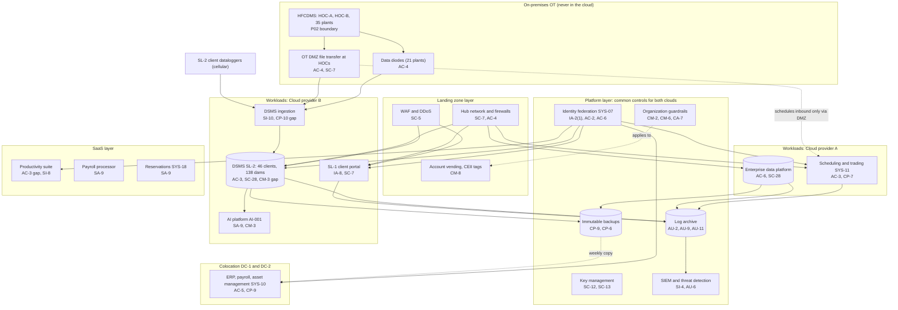

# Cloud Architecture and Control Placement: Cris Santos Company | Dams | Enterprise

**Organization:** Cris Santos Company, Inc. (publicly traded hydroelectric generation company) | **Tier:** Enterprise | **Provider:** Multi-cloud, vendor-agnostic: two public cloud providers (called Cloud provider A and Cloud provider B), two colocation data centers (DC-1 in Florida, DC-2 in Georgia), and SaaS
**Owner:** Director of Cloud Platform Engineering, with the CISO and the Director, OT Security | **Date:** 2026-08-31 | **Related:** HFCDMS SSP (P02), enterprise BIA (P05)

## 1. The rule that shapes everything: OT stays out of the cloud
The HFCDMS (P02), the plant control systems, and the Piedmont plants run on premises. **No control system runs in a cloud, and no cloud service can send anything into OT.** Data leaves OT one way: through hardware data diodes at 21 plants and through the OT DMZ file transfer at the two HOCs. This keeps the FERC Section 9 analysis and the NERC CIP Electronic Security Perimeters simple: the cloud estate is outside both, and P04 covers it as an enterprise IT estate with one important inbound feed (dam safety instrument data to the DSMS).

## 2. Architecture in layers
| Layer | What it is | Examples | Who runs it |
|---|---|---|---|
| **Platform** | Organization-wide services in both clouds | Guardrails, identity federation, key management, log archive, SIEM feeds, posture and vulnerability management, immutable backups, CI/CD | Cloud Platform Engineering; Security Operations; Identity team |
| **Landing zone** | The standard account pattern every workload lands in | Account vending with CEII and service line tags, hub network and firewalls, private links to DC-1, DC-2, and the WAN, WAF and DDoS, private DNS, zero-trust access | Cloud Platform Engineering; Network Engineering |
| **Workload** | Systems built or run by the company | Cloud A: scheduling, trading, and settlement platform (SYS-11), enterprise data platform, corporate workloads. Cloud B: DSMS (SYS-12, SL-2), AI and analytics platform (AI-001), SL-1 client portal. The OT-to-cloud data path | Application teams; Dam Safety Monitoring Services; Hydro Services |
| **Colocation** | Company equipment in DC-1 and DC-2 | ERP, payroll, and enterprise asset management (SYS-10); network core; offline backup copies | IT infrastructure |
| **SaaS** | Vendor-operated applications | Productivity suite, enterprise identity, payroll processor, reservations (SYS-18), SIEM and EDR consoles | Vendors, with the company's configuration and oversight |

## 3. Diagram

Note the direction of every arrow touching OT. Schedules reach the HOC as files placed in the OT DMZ and pulled from the OT side; nothing in the cloud initiates a connection into OT.

## 4. Responsibility by service model
Sources: SRC-AWS-SRM, SRC-AZURE-SRM, and SRC-GCP-SRM in `00_universal-framework/sources/source-register.csv`. The three published models agree on the split used here, so the design does not depend on which providers the company uses.

| Service model | Provider | Company (customer) | Shared |
|---|---|---|---|
| IaaS (scheduling platform servers) | Facilities, hosts, hypervisor, physical network | Guest OS, applications, identities, data, network policy | Encryption (provider service, company keys), logging |
| PaaS (DSMS containers, data platform, AI platform) | Also the platform runtime and its patching | Data, access, configuration, keys, application code, model changes | Backups, availability configuration |
| SaaS (productivity, payroll, reservations, security tools) | Also the application | Users, roles, data, oversight of the vendor | Audit review (complementary user entity controls) |
| Colocation | Building, power, cooling, perimeter | Racks, equipment, cage access lists | None |

## 5. Service categories and provider equivalents
| Service category | AWS | Microsoft Azure | Google Cloud |
|---|---|---|---|
| Organization guardrails | AWS Organizations service control policies | Azure Policy with management groups | Organization Policy Service |
| Key management | AWS KMS | Azure Key Vault | Cloud KMS |
| Audit logging | AWS CloudTrail | Azure Monitor activity log | Cloud Audit Logs |
| Threat detection and posture | Amazon GuardDuty; AWS Security Hub | Microsoft Defender for Cloud | Security Command Center |
| Managed containers | Amazon EKS | Azure Kubernetes Service | Google Kubernetes Engine |
| Managed machine learning | Amazon SageMaker | Azure Machine Learning | Vertex AI |
| Web application firewall | AWS WAF | Azure Web Application Firewall | Cloud Armor |
| Backup service | AWS Backup | Azure Backup | Backup and DR Service |

This table is for reading provider documentation only. The architecture, control map, and SSP describe service categories.

## 6. Common controls
`cloud-control-map.csv` has **57 rows** across 29 components: Platform 20, Landing zone 7, Workload 15, Colocation 5, SaaS 10. Responsibility: Customer 46, Shared 8, Provider 3.

**31 rows are published as common controls** (`common_control` = Yes) in the enterprise common control catalog. A cloud workload inherits them by being deployed through account vending, which applies guardrails, logging, network, key, and backup policies automatically. These are IT common controls; the OT common control providers that the HFCDMS inherits from are listed in P02 section 10.3 (CCP-01 to CCP-09). Only the platform-level identity, SOC, and GRC services are shared between the two worlds.

**Rules for inheriting:**
1. A workload may claim a common control only if its account was created by account vending and passes the posture baseline.
2. Customer-side identity, data protection, and logging stay explicit at every layer, including SaaS.
3. SaaS and colocation rows cite the vendor's SOC 2 report, reviewed by the third-party risk team (P09 evidence map).
4. Any account tagged CEII must use company-managed keys and restricted access groups.

## 7. Validation against the HFCDMS SSP (P02)
The HFCDMS has no cloud components, so the check is the reverse: every place where HFCDMS data or control could touch the cloud estate is covered.
| HFCDMS interface | Control in this map | Status |
|---|---|---|
| Instrument readings to the DSMS | AC-4 one-way data path; SI-10 input validation | In place |
| Schedules from SYS-11 to the HOC | Inbound file pull through the OT DMZ (P02 section 8); no cloud-initiated connection | In place |
| Generation history to the data platform | One-way OT DMZ replica; AC-6 and SC-28 on the data platform | In place |
| Remote access by cloud administrators | Corporate zero-trust gateway has no route to OT (AC-17 row) | In place |
| HFCDMS documentation (BCSI) in SaaS file storage | AC-3 row on the productivity suite | **Gap (POAM-006)** |

## 8. Findings from the mapping
1. **The one-way rule holds.** Route tables and diode configurations confirm no path from either cloud into OT. The SOC alerts on any new route toward OT address ranges.
2. **DSMS change control (SL-2).** Alert thresholds and model versions for 138 client dams change inside the application without the change records the pipeline gives code. For a service that warns of dam safety conditions, that is the most important cloud gap (POAM-019; P09 CC8.1).
3. **DSMS recovery.** The ingestion service rebuilt in 5.1 hours against a 4-hour RTO (POAM-020). The data was safe; the gap is the rebuild time.
4. **Sensitive files in SaaS storage.** BCSI (HOC network diagrams) in a contractor-shared project folder and CEII (PD inundation maps) in general shares (POAM-006, POAM-022). These are productivity suite configuration and behavior issues, not cloud platform issues.
5. **Client data is client CEII.** SL-2 holds instrument data for 138 client dams; per-client keys and tenant isolation tests support the confidentiality commitments in P09.
6. **AI platform.** Models run in the provider's managed machine learning service with no-training terms; model promotion follows the AI council process (P10).
