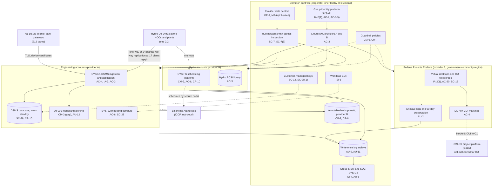
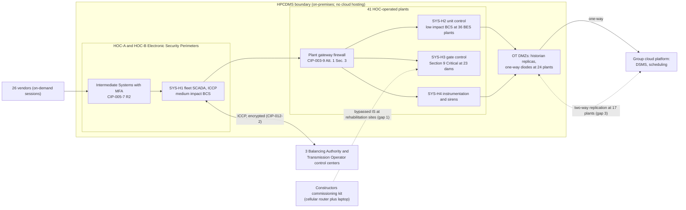

# Cloud Architecture and Control Placement: Cris Santos Company Holdings | Dams | Multi-Sector

**Organization:** Cris Santos Company Holdings, Inc. | **Tier:** Multi-Sector | **Providers:** two public cloud providers, called provider A and provider B (vendor-agnostic; see section 6). Provider B also offers a government-community region used for CUI.
**Scope:** the shared corporate cloud platform (SYS-G3 landing zones) plus the division workloads that run on it: the Engineering DSMS (SYS-E1) and modeling compute (SYS-E2), the Hydro scheduling platform (SYS-H6), the Federal Projects Enclave (SYS-C2) shared by Constructors and Engineering, and the SaaS platforms each division relies on. The SSP system (P02), the Hydro Plant Control and Dam Monitoring System, is **not** in the cloud; this mapping shows the boundary it keeps with the cloud.

## 1. Design in one paragraph
Corporate runs one **landing zone** per provider: identity federation from SYS-G1, a hub network with central egress inspection, guardrail policies, a write-once log archive, customer-managed keys, EDR, and an immutable backup vault in provider B. Divisions get their own **accounts** inside the landing zones and inherit these guardrails. Provider A hosts the DSMS, the Engineering modeling compute, the Hydro scheduling platform, and the Hydro BCSI library. Provider B's **government-community region** hosts the Federal Projects Enclave, which must meet FedRAMP Moderate equivalent requirements for covered defense information (DFARS 252.204-7012(b)(2)(ii)(D)). **Hydro OT is never hosted in the cloud:** only one-way data leaves the OT DMZs. Constructors' project platform (SYS-C1) and equipment telematics (SYS-C4) are SaaS, outside the landing zones.

## 2. Diagrams
### 2.1 Group landing zones and division workloads

### 2.2 The OT boundary (P02 system) and where the cloud stops

**Target state:** every DSMS feed leaves through a one-way diode or a one-way transfer service in the DMZ (POAM-005, due 2027-03-31). Commissioning at Hydro sites uses Hydro-managed laptops or Constructors laptops that pass the CIP-003-9 Attachment 1 Section 5.2 review, and remote help goes through the Intermediate Systems; cellular routers are prohibited inside Hydro plants (POAM-001, due 2026-12-31).

## 3. Tenancy and identity decision
- **Decision.** All three divisions sign in through the group identity platform, SYS-G1, and get their own accounts inside the landing zones. Two boundaries are kept apart from it.
- **Separate identity boundaries.** Hydro OT uses its own OT identity domain and OT PAM, and that domain trusts no corporate identity. The Federal Projects Enclave (SYS-C2), shared by Constructors and Engineering, is a separate enclave tenant in provider B's government-community region.
- **Why.** The FPE holds covered defense information, so it must meet FedRAMP Moderate equivalent requirements (DFARS 252.204-7012(b)(2)(ii)(D)). Keeping SYS-G1 out of the OT domain means a compromise of SYS-G1 does not give access to the HPCDMS.
- **What limits blast radius.** OT privileged access uses OT PAM with hardware tokens, and Interactive Remote Access uses MFA at the Intermediate Systems (CIP-005-7 Part 2.3). One-way diodes at 24 plants. FPE users have hardware-backed MFA, access by contract team, and DLP. Cloud administrators use just-in-time PAM elevation with session recording. The backup vault uses a separate backup identity.
- **Known gaps.** 17 HOC-operated plants still use two-way historian replication instead of one-way diodes (GR-03, POAM-005). CUI was copied to the commercial project platform before DLP was on (POAM-014).
- **Cross-division risks:** GR-02, GR-03, GR-18 in [risk-register.csv](../step-04_P01_risk-register/risk-register.csv).

## 4. Common versus division-specific controls
`cloud-control-map.csv` has **52 rows** across 27 components. The `control_scope` column shows who owns each placement:

| Scope | Rows | What it means |
|---|---|---|
| Common (group) | 21 | Provided once by corporate (SYS-G1, SYS-G2, SYS-G3, procurement) and inherited by every division account. Listed in the P02 common control catalog |
| Division-specific (Engineering) | 11 | DSMS ingestion, tenants, database, AI-001 model service, release pipeline, modeling compute |
| Shared enclave (Constructors and Engineering) | 7 | The FPE: its own tenant, MFA, DLP, encryption, logging and preservation, provider assurance |
| Division-specific (Constructors) | 7 | Project platform (SaaS), pay applications, commissioning kits, telematics |
| Division-specific (Hydro) | 6 | One-way transfer from the OT DMZ, scheduling platform, the no-OT-in-cloud rule, BCSI library |

| Responsibility | Rows |
|---|---|
| Customer (the group or a division) | 40 |
| Shared (provider and group) | 9 |
| Provider | 3 |

**Rule of thumb.** Identity, network guardrails, logging, keys, backups, and EDR are **common**. A division cannot opt out of them, only request an exception through POL-01. Application behavior, client tenants, CUI handling, and anything that touches OT are **division-specific**, because they depend on each division's regulators and clients: FERC and NERC for Hydro, DoD contracting officers for the FPE, and DSMS clients for Engineering.

## 5. Layers
| Layer | Common components | Division components | Key controls | Responsibility |
|---|---|---|---|---|
| Identity | SYS-G1, cloud IAM | DSMS client tenants and device certificates; FPE tenant; SYS-C1 external users | AC-2, AC-3, AC-6(5), IA-2(1), IA-3 | Customer (configuration); vendor (service) |
| Network | Hub networks, private circuits | DSMS ingestion endpoints; one-way transfer from the OT DMZ | SC-7, SC-7(5), SC-8(1), AC-4 | Customer, with provider network protections shared |
| Compute | Guardrails, EDR | DSMS services, AI-001, modeling compute, FPE desktops, commissioning laptops | CM-3, CM-6, CM-7, SI-3, SA-11 | Customer (guest OS, containers, code) |
| Data | Keys, backup vault | DSMS database, FPE storage, BCSI library | SC-12, SC-13, SC-28, SC-28(1), CP-9, CP-10 | Shared: provider encrypts; group owns keys, zoning, retention |
| Logging and monitoring | Log archive, SIEM | DSMS alert records; FPE preservation | AU-2, AU-6, AU-9, AU-11, AU-12, SI-4 | Shared: providers generate platform logs; group retains and reviews |
| SaaS dependencies | Identity and SIEM vendors | Project platform, telematics, inspection apps | SA-9, IA-12 | Provider for the service; customer for use and oversight |
| Physical | Provider data centers | none | PE-3, MP-6 | Provider (inherited) |

## 6. Service categories and provider equivalents
The design does not depend on a provider. This table gives each provider's name for each service category, for reading its shared responsibility documentation.

| Service category | AWS | Microsoft Azure | Google Cloud |
|---|---|---|---|
| Account structure and guardrails | AWS Organizations with service control policies | Management groups with Azure Policy | Resource hierarchy with Organization Policy |
| Government-community region for CUI | AWS GovCloud (US) | Azure Government | Assured Workloads (US regions) |
| Managed relational database | Amazon RDS | Azure SQL Database | Cloud SQL |
| Managed containers | Amazon EKS | Azure Kubernetes Service | Google Kubernetes Engine |
| Key management | AWS KMS | Azure Key Vault | Cloud KMS |
| Audit logging | AWS CloudTrail | Azure Monitor activity log | Cloud Audit Logs |
| Backup with immutability | AWS Backup (vault lock) | Azure Backup (immutable vault) | Backup and DR Service |
| Private connectivity | AWS Direct Connect | Azure ExpressRoute | Cloud Interconnect |

Shared responsibility sources: SRC-AWS-SRM, SRC-AZURE-SRM, SRC-GCP-SRM in `00_universal-framework/sources/source-register.csv`. All three agree on the split used here: for IaaS the provider owns facilities, hosts, and virtualization; for PaaS the provider also owns the runtime; for SaaS the provider owns the application. The customer always keeps identities, access decisions, data classification, and data. Whether a specific government-community offering meets the FedRAMP Moderate equivalency in DFARS 252.204-7012(b)(2)(ii)(D) is confirmed from the provider's package, not from this table.

## 7. Findings from the mapping
1. **The cloud never hosts OT, but the DSMS path leaks the other way.** At 17 plants the historian replication into the DSMS is two-way, so an Engineering cloud service has a network path back toward Hydro OT DMZs (AC-4, SC-7; P01 GR-03; POAM-005).
2. **The FPE is sound; the problem is what lives outside it.** The enclave has MFA, DLP, and FIPS-validated encryption, but CUI was copied to the commercial project platform before DLP was turned on (AC-3, AC-4; P01 CN-001; POAM-014).
3. **AI-001 changes are not controlled** (CM-3). Thresholds and model versions in the DSMS change without change records, which matters to 61 clients and to Hydro's dam safety teams (POAM-012; P09 CC8.1; P10).
4. **Commissioning kits are the least governed devices in the group** (SI-3, AC-17). They are not cloud workloads, but they are listed here because they connect cloud-managed remote support tools to owners' control networks (POAM-001, POAM-002).
5. **Common controls are strong and reused.** One identity platform, one SIEM, one backup design, and one set of guardrails serve all three divisions. Group internal audit assessed them once (P07).
