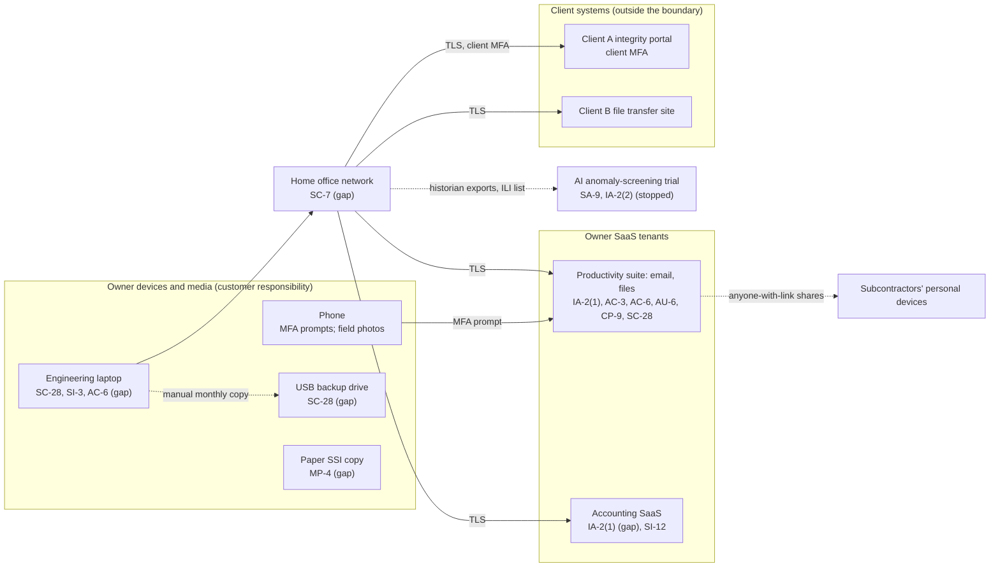

# SaaS Architecture and Control Placement: Cris Santos Company | Energy | Sole Proprietorship

**Organization:** Cris Santos Company (pipeline integrity engineering consultant) | **Tier:** Sole Proprietorship | **Provider:** SaaS only (no IaaS or PaaS)
**System:** Core Business SaaS Stack (CBSS), as defined in the system profile (P02)

## 1. Diagram
Control IDs on each node are the ones in `cloud-control-map.csv`. Dashed lines are flows that no approved agreement covers.

## 2. Layers
| Layer | Components | Key controls | Responsibility |
|---|---|---|---|
| Identity | Suite account (daily user and administrator), accounting account, AI trial account, client portal account | IA-2(1), IA-2(2), AC-6 | Customer configures; provider supplies MFA. Client A controls its own portal account |
| Data | Suite files and mail, SSI folder, accounting records, local analysis files, USB drive, paper | AC-3, SC-28, CP-9, SI-12, SA-9 | Provider protects data inside its service; the customer decides where data goes, who it is shared with, and how long it stays |
| Endpoints | Laptop, phone, removable media | SC-28, SI-3, AC-6 | Customer |
| Network | Home office router and ISP link | SC-7 | Customer (ISP owns the line) |
| Logging | Suite audit log | AU-2 (provider), AU-6 (customer) | Shared: provider records, customer reviews |
| SaaS applications and hosting | Suite and accounting platforms | Inherited (AU-2, SC-5, SC-28 at rest, PE family) | Provider |

## 3. Shared responsibility for SaaS
All three major cloud providers' shared responsibility models (SRC-AWS-SRM, SRC-AZURE-SRM, SRC-GCP-SRM) agree on the SaaS split: the provider runs the application, the platform, and the facilities; **the customer always keeps its identities and accounts, its data, and its devices.** That is why 12 of the 16 rows in the control map are the owner's alone. A provider's SOC 2 report never covers those three layers, and it never covers what the owner chooses to share. No IaaS equivalents table is needed, because the consultancy runs no infrastructure.

The SSI duties in 49 CFR 1520.9 sit entirely on the customer side. The suite can encrypt and log a file, but only the owner decides who the file is shared with (1520.9(a)(2)), whether it is marked (1520.9(a)(4)), and when it is destroyed (1520.19(b)).

## 4. Findings from the mapping
1. **Sharing settings, not encryption, are the weak point.** Anonymous links and a folder share gave the GIS subcontractor reach into the Client A folder that holds SSI. The suite logged and enforced exactly what it was told. Tracked as P01 R-003.
2. **The independent backup is the least protected copy.** The USB drive is the only copy outside the suite, and it is unencrypted and holds SSI. Tracked as R-004.
3. **The accounting SaaS has the weakest sign-in and the most personal data.** Social Security numbers and the bank feed sit behind a reused password. Tracked as R-005.
4. **Client data reached a service with no agreement.** The AI trial was a SaaS tenant the owner opened with a click-through. Tracked as R-006 and P10.
5. **Version history is not a ransomware backup by itself.** If ransomware encrypts synced files, the sync client uploads the encrypted versions. Recovery depends on the 30-day version history working as stated and on an independent, offline copy (R-001).
