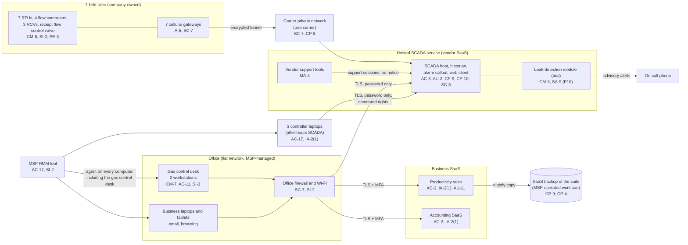

# Cloud Architecture and Control Placement: Cris Santos Company | Energy | Micro

**Organization:** Cris Santos Company, LLC (small intrastate natural gas transmission pipeline operator) | **Tier:** Micro | **Provider:** Vendor-agnostic SaaS (see section 3)
**System:** Pipeline SCADA and Gas Control System (PSGCS), as defined in the SSP (P02) | **Prepared:** 2026-07-31 by the Office Manager and the Operations Manager with the MSP lead technician; updated 2026-08-19 after P07 testing | **Approved:** Owner, 2026-09-15

## 1. Diagram
The company runs no servers and no IaaS tenant. Its "cloud" is a set of SaaS services, the most important of which is the **hosted SCADA service**, plus one cloud workload the MSP operates for it: the SaaS backup of the productivity suite (SYS-09).

## 2. Layers and who is responsible
| Layer | Components | Key controls | Customer (company) | MSP (on the company's behalf) | Provider (SCADA vendor or SaaS vendor) |
|---|---|---|---|---|---|
| Identity | SCADA accounts and roles; suite and accounting accounts | AC-2, IA-2(1), IA-5 | Creates and removes SCADA accounts; turns on SCADA MFA (**gap**); removes shared login (**gap**) | Creates and disables suite and laptop accounts | Runs sign-in, MFA, and lockout services |
| SCADA application | Displays, points, alarm set-points, leak module | AC-3, CM-3, AU-6 | Configures and approves changes; reviews the audit log (**gap**) | None | Runs the platform; ships releases (**without notice today**) |
| Network | Office firewall, Wi-Fi, flat office LAN, carrier private network | SC-7, CP-8 | Decides segmentation; confirms each SIM is on the private network | Configures and patches the firewall | Carrier provides the private network; SCADA vendor terminates tunnels |
| Endpoints | Gas control desk, controller laptops, tablets | CM-7, SI-3, AC-11, SC-28 | Decides what runs on the gas control desk | Antivirus, patching, encryption, screen lock | Not applicable |
| Field devices | RTUs, flow computers, gateways | CM-8, SI-2, IA-5, PE-3 | Inventory, firmware, passwords, physical locks (**the company alone**) | None | None |
| Data | SCADA configuration and history; suite files; backups | CP-9, CP-4 | Holds its own export of SCADA configuration and RTU programs (**gap**); restore tests | Operates the suite backup and runs restore tests | Backs up the SCADA tenant; replicates between data centers |
| Logging | SCADA audit log, suite logs, firewall logs | AU-2, AU-6, AU-11 | Reviews logs monthly (**gap**) | Keeps firewall logs 30 days | Generates and keeps logs (SCADA 12 months) |
| Vendor governance | SCADA contract, MSP contract, carrier agreement | SA-9, MA-4 | Contract terms, SOC 2 review, support-session notice | Answers the annual MSP review | Provides the SOC 2 report |

**The MSP is not a cloud provider.** It performs customer-side duties for the company. Anything marked "Customer (performed by MSP)" in `cloud-control-map.csv` remains the company's responsibility: the company must direct the work, receive evidence, and check it (SA-9).

**The SCADA vendor is a provider, but not for everything.** Its SOC 2 report lists complementary user entity controls that the company must run: named accounts and prompt removal, MFA, role assignment, audit log review, and change approval. All five were open gaps at fieldwork.

## 3. Service categories and provider equivalents
The design is vendor-agnostic. The shared responsibility split for SaaS is the same in all three major cloud providers' models: the provider runs the application, platform, and infrastructure; the customer keeps identities, access, data, and devices (SRC-AWS-SRM, SRC-AZURE-SRM, SRC-GCP-SRM in `00_universal-framework/sources/source-register.csv`). For the hosted SCADA service, the vendor's SOC 2 report is the evidence of the provider side.

| Service category used | What it is here | Equivalent category in the large cloud providers (for reading their documentation) |
|---|---|---|
| Hosted SCADA (industrial SaaS) | SCADA host, historian, callout, web client | Industry SaaS built on any provider; IoT and industrial data services |
| Cellular private network | Gateways on a carrier private network, tunneled to the SCADA vendor | Private connectivity for IoT devices |
| Productivity suite | Email, calendar, file storage | Productivity and collaboration SaaS |
| SaaS-to-SaaS backup | Nightly backup of the suite | Backup service or third-party SaaS backup |
| Remote monitoring and management | MSP device management | Device management SaaS |

## 4. Findings from the mapping
1. **The gas control desk is an office computer (SC-7, CM-7).** The 2 desk workstations share a flat network with every business laptop, receive email, browse the web, and keep a SCADA session open with command rights. Ransomware that starts with a phishing email in the office can reach the controllers' main screens in minutes. Fix: dedicated desk workstations with no email, browsing limited to the SCADA web client, on their own firewall segment, by 2026-11-30. Tracked as P01 R-001 and P07 POAM-004.
2. **The SCADA web client accepts a password alone from anywhere (IA-2(1), AC-17).** Any of the 3 controller accounts, or the shared desk login, can command valves from any internet connection. Fix: vendor app-based MFA for every SCADA account, named desk accounts, and sign-in alerts, by 2026-10-31 (P01 R-002; POAM-002 and POAM-003).
3. **The MSP's reach includes the gas control desk (AC-17).** The RMM agent can run commands on the desk workstations. Fix: when the desk is rebuilt, the MSP keeps patching it but remote control sessions on the desk need the Operations Manager's approval each time (P01 R-004).
4. **Vendor-side changes arrive without notice (CM-3, SA-9, MA-4).** The SCADA vendor switched on the leak-detection trial and ships platform releases without telling the company, and its support staff can enter the tenant without notice. Fix: contract terms for 30 days' notice of changes, notice of support sessions, and 24-hour security incident notice (P01 R-003, R-014; POAM-011, POAM-013).
5. **The company holds no copy of its own SCADA configuration (CP-9).** The vendor backs up the tenant, and RTU programs sit on one laptop. If the vendor relationship ended or the tenant were tampered with, the company could not rebuild. Fix: quarterly configuration export and RTU program copies on encrypted media in the office safe (P01 R-009; POAM-007).
6. **"Private network" depends on each SIM (SC-7).** P07 testing found that a replacement SIM installed at the municipal gate station in May 2026 had been provisioned with a public address, exposing the gateway's management page to the internet with its default password. The carrier moved it back to the private network on 2026-08-19. Fix: check every SIM change against the carrier's private-network list (P01 R-023; POAM-004 and POAM-005).
