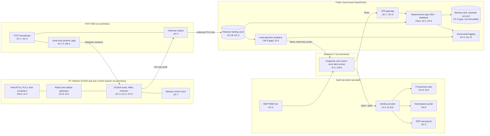

# Cloud Architecture and Control Placement: Cris Santos Company | Energy | Small

**Organization:** Cris Santos Company, LLC (intrastate natural gas transmission pipeline operator) | **Tier:** Small | **Provider:** Vendor-agnostic (see section 3)
**Systems:** the cloud tenant and SaaS services, and how they connect to the Pipeline SCADA and Gas Control System (PSGCS) defined in the SSP (P02)

## 1. Diagram

**The key design rule: nothing in the cloud or business IT can send data or commands into OT.** Historian data leaves OT through the replica in the DMZ and is pushed outbound to the cloud. Leak-detection alerts come back only to a separate business-network screen in the control room. They never reach an HMI or the SCADA host. The one inbound path into OT is the integrator's remote access through the jump host, and that is the weakest point (P01 R-002, R-003).

## 2. Layers
| Layer | Components | Key controls | Responsibility |
|---|---|---|---|
| Identity | Identity provider, cloud IAM roles | AC-2, AC-6, IA-2, IA-2(1), AC-7 | Customer (configuration); provider (service) |
| Network / edge | IT/OT firewall pair, DMZ, VPN gateway, cloud virtual network | SC-7, SC-8, AC-4 | Customer |
| Compute / application | Measurement VMs (IaaS), leak analytics workload (PaaS) | CM-6, CM-3, SI-2, SI-3, SA-9 | Customer for guest OS and application on IaaS; shared on PaaS (provider runs the platform) |
| Data | Landing zone, managed database, backup vault, keys | SC-28, SC-12, CP-9, CP-4 | Shared: provider encrypts; customer sets access, retention, and isolation |
| Logging / monitoring | Cloud audit logs, identity sign-in logs | AU-2, AU-6, AU-11 | Shared: provider generates; customer retains and reviews |
| SaaS applications | Productivity, nominations portal, ERP and payroll, MSP RMM | SC-8, SI-8, SA-9, AC-3, AC-6 | Provider (application and infrastructure); customer (users, roles, data, vendor oversight) |
| Physical / hypervisor | Provider data centers | PE family | Provider (inherited) |

The OT components (field devices, SCADA, backup control room) are on-premises and fully the company's responsibility. They appear in the diagram only to show the connection points. Their controls are in P02.

## 3. Service categories and provider equivalents
The design is independent of the provider. This table gives each provider's name for each service category, to use when reading its shared responsibility documentation.

| Service category | AWS | Microsoft Azure | Google Cloud |
|---|---|---|---|
| Virtual machines | Amazon EC2 | Azure Virtual Machines | Compute Engine |
| Managed relational database | Amazon RDS | Azure SQL Database | Cloud SQL |
| Container or app platform (analytics workload) | Amazon ECS | Azure Container Apps | Cloud Run |
| Object storage | Amazon S3 | Azure Blob Storage | Cloud Storage |
| Backup service | AWS Backup | Azure Backup | Backup and DR Service |
| Identity and access management | AWS IAM | Azure role-based access control with Microsoft Entra ID | Cloud IAM |
| Key management | AWS KMS | Azure Key Vault | Cloud KMS |
| Audit logging | AWS CloudTrail | Azure Monitor activity log | Cloud Audit Logs |
| Site-to-site VPN | AWS Site-to-Site VPN | Azure VPN Gateway | Cloud VPN |

Shared responsibility sources: SRC-AWS-SRM, SRC-AZURE-SRM, SRC-GCP-SRM in `00_universal-framework/sources/source-register.csv`. All three models agree on the split used here:
- **IaaS:** the provider owns physical facilities, hosts, and the virtualization layer. The customer owns the guest operating system, applications, network configuration, identities, and data.
- **PaaS:** the provider also runs the platform runtime. The customer keeps the code or model it deploys, its configuration, identities, and data.
- **SaaS:** the provider also owns the application. The customer keeps identities, access, data, and devices.

## 4. Findings from the mapping
1. **The historian push is the right pattern. Keep it one-way (AC-4, SC-7).** The firewall allows only outbound TLS from the DMZ replica to the landing zone. This was confirmed from the rule export on 2026-08-26. Any future request to let a cloud service write back to SCADA (for example, automatic valve closure from the leak model) would change the P10 risk tier and needs a new architecture review.
2. **The model vendor can change production behavior (CM-3, SA-9).** The anomaly model vendor deploys model updates directly into the analytics workload. There is no approval step, no change notice term, and no revalidation (P01 R-026, P10). Fix: vendor deployments go to a staging slot, and the Gas Control Manager approves promotion after the P10 validation checks.
3. **Backups are separated but not immutable (CP-9).** The backup vault is in a separate account, which is good. But the same two administrators own both accounts, and retention can be shortened. Fix: immutable retention of 30 days and a break-glass administrator for the backup account only (P01 R-019).
4. **Logs are not kept or reviewed (AU-6, AU-11).** Cloud audit logs use the 90-day default and nobody reviews them. They will be exported to the log workspace built for the OT monitoring project, with 1-year retention.
5. **The MSP stays out of OT.** The RMM agent inventory confirmed no agents in OT or the DMZ. This limits the damage a compromised MSP tool could do (P01 R-016) and must stay that way.
6. **Inherited controls rely on supplier reports.** Controls marked Shared or Provider depend on the cloud provider's and SaaS vendors' assurance reports. Only the MSP's SOC 2 report has been reviewed so far (P09).
