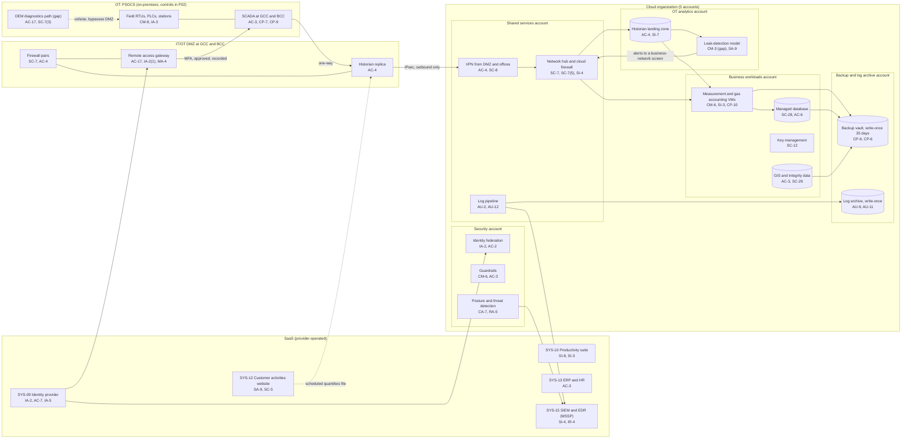

# Cloud Architecture and Control Placement: Cris Santos Company | Energy | Mid-Market

**Organization:** Cris Santos Company, Inc. (interstate natural gas transmission pipeline operator) | **Tier:** Mid-Market | **Provider:** Vendor-agnostic public cloud (see section 4), plus SaaS
**Systems:** the 5-account cloud landing zone (SYS-11), the SaaS services, and how they connect to the Pipeline SCADA and Gas Control System (PSGCS) defined in the SSP (P02) | **Prepared:** 2026-07-31 by the IT Director and the OT Security Engineers; updated 2026-09-17 with P07 results
**Control map:** `cloud-control-map.csv` (56 rows, 26 components)

## 1. Diagram

**The key design rule: nothing in the cloud or business IT can send data or commands into OT.** Historian data leaves OT through the replica in each DMZ and is pushed outbound over IPsec to the OT analytics account. Leak-detection alerts return only to a business-network display in the control room, never to an HMI or the SCADA host. The two approved inbound paths into OT are the remote access gateways at the GCC and BCC. The one exception found is the compressor OEM's diagnostics path, which bypasses the DMZ (section 5, finding 1).

## 2. Landing zone design
The landing zone separates duties across 5 accounts (subscriptions or projects, depending on the provider) under one cloud organization, so that compromise of one account limits what an attacker can reach in the others.

| Account | Purpose | Who administers | Key design decisions |
|---|---|---|---|
| **Security** | Organization root, identity federation to SYS-09, guardrails, posture management and threat detection | Security Manager and 1 security analyst | No workloads. Root credentials sealed. Guardrails apply to every other account and cannot be disabled from them |
| **Shared services** | Network hub, cloud firewall, VPNs from the DMZs and offices, DNS, patch service, log pipeline | IT Director's infrastructure team | All traffic between sites, workloads, and the internet passes the hub |
| **Business workloads** | Gas measurement and accounting application, managed database, GIS and integrity data, key management | Infrastructure team; Measurement Manager (application) | No internet ingress. Customer-managed keys. Detailed pipeline design data handled as Restricted (CEII) |
| **OT analytics** (added 2025-05) | Historian landing zone and the leak-detection model (P10 AI-001) | OT Security Engineers; model vendor (model namespace only) | Receives data only from the DMZ replicas. No path back to OT. Not yet submitted to TSA as a plan amendment (gap 12) |
| **Backup and log archive** | Backup vault with 35-day write-once retention in a second region; write-once log archive | 2 named backup administrators | Separate credentials not federated to daily accounts. Cross-account roles can write but not delete |

## 3. Layers and shared responsibility per service
| Layer | Components | Key controls | Service model | Responsibility |
|---|---|---|---|---|
| Identity | Cloud federation, break-glass accounts, guardrails, SYS-09 | IA-2, IA-2(1), AC-2, AC-6(5), AC-7, IA-5, IA-2(8) | PaaS / SaaS | Customer configures identities, roles, MFA, and reviews; provider runs the identity services |
| Network | Hub, cloud firewall, VPNs, DNS, alert relay | SC-7, SC-7(5), AC-4, SC-8, SC-8(1), SC-20 | IaaS / PaaS | Customer designs routes, rules, and segmentation; provider runs the gateway and DNS services |
| Compute | Measurement VMs, leak-detection model platform, patch service | CM-6, SI-2, SI-3, AU-12, CP-10, CM-3, SA-9 | IaaS / PaaS | Customer for guest OS and applications; shared on the model platform (vendor runs the model, company owns the account) |
| Data | Database, object storage, keys, backups | SC-28, SC-12, SI-7, CP-9, CP-6, CP-4, AC-3, AC-6 | IaaS / PaaS | Shared: provider encrypts and runs storage; customer controls keys, access, retention, and restore testing |
| Logging and monitoring | Log pipeline, posture service, log archive, SIEM | AU-2, AU-9, AU-11, CA-7, RA-5, SI-4, IR-4 | PaaS / SaaS | Shared: provider generates logs and detections; customer enables, retains, forwards, and acts on them; MSSP monitors |
| SaaS applications | Identity provider, productivity suite, customer activities website, ERP and HR, SIEM | AC-7, IA-5, SI-8, SA-9, SC-5, AC-2, AC-3 | SaaS | Provider runs the application; customer keeps users, roles, content, and vendor oversight |
| Physical | Provider data centers | PE-3, PE-13 | All | Provider (inherited, evidenced by SOC 2 reports) |

**Responsibility counts in `cloud-control-map.csv`:** 31 Customer, 18 Shared, 7 Provider. By service model: 22 IaaS, 23 PaaS, 11 SaaS rows. Across the three providers' shared responsibility models, the customer always keeps identity, data protection, and logging decisions.

## 4. Service categories and provider equivalents
The design is independent of the provider. This table gives each provider's name for the service category, for reading its shared responsibility documentation (SRC-AWS-SRM, SRC-AZURE-SRM, SRC-GCP-SRM in `00_universal-framework/sources/source-register.csv`).

| Service category | AWS | Microsoft Azure | Google Cloud |
|---|---|---|---|
| Multi-account organization and guardrails | AWS Organizations, service control policies | Management groups, Azure Policy | Resource Manager folders, organization policies |
| Account, subscription, or project | Account | Subscription | Project |
| Cloud identity federation | IAM Identity Center | Microsoft Entra ID with Azure RBAC | Cloud Identity with IAM |
| Network hub | Transit Gateway | Virtual WAN hub or hub virtual network | Network Connectivity Center or shared VPC |
| Cloud firewall | AWS Network Firewall | Azure Firewall | Cloud NGFW |
| Site-to-cloud VPN | Site-to-Site VPN | VPN Gateway | Cloud VPN |
| DNS with filtering | Route 53 with DNS Firewall | Azure DNS with DNS security policy | Cloud DNS with response policies |
| Virtual machines | EC2 | Virtual Machines | Compute Engine |
| Container platform (model) | Amazon ECS or EKS | Azure Container Apps or AKS | Cloud Run or GKE |
| Managed relational database | Amazon RDS | Azure SQL Database | Cloud SQL |
| Object storage with write-once retention | S3 with Object Lock | Blob Storage with immutability policies | Cloud Storage with bucket lock |
| Backup service | AWS Backup (vault lock) | Azure Backup (immutable vault) | Backup and DR Service |
| Key management | AWS KMS | Azure Key Vault | Cloud KMS |
| Audit logging | CloudTrail | Azure Monitor activity log | Cloud Audit Logs |
| Posture and threat detection | Security Hub, GuardDuty | Microsoft Defender for Cloud | Security Command Center |

**Service model split used here (all three providers agree):**
- **IaaS** (virtual machines, networks, object storage): the provider owns facilities, hosts, and virtualization. The customer owns the guest OS, applications, network configuration, identities, and data.
- **PaaS** (managed database, container platform, backup, key service, DNS): the provider also owns the platform software and its patching. The customer owns access, keys, data, configuration, and what it deploys.
- **SaaS** (identity provider, productivity suite, customer activities website, ERP, SIEM): the provider also owns the application. The customer keeps identities, roles, data, and vendor oversight.

## 5. Findings from the mapping
1. **The OEM diagnostics path breaks the design rule (AC-17, SC-7(3)).** The compressor OEM collects unit vibration and performance data for its predictive maintenance service (P10 AI-002) through cellular modems attached to unit control panels. These paths bypass the DMZ and are not in the TSA Cybersecurity Implementation Plan. P07 confirmed one at Compressor Station 4 (POAM-003). Fix: route OEM data out through the DMZ historian replica into the OT analytics account, and give the OEM read access there instead of a path into OT.
2. **The model vendor can change production behavior (CM-3, SA-9).** The leak-detection vendor deploys model updates directly into the OT analytics account. There is no staging slot and no MOC approval (P01 R-027; P10). Fix: staging slot, revalidation, and Director of Gas Control approval before promotion.
3. **A new account was added without a TSA plan amendment (CM-4).** The OT analytics account went live in 2025-05. It receives Critical Cyber System data and returns alerts to the control room, which is a permanent change to measures in the Cybersecurity Implementation Plan. SD 02G Section VI.D requires an amendment request within 50 calendar days of a permanent change (gap 12; P03).
4. **Recovery is isolated and partly proven.** The backup account is separate, write-once, and in a second region, with separate credentials. Business workloads were restore-tested in 2026-06. The OT analytics account (model configuration and landing zone) has not been restore-tested.
5. **Log retention is uneven (AU-11).** Cloud logs are archived for 12 months in the write-once log archive. OT logs are kept only 90 days in the SIEM (gap 10). Fix: route OT logs to the same archive by 2026-12-31.
6. **Boundary check.** Every PSGCS interface in the SSP (P02 sections 7 and 8) appears in the diagram. Every cloud component has at least one row in the control map, and each account has controls from at least 2 of the AC, AU, CM, IA, SC, and SI families or inherits them.
7. **Inherited controls rely on supplier reports.** Controls marked Provider or Shared depend on the cloud provider's and SaaS vendors' SOC 2 reports and complementary user entity controls. Only 4 of 14 Tier 1 vendor reports have been reviewed so far, and the customer activities website vendor's report is not among them (P09).
