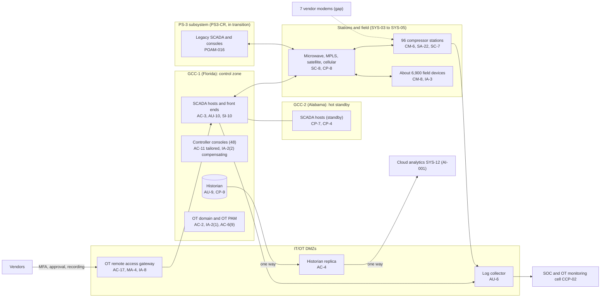

# System Security Plan: Pipeline SCADA and Gas Control System (PSGCS)

**Organization:** Cris Santos Company, Inc. (publicly traded interstate natural gas transmission company) | **Tier:** Enterprise | **Vertical:** Energy (natural gas pipeline)
**Outline:** NIST SP 800-18 Rev. 2, System Security Plan Outline Example (June 2026) | **Version:** 4.0, 2026-09-14
**Handling:** The full plan, with network addresses and firewall rules, is SSI under 49 CFR Part 1520 because it is incorporated by reference into the TSA-approved Cybersecurity Implementation Plan. This sample shows the structure and content at a level that contains no SSI.

## 1. System Name and Identifier
Pipeline SCADA and Gas Control System (**PSGCS**), identifier CSC-SYS-PSGCS-001. Tier-1 system and a Critical Cyber System under SD Pipeline-2021-02G Section III.A.

## 2. System Overview
The PSGCS lets controllers monitor and control about 11,600 miles of owned interstate pipeline and about 1,150 miles of operated JV pipeline. It collects pressures, flows, temperatures, gas quality, and valve and compressor status from about 6,900 field devices; presents them on controller consoles with alarms; and sends control commands to remote valves, compressor station set-points, and flow control at meter stations.

**Why integrity and availability matter most.** A false value or an unauthorized command can lead a controller to overpressure a segment or to miss a rupture; loss of visibility forces manual operation and, after about 4 hours, curtailment of firm service (P05 BP-01). Confidentiality matters too: SCADA configurations and network details are SSI and CEII.

**Major components:**
- Redundant SCADA host servers, front-end processors, and historians at GCC-1 (primary) and GCC-2 (hot standby), one SCADA platform for PS-1, PS-2, and JV-1 to JV-3
- 48 controller consoles at GCC-1 and 24 at GCC-2 on 9 desks; engineering workstations; an OT domain with no trust to the business domain
- **PS-3 subsystem (in transition):** legacy SCADA from a different vendor, 6 consoles at PS3-CR, and its own front end, migrating to the main platform by 2027-06-30
- Interfaces to compressor station control systems at 96 stations (station PLCs and HMIs are inside the boundary; hardwired emergency shutdown systems are independent and outside it)
- About 6,900 field RTUs, PLCs, flow computers, and gas chromatographs
- SCADA telecommunications: private microwave and radio, two MPLS carriers, satellite backup, and cellular gateways
- IT/OT DMZs at both GCCs (historian replicas, patch staging, log collectors) and the OT remote access gateway
- OT privileged access management and the OT public key infrastructure
- Physical access control at GCC-1, GCC-2, and PS3-CR

Users: about 150 qualified controllers, 18 PS-3 controllers, about 60 SCADA and OT engineers, about 900 station operators and technicians with station HMI access, and about 210 vendor users who reach the system only through the gateway.

## 3. Laws, Regulations, and Policies Affecting the System
| ID | Requirement | Citation | How it affects the PSGCS |
|---|---|---|---|
| C-ENERGY-R03 | TSA SD Pipeline-2021-02G | Sections II to VII (effective 2026-05-03 to 2027-05-02) | The PSGCS is a Critical Cyber System; the Cybersecurity Implementation Plan sets the measures TSA inspects (segmentation, access control, monitoring, patching, incident response, assessment) |
| C-ENERGY-R02 | TSA SD Pipeline-2021-01G | Sections II.B to II.D (effective 2026-01-16 to 2027-01-15) | Cybersecurity Coordinator; incident reporting to CISA within 72 hours |
| C-ENERGY-R04 | PHMSA control room management | 49 CFR 192.631 | Controller roles, adequate information (point-to-point verification, backup SCADA testing), alarm management, change management, training |
| PHMSA | O&M manual, emergency plans, incident reports | 49 CFR 192.605, 192.615; Part 191 | Abnormal operation and emergency procedures; incident notices (P08) |
| SSI | Sensitive Security Information | 49 CFR Part 1520 (1520.5(b)(5); 1520.9; 1520.13) | Plans, assessments, and submissions to TSA are SSI and must be marked and restricted |
| CEII | FERC Critical Energy Infrastructure Information | 18 CFR 388.113 | Engineering and vulnerability details filed with FERC are submitted with CEII treatment |
| SEC | Cybersecurity disclosure | Form 8-K Item 1.05; 17 CFR 229.106 | A material PSGCS incident goes through the P08 materiality step |
| Internal | POL-01 to POL-05 and standards | P06 | Enterprise policy hierarchy, including STD-02.4 OT Access Standard |

Not applicable: C-ENERGY-R01 (NERC CIP; the company is not a NERC-registered entity), and C-ENERGY-R05 (CIRCIA; proposed rule only, not in effect).

## 4. System Status
### 4.1 System Security Plan Approval
Prepared by the Director of SCADA Engineering and the Director of OT Security with the GRC team. Reviewed by the CISO and the Vice President, Gas Control. Approved by the Chief Operating Officer on 2026-09-14.
### 4.2 System Authorization Decision
The company is not a federal agency, so there is no formal ATO. The equivalent internal decision:
- **Authorizing official equivalent:** Chief Operating Officer, with the CISO's recommendation.
- **Decision (2026-09-14):** continue operation with conditions, based on the Internal Audit assessment (P07) and the risk register (P01).
- **Conditions:** remove the remaining always-on vendor modems (POAM-004 by 2026-12-15); fix shared station account password changes (POAM-001 by 2026-11-30); exercise IT/OT isolation at GCC-2 and PS3-CR (POAM-012 by 2027-03-31); complete PS-3 segmentation and migration (POAM-016 by 2027-06-30).
- **Reauthorization:** annually, and after the PS-3 cutover to the main SCADA platform.
### 4.3 System Operational Status
Operational. Planned major modifications: PS-3 migration to the main SCADA platform (2027-06-30); station HMI and PLC replacement at 22 stations (2027 to 2028); OT network monitoring at the remaining 22 stations (2027-03-31).

## 5. Role Identification and Responsible Personnel
| Role | Title | Responsibility |
|---|---|---|
| System owner | Vice President, Gas Control | Accountable for the PSGCS and the 192.631 procedures; approves access roles |
| Authorizing official (equivalent) | Chief Operating Officer | Accepts residual risk to operate |
| TSA Cybersecurity Coordinator | Director of OT Security (primary); Director of Security Operations and CISO (alternates) | Point of contact with TSA and CISA, available 24/7 |
| System administrator | Director of SCADA Engineering | SCADA hosts, OT domain, configurations, backups |
| Station controls | Director of Compression Engineering | Station PLCs and HMIs; replacement program |
| Information security | CISO; Director of Security Operations | Program oversight; SOC and OT monitoring cell |
| Pipeline safety | Vice President, Pipeline Safety and Compliance | O&M manual, emergency plans, Part 191 notices |
| Common control providers | See section 10.3 | Operate inherited controls |
| Independent assessor | Chief Audit Executive (Internal Audit, co-sourced OT assessment firm) | Annual assessment (P07) |

## 6. System Information Types and System Categorization
Information types are adapted from NIST SP 800-60 Vol. 2 Rev. 1 (energy supply and critical infrastructure protection types). Impact levels follow FIPS 199.

| Information type | Confidentiality | Integrity | Availability | Rationale |
|---|---|---|---|---|
| Real-time process data and control commands | Moderate | **High** | **High** | A false value or unauthorized command could contribute to overpressure or a missed rupture; loss of control forces manual operation and curtailment (P05 BP-01: MTD 4 h, RTO 1 h) |
| SCADA configuration, network design, and security records | **High** | High | Moderate | SSI and CEII; disclosure would help an attacker plan an attack on the pipeline |
| Measurement and gas quality data | Low | Moderate | Moderate | Custody transfer; flow computers keep 35 days of data (P05 BP-06) |
| **PSGCS category** | **High** | **High** | **High** | High-water mark |

**Categorization decision.** The PSGCS is categorized **High** and uses the **SP 800-53B High baseline**, tailored with the OT overlay in NIST SP 800-82 Rev. 3 Appendix F. Tailoring decisions that keep controllers able to see and act at all times (no console lock, alert instead of lockout, compensating controls instead of MFA at control room consoles) are recorded under PL-11 and in the Cybersecurity Implementation Plan, as SD 02G Section III.C.2 requires.

**Documented controls.** `control-implementation.csv` documents **216 controls**: all 188 base controls in the High baseline, 27 control enhancements that carry most of the OT-specific implementation, and 1 company addition (AU-14 session audit). The remaining High-baseline enhancements are fully inherited from the common control catalog (section 10.3) and are listed there rather than repeated here. The `csf2_subcategories` column uses the official NIST CSF 2.0 to SP 800-53 Rev. 5.2.0 mapping; it is blank where NIST maps no subcategory and for enhancements.

## 7. Authorization Boundary Description
**Inside the boundary:** SYS-01 (SCADA hosts, consoles, historians, engineering workstations, OT domain at GCC-1 and GCC-2); SYS-02 (PS-3 legacy SCADA and PS3-CR consoles); station PLCs, station HMIs, and station networks (SYS-03, except hardwired emergency shutdown systems); field devices (SYS-04); SCADA telecommunications equipment owned by the company (SYS-05); DMZs and the OT remote access gateway (SYS-06); the OT identity stack and OT privileged access (SYS-07 OT part); physical access control for the three control rooms (SYS-13).

**Outside the boundary (common control providers and interconnected systems):**
- Enterprise GRC, SOC and SIEM, network and carrier management, physical security, HR, third-party risk (CCP-01 to CCP-08)
- Cloud analytics and the leak-detection model (SYS-12), measurement system (SYS-10), shipper services platform (SYS-09)
- Interconnecting pipelines' measurement links; JV owners' data feeds (via SYS-09, not from the SCADA network)

The enterprise multi-cloud diagram is in P04 `cloud-architecture.md`.

## 8. Information Exchanges Summary
| Connected system / party | Direction | Data | Agreement |
|---|---|---|---|
| Historian replica in the DMZ, then cloud analytics (SYS-12) | Outbound, one way | 1-minute process data | Internal data flow register; P04 |
| Measurement system (SYS-10) | Outbound through the DMZ | Flow computer volumes and gas quality | Internal data flow register |
| Interconnecting pipelines | Bidirectional at interconnect meter stations | Pressures and volumes at shared points | Interconnect operating agreements with data terms |
| JV owners | Outbound through SYS-09 (not from SCADA) | Operating reports and measurement statements | Operating agreements (SL-2) |
| SCADA vendor | Remote support through the gateway | Troubleshooting sessions | Support agreement with security terms |
| Compression equipment manufacturers | Remote monitoring of turbine units | Unit performance data | Service agreements; **7 modems outside the gateway (POAM-004)** |
| PS-3 legacy SCADA vendor | Remote support through a temporary jump host in the PS-3 DMZ | Troubleshooting sessions | Legacy agreement assigned at acquisition; **incident notice terms missing (POAM-014)** |

## 9. System Component Inventory
| Component | Type | Location | Owner |
|---|---|---|---|
| SCADA hosts, front ends, historians (redundant pairs) | On-premises servers | GCC-1; GCC-2 | Director of SCADA Engineering |
| Controller consoles (48 and 24) and engineering workstations (about 40) | Workstations | GCC-1; GCC-2 | Director of SCADA Engineering |
| PS-3 legacy SCADA hosts and 6 consoles | On-premises servers and workstations | PS3-CR | Director of SCADA Engineering (transition team) |
| Station PLCs and HMIs (96 stations; 22 with end-of-support HMIs or firmware) | OT controllers | Compressor stations | Director of Compression Engineering |
| About 6,900 RTUs, PLCs, flow computers, chromatographs | Field devices | Meter and valve sites | Director of Measurement; Director of SCADA Engineering |
| Microwave and radio sites, MPLS routers, satellite terminals, about 520 cellular gateways | Telecommunications | Field | Director of Network Engineering |
| DMZ firewalls, historian replicas, patch staging, log collectors, gateway nodes (2) | Network and servers | GCC-1; GCC-2 | Director of OT Security |
| Physical access control panels and readers | OT (TSA definition) | GCC-1, GCC-2, PS3-CR | Vice President, Corporate Security |

The full hardware and software inventory, with firmware versions, is in the OT asset inventory (SD 02G Section IV.C.2.a).

## 10. Control Implementation Details
### 10.1 Control implementation status
See `control-implementation.csv` (216 controls).

| Status | Count |
|---|---|
| Implemented | 177 |
| Partially implemented | 33 |
| Planned | 4 |
| Not applicable | 2 |
| **Total** | **216** |

| Inheritance | Count |
|---|---|
| Common (fully inherited from a common control provider) | 98 |
| Hybrid (shared between a provider and the PSGCS team) | 7 |
| System-specific | 111 |

Partially implemented controls: AC-2, AC-2(1), AC-17, AT-3, AU-6, AU-11, AU-12, CM-2, CM-3, CM-6, CM-8, CP-2, CP-4, CP-7, CP-8, CP-10, IA-2, IA-2(2), IA-5, IR-3, IR-8, MA-4, MP-3, RA-5, SA-9, SA-22, SC-7, SC-8, SI-2, SI-4, SI-7, SR-3, SR-6. Planned: CM-7(5), SI-7(15), SR-9, SR-10 (all tied to the station replacement program). Not applicable: AC-22 and SC-15, with reasons in the CSV.

Most partial controls trace to three causes: the PS-3 subsystem (not yet migrated), the 22 legacy compressor stations, and third-party remote access.

### 10.2 Control assessment status
Internal Audit, with the co-sourced OT assessment firm, assessed 45 of these controls from 2026-07-13 to 2026-08-28 using SP 800-53A Rev. 5 procedures and statistical sampling (P07 `assessment-plan.md`, `assessment-results.csv`). The assessment also counts toward the SD 02G Section III.G.2.d schedule (at least one-third of plan measures each year). Weaknesses are in P07 `poam.csv`.

### 10.3 Common control providers and inheritance
Common and hybrid controls are inherited from enterprise providers. Each provider publishes its controls in the enterprise **common control catalog** and is assessed on its own cycle; the PSGCS inherits the results.

| Provider | Name | Accountable role | Controls provided | Rows in this plan | Evidence of operation |
|---|---|---|---|---|---|
| CCP-01 | Enterprise GRC program | CISO (with the Chief Risk Officer and Chief Audit Executive for assessment) | Policies and standards (P06), risk method, assessment, POA&M, Cybersecurity Assessment Plan | 25 | Annual Internal Audit assessment; TSA annual report |
| CCP-02 | Security operations (SOC and OT monitoring cell) | Director of Security Operations | SIEM, OT network monitoring, incident response, vulnerability management, threat intelligence, CISA reporting | 20 | SOC metrics; P07 SI-4, RA-5, IR results |
| CCP-03 | Network and telecommunications engineering | Director of Network Engineering | Carrier management, encrypted tunnels, OT DNS, remote access transport, wireless controls | 9 | Network configuration reviews |
| CCP-04 | Corporate security and facilities | Vice President, Corporate Security | Physical access, guards, video, environmental protection at the GCCs and stations | 20 | Badge reviews; generator tests |
| CCP-05 | Human resources and training | Chief Human Resources Officer | Screening, terminations, transfers, training, rules of behavior | 16 | HR and learning system reports |
| CCP-06 | Third-party risk management | Director of Third-Party Risk Management | Supplier tiering, contract terms, supply chain risk management | 12 | Supplier register and reviews |
| CCP-07 | Field operations and compression | Director of Compression Engineering | Maintenance scheduling and spares for station and field equipment | 2 | Work orders |
| CCP-08 | Pipeline safety and compliance | Vice President, Pipeline Safety and Compliance | Records retention under 192.631(j) and the records schedule | 1 | Records audits |
| **Total** | | | | **105** | |

**Inheritance rules:**
- A Common control is fully inherited; the PSGCS team verifies only that the system is onboarded (for example, log forwarding from a new station).
- A Hybrid control names both parts in the implementation statement.
- If a provider's assessment finds a weakness, the finding is linked to every inheriting system's POA&M. Example: POAM-005 (OT monitoring coverage) is a CCP-02 weakness that affects the PSGCS at 22 stations.
- **MSSP and authorized representatives:** where a managed security service provider or contractor performs a measure, the company keeps sole responsibility for the Cybersecurity Implementation Plan (SD 02G Sections II.A.3 and II.A.4). The managed security service provider has no OT access.

## 11. Digital Identity Acceptance Statement
- **Engineers and administrators:** OT domain accounts with MFA using hardware tokens through OT privileged access management, comparable to NIST SP 800-63 AAL3 for privileged access.
- **Controllers at GCC-1 and GCC-2:** individual console logins without MFA. Compensating controls (badge plus PIN to the control room floor, guards, console bound to the controller role and desk, session logging) are documented in the Cybersecurity Implementation Plan as SD 02G Section III.C.2 requires for control rooms regulated under 49 CFR Part 192. PS3-CR does not yet meet these (POAM-016).
- **Station operators:** individual accounts on new station HMIs; shared operator accounts on legacy HMIs at 31 stations, permitted as critical for operations under SD 02G Section III.C.4 with password change on departure (gap POAM-001).
- **Vendors:** individual gateway accounts with MFA, sponsored by an internal owner, enabled per session.

## 12. Referenced Artifacts
Scenario facts (`../00_company-facts.md`); BIA (P05); multi-cloud architecture and control map (P04); enterprise risk register (P01); regulatory gap analysis (P03); policy hierarchy and policies (P06); Internal Audit assessment and POA&M (P07); ransomware runbook (P08); SOC 2 readiness for SL-1 and SL-2 (P09); AI portfolio including AI-001 (P10); TSA-approved Cybersecurity Implementation Plan (amended 2025-09-12); Cybersecurity Assessment Plan (approved 2025-11-14); Cybersecurity Incident Response Plan v5; control room management procedures; PSGCS contingency plan v6.

## 13. Acronym List and Glossary
- **AOC:** abnormal operating condition
- **CCP:** common control provider
- **CEII:** Critical Energy Infrastructure Information (18 CFR 388.113)
- **Critical Cyber System:** an IT or OT system or data whose compromise could cause operational disruption (SD 02G Section VII.C)
- **DMZ:** demilitarized zone between the business and SCADA networks
- **GCC:** gas control center
- **HMI:** human-machine interface
- **PLC / RTU:** programmable logic controller / remote terminal unit
- **PSGCS:** Pipeline SCADA and Gas Control System
- **SSI:** Sensitive Security Information (49 CFR Part 1520)

## 14. System Security Plan Review and Change Records
| Version | Date | Change | Author |
|---|---|---|---|
| 3.0 | 2025-09-10 | Rewritten for the amended Cybersecurity Implementation Plan; PS-3 added as a subsystem in transition | Director of SCADA Engineering |
| 3.1 | 2026-02-10 | Updated SCADA role and area matrix; new STD-02.4 OT Access Standard | Director of SCADA Engineering |
| 4.0 | 2026-09-14 | High baseline documented in full; common control provider mapping; 2026 assessment results | Director of SCADA Engineering with the Director of OT Security and GRC team |
