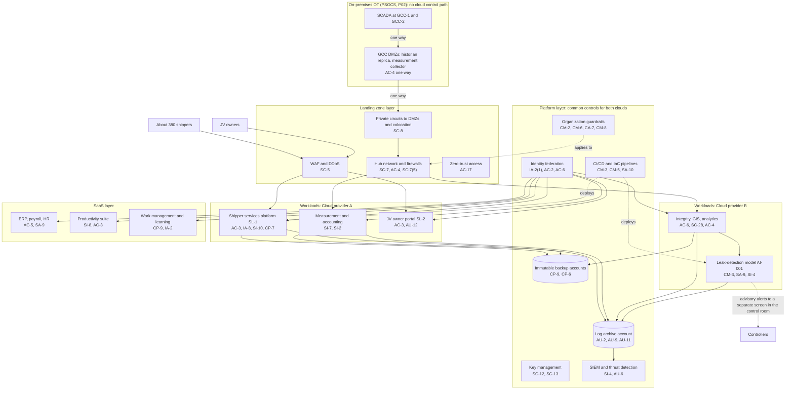

# Cloud Architecture and Control Placement: Cris Santos Company | Energy | Enterprise

**Organization:** Cris Santos Company, Inc. (publicly traded interstate natural gas transmission company) | **Tier:** Enterprise | **Provider:** Multi-cloud, vendor-agnostic: two public cloud providers (Cloud provider A and Cloud provider B), two colocation data centers, and SaaS (see section 4)
**Owner:** Director of Cloud Platform Engineering, with the CISO and the Director of OT Security | **Date:** 2026-08-31 | **Related:** PSGCS SSP (P02), enterprise BIA (P05)

## 1. Architecture in layers and the OT line
**The first design rule: no SCADA control function runs in a cloud.** The PSGCS (P02) stays on-premises at GCC-1, GCC-2, and PS3-CR. Clouds host business and analytics workloads that receive OT data one way through the GCC DMZs. Nothing in any cloud account can open a connection toward the SCADA network.

The cloud estate is organized in four layers, plus colocation. Each lower layer provides **common controls** that the layers above inherit, so a workload team configures only what is specific to its system.

| Layer | What it is | Examples | Who runs it |
|---|---|---|---|
| **Platform** | Organization-wide services in both clouds | Guardrails, identity federation, key management, log archive, SIEM feeds, vulnerability and posture management, immutable backup accounts, CI/CD pipelines | Cloud Platform Engineering; Security Operations; Identity team |
| **Landing zone** | The standard account pattern every workload lands in | Account vending with mandatory tags (including SSI, CEII, and Critical Cyber System tags), hub-and-spoke networks with cloud firewalls, private circuits to colocation and the GCC DMZs, WAF and DDoS protection, zero-trust access, egress filtering | Cloud Platform Engineering; Network Engineering |
| **Workload** | Systems the company builds or runs | Cloud A: shipper services platform (SL-1), gas measurement and accounting, JV owner portal (SL-2). Cloud B: integrity, GIS, and analytics platform; leak-detection model (AI-001); cloud AI services | Application teams |
| **SaaS** | Vendor-operated applications | ERP, payroll, and HR; productivity suite; work management and learning systems; enterprise identity platform | Vendors, with the company's configuration and oversight |

Colocation DC-1 (Florida) and DC-2 (Georgia) host the IT network core and offline copies of the immutable backups and of SCADA backup replicas.

**Critical Cyber Systems in the cloud.** SD Pipeline-2021-02G Section VII.C counts business services whose compromise could cause operational disruption. The Cybersecurity Implementation Plan therefore lists three cloud workloads as Critical Cyber Systems: the shipper services platform (nominations and scheduling feed gas control), the measurement system, and the analytics platform with AI-001 (a compromised model could mislead controllers). Their accounts carry the Critical Cyber System tag, and the SD 02G measures apply to them.

## 2. Diagram

## 3. Responsibility by service model
Sources: SRC-AWS-SRM, SRC-AZURE-SRM, and SRC-GCP-SRM in `00_universal-framework/sources/source-register.csv`. The three published models agree on the split used here, so the design does not depend on which two providers the company uses.

| Service model | Provider | Company (customer) | Shared |
|---|---|---|---|
| IaaS (measurement system servers) | Facilities, hosts, hypervisor, physical network | Guest OS, applications, identities, data, network policy | Encryption (provider service, customer keys), logging |
| PaaS (managed containers, databases, data platform, AI services) | Also the platform runtime and its patching | Data, access, configuration, keys, application code | Backups, availability configuration |
| SaaS (ERP, productivity, work management, identity) | Also the application | Users, roles, data, oversight of the vendor | Audit review (complementary user entity controls) |
| Colocation | Building, power, cooling, perimeter | Racks, equipment, cage access lists | None |

**TSA reminder.** Where a provider or managed security service provider performs a measure in the Cybersecurity Implementation Plan, the company keeps sole responsibility for compliance (SD 02G Section II.A.3). Provider SOC 2 reports support the company's assurance; they do not shift the duty.

## 4. Service categories and provider equivalents
| Service category | AWS | Microsoft Azure | Google Cloud |
|---|---|---|---|
| Organization guardrails | AWS Organizations service control policies | Azure Policy with management groups | Organization Policy Service |
| Account vending | AWS Control Tower account factory | Azure landing zone subscription vending | Resource Manager project creation |
| Key management | AWS KMS | Azure Key Vault | Cloud KMS |
| Audit logging | AWS CloudTrail | Azure Monitor activity log | Cloud Audit Logs |
| Threat detection | Amazon GuardDuty | Microsoft Defender for Cloud | Security Command Center |
| Managed containers | Amazon EKS | Azure Kubernetes Service | Google Kubernetes Engine |
| Managed relational database | Amazon RDS | Azure SQL Database | Cloud SQL |
| Web application firewall | AWS WAF | Azure Web Application Firewall | Cloud Armor |
| Backup service | AWS Backup | Azure Backup | Backup and DR Service |

This table is for reading provider documentation only. The architecture, control map, and SSP describe service categories.

## 5. Common controls
`cloud-control-map.csv` has **62 rows** across 28 components: Platform 22, Landing zone 8, Workload 19, SaaS 10, Colocation 3. Responsibility: Customer 49, Shared 8, Provider 5.

**33 rows are published as common controls** (`common_control` = Yes) in the enterprise common control catalog. They map to the common control providers in the PSGCS SSP (P02 section 10.3), mainly security operations (CCP-02), network and telecommunications engineering (CCP-03), and corporate security and facilities (CCP-04 for colocation oversight). A workload inherits them by being deployed through account vending, which applies the guardrails, logging, network, key, and backup policies automatically.

**Rules for inheriting:**
1. A workload may claim a common control only if its account was created by account vending and passes the posture baseline.
2. Customer-side identity, data protection, and logging stay explicit at every layer: even a SaaS application has Customer rows for access and logging.
3. SaaS and colocation rows cite the provider's SOC 2 report, reviewed by the third-party risk team (P09 evidence map).
4. A workload tagged as a Critical Cyber System must also meet the SD 02G measures in the Cybersecurity Implementation Plan, including the patch timelines for Known Exploited Vulnerabilities and 12-month log retention.

## 6. Validation against the PSGCS SSP (P02)
The PSGCS has no cloud components, so the check is the reverse: every place OT data or control could touch the cloud is covered.
| Interface | AC | AU | CM | IA | SC | SI |
|---|---|---|---|---|---|---|
| DMZ historian replica to analytics (one way) | AC-4 (DMZ and hub) | AU-2 (inherited) | CM-6 (inherited) | n/a (no inbound sessions) | SC-8 (circuit), SC-7 | SI-4 (inherited) |
| DMZ measurement collector to measurement system | AC-4 | AU-2 (inherited) | CM-3 (inherited) | n/a | SC-8 | SI-7 (hash check) |
| AI-001 alerts to the control room | AC-3 (view-only screen) | AU-12 | CM-3 (model change control) | IA-2 (SSO) | SC-7 (no SCADA path) | SI-4 |
| Cloud administrators | AC-6, AC-2 (inherited) | AU-2 (inherited) | CM-5 (inherited) | IA-2(1) (inherited) | No federation with the OT domain | n/a |

## 7. Findings from the mapping
1. **No cloud path into OT is confirmed.** Route tables, firewall rules, and the 2026-05 purple team exercise found no path from any cloud account to the SCADA network.
2. **AI-001 change control.** The leak model vendor deployed two updates in 2026 without staging and approval (POAM-019; P10).
3. **Business services are Critical Cyber Systems.** The shipper services platform is in TSA scope because a loss of scheduling can disrupt operations; its controls are treated as SD 02G measures, not just SOC 2 controls (P09).
4. **SSI and CEII in SaaS.** Sensitivity labels exist, but 3 of 25 sampled TSA submission records were unmarked (POAM-010).
5. **Two clouds, one control set.** Guardrails, logging, and key policies are written once as code and applied to both clouds.
6. **Work management restore untested.** Operator qualification records depend on a SaaS export that has never been restored (P05 DEP-24).
