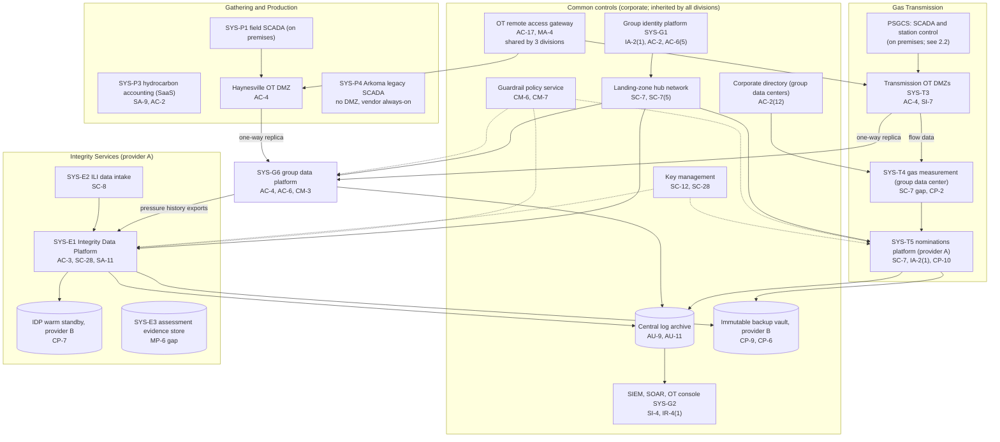
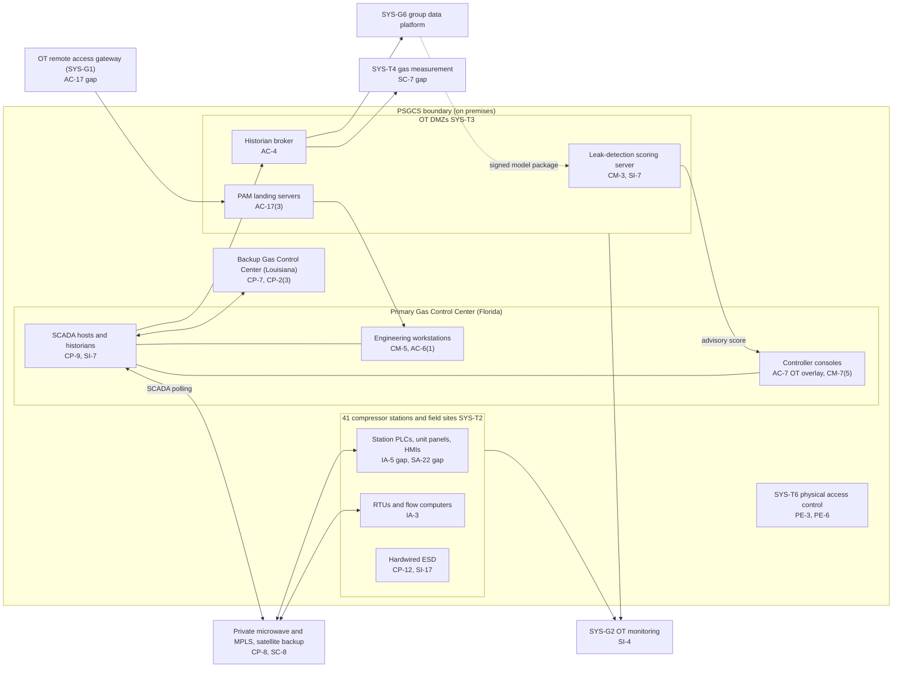

# Cloud Architecture and Control Placement: Cris Santos Company Holdings | Energy | Multi-Sector

**Organization:** Cris Santos Company Holdings, Inc. | **Tier:** Multi-Sector | **Providers:** two public cloud providers, called provider A and provider B (vendor-agnostic; see section 5)
**Scope:** the shared corporate platform (SYS-G1 to SYS-G3 and the group data platform SYS-G6) plus the division workloads that run on it, and the on-premises OT systems those workloads connect to. The SSP system (P02) is the Pipeline SCADA and Gas Control System (PSGCS), which stays on premises.

## 1. Design in one paragraph
Corporate runs one **landing zone** per provider: identity federation from SYS-G1, a hub network, guardrail policies, a central log archive, key management, EDR, and an immutable backup vault. Divisions get their own **accounts** inside the landing zone and inherit these guardrails. Provider A hosts the corporate hub, the group data platform (SYS-G6), the Gas Transmission nominations platform (SYS-T5), and the Integrity Data Platform (SYS-E1). Provider B hosts disaster recovery replicas, the IDP warm standby, and the backup vault. **OT never runs in the cloud.** SCADA, station control, and field SCADA stay on premises behind OT DMZs; the cloud receives one-way historian replicas only. Two business systems that matter to pipeline operations sit outside the cloud in the group data centers: gas measurement (SYS-T4) and the corporate directory it depends on.

## 2. Diagrams
### 2.1 Group landing zone, division workloads, and OT boundaries

### 2.2 PSGCS boundary (SSP system) and its interfaces

**Target state:** SYS-T4 moves into a dedicated measurement enclave with its own identity store, so a corporate directory compromise no longer reaches a server that touches OT (POAM-007, due 2027-06-30); the OT remote access gateway is split by division (POAM-001); leak-detection model changes enter the control room management of change (POAM-010, POAM-026).

## 3. Common versus division-specific controls
`cloud-control-map.csv` has 48 rows across 34 components. The `control_scope` column shows who owns each placement:

| Scope | Rows | What it means |
|---|---|---|
| Common (group) | 23 | Provided once by corporate (SYS-G1, SYS-G2, SYS-G3) and inherited by every division account. Listed in the P02 common control catalog |
| Shared corporate system (SYS-G6) | 5 | The group data platform that receives OT historian replicas and trains the leak-detection model |
| Division-specific (Gas Transmission) | 8 | Nominations platform, measurement servers, OT DMZ broker, scoring server |
| Division-specific (Gathering and Production) | 4 | Hydrocarbon accounting SaaS, royalty file exports, field historian replica |
| Division-specific (Integrity Services) | 8 | Integrity Data Platform, ILI intake, assessment evidence store |

| Responsibility | Rows |
|---|---|
| Customer (the group or a division) | 35 |
| Shared (provider and group) | 12 |
| Provider | 1 |

**Rule of thumb.** Identity, the OT remote access gateway, network guardrails, logging, keys, backups, and EDR are **common**. A division cannot opt out of them, only request an exception through POL-01. Application behavior, data access inside an application, customer-facing identity (shippers, clients), and anything that connects to OT are **division-specific**, because they depend on each division's regulators and customers.

## 4. Layers
| Layer | Common components | Division components | Key controls | Responsibility |
|---|---|---|---|---|
| Identity | SYS-G1, corporate directory, OT remote access gateway, cloud IAM | Shipper identity (SYS-T5), client identity (SYS-E1), SCADA local accounts (PSGCS) | AC-2, AC-3, AC-6(5), AC-17, IA-2(1) | Customer (configuration); vendor (identity service) |
| Network | Hub network, private links | WAF and API gateway (SYS-T5), OT DMZs | SC-7, SC-7(5), SC-8(1), SC-5, AC-4 | Customer, with provider DDoS protection shared |
| Compute | EDR, guardrails | Nominations containers, IDP containers, measurement servers, scoring server | SI-3, CM-6, CM-7, SC-7, SI-7, SA-11 | Customer (guest OS, containers, code) |
| Data | Keys, backup vault | IDP tenant data, SYS-G6 replicas, royalty files, assessment evidence | SC-12, SC-28, CP-9, CP-6, AC-3, MP-6, SI-12 | Shared: provider encrypts; group owns keys, zoning, and retention |
| Logging and monitoring | Log archive, SIEM, SOAR, OT console | Application and query logs | AU-3, AU-9, AU-11, SI-4, IR-4(1) | Shared: providers generate platform logs; group retains and reviews |
| SaaS dependencies | Identity, SIEM, EDR vendors | Hydrocarbon accounting SaaS | SA-9, AC-2 | Provider for the service; customer for use and oversight |
| Physical | Provider data centers; group data centers | Gas control centers and stations (PSGCS, on premises) | PE-3 | Provider for its facilities; group for its own |

## 5. Service categories and provider equivalents
The design does not depend on a provider. This table gives each provider's name for each service category, for reading its shared responsibility documentation.

| Service category | AWS | Microsoft Azure | Google Cloud |
|---|---|---|---|
| Account structure and guardrails | AWS Organizations with service control policies | Management groups with Azure Policy | Resource hierarchy with Organization Policy |
| Managed containers | Amazon EKS | Azure Kubernetes Service | Google Kubernetes Engine |
| Managed relational database | Amazon RDS | Azure SQL Database | Cloud SQL |
| Object storage | Amazon S3 | Azure Blob Storage | Cloud Storage |
| Key management | AWS KMS | Azure Key Vault | Cloud KMS |
| Audit logging | AWS CloudTrail | Azure Monitor activity log | Cloud Audit Logs |
| Backup with immutability | AWS Backup (vault lock) | Azure Backup (immutable vault) | Backup and DR Service |
| Private connectivity | AWS Direct Connect | Azure ExpressRoute | Cloud Interconnect |
| Managed file transfer | AWS Transfer Family | Azure Blob SFTP | Cloud Storage transfer options |

Shared responsibility sources: SRC-AWS-SRM, SRC-AZURE-SRM, SRC-GCP-SRM in `00_universal-framework/sources/source-register.csv`. All three agree on the split used here: for IaaS the provider owns facilities, hosts, and virtualization; for PaaS the provider also owns the runtime; for SaaS the provider owns the application. The customer always keeps identities, access decisions, data classification, and data.

## 6. Findings from the mapping
1. **The cloud is not where the OT risk is; the seams are.** SCADA never runs in the cloud and replicas flow one way. The two weak placements are on premises: gas measurement servers that are corporate-directory members yet receive data from the OT DMZ (SC-7; POAM-007), and one remote access gateway shared by three divisions (AC-17; POAM-001).
2. **The Integrity Data Platform is sound as a platform but not yet as an SSI store.** Tenant isolation, encryption, and standby are in place (AC-3, SC-28, CP-7). What is missing is SSI labeling and need-to-know enforcement for the Transmission division's and 9 designated clients' SSI (POAM-019), and enforced deletion of assessment evidence (MP-6; POAM-020).
3. **The group data platform is where AI meets OT.** It trains the leak-detection model that controllers see. Its release process is sound (signed packages, SI-7), but it is not linked to control room change management (CM-3; POAM-026).
4. **Common controls are strong and reused.** One identity platform, one SIEM, one backup design. This is what lets group internal audit assess them once (P07). The weak link is documentation of inheritance for Gathering and Production (P02, POAM-017), not the controls themselves.
5. **Royalty owner files leave the SaaS.** The accounting SaaS is well controlled by its vendor, but monthly exports sit on a corporate file share, which is exactly what a ransomware crew steals first (P08).
