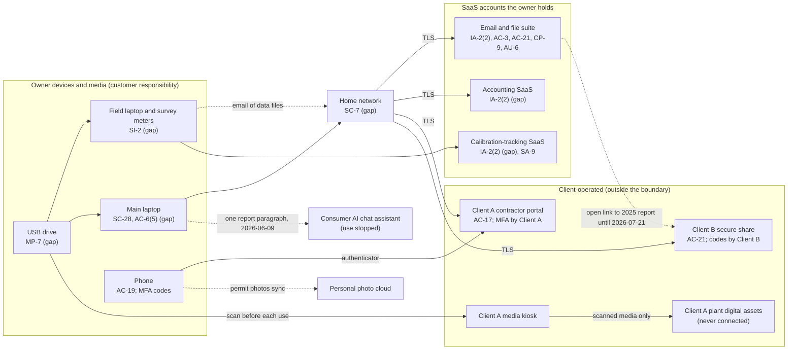

# SaaS Architecture and Control Placement: Cris Santos Company | Nuclear Reactors, Materials, and Waste | Sole Proprietorship

**Organization:** Cris Santos Company (independent radiation safety consultant) | **Tier:** Sole Proprietorship | **Provider:** SaaS only (no IaaS or PaaS)
**System:** Core Business SaaS Stack (CBSS), as defined in the system profile (P02) | **Mapped:** 2026-07-22 by the owner-consultant with the IT technician

## 1. Diagram
Control IDs on each node are the ones in `cloud-control-map.csv`. Dashed lines are flows that break a client term or have no agreement.

## 2. Layers
| Layer | Components | Key controls | Responsibility |
|---|---|---|---|
| Identity | Suite, accounting, and calibration accounts; Client A and Client B portal credentials | IA-2(2), AC-17, AC-6(5) | Owner configures; providers and clients supply MFA |
| Data | Suite files and email; Client B security information; Client A work packages; survey data | AC-3, AC-21, CP-9, SC-28 | Providers protect data inside their services; the owner decides where client data goes and who can open it |
| Endpoints and media | Main laptop, field laptop, phone, USB drive | SC-28, SI-2, MP-7, AC-19 | Owner |
| Network | Home router and Wi-Fi | SC-7 | Owner (the ISP supplies the router) |
| Logging | Suite sign-in and sharing logs | AU-2 (provider), AU-6 (owner) | Shared: provider records, owner reviews |
| SaaS applications and hosting | Suite, accounting, and calibration platforms | Inherited (AU-2, SC-8, PE family) | Provider |

## 3. Shared responsibility for SaaS
All three major cloud providers' shared responsibility models (SRC-AWS-SRM, SRC-AZURE-SRM, SRC-GCP-SRM) agree on the SaaS split: the provider runs the application, the platform, and the facilities; **the customer always keeps its identities, its data, and its devices.** That is why 12 of the 17 rows in the control map are the owner's alone, 4 are shared, and 1 is the provider's. Two rows cover client-operated services: there the client sets the rules by contract (CSR-A, CSIA-B) and the owner's part is to use the service as the contract says. No IaaS equivalents table is needed, because the business runs no infrastructure.

## 4. Findings from the mapping
1. **The worst exposure was a sharing setting, not a breach of the provider.** The suite did exactly what the owner told it: an open link to Client B's 2025 Part 37 review report stayed live for 13 months. No SaaS control can decide that Client B security information does not belong in the suite. Only a rule can (POL-01 8.2, 8.5). Tracked as P01 R-002.
2. **MFA is off where it is free to turn on** (accounting, calibration-tracking), and email relies on text message codes. The calibration-tracking gap was found during this mapping. Tracked with R-003 and R-011.
3. **The USB drive is the only path from the business to Client A's plant.** Client A's kiosk is the control that protects the plant; the owner's part is a dedicated, encrypted, Client A-only drive and an offline field laptop, so the kiosk never has to catch something the owner carried in. Tracked as R-004 and R-005.
4. **The phone is part of the boundary.** It holds both second factors and the permit photos. Losing it is a lockout risk (R-010) and a disclosure risk (R-015).
