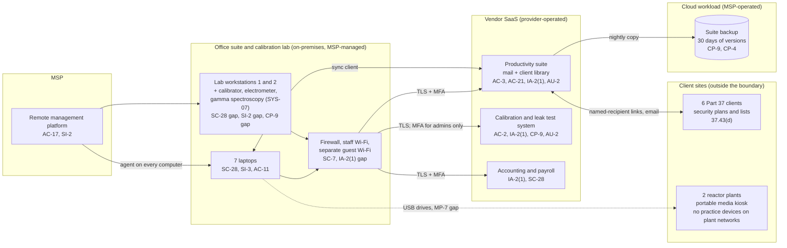

# Cloud Architecture and Control Placement: Cris Santos Company | Nuclear Reactors, Materials, and Waste | Micro

**Organization:** Cris Santos Company, LLC (radiation safety consulting practice) | **Tier:** Micro | **Provider:** Vendor-agnostic SaaS (see section 3)
**System:** Practice Business Platform (PBP), as defined in the SSP (P02) | **Prepared:** 2026-08-14 by the Office Manager with the MSP lead technician | **Approved:** Principal Health Physicist (owner), 2026-09-15

## 1. Diagram
The practice runs no servers and no IaaS tenant. Its cloud is a set of SaaS services plus one cloud workload that the MSP operates for it: the SaaS-to-SaaS backup of the productivity suite (SYS-06). Client sites appear on the diagram because the most sensitive data flows go to and from them.

## 2. Layers and who is responsible
| Layer | Components | Key controls | Customer (practice) | MSP (on the practice's behalf) | Provider (SaaS vendor) |
|---|---|---|---|---|---|
| Identity | Suite, SYS-02, SYS-03, and backup accounts; firewall login | AC-2, AC-6, IA-2(1) | Decides who gets access; keeps the client approval list; enforces MFA settings | Creates and disables suite and laptop accounts; holds the backup and firewall logins | Runs sign-in and MFA services |
| Network | Firewall, Wi-Fi, internet line | SC-7, AC-18 | Approves changes and vendor remote access | Configures, patches, and monitors | Not applicable |
| Endpoints | 7 laptops, 2 lab workstations, USB drives | SC-28, SI-3, SI-2, AC-11, MP-7 | Approves patch exclusions; owns the media rule and the inventory | Encryption, antivirus, patching, screen lock | Not applicable |
| SaaS applications | Suite, SYS-02, SYS-03 | AC-3, AC-21, SC-8, AU-2 | Library permissions, sharing settings, SYS-02 roles | Suite settings on request | Application, platform, data centers |
| Data | Client library, SYS-02 records, backup copies, lab files | AC-3, CP-9, CP-4, SC-28, SI-12 | Decides who sees client security information, retention, return or destruction, and restore testing | Operates the backup and runs restore tests | Encrypts and backs up its own platform |
| Logging | Suite audit log, SYS-02 audit trail, firewall logs | AU-2, AU-6, AU-11 | **Reviews access to client security information monthly (gap today)** | Keeps firewall logs; forwards alerts | Generates and stores logs |
| Vendor governance | SOC 2 review, MSP review, data-use terms | SA-9, SR-6 | Reviews SOC 2 and MSP evidence; negotiates data-use terms | Discloses its subcontractors (backup vendor) | Provides SOC 2 reports |

**The MSP is not a cloud provider in the shared responsibility sense.** It performs customer-side duties for the practice. Anything marked "Customer (performed by MSP)" in `cloud-control-map.csv` remains the practice's responsibility, and the client contracts make the practice answerable for it. The practice must direct the work, receive evidence, and check it (SA-9).

**Client duties do not move to the SaaS vendors.** The Part 37 clients' 37.43(d) duties flow to the practice by contract. None of the SaaS vendors has agreed to them, and none needs to: the practice meets them through who it lets into each folder (AC-3), what it shares and with whom (AC-21), and how it deletes copies at the end of an engagement (SI-12). Those are customer-side controls in every SaaS model.

## 3. Service categories and provider equivalents
The design is vendor-agnostic. The shared responsibility split for SaaS is the same in all three major cloud providers' models: the provider runs the application, platform, and infrastructure; the customer keeps identities, access, data, and devices (SRC-AWS-SRM, SRC-AZURE-SRM, SRC-GCP-SRM in `00_universal-framework/sources/source-register.csv`). For the practice's vendors, the SOC 2 report or vendor security documentation is the evidence of the provider side.

| Service category used | What it is here | Equivalent category in the large cloud providers (for reading their documentation) |
|---|---|---|
| Productivity suite | Email, calendar, file storage, sharing, sync client | Productivity and collaboration SaaS |
| Line-of-business SaaS | Calibration and leak test management | Industry SaaS built on any provider |
| Accounting and payroll SaaS | Invoices, payroll | Business application SaaS |
| SaaS-to-SaaS backup | Nightly copy of the suite | Backup service or third-party SaaS backup |
| Remote monitoring and management | MSP device management | Device management SaaS |

## 4. Findings from the mapping
1. **The client library is one big room (AC-3, AC-21).** Every staff member can open every client's Part 37 documents, and the sync client copies them to all 7 laptops. Clients approved only 4 staff. Fix: one restricted folder per client, open only to that client's approved staff, with sync turned off for those folders. Tracked as P01 R-001 and R-004 and P07 POAM-002.
2. **Sync is not backup (CP-9, CP-4).** If ransomware encrypts a laptop's synced folders, the encrypted files sync to the suite and then to the backup. Only the 30 days of versions protect the practice, and nobody has tried a restore. Fix: 90-day immutable versions, a restore test by 2026-10-31, and quarterly tests (R-010, POAM-007, POAM-008).
3. **The MSP-held firewall login has no MFA (IA-2(1)).** One stolen MSP password would open the office network. Fix: named MSP accounts with MFA by 2026-10-31 (R-013, POAM-005).
4. **The weakest computers sit next to the most important instruments.** The lab workstations are unencrypted, unpatched, and on the staff network. Lab workstation 2 runs an unsupported operating system and is not backed up (R-009, R-011).
5. **The path to the reactor plants is a USB drive (MP-7).** Practice devices never join plant networks, so the only digital path into a plant is removable media. That path has already carried malware once, on 2026-04-14 (R-003, POAM-010).
6. **The SYS-02 vendor wants to learn from the practice's data.** Its standard terms allow pooled customer data for product improvement, which its AI drift module uses. Free-text location fields name client irradiator rooms (P10; R-016).
