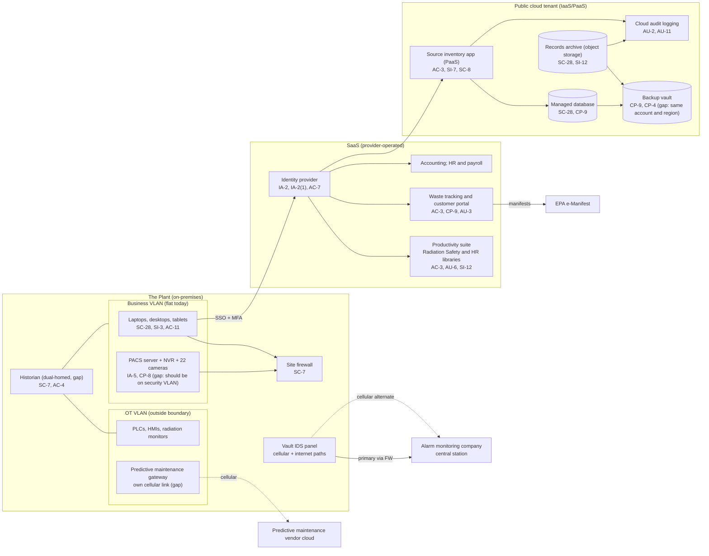

# Cloud Architecture and Control Placement: Cris Santos Company | Nuclear Reactors, Materials, and Waste | Small

**Organization:** Cris Santos Company, LLC (radioactive and hazardous waste processor) | **Tier:** Small | **Provider:** Vendor-agnostic (see section 3)
**System:** Business Operations and Records Platform (BORP), as defined in the SSP (P02)

## 1. Diagram

## 2. Layers
| Layer | Components | Key controls | Responsibility |
|---|---|---|---|
| Identity | Identity provider, cloud IAM roles | AC-2, AC-6, AC-7, IA-2, IA-2(1) | Customer (configuration), provider (service) |
| Network / edge | Site firewall, business VLAN, cloud network rules and private endpoint | SC-7, CP-8 | Customer |
| Compute / application | Source inventory application (PaaS), endpoints, PACS server and NVR | AC-3, SI-7, SC-8, SI-3, IA-5 | Customer (application code, roles, data); provider (PaaS runtime) |
| Data | Managed database, records archive, backup vault, SaaS libraries | SC-28, CP-9, CP-4, SI-12 | Shared: provider encrypts; customer sets retention, isolation, and access |
| Logging / monitoring | Cloud audit logs, identity sign-in logs, SaaS file access logs | AU-2, AU-6, AU-11 | Shared: provider generates; customer retains and reviews |
| SaaS applications | Productivity suite, waste tracking, accounting, HR | AC-3, AC-21, AU-3, CP-9 | Provider (application and infrastructure); customer (users, roles, sharing, data) |
| Physical / hypervisor | Provider data centers | PE family | Provider (inherited) |

## 3. Service categories and provider equivalents
The company's design is independent of the provider. This table gives each provider's name for each service category, to use when reading its shared responsibility documentation.

| Service category | AWS | Microsoft Azure | Google Cloud |
|---|---|---|---|
| Managed web application platform | AWS Elastic Beanstalk or AWS App Runner | Azure App Service | Cloud Run |
| Managed relational database | Amazon RDS | Azure Database for PostgreSQL | Cloud SQL |
| Object storage | Amazon S3 | Azure Blob Storage | Cloud Storage |
| Backup service | AWS Backup | Azure Backup | Backup and DR Service |
| Identity and access management | AWS IAM | Azure role-based access control with Microsoft Entra ID | Cloud IAM |
| Audit logging | AWS CloudTrail | Azure Monitor activity log | Cloud Audit Logs |
| Private network endpoint | AWS PrivateLink | Azure Private Link | Private Service Connect |

Shared responsibility sources: SRC-AWS-SRM, SRC-AZURE-SRM, SRC-GCP-SRM in `00_universal-framework/sources/source-register.csv`. All three models agree on the split used here:
- **IaaS:** the provider owns physical facilities, hosts, and virtualization. The customer owns the network configuration, identities, and data.
- **PaaS:** the provider also owns the runtime and database engine patching. The customer owns application code, access roles, data, and backup settings.
- **SaaS:** the provider also owns the application. The customer keeps identities, access, sharing settings, and data.

## 4. Findings from the mapping
1. **Part 37 information sits in a SaaS library with customer-controlled permissions (AC-3, AC-21).** The provider encrypts the files, but who can open them is always the customer's job. Today 23 users can open the security plan. Fix: a restricted library with sync, download, and external sharing blocked. Tracked as P01 R-004 and P07 POAM-001.
2. **Backup isolation (CP-9).** The backup vault shares the production account, region, and administrator roles. A single compromised administrator could delete the source inventory history and the records archive, which would defeat the 37.101 duty to guard records "against tampering with and loss." Fix: a separate account with immutable retention and a second region (POAM-003).
3. **The security systems are on-premises but on the wrong network (SC-7, CP-8).** The PACS server, NVR, and cameras are not cloud components. They appear here because they share the business VLAN with everything else in the diagram. Moving them to a security VLAN with its own firewall and UPS removes the common failure mode (37.49(c); POAM-002).
4. **Two unmanaged paths cross the boundary.** The historian bridges the business and OT networks, and the predictive maintenance gateway has its own cellular link to the vendor's cloud. Neither passes a managed interface (P03 G-080, G-068). They are drawn so that the boundary picture is honest.
5. **Source inventory integrity (SI-7).** The PaaS platform protects the runtime, but the application has no edit history. Adding an audit table and second-person verification is a customer change (P01 R-013).
6. **Inherited controls rely on vendor SOC 2 reports.** Controls marked "Provider" for the waste tracking system depend on the vendor's SOC 2 Type 2 report, reviewed in P09.
