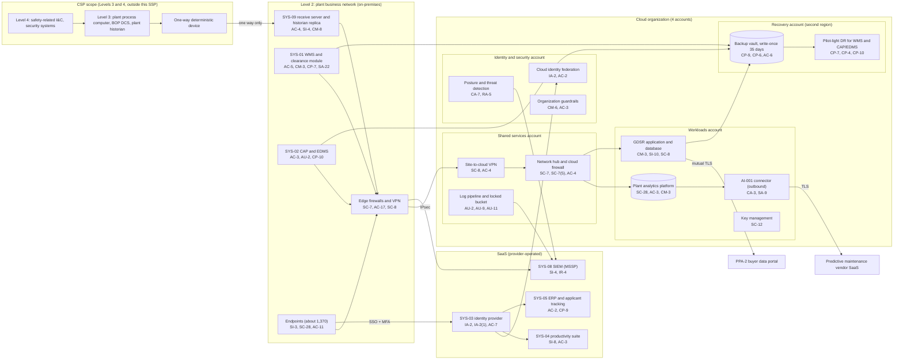

# Cloud Architecture and Control Placement: Cris Santos Company | Nuclear Reactors, Materials, and Waste | Mid-Market

**Organization:** Cris Santos Company, Inc. | **Tier:** Mid-Market | **Provider:** Vendor-agnostic public cloud (see section 4), plus SaaS
**System:** Plant Business Network and Work Management System (PBN-WMS), as defined in the SSP (P02) | **Prepared:** 2026-07-31 by the IT Security Manager; updated 2026-09-17 with P07 results
**Control map:** `cloud-control-map.csv` (54 rows, 25 components)

## 1. Diagram
The diagram shows where the cloud sits relative to the CSP defensive architecture. The cloud is **below** Level 2. Plant data reaches it only after crossing the one-way deterministic device into Level 2 and then the site-to-cloud VPN. No path exists from the cloud back toward Level 3.

## 2. Landing zone design
The landing zone separates duties across 4 accounts (subscriptions or projects, depending on the provider) under one cloud organization.

| Account | Purpose | Who administers | Key design decisions |
|---|---|---|---|
| **Identity and security** | Organization root, federation to SYS-03, guardrails, posture and threat detection | IT Security Manager and 1 analyst | No workloads. Root credentials sealed. Guardrails apply to every account and cannot be disabled from them |
| **Shared services** | Network hub, cloud firewall, site-to-cloud VPN, DNS, one directory domain controller, log pipeline and locked log bucket | IT Director's infrastructure team | All traffic between the site, workloads, and the internet passes the hub. Logs from all accounts land in a write-once bucket |
| **Workloads** | Plant analytics platform (copy of historian data), AI-001 connector, GDSR application and database, key management | Infrastructure team; Energy Marketing for GDSR content | Separate subnets per workload. No internet ingress. Company-managed keys. **No Safeguards Information and no Security-Related Information** (guardrail tags and POL-04) |
| **Recovery** | Backup vault with 35-day write-once retention, pilot-light DR for WMS and CAP/EDMS, isolated recovery network | 2 named backup administrators | Separate administrator credentials, not federated. Backups written by a cross-account role that can write but not delete |

**Nuclear-specific rules for the cloud (POL-04 and STD-01):**
- Safeguards Information is never stored or processed in the cloud. It stays on the stand-alone SGI computers (73.22(g)).
- Security-Related Information (CSP, CDA inventory, assessments, defensive architecture drawings) stays in the EDMS restricted folders on premises.
- The cloud never connects to Level 3 or Level 4. The site-to-cloud VPN terminates on the business network edge. Any proposal that would send data from the cloud toward the plant needs a CST evaluation under 73.54(d)(3) and a CSP review.

## 3. Layers and shared responsibility per service
| Layer | Components | Key controls | Service model | Responsibility |
|---|---|---|---|---|
| Identity | Cloud federation, break-glass accounts, privileged access broker, SYS-03 | IA-2, IA-2(1), AC-2, AC-6(5), AC-7, IA-5 | PaaS and SaaS | Customer configures identities, roles, MFA, and reviews; provider runs the identity services |
| Network | Hub, cloud firewall, VPN, DNS, AI-001 connector, GDSR transfer | SC-7, SC-7(5), SC-8, AC-4, SC-20, CA-3 | IaaS and PaaS | Customer designs routes, rules, and segmentation; provider runs gateways and DNS |
| Compute | GDSR virtual machines, directory domain controller, managed analytics, pilot-light DR | CM-6, SI-2, SI-3, CM-3, CP-7, CP-10 | IaaS and PaaS | Customer owns guest OS, applications, and EDR; provider owns hosts and hypervisor |
| Data | Object storage, managed database, keys, backups | SC-28, SC-12, CP-9, CP-6, CP-9(1), SI-10, AC-3, AC-6 | PaaS | Shared: provider encrypts and operates storage; customer controls keys, access, retention, isolation, and restore testing |
| Logging and monitoring | Log pipeline, posture service, SIEM | AU-2, AU-9, AU-11, AU-12, CA-7, RA-5, SI-4, IR-4 | PaaS and SaaS | Shared: provider generates logs; customer enables, retains, forwards, and acts on them; MSSP monitors |
| SaaS applications | Identity provider, productivity suite, ERP and applicant tracking, SIEM | AC-7, IA-5, SI-8, AC-3, AC-2, CP-9 | SaaS | Provider runs the application; customer keeps users, roles, sharing settings, and data |
| Physical | Provider data centers | PE-3, PE-11, PE-13 | All | Provider (inherited, evidenced by SOC 2 reports) |

**Responsibility counts in `cloud-control-map.csv`:** 30 Customer, 17 Shared, 7 Provider (54 rows). By service model: 16 IaaS, 29 PaaS, 9 SaaS. By account: 9 identity and security, 11 shared services, 15 workloads, 8 recovery, 3 provider data centers, and 8 for the SaaS services.

## 4. Service categories and provider equivalents
The design is independent of the provider. This table gives each provider's name for the service category, for reading its shared responsibility documentation (SRC-AWS-SRM, SRC-AZURE-SRM, SRC-GCP-SRM in `00_universal-framework/sources/source-register.csv`).

| Service category | AWS | Microsoft Azure | Google Cloud |
|---|---|---|---|
| Multi-account organization and guardrails | AWS Organizations, service control policies | Management groups, Azure Policy | Resource Manager folders, organization policies |
| Account, subscription, or project | Account | Subscription | Project |
| Cloud identity federation | IAM Identity Center | Microsoft Entra ID with Azure RBAC | Cloud Identity with IAM |
| Network hub and cloud firewall | Transit Gateway, AWS Network Firewall | Virtual WAN hub, Azure Firewall | Network Connectivity Center, Cloud NGFW |
| Site-to-cloud VPN | Site-to-Site VPN | VPN Gateway | Cloud VPN |
| Object storage with write-once retention | S3 with Object Lock | Blob Storage with immutability policies | Cloud Storage with bucket lock |
| Managed analytics service | Amazon Athena or Redshift | Azure Synapse | BigQuery |
| Managed relational database | Amazon RDS | Azure SQL Database | Cloud SQL |
| Backup service | AWS Backup (vault lock) | Azure Backup (immutable vault) | Backup and DR Service |
| Pilot-light disaster recovery | AWS Elastic Disaster Recovery | Azure Site Recovery | Backup and DR Service |
| Key management | AWS KMS | Azure Key Vault | Cloud KMS |
| Audit logging | CloudTrail | Azure Monitor activity log | Cloud Audit Logs |
| Posture and threat detection | Security Hub, GuardDuty | Microsoft Defender for Cloud | Security Command Center |

**Service model split used here (all three providers agree):**
- **IaaS** (virtual machines, networks): the provider owns facilities, hosts, and virtualization. The customer owns the guest OS, applications, network configuration, identities, and data.
- **PaaS** (managed database, analytics, storage, backup, keys): the provider also owns the platform software and its patching. The customer owns access, keys, data, and configuration.
- **SaaS** (identity provider, productivity suite, ERP, SIEM): the provider also owns the application. The customer keeps identities, roles, settings, and data.

## 5. Findings from the mapping
1. **The CSP boundary holds in the cloud design.** Guardrails and hub rules prevent any route from the cloud toward the receive server, and the VPN terminates on the business network edge. P07 confirmed with a reachability test that nothing in the workloads account can reach the receive server.
2. **The analytics feed and the AI-001 connector were added without a CST evaluation.** Both consume Level 3 data that crossed the one-way device. The one-way device protects Level 3 from them, but the 73.54(d)(3) evaluation and the CSP documentation were skipped (gap 3; P01 R-006; POAM-019).
3. **Recovery is designed but unproven.** Backups are isolated (separate account, second region, write-once, separate credentials). The pilot-light DR for WMS and CAP/EDMS has never been failed over, and the clearance module cannot run there until it is upgraded (P01 R-010, R-018; POAM-010, POAM-017).
4. **GDSR integrity depends on change control that does not exist yet.** The data service that PPA-2 wants a SOC 2 report on has its meter-data scripts edited directly (gap 12; P01 R-026; POAM-007).
5. **Logging gaps sit at the edges.** Cloud control-plane logs are complete, but GDSR database audit logs and the analytics platform's access logs are not forwarded to the SIEM, and there is no egress volume alerting (P01 R-012; POAM-005).
6. **Boundary check.** Every in-scope cloud and SaaS component in the SSP (P02 section 9) appears in the diagram and has at least one row in the control map. Each account has controls from at least 2 of the AC, AU, CM, IA, SC, and SI families or inherits them.
7. **Inherited controls rely on SOC 2 reports.** Provider and Shared rows for the cloud provider, identity provider, productivity suite, ERP vendor, and MSSP depend on their SOC 2 Type 2 reports and complementary user entity controls, reviewed each year in P09 `vendor-soc2-review.csv`.
