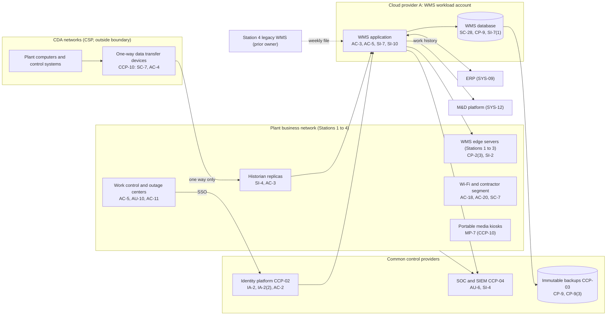

# System Security Plan: Fleet Work Management System and Plant Business Networks (WMS-PBN)

**Organization:** Cris Santos Company, Inc. (publicly traded nuclear generation company) | **Tier:** Enterprise | **Vertical:** Nuclear Reactors, Materials, and Waste
**Outline:** NIST SP 800-18 Rev. 2, System Security Plan Outline Example (June 2026) | **Version:** 2.0, 2026-09-14

## 1. System Name and Identifier
Fleet Work Management System and Plant Business Networks (**WMS-PBN**), identifier CSC-SYS-WMS-001. Tier-1 system in the enterprise application inventory. Non-safety: no part of WMS-PBN is a critical digital asset (CDA).

## 2. System Overview
WMS-PBN is the business side of plant operations. It has two parts:
- **The fleet work management system (WMS).** Commercial enterprise asset management software, customer-managed on Cloud provider A. It holds work orders and work packages, **clearance and tagging** (the records that define which equipment is isolated so people can work on it safely), **Technical Specification surveillance scheduling** (about 260 surveillances a week across the fleet), and refueling outage schedules. About 9,500 named users plus up to 1,500 outage contractors per outage. A read-only **WMS edge server** at each of Stations 1 to 3 keeps the clearance index and surveillance schedule available if the cloud link fails.
- **The four plant business networks.** Station LANs, Wi-Fi, work control and outage control centers, outage trailers, business workstations, print servers, and the **plant data historian replicas** that receive plant data through the **one-way data transfer devices**.

**Why integrity matters most.** A clearance record that shows the wrong isolation boundary can injure a worker. A surveillance schedule that is silently changed can let a required test pass its Technical Specification interval (10 CFR 50.36(c)(3) defines surveillance requirements), which forces required actions and may be reportable. Plant procedures require independent verification of clearances in the field, so the WMS is not the only barrier, but WMS integrity is still the main design driver.

**Relationship to the 73.54 program.** Each station's analysis under 10 CFR 73.54(b)(1) determined that the WMS, edge servers, and business networks are not CDAs: they perform no safety, security, or emergency preparedness function, and plant procedures do not rely on them without independent verification. The business networks form the **outer level of the defensive architecture**. The CDA boundary is the one-way data transfer device, which lets plant data flow out and nothing flow in. Portable media and mobile devices that cross from business areas toward CDAs are controlled by the cyber security plan (CSP), not by this SSP.

## 3. Laws, Regulations, and Policies Affecting the System
| ID | Requirement | Citation | How it affects WMS-PBN |
|---|---|---|---|
| C-NUCLEAR-R01 | NRC cyber security rule | 10 CFR 73.54 | WMS-PBN is outside the CDA scope but is the outer defensive level (73.54(c)(2)); modifications near the boundary need a cyber review (73.54(d)(3)); wireless devices near plant equipment need a 73.54(b)(1) analysis |
| C-NUCLEAR-R03 | Cyber security event notifications | 10 CFR 73.77 | Business network incidents that reach toward CDAs, or reports to other agencies, can start NRC clocks (P08) |
| C-NUCLEAR-S01 | Safeguards Information | 10 CFR 73.22(g) | SGI may be processed only on stand-alone computers, so SGI is prohibited on WMS-PBN |
| C-NUCLEAR-S02 | Access authorization and FFD information | 10 CFR 73.56(m); 26.37 | Contractor onboarding data passes through WMS-PBN workstations; it must be protected |
| C-NUCLEAR-S10 | Technical Specification surveillance requirements | 10 CFR 50.36(c)(3) | Surveillance schedules in the WMS must be accurate |
| C-NUCLEAR-S06 | SEC cybersecurity disclosure | Form 8-K Item 1.05; 17 CFR 229.106 | A material WMS-PBN incident goes through the P08 materiality step |
| C-NUCLEAR-S07 | State breach and data security laws | Each state where affected individuals reside (Florida worked example: Fla. Stat. 501.171) | Worker and contractor personal information |
| C-NUCLEAR-S09 | Export control | 10 CFR Part 810 (810.2(a)(2)) | Work packages can contain reactor technology; transfers outside the company use a controlled workflow |
| Internal | POL-01 to POL-05 and standards | P06 | Enterprise policy hierarchy |

Not applicable: C-NUCLEAR-R02 (73.110 applies only to Part 53 licensees or those who elect it); C-NUCLEAR-R04 (NERC CIP does not apply to WMS-PBN; the Generation Dispatch Center is a separate system); C-NUCLEAR-R05 (CIRCIA is proposed only).

## 4. System Status
### 4.1 System Security Plan Approval
Prepared by the WMS Application Manager and the GRC team. Reviewed by the CISO, the Director, Nuclear Cyber Security, and the Vice President, Fleet Work Management. Approved by the Chief Nuclear Officer on 2026-09-14.
### 4.2 System Authorization Decision
The company is not a federal agency, so there is no formal ATO. The equivalent internal decision:
- **Authorizing official equivalent:** Chief Nuclear Officer, with the CISO's recommendation.
- **Decision (2026-09-14):** continue operation with conditions, based on the Internal Audit assessment (P07) and the risk register (P01).
- **Conditions:** close the High POA&M items that affect clearance and surveillance integrity before the next outage at the affected station (POAM-005 by 2026-11-30, POAM-007 by 2026-12-15, POAM-008 by 2027-01-31); remove the cellular sensor gateways at Station 4 from the business network until analyzed (POAM-018 by 2026-12-31); segment the Station 4 business network (POAM-009 by 2027-03-31).
- **Reauthorization:** annually, and at the Station 4 WMS migration (planned 2027-05).
### 4.3 System Operational Status
Operational. Planned major modifications: Station 4 migration to the fleet WMS (2027-05); automated change blocking for scheduling rules (CM-3(1)); automated integrity response for clearance records (SI-7(2), SI-7(5)).

## 5. Role Identification and Responsible Personnel
| Role | Title | Responsibility |
|---|---|---|
| System owner | Vice President, Fleet Work Management | Accountable for the WMS and its use at all stations; approves role templates |
| Authorizing official (equivalent) | Chief Nuclear Officer | Accepts residual risk to operate |
| Station process owners | Plant Managers (4) | Clearance, surveillance, and work control procedures at each station |
| System administrator | WMS Application Manager | Day-to-day administration, configuration, integrations, change control |
| Information security | CISO; Director, Security Operations | Program oversight; SOC monitoring; incident response |
| Boundary with CDAs | Director, Nuclear Cyber Security; Site Cyber Security Program Managers | One-way devices, portable media controls, 73.54(b)(1) analyses, 73.77 decisions |
| Common control providers | See section 10.3 | Operate inherited controls |
| Independent assessor | Chief Audit Executive (Internal Audit) | Annual assessment (P07) |

## 6. System Information Types and System Categorization
Information types are modeled on NIST SP 800-60 Vol. 2 Rev. 1. Impact levels follow FIPS 199, used as a model.

| Information type | Confidentiality | Integrity | Availability | Rationale |
|---|---|---|---|---|
| Plant maintenance and operations records (work orders, clearances, surveillance schedules, outage schedules) | Moderate | **High (treated)** | Moderate | Equipment details are sensitive but are not SGI. A wrong clearance boundary or a changed surveillance date can harm workers or cause a Technical Specification violation, so integrity is treated at High. Printed schedules and paper clearances keep critical work going, so availability stays Moderate (P05 BP-06: MTD 24 h, RTO 8 h online; BP-07: RTO 4 h in an outage) |
| Personnel and contractor information (names, badge numbers, qualifications) | Moderate | Moderate | Low | Personal information; access authorization records themselves stay in SYS-10 |
| Supply chain and inventory data | Low | Moderate | Low | Parts and purchase links |
| Information security (audit logs, configurations, credentials) | Moderate | Moderate | Moderate | Protects the evidence for record integrity |
| **WMS-PBN category** | **Moderate** | **Moderate baseline, integrity supplemented** | **Moderate** | See the decision below |

**Categorization decision.** A strict FIPS 199 high-water mark would make the system High because of integrity. The company is not a federal agency and uses FIPS 199 as a model. The Chief Nuclear Officer approved this tailoring on 2026-09-14, after the risk committee of the board reviewed it on 2026-09-10:
- WMS-PBN uses the **SP 800-53B Moderate baseline**.
- It adds **8 High-baseline controls** that protect clearance and surveillance integrity: AU-9(2), AU-10, CM-3(1), CM-4(1), CM-5(1), CP-9(3), SI-7(2), SI-7(5).
- The decision is reviewed annually. If the integrity POA&M items (POAM-005, POAM-007, POAM-008) are not closed by 2027-06-30, the CISO will recommend full High categorization.

**Documented controls.** `control-implementation.csv` documents **233 controls**: all 177 base controls in the Moderate baseline, 48 of its 110 control enhancements, and the 8 High-baseline integrity supplements. The other 62 Moderate enhancements are fully inherited from the common control catalog (section 10.3) and are listed there rather than repeated here.

## 7. Authorization Boundary Description
**Inside the boundary:** the WMS application servers, database, and integration services in the WMS workload account (Cloud provider A); the WMS edge servers at Stations 1 to 3; the four plant business networks with their workstations, Wi-Fi, outage trailers, print servers; and the plant data historian replicas on the business side of the one-way devices.

**Outside the boundary (common control providers and interconnected systems):**
- Landing zone services (network hub, key management, log archive, backup accounts, standby region): CCP-03
- Identity platform (SYS-03): CCP-02
- SOC, SIEM, EDR, scanners: CCP-04
- The one-way data transfer devices, portable media kiosks, and everything on the CDA side: CCP-10 and the CSP
- The Station 4 legacy work management system and directory (prior owner, transition services agreement)
- ERP (SYS-09), the M&D platform (SYS-12), and outage contractors' home office systems

The enterprise multi-cloud diagram is in P04 `cloud-architecture.md`.

## 8. Information Exchanges Summary
| Connected system / party | Direction | Data | Agreement |
|---|---|---|---|
| CDA networks through the one-way data transfer devices | Inbound only (plant to business network) | Plant process data to the historian replicas | Station CSP and design basis of the one-way device; no reverse path exists |
| ERP (SYS-09) | Bidirectional (API over TLS) | Parts reservations, purchase requisitions, cost data | Internal interface specification |
| M&D platform (SYS-12) | Outbound work history; inbound advisory work requests | Equipment history and AI-001 advisories | Internal data sharing agreement; the M&D analytics vendor has no SOC report (POAM-016) |
| Station 4 legacy WMS (prior owner) | Inbound weekly file | Work history for fleet reporting | Transition services agreement; **no documented security review (POAM-022)** |
| Outage contractors' home offices | Outbound through the controlled transfer workflow | Work packages for preparation | Contract security terms; export control check (C-NUCLEAR-S09) |
| EAM software vendor | Remote support through PAM | Troubleshooting access | Support agreement; vendor SOC 2 reviewed |
| Wireless sensor gateways at Station 4 | Outbound over their own cellular links | Vibration and temperature data to the AI-001 vendor | **Installed without review; to be removed from the business network until analyzed (POAM-018)** |

## 9. System Component Inventory
| Component | Type | Location / provider | Owner |
|---|---|---|---|
| WMS application servers (6) | IaaS virtual machines | Cloud provider A, primary US region; standby in second US region | WMS Application Manager |
| WMS database | Managed relational database (PaaS) | Cloud provider A | WMS Application Manager |
| WMS integration services | Managed integration service | Cloud provider A | WMS Application Manager |
| WMS edge servers (3) | On-premises servers | Stations 1 to 3 work control centers | WMS Application Manager |
| Plant data historian replicas (7, one per unit) | On-premises servers | Station business networks | Site Cyber Security Program Managers (with plant engineering) |
| Station firewalls (8) and network switches (about 1,300) | Network devices | Stations 1 to 4 | Director of Network Engineering |
| Business workstations and laptops (about 9,800 at stations) | Endpoints | Stations 1 to 4 | Director of Endpoint Engineering |
| Outage trailers and contractor segment | Network segment | Stations 1 to 4 | Director of Network Engineering |
| Station 4 legacy business workstations on unsupported OS (31) | Endpoints | Station 4 | Director of Endpoint Engineering |

## 10. Control Implementation Details
### 10.1 Control implementation status
See `control-implementation.csv` (233 controls).

| Status | Count |
|---|---|
| Implemented | 203 |
| Partially implemented | 27 |
| Planned | 3 |
| **Total** | **233** |

| Inheritance | Count |
|---|---|
| Common (fully inherited from a common control provider) | 171 |
| Hybrid (shared between a provider and the WMS team) | 30 |
| System-specific | 32 |

The Planned controls are High-baseline integrity supplements: CM-3(1), SI-7(2), SI-7(5). Partially implemented controls: AC-2, AC-2(3), AC-5, AC-17, AC-18, AU-6, AU-10, CA-3, CM-3, CM-8, CP-2, CP-4, CP-10, IA-2, IA-5, IR-6, IR-8, MP-7, PS-4, PS-7, RA-5, SA-9, SC-7, SI-2, SI-3, SI-4, SR-6. Most of them trace to Station 4 integration, outage contractor access, and the clearance integrity findings.

### 10.2 Control assessment status
Internal Audit assessed 44 of these controls from 2026-07-13 to 2026-08-28 using SP 800-53A Rev. 5 procedures and statistical sampling (P07 `assessment-plan.md`, `assessment-results.csv`). Weaknesses are in P07 `poam.csv`.

### 10.3 Common control providers and inheritance
Common and hybrid controls are inherited from the enterprise platform and, at the CDA boundary, from the nuclear cyber security program. Each provider publishes its controls in the enterprise **common control catalog** (maintained by the GRC team in the GRC platform) and is assessed on its own cycle; WMS-PBN inherits the results.

| Provider | Name | Accountable role | Controls provided | Rows in this plan | Evidence of operation |
|---|---|---|---|---|---|
| CCP-01 | Enterprise GRC program | CISO (with the Chief Risk Officer and Chief Audit Executive for assessment) | Policies and standards (P06), risk method, assessment, POA&M, continuous monitoring | 37 | Annual Internal Audit assessment (P07); GRC platform |
| CCP-02 | Identity platform (SYS-03) | Director of Identity and Access Management | SSO, MFA, PAM, identity governance, account lifecycle | 33 | SOX IT general control testing; P07 AC-2, IA-2, IA-5 results |
| CCP-03 | Cloud landing zone (Cloud provider A) | Director of Cloud Platform Engineering | Guardrails, key management, encryption, backups, log archive, standby region | 27 | Posture management reports; provider SOC 2 Type 2 |
| CCP-04 | Security operations | Director, Security Operations | 24x7 SOC, SIEM, network detection, vulnerability management, incident response, threat intelligence | 26 | SOC metrics; P07 SI-4, RA-5, IR results |
| CCP-05 | Enterprise and plant business networks | Director of Network Engineering | Station segmentation, firewalls, network access control, Wi-Fi, carriers, DNS | 13 | Rule reviews; P07 SC-7 results |
| CCP-06 | Endpoint engineering | Director of Endpoint Engineering | Workstation baselines, EDR, patching, device control, CMDB | 17 | Patch and EDR coverage reports |
| CCP-07 | Facilities and nuclear security (physical) | Vice President, Facilities; Director, Nuclear Security | Network rooms, DC-1, station owner-controlled and protected areas | 16 | Badge reviews; colocation SOC 2 report |
| CCP-08 | Human resources and workforce training | Chief Human Resources Officer (with the Director, Nuclear Security for access authorization) | Screening, terminations, sanctions, training, agreements | 15 | HR and learning system reports |
| CCP-09 | Third-party risk management | Director of Third-Party Risk Management | Vendor tiering, contracts, SOC report reviews, supply chain risk management | 15 | Vendor register; SOC report reviews |
| CCP-10 | Nuclear cyber security program (CSP boundary controls) | Director, Nuclear Cyber Security | One-way data transfer devices, portable media kiosks, 73.54(b)(1) analyses at the boundary | 2 | NRC IP 71130.10 inspections; Nuclear Oversight 73.55(m) reviews |

**Inheritance rules:**
- A Common control is fully inherited; the WMS team verifies only that WMS-PBN is onboarded (for example, SSO integration and log forwarding).
- A Hybrid control names both parts in the implementation statement: the provider's part and the WMS team's part.
- If a provider's assessment finds a weakness, the finding is linked to every inheriting system's POA&M. Example: POAM-003 (Station 4 identities not federated) is a CCP-02 weakness that affects WMS-PBN because Station 4 staff use the business network in its boundary.
- CCP-10 controls are governed by the CSP and inspected by the NRC. This SSP inherits their operation but does not change them; any change goes through the station's CSP change process (73.54(d)(3)).

## 11. Digital Identity Acceptance Statement
- **Employees and contractors:** SSO with MFA (authenticator app with number matching, or a FIDO2 security key). Privileged users use phishing-resistant FIDO2 keys through PAM. This is comparable to NIST SP 800-63 AAL2 for users and AAL3-like protection for privileged users.
- **Clearance approval:** requires step-up authentication (IA-11) and the user's own identity; shared kiosk logins are prohibited (POAM-007 closes the Station 2 exception).
- **Contractors:** identity-proofed through the access authorization process (government identification checked before badging) before any account is created.
- **Station 4 users:** still authenticate to the prior owner's directory until federation (POAM-003).

## 12. Referenced Artifacts
Scenario facts (`../00_company-facts.md`), BIA (P05), multi-cloud architecture and control map (P04), enterprise risk register (P01), regulatory gap analysis (P03), policy hierarchy and policies (P06), Internal Audit assessment and POA&M (P07), cyber incident runbook (P08), SOC 2 readiness (P09), AI portfolio including AI-001 (P10), WMS contingency plan v5, station CSPs (controlled documents, not attached), enterprise common control catalog.

## 13. Acronym List and Glossary
- **CDA:** critical digital asset (a digital asset that must be protected under 10 CFR 73.54)
- **Clearance (tagging):** the documented isolation of equipment so work can be done safely
- **CSP:** cyber security plan approved by the NRC under 10 CFR 73.54
- **Edge server:** read-only WMS copy at a station for continuity
- **One-way data transfer device:** a hardware device that lets data flow in only one direction (out of the CDA network)
- **PAM:** privileged access management
- **SGI:** Safeguards Information (10 CFR 73.21-73.22)
- **Surveillance:** a test, calibration, or inspection required by Technical Specifications (10 CFR 50.36(c)(3))
- **WMS:** work management system

## 14. System Security Plan Review and Change Records
| Version | Date | Change | Author |
|---|---|---|---|
| 1.0 | 2025-09-12 | Initial plan (Moderate baseline), Stations 1 to 3 | WMS Application Manager |
| 1.1 | 2026-01-23 | Added the Station 4 business network after the 2025-07-01 acquisition | WMS Application Manager |
| 2.0 | 2026-09-14 | Integrity supplementation; common control provider mapping including CCP-10; 2026 assessment results | WMS Application Manager with GRC team |
