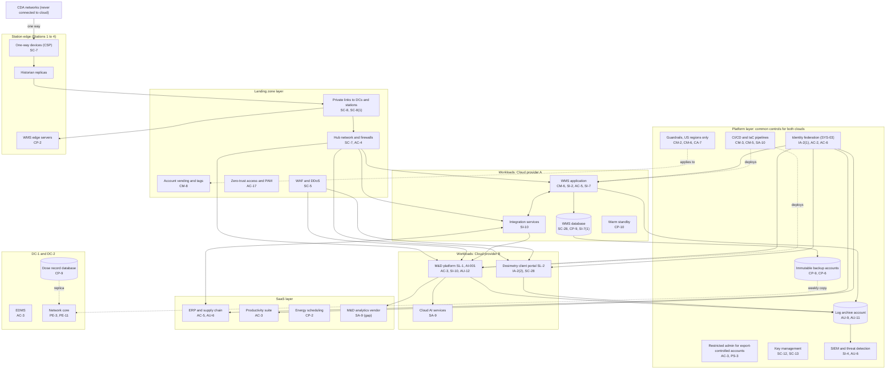

# Cloud Architecture and Control Placement: Cris Santos Company | Nuclear Reactors, Materials, and Waste | Enterprise

**Organization:** Cris Santos Company, Inc. (publicly traded nuclear generation company) | **Tier:** Enterprise | **Provider:** Multi-cloud, vendor-agnostic: two public cloud providers (Cloud provider A and Cloud provider B, US regions only), two data centers (DC-1 company-owned in Florida, DC-2 colocation in Georgia), SaaS, and station edge components (see section 4)
**Owner:** Director of Cloud Platform Engineering, with the CISO and the Director, Nuclear Cyber Security | **Date:** 2026-08-31 | **Related:** WMS-PBN SSP (P02), enterprise BIA (P05)

## 1. Architecture in layers
The estate is organized in layers. Each lower layer provides **common controls** that the layers above inherit, so a workload team configures only what is specific to its system.

| Layer | What it is | Examples | Who runs it |
|---|---|---|---|
| **Platform** | Organization-wide services in both clouds | Guardrails (including a US-regions-only policy), identity federation, key management, log archive, SIEM feeds, vulnerability and posture management, immutable backup accounts, CI/CD pipelines, restricted administration for export-controlled accounts | Cloud Platform Engineering; Security Operations; Identity team |
| **Landing zone** | The standard account pattern every workload lands in | Account vending with owner, data class, and export-control tags; hub-and-spoke networks with cloud firewalls; private links to data centers and stations; WAF and DDoS protection; zero-trust access and PAM | Cloud Platform Engineering; Network Engineering |
| **Workload** | Systems built or run by the company | Cloud A: the WMS (application servers, database, integration services, warm standby). Cloud B: the M&D platform (SL-1 and AI-001), the dosimetry client portal (SL-2), cloud AI services, the data and analytics platform | Application teams (for example, the WMS Application Manager) |
| **SaaS** | Vendor-operated applications | ERP and supply chain, payroll, productivity suite, energy scheduling platform, M&D analytics vendor, EAM vendor support | Vendors, with the company's configuration and oversight |
| **Data center** | DC-1 and DC-2 | Network core, engineering document management (EDMS), dosimetry dose record database, offline backup copies | Infrastructure team; colocation provider for DC-2 building controls |
| **Station edge** | Business-side components at the stations | WMS edge servers; one-way data transfer devices and plant data historian replicas | WMS team; station cyber security teams |

**What never goes to the cloud.** Critical digital assets, their configurations and backups, cyber security plans, and Safeguards Information stay at the stations or on stand-alone SGI computers (10 CFR 73.22(g)). Nothing in the cloud connects toward a CDA network: plant data reaches the business network only through hardware one-way devices, and from there the WMS and M&D platform read the historian replicas.

## 2. Diagram

## 3. Responsibility by service model
Sources: SRC-AWS-SRM, SRC-AZURE-SRM, and SRC-GCP-SRM in `00_universal-framework/sources/source-register.csv`. The three published models agree on the split used here, so the design does not depend on which two providers the company uses.

| Service model | Provider | Company (customer) | Shared |
|---|---|---|---|
| IaaS (WMS application servers) | Facilities, hosts, hypervisor, physical network | Guest OS, WMS application, identities, data, network policy | Encryption (provider service, customer keys), logging |
| PaaS (WMS database, M&D platform, dosimetry portal, AI services) | Also the platform runtime and its patching | Data, access, configuration, keys, application code | Backups, availability configuration |
| SaaS (ERP, payroll, productivity, scheduling, M&D analytics) | Also the application | Users, roles, data, oversight of the vendor | Audit review (complementary user entity controls) |
| Colocation (DC-2) | Building, power, cooling, perimeter | Racks, equipment, cage access lists | None |

**Export control adds a shared item.** Work packages and engineering documents can contain reactor technology within 10 CFR 810.2(b)(5). The company restricts administration of export-controlled accounts to confirmed U.S. persons and buys the providers' U.S.-person support option, so both sides of the shared model have a part (rows for AC-3 and PS-3 in the control map). The Export Compliance Officer owns this design; the specific license and authorization analysis is outside this deliverable.

## 4. Service categories and provider equivalents
| Service category | AWS | Microsoft Azure | Google Cloud |
|---|---|---|---|
| Organization guardrails | AWS Organizations service control policies | Azure Policy with management groups | Organization Policy Service |
| Account vending | AWS Control Tower account factory | Azure landing zone subscription vending | Resource Manager project creation |
| Key management | AWS KMS | Azure Key Vault | Cloud KMS |
| Audit logging | AWS CloudTrail | Azure Monitor activity log | Cloud Audit Logs |
| Threat detection | Amazon GuardDuty | Microsoft Defender for Cloud | Security Command Center |
| Managed relational database | Amazon RDS | Azure SQL Database | Cloud SQL |
| Web application firewall | AWS WAF | Azure Web Application Firewall | Cloud Armor |
| Backup service | AWS Backup | Azure Backup | Backup and DR Service |

This table is for reading provider documentation only. The architecture, control map, and SSP describe service categories.

## 5. Common controls
`cloud-control-map.csv` has **61 rows** across 35 components: Platform 20, Landing zone 9, Workload 17, SaaS 9, Data center 4, Station edge 2. Responsibility: Customer 44, Shared 12, Provider 5.

**30 rows are published as common controls** (`common_control` = Yes) in the enterprise common control catalog. They map to the common control providers in the WMS-PBN SSP (P02 section 10.3): identity (CCP-02), landing zone (CCP-03), security operations (CCP-04), network (CCP-05), facilities (CCP-07), and the CSP boundary (CCP-10, the one-way device row). A workload inherits them by being deployed through account vending, which applies the guardrails, logging, network, key, and backup policies automatically.

**Rules for inheriting:**
1. A workload may claim a common control only if its account was created by account vending and passes the posture baseline.
2. Customer-side identity, data protection, and logging stay explicit at every layer: even a SaaS application has Customer rows for access (AC-3, AU-6) because those are always the company's responsibility.
3. SaaS rows cite the vendor's SOC 2 report, reviewed by the third-party risk team (P09 evidence map).
4. No cloud workload may claim a CSP control. The one-way device row is listed so the boundary is visible, but its control owner is the station cyber security team under the CSP.

## 6. Validation against the WMS-PBN SSP (P02)
Every WMS-PBN component in the SSP boundary appears here with controls from each required family, directly or inherited:
| WMS-PBN component | AC | AU | CM | IA | SC | SI |
|---|---|---|---|---|---|---|
| WMS application servers | AC-5 | AU-9 (inherited) | CM-6, CM-2 (inherited) | IA-2(1) (inherited) | SC-7 (inherited) | SI-2, SI-7 |
| WMS database | AC-6 (inherited) | AU-11 (inherited) | CM-6 (inherited) | IA-2(1) (inherited) | SC-28 | SI-7(1), SI-2 (provider) |
| WMS integration services | AC-4 (inherited) | AU-6 (inherited) | CM-3 (inherited) | IA-2(1) (inherited) | SC-8 (inherited) | SI-10 |
| WMS edge servers and historian replicas | AC-6 (inherited) | AU-6 (inherited) | CM-8 (inherited) | IA-2(1) (inherited) | SC-7 (CSP boundary) | SI-4 (inherited) |

## 7. Findings from the mapping
1. **The CDA boundary holds in the architecture.** No cloud service has a path toward a CDA network; the only connection is the one-way device output to the historian replicas. This is the most important design property and is confirmed in each station's CSP.
2. **Station 4 sits outside the landing zone pattern.** Its business network reaches the cloud only through DC-1 over a single carrier, its legacy WMS is not in the cloud, and its logs are not in the SIEM (POAM-004, POAM-021, POAM-022).
3. **Clearance integrity is a workload responsibility.** No platform service can check that a clearance boundary is right; the WMS team owns SI-7 and SI-7(1), and the open items are AC-5 and AU-10 (POAM-005, POAM-007).
4. **Two clouds, one control set.** Guardrails, logging, and key policies are written once as code and applied to both clouds. Differences are limited to service names (section 4).
5. **The M&D analytics vendor is an assurance gap.** It receives SL-1 client data and fleet work history but has no SOC report (POAM-016).
6. **AI services** run in the company tenant under terms that forbid training on company data. The AI governance committee reviews each new model deployment (P10).
