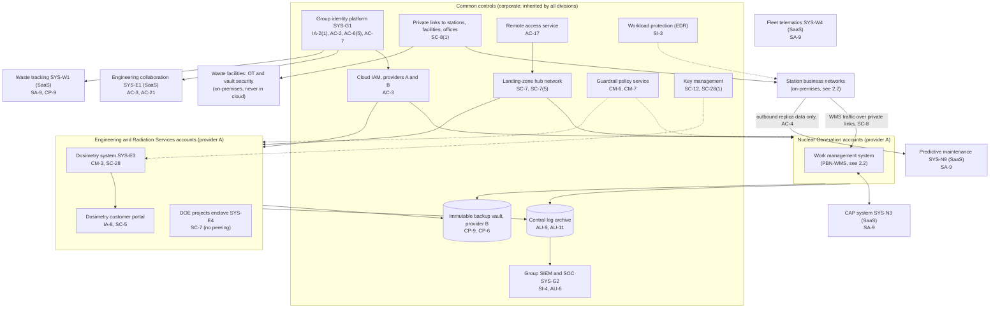
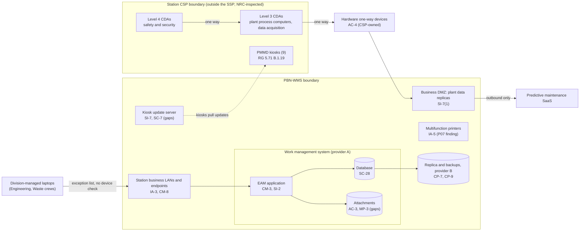

# Cloud Architecture and Control Placement: Cris Santos Company Holdings | Nuclear Reactors, Materials, and Waste | Multi-Sector

**Organization:** Cris Santos Company Holdings, Inc. | **Tier:** Multi-Sector | **Providers:** two public cloud providers, called provider A and provider B (vendor-agnostic; see section 6)
**Scope:** the shared corporate cloud platform (SYS-G3) plus the division workloads on it, and the on-premises edge of the P02 system (station business networks, one-way devices, kiosk update server). The SSP system (P02) is the Plant Business Network and Work Management System (PBN-WMS).

## 1. Design in one paragraph
Corporate runs one **landing zone** per provider: identity federation from SYS-G1, a hub network, guardrail policies, a central log archive, key management, EDR, and an immutable backup vault. Each division gets its own **accounts** (subscriptions or projects) inside the landing zone and inherits these guardrails. Provider A hosts the hub, the fleet work management system (part of the PBN-WMS), the dosimetry system and portal, engineering workloads, and a separate DOE projects enclave. Provider B hosts disaster recovery replicas and the backup vault. Several services are vendor SaaS: the CAP system, predictive maintenance, engineering collaboration, waste tracking, and fleet telematics. **The nuclear design rule is what is not in the cloud:** no CDA, no SGI, no CSP document or CDA inventory, no fleet operations center component, and no Part 37 security system. Plant data leaves the stations only one way, through hardware one-way devices into each station's business DMZ, and from there outbound to approved services.

## 2. Diagrams
### 2.1 Group landing zone and division workloads

### 2.2 PBN-WMS (SSP boundary) and its edge with the CSP

**Target state (POAM-001, POAM-003, POAM-004, POAM-005, POAM-010; due 2026-11-30 to 2027-03-31):** division-managed laptops land in a contractor segment with a device check and reach only the WMS and approved file shares; cross-division accounts end with the outage assignment; CDA work packages sit in a restricted WMS module with a cyber security sensitive label; the kiosk update server moves to a restricted segment, and every update package is checked against the vendor's signature before the CST releases it to the kiosks.

## 3. Tenancy and identity decision
- **Decision.** All three divisions federate their business systems to the group identity platform, SYS-G1, and get their own accounts inside the landing zone. No division has its own identity tenant. The DOE projects enclave (SYS-E4) is a separate account with no peering to other division accounts.
- **What stays out.** No CDA, SGI, CSP document, fleet operations center component, or Part 37 security system is in the cloud. Plant data leaves each station only one way, through hardware one-way devices.
- **Why.** The nuclear design rule keeps CDAs off the shared platform. The PBN-WMS was analyzed under 10 CFR 73.54(b)(1) and is outside the CSP scope. The P02 plan records the choice for cross-division users: the fix is assignment-bound access and a device check, not separate identities.
- **What limits blast radius.** Hardware keys for administrators and just-in-time PAM elevation with session recording. Division administrators cannot delete logs in the write-once archive. Work management vendors use named federated guest accounts with MFA.
- **Known gaps.** About 1,900 standing cross-division accounts are removed a median of 46 days late (GR-01, POAM-001). Division-managed laptops join station business networks with no device check (POAM-005). Vendor support sessions are not recorded. Dosimetry customer administrators use a password only (POAM-013).
- **Cross-division risks:** GR-01, GR-03, GR-10, GR-12, GR-18 in [risk-register.csv](../step-04_P01_risk-register/risk-register.csv).

## 4. Common versus division-specific controls
`cloud-control-map.csv` has 53 rows across 35 components. The `control_scope` column shows who owns each placement:

| Scope | Rows | What it means |
|---|---|---|
| Common (group) | 22 | Provided once by corporate (SYS-G1, SYS-G2, SYS-G3) and inherited by every division account. Listed in the P02 common control catalog |
| Shared system (PBN-WMS) | 11 | Controls of the P02 system, in the cloud and at the station edge |
| Division-specific (Nuclear Generation) | 5 | Design rule for CDAs and SGI; CAP and predictive maintenance dependencies |
| Division-specific (Engineering and Radiation Services) | 9 | Dosimetry system and portal, engineering collaboration, DOE enclave, SGI design rule |
| Division-specific (Radioactive Waste Management) | 6 | Waste tracking, e-Manifest, telematics, Part 37 design rule |

| Responsibility | Rows |
|---|---|
| Customer (the group or a division) | 41 |
| Shared (provider and group) | 8 |
| Provider | 4 |

**Rule of thumb.** Identity, network guardrails, logging, keys, backups, and EDR are **common**. A division cannot opt out of them, only request an exception under POL-01. Application behavior, data access within an application, customer-facing identity, and regulator-specific design rules are **division-specific**, because they depend on each division's regulators and customers.

## 5. Layers
| Layer | Common components | Division components | Key controls | Responsibility |
|---|---|---|---|---|
| Identity | SYS-G1, cloud IAM | WMS vendor guest access, dosimetry customer identity, waste portal customer accounts | AC-2, AC-3, AC-6(5), IA-2, IA-2(1), IA-8 | Customer (configuration); vendor (service) |
| Network | Hub, private links, remote access | Station LANs, business DMZs, one-way devices, DOE enclave | SC-7, SC-7(5), SC-8, SC-8(1), AC-4, IA-3 | Customer, with provider DDoS protection shared |
| Compute | EDR, guardrails | WMS application, dosimetry system, kiosk update server | SI-2, SI-3, SI-7, CM-3, CM-6, CM-7 | Customer (guest OS and application); provider (managed runtime) |
| Data | Keys, backup vault | WMS database and attachments, dosimetry database | SC-12, SC-28, SC-28(1), CP-9, CP-6, CP-7, AC-3, MP-3 | Shared: provider encrypts; group owns keys, labels, and retention |
| Logging and monitoring | Log archive, SIEM | WMS audit logs | AU-3, AU-6, AU-9, AU-11, SI-4 | Shared: providers generate platform logs; group retains and reviews |
| SaaS dependencies | Identity, SIEM, EDR vendors | CAP, predictive maintenance, engineering collaboration, waste tracking, telematics | SA-9, CP-9 | Provider for the service; customer for use and oversight |
| Physical | Provider data centers | Station and facility rooms (on-premises) | PE-3, MP-6 | Provider (cloud); station security (on-premises) |

## 6. Service categories and provider equivalents
The design does not depend on a provider. This table gives each provider's name for each service category, for reading its shared responsibility documentation.

| Service category | AWS | Microsoft Azure | Google Cloud |
|---|---|---|---|
| Account structure and guardrails | AWS Organizations with service control policies | Management groups with Azure Policy | Resource hierarchy with Organization Policy |
| Managed relational database | Amazon RDS | Azure SQL Database | Cloud SQL |
| Object storage | Amazon S3 | Azure Blob Storage | Cloud Storage |
| Key management | AWS KMS | Azure Key Vault | Cloud KMS |
| Audit logging | AWS CloudTrail | Azure Monitor activity log | Cloud Audit Logs |
| Backup with immutability | AWS Backup (vault lock) | Azure Backup (immutable vault) | Backup and DR Service |
| Private connectivity | AWS Direct Connect | Azure ExpressRoute | Cloud Interconnect |

Shared responsibility sources: SRC-AWS-SRM, SRC-AZURE-SRM, SRC-GCP-SRM in `00_universal-framework/sources/source-register.csv`. All three agree on the split used here: for IaaS the provider owns facilities, hosts, and virtualization; for PaaS the provider also owns the runtime; for SaaS the provider owns the application. The customer always keeps identities, access decisions, data classification, and data.

## 7. Findings from the mapping
1. **The cloud is not on the path to the reactors, by design.** No row maps a CDA, SGI, or CSP control to a cloud service. The design rules (PL-8, MP-4) and the one-way devices (AC-4) are the most important rows in the map, and they are met.
2. **The weak points are at the station edge, not in the cloud.** Division-managed laptops on station networks (IA-3), the kiosk update server (SI-7, SC-7), and printers with default passwords (IA-5, found in P07) are on-premises PBN-WMS components.
3. **WMS data, not WMS infrastructure, is the cloud risk.** Encryption, keys, and backups are sound (SC-28, SC-12, CP-9). The gap is who can read CDA work packages (AC-3, MP-3; POAM-003).
4. **Common controls are strong and reused.** One identity platform, one SIEM, one backup design. This lets group internal audit assess them once (P07). The weak link is the identity lifecycle for cross-division staff (AC-2; POAM-001), not the platform.
5. **SaaS dependencies need report reviews with the right scope.** The predictive maintenance vendor's SOC 2 report does not cover its model hosting provider (SA-9; P10), and the waste tracking vendor's report is the Radioactive Waste Management division's main evidence for RCRA record availability.
