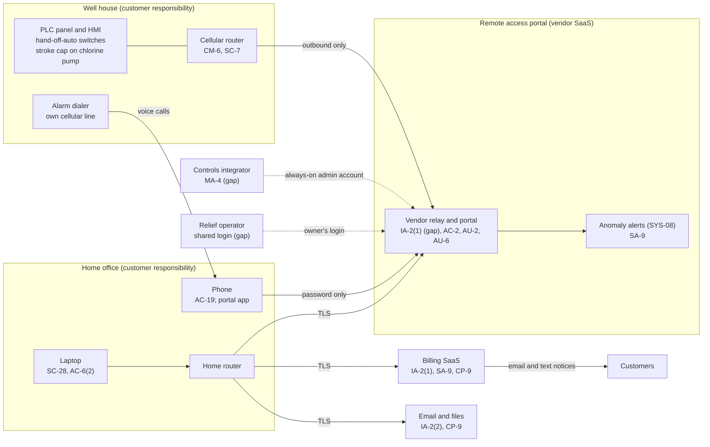

# SaaS Architecture and Control Placement: Cris Santos Company | Water and Wastewater Systems | Sole Proprietorship

**Organization:** Cris Santos Company (small community water system) | **Tier:** Sole Proprietorship | **Provider:** SaaS only (no IaaS or PaaS)
**System:** Water System Operations Profile (WSOP), as defined in the system profile (P02)

## 1. Diagram
Control IDs on each node are the ones in `cloud-control-map.csv`. Dashed lines are paths with a known gap.

## 2. Layers
| Layer | Components | Key controls | Responsibility |
|---|---|---|---|
| Identity | Portal accounts, billing administrator, email account | IA-2(1), IA-2(2), AC-2 | Customer configures; vendors provide MFA |
| Remote maintenance | Integrator sessions through the portal | MA-4, AC-17 | Customer approves and records; vendor logs |
| Data | Customer records, files, PLC program copy, residual records | SA-9, CP-9, SC-28 | Vendor protects data in its service; customer decides what goes where and keeps second copies |
| Endpoints | Laptop, phone | SC-28, AC-6(2), AC-19 | Customer |
| Network | Cellular router at the well house; home router | CM-6, SC-7 | Customer |
| Logging | Portal audit log; billing and email sign-in history | AU-2 (vendor), AU-6 (customer) | Shared: vendor records, customer reviews |
| SaaS applications and hosting | Portal, billing, email platforms | Inherited (AU-2, platform security, PE family) | Provider |
| Control panel | PLC, HMI, dialer | Outside the SaaS model; P02 controls IA-5, CP-9, CP-10 | Customer, with the integrator |

## 3. Shared responsibility for SaaS
All three major cloud providers' shared responsibility models (SRC-AWS-SRM, SRC-AZURE-SRM, SRC-GCP-SRM) agree on the SaaS split: the provider runs the application, platform, and facilities; **the customer always keeps its identities and accounts, its data, and its devices.** That is why 12 of the 16 rows in the control map are the owner's alone and 3 more are shared. No IaaS equivalents table is needed, because the business runs no infrastructure in the cloud.

The remote access portal adds one twist. It is SaaS, but what it controls is physical: a setpoint typed into the portal changes the chlorine dose at the well house. The vendor's SOC 2 report covers the vendor's platform, not **who the owner lets in**. The vendor's own report lists customer MFA, account management, and log review as the customer's job (P09).

## 4. Findings from the mapping
1. **The portal is the front door to the treatment process, and it is guarded by one reused password.** MFA is available and free. Tracked as P01 R-001.
2. **The integrator has a key that never expires.** Its account is always enabled, and 2 of its 3 sign-ins in the last 90 days could not be matched to a support call. Tracked as P01 R-002.
3. **The cellular router was administrable from the internet with its label password** (found in P07 testing and turned off the same day). Tracked as P01 R-003.
4. **The customer contact list lives only in the billing SaaS.** If the billing vendor or email is down during an incident, the 24-hour notice depends on hand delivery. Tracked as P01 R-009.
5. **The anomaly alert feature sends process data to a model the vendor may train.** Process data is not personal information, but it reveals how the plant runs. Tracked as P01 R-010 and P10.
