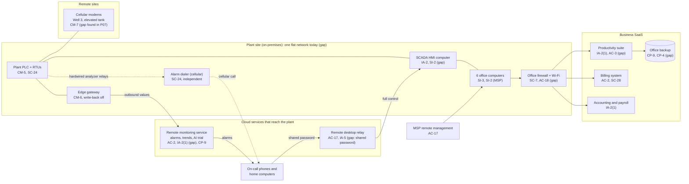

# Cloud Architecture and Control Placement: Cris Santos Company | Water and Wastewater Systems | Micro

**Organization:** Cris Santos Company, LLC (privately held community water system) | **Tier:** Micro | **Provider:** Vendor-agnostic SaaS (see section 3)
**System:** Water Treatment SCADA System (WTSS), as defined in the SSP (P02) | **Prepared:** 2026-07-24 by the Office Manager with the Chief Operator and the MSP lead technician | **Approved:** Owner and General Manager, 2026-08-31

## 1. Diagram
The company runs no servers and no IaaS tenant. Its cloud is a set of SaaS services plus one cloud workload that matters for the plant: the **remote monitoring service** (SYS-05), fed by an edge gateway in the plant control panel. A second cloud service reaches into the plant as well: the **remote desktop tool's relay** (SYS-04), which is how the integrator and on-call operators reach the HMI. The diagram shows today's design; items marked "gap" are fixed by the dates in `cloud-control-map.csv`.

## 2. Layers and who is responsible
| Layer | Components | Key controls | Customer (company) | MSP or integrator (on the company's behalf) | Provider (SaaS vendor) |
|---|---|---|---|---|---|
| Identity | Remote monitoring users, remote desktop password, suite, billing, accounting, firewall login | AC-2, IA-2(1), IA-5 | Decides who gets access; turns on MFA; removes leavers | MSP holds the suite and firewall administrator logins; integrator technicians use the remote desktop password | Runs sign-in and MFA services |
| Network | Office firewall, Wi-Fi, edge gateway, remote desktop relay | SC-7, AC-17, AC-18 | Approves changes; decides what may leave the plant network | MSP configures the firewall; integrator installed the gateway and the remote tool | Relays and encrypts sessions and data |
| Endpoints | HMI computer, office computers, phones | SI-2, SI-3, CM-6 | Owns the HMI computer outright (no one else covers it today) | MSP patches office computers only | Not applicable |
| SaaS applications | Monitoring service, suite, billing, accounting | AC-3, AU-2, SI-4 | Users, roles, alarm limits, sharing settings, write-back setting | Suite administration on request | Application, platform, data centers |
| Data | Trend history, customer data, office files, backup copies | CP-9, CP-4, SC-28 | Exports the customer contact list; restore testing; decides retention | MSP operates the office backup | Encrypts and backs up its own platform |
| Logging | Remote desktop history, monitoring sign-ins, suite logs | AU-2, AU-6 | **Reviews logs (gap today)** | MSP keeps firewall logs for 7 days | Generates and keeps logs (90 days for the remote tool) |

**The MSP and the integrator are not cloud providers.** They do customer-side work. Anything marked "Customer (performed by MSP)" in `cloud-control-map.csv` stays the company's responsibility: the company must direct the work, get evidence, and check it (SA-9).

**Nobody owns the HMI computer's hygiene.** The MSP contract excludes plant control systems, and the integrator's contract is time-and-materials with no maintenance duties. The SaaS providers protect their platforms, not the plant. This gap does not show up in any vendor's shared responsibility model because it sits between two contractors.

## 3. Service categories and provider equivalents
The design is vendor-agnostic. For SaaS, all three large cloud providers' shared responsibility models agree: the provider runs the application, platform, and infrastructure; the customer keeps identities, access, data, and devices (SRC-AWS-SRM, SRC-AZURE-SRM, SRC-GCP-SRM in `00_universal-framework/sources/source-register.csv`). The remote monitoring vendor runs its service on a public cloud provider, which is a carved-out subservice organization in its SOC 2 report (P09).

| Service category used | What it is here | Equivalent category in the large cloud providers (for reading their documentation) |
|---|---|---|
| Industrial remote monitoring SaaS | Remote monitoring service with edge gateway | IoT data ingestion and time-series storage services (for example AWS IoT Core with Amazon Timestream, Azure IoT Hub with Azure Data Explorer, Google Cloud Pub/Sub with Bigtable) |
| Remote desktop relay | Remote desktop tool's cloud relay | Managed remote access or bastion services (for example AWS Systems Manager Session Manager, Azure Bastion, Google Cloud Identity-Aware Proxy) |
| Productivity suite | Email, files, chat | Productivity and collaboration SaaS |
| Line-of-business SaaS | Billing, accounting and payroll | Industry SaaS built on any provider |
| SaaS backup | Nightly office backup | Backup service or third-party SaaS backup |
| Remote monitoring and management | MSP device management | Device management SaaS |

The plant equipment is on-premises, so the company owns every layer of it. No cloud shared responsibility model reduces any OT duty.

## 4. Findings from the mapping
1. **Two cloud services reach the plant, and only one is designed for it.** The remote monitoring service only reads values and has write-back turned off (checked on 2026-08-11). The remote desktop relay gives full control of the HMI to anyone with one shared password (AC-17, IA-5). Fix: named accounts with MFA, attended sessions, and Chief Operator approval for vendor sessions by 2026-09-30. Tracked as P01 R-001 and R-002 and P07 POAM-002.
2. **The cloud services sit on a flat network (SC-7).** The gateway, the HMI computer, and the office computers share one switch, so a compromised office computer can reach the PLC. Fix: a separate OT network behind its own firewall rules, with the gateway as the only device allowed to reach the internet, by 2026-11-30. Tracked as P01 R-003 and POAM-006.
3. **MFA is missing where it matters most.** Email has MFA; the remote monitoring service, the remote desktop tool, and the MSP-held firewall login do not (IA-2(1)). Fix by 2026-09-30 (POAM-004).
4. **The emergency plan and device passwords sit in an open folder (AC-3).** Everyone in the company, and anyone who takes over one email account, can read the SCADA drawings and the password spreadsheet. Fix: a restricted folder and a password manager by 2026-09-30 (P01 R-009).
5. **The customer contact list lives only in the billing system (CP-9).** It is needed for a Tier 1 notice within 24 hours. Fix: a monthly export printed for the plant binder (P01 R-010).
6. **Inherited controls rely on vendor reports.** Controls marked "Provider" depend on each vendor's own assurance. The remote monitoring vendor's SOC 2 report is reviewed in P09; the others rely on vendor statements.
