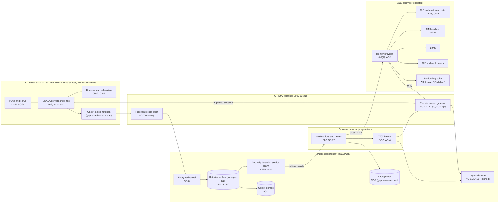

# Cloud Architecture and Control Placement: Cris Santos Company | Water and Wastewater Systems | Small

**Organization:** Cris Santos Company, LLC (investor-owned community water system) | **Tier:** Small | **Provider:** Vendor-agnostic (see section 3)
**Scope:** one public cloud tenant (IaaS/PaaS) plus the SaaS services the company uses, and how both connect to the Water Treatment SCADA System (WTSS, P02)

## 1. Diagram
The diagram shows the **target** design for March 2027. Items marked "gap" show where today's setup differs.

## 2. Layers
| Layer | Components | Key controls | Responsibility |
|---|---|---|---|
| Identity | Identity provider, cloud IAM roles, service identity for the anomaly model | AC-2, AC-6, IA-2(1), IA-5 | Customer (configuration), provider (service) |
| Network / edge | IT/OT firewall, OT DMZ, remote access gateway, encrypted tunnel, cloud network rules | SC-7, SC-8, AC-17 | Customer (provider runs the tunnel gateway service) |
| Compute / application | Anomaly detection container service | CM-3, SI-4, SA-9 | Customer (deployment and change review); provider (platform); model vendor (model image) |
| Data | Historian replica, object storage, backup vault, keys | SC-28, SC-12, CP-9, SI-7 | Shared: provider encrypts and backs up managed services, customer sets retention, access, and isolation |
| Logging / monitoring | Cloud audit logs, planned log workspace for cloud and OT logs | AU-2, AU-6, AU-11 | Shared: provider generates, customer retains and reviews |
| SaaS applications | CIS, AMI, LIMS, GIS, productivity suite | AC-3, CP-9, IR-6 | Provider (application and infrastructure), customer (users, roles, data) |
| Physical / hypervisor | Provider data centers | PE family | Provider (inherited) |

**Design rule: nothing in the cloud can write to OT.** Data flows one way, from the OT DMZ to the historian replica. The anomaly detection model reads the replica and sends advisory alerts to people. It has no path back to the SCADA servers or PLCs. This keeps a cloud compromise from becoming a treatment incident (SP 800-82r3 sec. 5.2.3), and it is why the AI use case in P10 can stay advisory.

## 3. Service categories and provider equivalents
The company's design is independent of the provider. This table gives each provider's name for each service category, to use when reading its shared responsibility documentation.

| Service category | AWS | Microsoft Azure | Google Cloud |
|---|---|---|---|
| Managed time-series or relational database | Amazon Timestream or Amazon RDS | Azure Data Explorer or Azure SQL Database | Bigtable or Cloud SQL |
| Container service | Amazon ECS | Azure Container Apps | Cloud Run |
| Object storage | Amazon S3 | Azure Blob Storage | Cloud Storage |
| Backup service | AWS Backup | Azure Backup | Backup and DR Service |
| Identity and access management | AWS IAM | Azure role-based access control with Microsoft Entra ID | Cloud IAM |
| Key management | AWS KMS | Azure Key Vault | Cloud KMS |
| Audit logging | AWS CloudTrail | Azure Monitor activity log | Cloud Audit Logs |
| Site-to-site VPN | AWS Site-to-Site VPN | Azure VPN Gateway | Cloud VPN |
| Network filtering | Security groups | Network security groups | VPC firewall rules |

Shared responsibility sources: SRC-AWS-SRM, SRC-AZURE-SRM, SRC-GCP-SRM in `00_universal-framework/sources/source-register.csv`. All three models agree on the split used here:
- **IaaS:** the provider owns physical facilities, hosts, and the virtualization layer. The customer owns the guest operating system, applications, network configuration, identities, and data.
- **PaaS (managed database, container service):** the provider also owns the operating system and platform patching. The customer owns data, access, configuration, and what it deploys.
- **SaaS:** the provider also owns the application. The customer keeps identities, access, data, and devices.

The OT systems are on-premises, so the company owns every layer of them. Cloud shared responsibility does not reduce any OT duty.

## 4. Findings from the mapping
1. **Historian path (SC-7).** Today the historian is dual-homed and sends data to the cloud through the business firewall. A business-network compromise could reach OT through it. Fix: the one-way push from the OT DMZ shown above. Tracked as P01 R-003 and POAM-010.
2. **Model changes are not reviewed (CM-3).** The model vendor updated the anomaly model image twice during the pilot with no company review. Fix: version pinning and a change review before deployment (P10). Tracked as P01 R-022.
3. **Replica integrity (SI-7).** Nothing checks that replica values match the plant historian. The AI model and any compliance use of the replica depend on that. Fix: daily reconciliation of record counts and sample values.
4. **Backup isolation (CP-9).** The backup vault shares the production account and administrator role. Fix: separate backup account with immutable retention and a restore test. Tracked as P01 R-025.
5. **RRA documents in the productivity suite (AC-3).** The RRA, ERP, and SCADA drawings are open to all staff. Fix due 2026-09-30 (P03 G-032).
6. **Inherited controls rely on vendor reports.** SaaS controls marked "Provider" depend on the vendors' SOC 2 reports. The CIS vendor's report is reviewed in P09.
