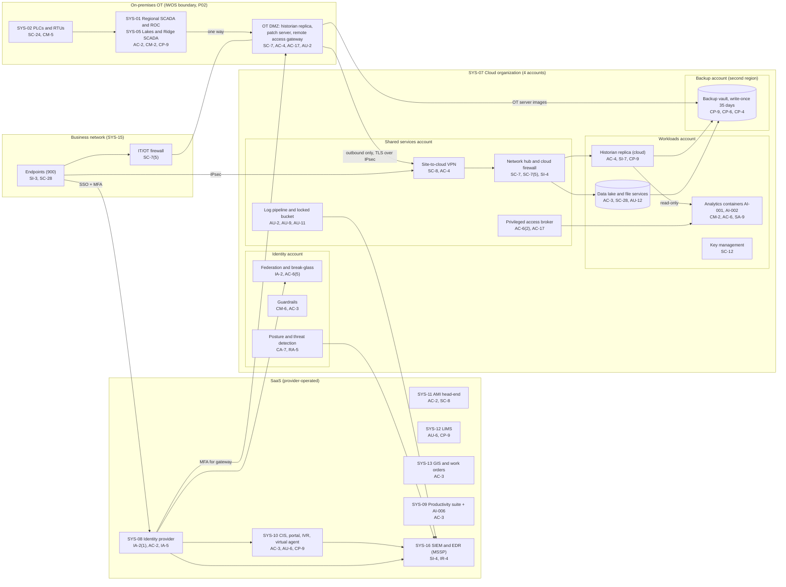

# Cloud Architecture and Control Placement: Cris Santos Company | Water and Wastewater Systems | Mid-Market

**Organization:** Cris Santos Company, Inc. (PE-backed investor-owned water utility) | **Tier:** Mid-Market | **Provider:** Vendor-agnostic public cloud (see section 4), plus SaaS
**System:** Integrated Water Operations SCADA (IWOS), as defined in the SSP (P02), and the cloud and SaaS services it connects to | **Prepared:** 2026-07-31 by the Security Manager with the IT Director; updated 2026-09-15 with P07 results
**Control map:** `cloud-control-map.csv` (58 rows, 26 components)

## 1. Diagram
The IWOS itself runs on premises. The cloud holds a read-only copy of process data for analytics, the backup copies, and the business SaaS. The design rule is simple: **data can leave OT, but nothing in the cloud can reach back into OT.**

## 2. Landing zone design
The landing zone has 4 accounts (subscriptions or projects, depending on the provider) under one cloud organization. Each account limits what an attacker can do from any other.

| Account | Purpose | Who administers | Key design decisions |
|---|---|---|---|
| **Identity** | Organization root, federation to the identity provider (SYS-08), guardrails, posture management and threat detection | Security Manager and the IT security analyst | No workloads. Root credentials sealed. Guardrails cannot be disabled from member accounts and block any route toward the OT DMZ |
| **Shared services** | Network hub, cloud firewall, site-to-cloud VPN (separate tunnels for headquarters and the OT DMZ), DNS resolver, privileged access broker, log pipeline and locked log bucket | IT Director's infrastructure team | All traffic passes the hub. The OT DMZ tunnel carries only historian replication and OT image backups, and only the DMZ side can open it |
| **Workloads** | Historian replica, water quality analytics containers (AI-001 anomaly detection, AI-002 dose recommender pilot), data lake, file services, key management | Infrastructure team; analytics vendor through the broker only | No internet ingress. Analytics read the replica through a read-only identity. Company-managed keys |
| **Backup** | Backup vault with 35-day write-once retention in a second region; also holds copies of Regional OT server images | 2 named backup administrators | Credentials not federated to everyday accounts. The cross-account backup role can write but not delete |

**Why the cloud never writes to OT.** The SSP rates IWOS integrity High because an unauthorized chemical feed change could harm people (P02 section 6). A cloud-to-OT path would make every cloud administrator, vendor, and analytics container a potential route to the chemical feed PLCs. The AI-002 vendor asked for a write-back interface so its recommendations could become setpoints. The company refused (P10). Recommendations are shown to operators, who decide.

## 3. Layers and shared responsibility per service
| Layer | Components | Key controls | Service model | Responsibility |
|---|---|---|---|---|
| Identity | Federation, break-glass accounts, privileged access broker, SYS-08, OT remote access gateway | IA-2, IA-2(1), AC-2, AC-6(2), AC-6(5), AC-17, IA-5 | PaaS / SaaS / on-premises | Company configures identities, roles, MFA, and reviews; providers run the identity services; the gateway is company-run |
| Network | Hub, cloud firewall, VPN, DNS, OT DMZ, IT/OT firewall | SC-7, SC-7(5), SC-8, AC-4, SC-20, SI-4 | IaaS / PaaS / on-premises | Company designs routes, rules, and the one-way OT flow; provider runs the gateway and DNS services |
| Compute | Historian replica, analytics containers, virtual machines | CM-2, CM-6, SI-2, SI-3, SI-7, AC-6, SA-9 | IaaS / PaaS | Company owns images, guest OS, model versions, and vendor access; provider owns hosts and the managed container platform |
| Data | Data lake, file services, keys, backups | SC-28, SC-12, CP-9, CP-6, CP-4, AC-3, AU-12 | PaaS | Shared: provider encrypts and operates storage; company controls keys, access, retention, isolation, and restore testing |
| Logging and monitoring | Log pipeline, posture service, SIEM | AU-2, AU-9, AU-11, CA-7, RA-5, SI-4, IR-4 | PaaS / SaaS | Shared: providers generate logs and detections; company enables, retains, forwards, and acts on them; MSSP monitors |
| SaaS applications | CIS, AMI, LIMS, GIS, productivity suite, identity provider | AC-2, AC-3, AU-6, CP-9, IA-2, SC-8 | SaaS | Vendor runs the application and infrastructure; company keeps users, roles, audit review, and its data |
| Physical | Provider data centers | PE-3, PE-13 | All | Provider (inherited, evidenced by SOC 2 reports in P09) |

**Responsibility counts in `cloud-control-map.csv`:** 36 Customer, 16 Shared, 6 Provider (58 rows). By service model: 24 PaaS, 15 IaaS, 15 SaaS, and 4 on-premises rows for the OT DMZ components that form the boundary with the cloud. The customer side is always identity, data protection, and logging, as the three providers' shared responsibility models agree.

## 4. Service categories and provider equivalents
The design is independent of the provider. This table gives each provider's name for the service category, for reading its shared responsibility documentation (SRC-AWS-SRM, SRC-AZURE-SRM, SRC-GCP-SRM in `00_universal-framework/sources/source-register.csv`).

| Service category | AWS | Microsoft Azure | Google Cloud |
|---|---|---|---|
| Multi-account organization and guardrails | AWS Organizations, service control policies | Management groups, Azure Policy | Resource Manager folders, organization policies |
| Account, subscription, or project | Account | Subscription | Project |
| Cloud identity federation | IAM Identity Center | Microsoft Entra ID with Azure RBAC | Cloud Identity with IAM |
| Network hub | Transit Gateway | Virtual WAN hub or hub virtual network | Network Connectivity Center or shared VPC |
| Cloud firewall | AWS Network Firewall | Azure Firewall | Cloud NGFW |
| Site-to-cloud VPN | Site-to-Site VPN | VPN Gateway | Cloud VPN |
| Virtual machines | EC2 | Virtual Machines | Compute Engine |
| Managed containers | Amazon ECS or EKS | Azure Kubernetes Service or Container Apps | GKE or Cloud Run |
| Object storage with write-once retention | S3 with Object Lock | Blob Storage with immutability policies | Cloud Storage with bucket lock |
| Managed file shares | Amazon FSx | Azure Files | Filestore |
| Backup service | AWS Backup (vault lock) | Azure Backup (immutable vault) | Backup and DR Service |
| Key management | AWS KMS | Azure Key Vault | Cloud KMS |
| Audit logging | CloudTrail | Azure Monitor activity log | Cloud Audit Logs |
| Posture and threat detection | Security Hub, GuardDuty | Microsoft Defender for Cloud | Security Command Center |

**Service model split used here (all three providers agree):**
- **IaaS** (virtual machines, networks): the provider owns facilities, hosts, and virtualization. The company owns the guest OS, applications, network configuration, identities, and data.
- **PaaS** (managed containers, storage, backup, key service): the provider also owns the platform software and its patching. The company owns access, keys, data, images, and configuration.
- **SaaS** (CIS, AMI, LIMS, GIS, identity provider, SIEM): the provider also owns the application. The company keeps identities, roles, audit review, and data.

## 5. Findings from the mapping
1. **The one-way design holds, and it must be protected.** P07 confirmed that no route exists from any cloud account to the OT DMZ and that the IT/OT firewall blocks inbound connections from the cloud (P07 SC-7 test notes). Guardrails now prevent new routes. Any future request for a write path (for example from the AI-002 vendor) is an architecture change that needs the COO's approval and a new risk assessment (P01 R-044).
2. **Analytics vendor changes were uncontrolled.** The AI-001 vendor pushed two model image updates in 2026 without notice. Images are now pinned by digest, and the contract amendment requiring 10 business days notice is due 2026-11-30 (P10; P01 R-043).
3. **Logging gaps sit in the workloads account.** The data lake, file-service access audit, and analytics containers do not forward logs to the SIEM. Fix by 2027-01-31 under STD-02 (P01 R-029).
4. **Recovery is designed but only partly proven.** The backup account is isolated (separate account and region, write-once, separate credentials), which is the strongest control here. File-service restores pass each quarter. The historian replica and analytics rebuild have never been tested. The first test is 2026-11-10. These workloads have the lowest BIA priority (BP-18), so the gap is Low (P01 R-042).
5. **Only Regional OT data reaches the cloud.** Lakes and Ridge historians are not replicated, so AI-001 covers only the Regional System. That limits the value of AI-001 and is recorded in P10. It is not a security gap.
6. **Boundary check.** Every interconnection in the SSP (P02 section 8) that touches the cloud or SaaS appears in the diagram. Every cloud component has at least one row in the control map, and each account has controls from at least 2 of the AC, AU, CM, IA, SC, and SI families or inherits them.
7. **Inherited controls rely on SOC 2 reports.** Controls marked Provider or Shared for the cloud provider, identity provider, CIS, AMI, LIMS, and MSSP depend on their SOC 2 Type 2 reports and complementary user entity controls. They are reviewed each year in P09 `vendor-soc2-review.csv`. The GIS vendor's report has been requested and not yet received.
