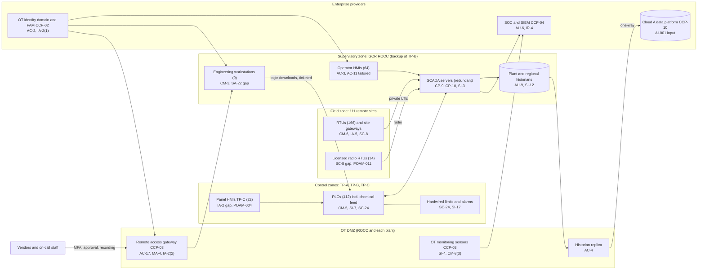

# System Security Plan: Gulf Coast Regional Water Treatment SCADA System (GCR-WTSS)

**Organization:** Cris Santos Company, Inc. (publicly traded parent of state-regulated community water utilities) | **Tier:** Enterprise | **Vertical:** Water and Wastewater Systems
**Outline:** NIST SP 800-18 Rev. 2, System Security Plan Outline Example (June 2026), with OT guidance from NIST SP 800-82 Rev. 3 | **Version:** 2.0, 2026-09-14

## 1. System Name and Identifier
Gulf Coast Regional Water Treatment SCADA System (**GCR-WTSS**), identifier CSC-OT-GCR-001. Tier-1 OT system in the enterprise application and OT inventory.

## 2. System Overview
The GCR-WTSS monitors and controls drinking water production and delivery for the company's largest community water system, the Gulf Coast Regional System in Florida (about 1.24 million people served through about 452,000 connections; average day demand 168 MGD, maximum day 205 MGD). It supervises three treatment plants and 111 remote sites from the GCR regional operations control center (ROCC), with a backup control center at TP-B:
- **TP-A**, surface water plant (120 MGD): conventional treatment with chloramine disinfection; gaseous chlorine in one-ton containers (an EPA Risk Management Program process).
- **TP-B**, groundwater lime-softening plant (60 MGD): fed by 46 wells; hosts the backup control center and the OT test rack.
- **TP-C**, brackish groundwater reverse osmosis plant (30 MGD): sodium hypochlorite disinfection.
- **Distribution:** 28 booster stations and 37 storage tanks (111 remote sites with the 46 wells).

Licensed operators staff the ROCC and every plant 24 hours a day.

**Why integrity and availability matter most.** An unauthorized change to a chemical feed setpoint, a pump command, or PLC logic could harm public health or cut pressure to hundreds of thousands of people. Loss of supervisory control forces manual operation of three plants and roving checks of 111 remote sites (P05 BP-01 to BP-03).

**Major components:**
- Commercial SCADA platform with redundant servers at the ROCC and a standby set at TP-B
- 64 operator HMI stations (ROCC and plants) and 22 panel HMIs on the TP-C reverse osmosis trains
- 9 engineering workstations (3 on an unsupported operating system)
- A plant historian at each plant (the TP-C historian is on an unsupported operating system) and a regional historian at the ROCC
- 412 PLCs and 166 RTUs, including chemical feed control at all three plants
- Telemetry: private LTE (124 endpoints) and licensed radio (14 legacy RTUs)
- OT networks at the ROCC and each plant, with an OT DMZ at each

**Engineered safeguards outside the software.** Chemical feed pumps have hardwired stroke or rate limits, analyzers have independent hardwired alarms to the control rooms, chlorinators are vacuum-feed with automatic shutoff, and PLCs fail to a safe state on loss of communication. SCADA cannot override these safeguards. They are documented as SC-24 and SI-17 and are why no GCR-WTSS risk in P01 is rated Very High.

Users: about 280 named OT domain accounts (operators, supervisors, SCADA technicians, OT engineers), 31 privileged OT administrators, and 41 vendor and integrator users who reach the system only through the OT remote access gateway.

## 3. Laws, Regulations, and Policies Affecting the System
| ID | Requirement | Citation | How it affects the GCR-WTSS |
|---|---|---|---|
| C-WATER-R01 | SDWA section 1433 risk and resilience assessment and emergency response plan | 42 U.S.C. 300i-2(a)(1)(A)(ii), (iii), (v), (vi); (b)(1)-(4); (d) | The GCR-WTSS is the main "electronic, computer, or other automated system" in the Gulf Coast Regional System RRA (category 100,000 or more; review certified before March 31, 2025). Its protection, recovery, and detection are part of the ERP's cybersecurity strategies (ERP review certified before September 30, 2025). RRA and ERP records are kept 5 years |
| C-WATER-R02 | CIRCIA (proposed, not in effect) | 6 U.S.C. 681-681g; proposed 6 CFR Part 226 | Tracked only. Would require reporting covered cyber incidents to CISA if finalized as proposed |
| Federal | SDWA public notification rule | 40 CFR 141.202; 40 CFR 141.31 | A cyber-caused failure or significant interruption in key treatment processes can require a Tier 1 notice and primacy agency consultation within 24 hours (P08) |
| Federal | Tampering with public water systems | 42 U.S.C. 300i-1 | Relevant to law enforcement referral after an attack |
| Federal | EPA Risk Management Program; release reporting | 40 CFR Part 68 (chlorine above 2,500 pounds, 40 CFR 68.130); 40 CFR 302.6; 40 CFR 355.40 | TP-A chlorine process; a cyber-caused release must be reported immediately (P08) |
| SEC | Cybersecurity disclosure | Form 8-K Item 1.05; 17 CFR 229.106 | A material GCR-WTSS incident goes through the P08 materiality step |
| State | Florida primacy agency drinking water rules | State primacy agency | Operator licensing, monitoring, and reporting; consultation for Tier 1 notices |
| Internal | Policies POL-01 to POL-05, standards, and procedures | P06 | Enterprise policy hierarchy |

Not applicable: wastewater (POTW) requirements; federal contract clauses (no federal contracts); HIPAA; state breach notification laws (the GCR-WTSS holds no customer personal information).

## 4. System Status
### 4.1 System Security Plan Approval
Prepared by the GCR SCADA Manager and the GRC team. Reviewed by the CISO, the Director of OT Security, and the Vice President, Gulf Coast Regional Operations. Approved by the Chief Operating Officer on 2026-09-14.
### 4.2 System Authorization Decision
The company is not a federal agency, so there is no formal authorization to operate. The equivalent internal decision:
- **Authorizing official equivalent:** Chief Operating Officer, with the CISO's recommendation.
- **Decision (2026-09-14):** continue operation with conditions, based on the independent assessment by Internal Audit and the co-sourced OT assessment firm (P07) and the risk register (P01). Operation continues because the plants cannot be shut down and because manual operation and the hardwired safeguards limit the worst outcomes.
- **Conditions:** close the High POA&M items that affect the GCR-WTSS: POAM-009 (telemetry gateway configuration audit) by 2026-10-31; POAM-010 (backup control center transfer within 2 hours) by 2027-02-28; POAM-003 (PLC logic verification and comparison) by 2027-03-31; POAM-008 (replace the 4 unsupported hosts) by 2027-06-30. The Moderate items POAM-004 and POAM-005 are due by 2026-12-31 and 2026-11-30.
- **Reauthorization:** annually, or after a major change (for example, the SCADA platform version upgrade planned for 2027).
### 4.3 System Operational Status
Operational. Planned major modifications: automated PLC logic comparison (CM-3(1), SI-7(5)), replacement of the 4 unsupported hosts, migration of the 14 radio RTUs to private LTE, and a geographically separate standby LTE core.

## 5. Role Identification and Responsible Personnel
| Role | Title | Responsibility |
|---|---|---|
| System owner | Vice President, Gulf Coast Regional Operations | Accountable for GCR-WTSS operation, changes, and the contingency annex |
| Authorizing official (equivalent) | Chief Operating Officer | Accepts residual risk to operate |
| System administrator | GCR SCADA Manager | Day-to-day administration, change control, backups, account approvals |
| OT engineering | Director of OT Engineering | OT standards, controller lifecycle, PLC change control, vulnerability remediation |
| Information security | CISO; Director of OT Security; Director of Security Operations | Program oversight; OT architecture and gateway; SOC monitoring and incident response |
| Water quality | Senior Vice President, Water Quality and Environmental Compliance; GCR regional water quality manager | Tier 1 notice decisions; primacy agency consultation |
| RRA and ERP | Vice President, Resilience and Emergency Management | RRA and ERP program; exercises |
| Common control providers | See section 10.3 | Operate inherited controls |
| Independent assessor | Chief Audit Executive (Internal Audit, with a co-sourced OT assessment firm) | Annual assessment (P07) |

## 6. System Information Types and System Categorization
SP 800-60 is written for federal mission areas and has no water treatment process type. The company defined its own information types and rated them with FIPS 199 definitions.

| Information type | Confidentiality | Integrity | Availability | Rationale |
|---|---|---|---|---|
| Process control and setpoints (PLC logic, chemical feed setpoints, commands) | Moderate | **High** | **High** | Unauthorized change to dosing or pumping could harm public health for about 1.24 million people; loss of control forces manual operation (P05 BP-01 MTD 12 h, BP-02 MTD 6 h) |
| Process and water quality data (historians, analyzer values, alarms) | Low | High | Moderate | Operators and compliance reporting rely on accurate values; grab sampling covers short outages (P05 BP-04) |
| System configuration and network information (diagrams, IP plans, credentials) | Moderate | Moderate | Low | Disclosure helps an attacker plan an intrusion; also RRA and ERP content (Restricted under POL-04) |
| **GCR-WTSS category (high-water mark)** | **Moderate** | **High** | **High** | |

**Baseline:** the NIST SP 800-53B **High** baseline, tailored with the OT overlay in SP 800-82 Rev. 3 Appendix F. Tailoring keeps operator HMIs available in staffed control rooms (AC-2(5), AC-7, AC-11) and is recorded in each implementation statement and in the tailoring record approved by the CISO.

**Documented controls.** `control-implementation.csv` documents **330 controls**: 326 from the High baseline and 4 organization-added OT controls (SC-41, SC-45, SI-13, SI-17) that describe the plant's fail-safe and time-synchronization design. The other 44 High-baseline control enhancements are fully inherited from the common control catalog (section 10.3), for example the media sanitization, wireless, and supply chain enhancements, or do not apply to a non-federal OT system (for example IA-8(1), IA-8(2), and IA-8(4) for federal PIV credentials). They are listed in the tailoring record rather than repeated here.

## 7. Authorization Boundary Description
**Inside the boundary:** SCADA servers at the ROCC and TP-B, operator and panel HMIs, engineering workstations, plant and regional historians, PLCs and RTUs, the private LTE site gateways and radios, the OT switches and zone firewalls at the ROCC and plants, and the OT side of each OT DMZ.

**Outside the boundary (common control providers and interconnected systems):**
- OT remote access gateway cluster in the Florida OT DMZ (SYS-04) and passive OT monitoring sensors: CCP-03
- Florida OT identity domain, PAM, and identity governance (SYS-05): CCP-02
- SOC, SIEM, and vulnerability scanning: CCP-04
- Enterprise network, OT DMZ firewalls, private LTE core, and radio network (SYS-12, SYS-03): CCP-05
- Historian replica and AI-001 on the Cloud provider A data platform (SYS-06): CCP-10
- Contract-services monitoring platform (SL-1) at the GCR ROCC: a separate system on its own network segment, with no connection to the GCR-WTSS control zones

The enterprise multi-cloud and OT DMZ diagram is in P04 `cloud-architecture.md`.

## 8. Information Exchanges Summary
| Connected system / party | Direction | Data | Agreement |
|---|---|---|---|
| Cloud provider A data platform (historian replica, AI-001) | Outbound only, through the OT DMZ replica | Process and water quality data | Interconnection record ICR-GCR-01; cloud provider terms |
| OT remote access gateway (SYS-04) | Inbound brokered sessions | Engineering and support sessions | Interconnection record ICR-GCR-02; POL-02 |
| SCADA platform vendor and 4 GCR integrators | Inbound sessions through the gateway | Support and logic changes | Service contracts; **2 of the 4 integrator contracts lack current security terms (POAM-012)** |
| Private LTE core and carrier backhaul | Bidirectional | Telemetry for 124 endpoints | Carrier contract with priority service |
| Licensed radio network | Bidirectional | Telemetry for 14 legacy RTUs | FCC license; **no message authentication (POAM-011)** |
| LIMS (SYS-09) | None (manual entry of grab sample results) | Not applicable | Not applicable |
| Corporate security operations center | Inbound alarms (separate physical security network) | Intrusion and door alarms | Internal agreement |

## 9. System Component Inventory
| Component | Type | Location / provider | Owner |
|---|---|---|---|
| SCADA servers (redundant pair plus standby set) | Server | GCR ROCC; TP-B | GCR SCADA Manager |
| Operator HMI stations (64) | Workstation | ROCC and plants | GCR SCADA Manager |
| TP-C panel HMIs (22) | Panel computer (shared local accounts, **gap**) | TP-C reverse osmosis trains | GCR SCADA Manager |
| Engineering workstations (9; 3 on unsupported OS, **gap**) | Workstation | ROCC (4), each plant (5) | Director of OT Engineering |
| Plant historians (3; TP-C on unsupported OS, **gap**) and regional historian | Server | Plants; ROCC | GCR SCADA Manager |
| PLCs (412) | Controller | TP-A, TP-B, TP-C, wells, boosters | GCR SCADA Manager |
| RTUs (166) | Controller | Remote sites | GCR SCADA Manager |
| Private LTE site gateways (124) and radios (14) | Telemetry | Remote sites | Director of Network Engineering |
| OT switches and zone firewalls | Network | ROCC and plants | Director of Network Engineering |
| Test rack | Lab equipment | TP-B | Director of OT Engineering |

The full inventory with firmware versions is in the OT asset inventory (CM-8). 4 of 60 sampled field devices were missing from it (POAM-017).

## 10. Control Implementation Details
### 10.1 Control implementation status
See `control-implementation.csv` (330 controls).

| Status | Count |
|---|---|
| Implemented | 287 |
| Partially implemented | 37 |
| Planned | 2 |
| Not applicable | 4 |
| **Total** | **330** |

| Inheritance | Count |
|---|---|
| Common (fully inherited from a common control provider) | 160 |
| Hybrid (shared between a provider and the GCR team) | 30 |
| System-specific | 140 |

Planned: CM-3(1) and SI-7(5) (automated logic comparison and response, POAM-003). Not applicable as tailored: AC-10, AC-21, IA-2(12), MA-5(1). Partially implemented: AC-2, AC-2(1), AC-2(12), AC-17, AT-3, AU-6, AU-6(5), AU-10, AU-12, CM-3, CM-4(2), CM-6, CM-7(5), CM-8, CM-8(2), CP-7, CP-8(2), CP-9, CP-10, IA-2, IA-5, MA-4, MA-5, PE-6, PS-4, PS-7, RA-5, SA-4, SA-9, SA-22, SC-8, SC-8(1), SI-2, SI-7, SI-7(1), SR-6, SR-8.

### 10.2 Control assessment status
Internal Audit, with a co-sourced OT assessment firm, assessed 46 of these controls from 2026-07-13 to 2026-08-28 using SP 800-53A Rev. 5 procedures and statistical sampling (P07 `assessment-plan.md`, `assessment-results.csv`). This was the first independent OT assessment; the 2025 review was a self-assessment by the OT security team. Weaknesses are in P07 `poam.csv`.

### 10.3 Common control providers and inheritance
Common and hybrid controls are inherited from enterprise providers. Each provider publishes its controls in the enterprise **common control catalog** (maintained by the GRC team in the GRC platform) and is assessed on its own cycle; the GCR-WTSS inherits the results.

| Provider | Name | Accountable role | Controls provided | Rows in this plan | Evidence of operation |
|---|---|---|---|---|---|
| CCP-01 | Enterprise GRC program | CISO (with the Chief Risk Officer and Chief Audit Executive) | Policies and standards (P06), risk method, assessment, POA&M, continuous monitoring | 23 | Annual Internal Audit assessment (P07); GRC platform |
| CCP-02 | Identity platform and OT identity domains (SYS-05) | Director of Identity and Access Management | OT domain accounts, PAM, MFA, PKI and keys | 26 | P07 AC-2, IA-2, IA-5 results |
| CCP-03 | OT security services | Director of OT Security | OT remote access gateway, passive OT monitoring, OT DMZ standard | 18 | Gateway and monitoring reports; P07 AC-17, SI-4 |
| CCP-04 | Security operations | Director of Security Operations | 24x7 SOC with OT analysts, SIEM, vulnerability scanning, incident response, threat intelligence | 41 | SOC metrics; P07 AU-6, RA-5, IR results |
| CCP-05 | Enterprise network and telemetry (SYS-12, SYS-03) | Director of Network Engineering | OT DMZ firewalls, zone firewalls, private LTE core, radio, DNS | 16 | Rule reviews; P07 SC-7, SC-8 |
| CCP-06 | OT engineering standards and lifecycle | Director of OT Engineering | Hardening guides, OT inventory platform, architecture, procurement security, component lifecycle | 19 | Standards repository; P07 CM-6, CM-8 |
| CCP-07 | Corporate security (SYS-15) | Vice President, Corporate Security | Physical access, intrusion alarms, video, visitor control | 11 | Badge and alarm reports; P07 PE-3, PE-6 |
| CCP-08 | Human resources and workforce training | Chief Human Resources Officer | Screening, terminations, sanctions, training, rules of behavior | 16 | HR and learning system reports |
| CCP-09 | Third-party risk management | Director of Third-Party Risk Management | Vendor tiering, contract security terms, integrator reviews, supply chain plan | 12 | Vendor register; P07 SA-9 |
| CCP-10 | Cloud landing zone and data platform (Cloud provider A) | Director of Cloud Platform Engineering | Log archive account, off-site image copies at DC-2, historian replica hosting | 4 | Posture reports; provider SOC 2 Type 2 |
| CCP-11 | Resilience and emergency management | Vice President, Resilience and Emergency Management | ERP program, contingency template, exercise program | 4 | ERP certifications; exercise reports |

**Inheritance rules:**
- A Common control is fully inherited; the GCR team verifies only that the GCR-WTSS is onboarded (for example, log forwarding, OT domain join, gateway enrollment).
- A Hybrid control names both parts in the implementation statement: the provider's part and the GCR team's part.
- If a provider's assessment finds a weakness, the finding is linked to every inheriting system's POA&M. Example: POAM-002 (manual OT domain disablement) is a CCP-02 weakness that affects every ROCC-supervised system, including the GCR-WTSS.

## 11. Digital Identity Acceptance Statement
- **Remote access** (on-call staff, vendors, integrators): MFA through the identity platform at the OT remote access gateway, with phishing-resistant FIDO2 authenticators for privileged and integrator accounts, per-session approval, and recording. Remote access can change treatment, so it gets the strongest assurance the company supports (comparable to NIST SP 800-63 AAL3 for privileged users).
- **Privileged OT administration:** PAM checkout with phishing-resistant MFA.
- **Operators in control rooms:** named OT domain accounts with passwords, signed in at shift start. Badge plus PIN entry to control rooms and the SP 800-82 Rev. 3 OT overlay tailoring compensate for not locking operator HMIs. The 22 TP-C panel HMIs move to named accounts under POAM-004.
- **Device and service credentials** (PLCs, RTUs, site gateways, historian service accounts) are vaulted in PAM and changed from commissioning values.

## 12. Referenced Artifacts
Scenario facts (`../00_company-facts.md`), enterprise BIA (P05), multi-cloud and OT DMZ architecture and control map (P04), enterprise risk register (P01), regulatory gap analysis (P03), policy hierarchy and policies (P06), independent assessment and POA&M (P07), HMI compromise runbook and notification matrix (P08), SOC 2 readiness for SL-1 and SL-2 (P09), AI portfolio including AI-001 (P10), Gulf Coast Regional System RRA (2025 review) and ERP (2025 review), GCR-WTSS contingency annex, zone and conduit register, tailoring record, enterprise common control catalog.

## 13. Acronym List and Glossary
- **CCP:** common control provider
- **DMZ:** demilitarized zone, a buffer network between IT and OT
- **ERP:** emergency response plan (SDWA section 1433(b))
- **HMI:** human-machine interface
- **MGD:** million gallons per day
- **OT:** operational technology
- **PAM:** privileged access management
- **PLC:** programmable logic controller
- **POA&M:** plan of action and milestones
- **ROCC:** regional operations control center
- **RRA:** risk and resilience assessment (SDWA section 1433(a))
- **RTU:** remote terminal unit
- **SCADA:** supervisory control and data acquisition
- **WARN:** water and wastewater agency response network (mutual aid)

## 14. System Security Plan Review and Change Records
| Version | Date | Change | Author |
|---|---|---|---|
| 1.0 | 2025-09-12 | Initial plan (High baseline, OT overlay) | GCR SCADA Manager |
| 1.1 | 2026-03-02 | Gateway enrollment for all GCR vendors; OT monitoring at TP-C | GCR SCADA Manager |
| 2.0 | 2026-09-14 | Common control provider mapping; 2026 independent assessment results; authorization conditions | GCR SCADA Manager with the GRC team |
