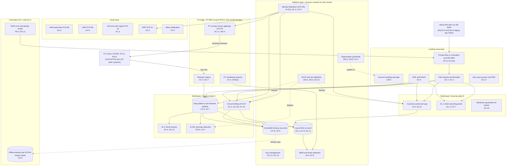

# Cloud Architecture and Control Placement: Cris Santos Company | Water and Wastewater Systems | Enterprise

**Organization:** Cris Santos Company, Inc. (publicly traded parent of state-regulated community water utilities) | **Tier:** Enterprise | **Provider:** Multi-cloud, vendor-agnostic: two public cloud providers (called Cloud provider A and Cloud provider B), two colocation data centers, SaaS, and an on-premises OT edge (see section 4)
**Owner:** Director of Cloud Platform Engineering, with the CISO and the Director of OT Security | **Date:** 2026-08-31 | **Related:** GCR-WTSS SSP (P02), enterprise BIA (P05)

## 1. Architecture in layers
The estate is organized in layers. Each lower layer provides **common controls** that the layers above inherit, so a workload team configures only what is specific to its system. **OT stays on premises.** Treatment and distribution control (SCADA, PLCs, RTUs, HMIs) never runs in the cloud. The cloud receives process data one way, through the OT DMZ, for analytics and AI.

| Layer | What it is | Examples | Who runs it |
|---|---|---|---|
| **Platform** | Organization-wide services in both clouds | Cloud organization guardrails, identity federation, key management, log archive, SIEM feeds, vulnerability and posture management, immutable backup accounts, CI/CD pipelines | Cloud Platform Engineering; Security Operations; Identity team |
| **Landing zone** | The standard account (subscription or project) pattern every workload lands in | Account vending with mandatory tags, hub-and-spoke network with cloud firewalls, private connectivity to colocation and SD-WAN, WAF and DDoS protection, private DNS, zero-trust and PAM access | Cloud Platform Engineering; Network Engineering |
| **Workload** | Systems built or run by the company | Cloud A: CIS and billing (SYS-07) with SL-2 client tenants, enterprise data platform with historian replicas, AI-001. Cloud B: customer portal and mobile app, SL-1 client reporting portal, workforce generative AI tenant | Application and data teams |
| **SaaS** | Vendor-operated applications | AMI head-ends (SYS-08), LIMS (SYS-09), GIS and work management (SYS-10), ERP (SYS-11), mass notification, productivity suite, contact center platform, payment processor | Vendors, with the company's configuration and oversight |
| **Colocation** | Two data centers | DC-1 (Florida): WAN core, identity nodes, OT DMZ jump hosts for Florida. DC-2 (Georgia): standby WAN core, offline backup copies, quarterly SCADA image copies | Colocation providers (building); Network Engineering (equipment) |
| **OT edge** | The boundary between OT and everything above | OT DMZ at every ROCC and at every plant of the 31 monitored systems: historian replicas, OT remote access gateway (SYS-04), passive OT monitoring sensors | OT Security; Network Engineering |

## 2. Diagram

## 3. Responsibility by service model
Sources: SRC-AWS-SRM, SRC-AZURE-SRM, and SRC-GCP-SRM in `00_universal-framework/sources/source-register.csv`. The three published models agree on the split used here, so the design does not depend on which two providers the company uses.

| Service model | Provider | Company (customer) | Shared |
|---|---|---|---|
| IaaS (CIS application servers) | Facilities, hosts, hypervisor, physical network | Guest OS, applications, identities, data, network policy | Encryption (provider service, customer keys), logging |
| PaaS (CIS database, data platform, containers, AI services) | Also the platform runtime and its patching | Data, access, configuration, keys, application code, models | Backups, availability configuration |
| SaaS (AMI, LIMS, GIS, ERP, mass notification) | Also the application | Users, roles, data, oversight of the vendor | Audit review (complementary user entity controls) |
| Colocation | Building, power, cooling, perimeter | Racks, equipment, cage access lists | None |
| OT edge (on premises) | None | Everything | None |

## 4. Service categories and provider equivalents
| Service category | AWS | Microsoft Azure | Google Cloud |
|---|---|---|---|
| Organization guardrails | AWS Organizations service control policies | Azure Policy with management groups | Organization Policy Service |
| Account vending | AWS Control Tower account factory | Azure landing zone subscription vending | Resource Manager project creation |
| Key management | AWS KMS | Azure Key Vault | Cloud KMS |
| Audit logging | AWS CloudTrail | Azure Monitor activity log | Cloud Audit Logs |
| Threat detection | Amazon GuardDuty | Microsoft Defender for Cloud | Security Command Center |
| Managed relational database | Amazon RDS | Azure SQL Database | Cloud SQL |
| Web application firewall | AWS WAF | Azure Web Application Firewall | Cloud Armor |
| Backup service | AWS Backup | Azure Backup | Backup and DR Service |

This table is for reading provider documentation only. The architecture, control map, and SSP describe service categories.

## 5. Common controls
`cloud-control-map.csv` has **67 rows** across 33 components: Platform 19, Landing zone 8, Workload 19, SaaS 12, Colocation 3, OT edge 6. Responsibility: Customer 47, Shared 16, Provider 4.

**36 rows are published as common controls** (`common_control` = Yes) in the enterprise common control catalog. They map to the common control providers in the GCR-WTSS SSP (P02 section 10.3): identity (CCP-02), OT security services (CCP-03), security operations (CCP-04), network (CCP-05), and cloud landing zone and data platform (CCP-10). A cloud workload inherits them by being deployed through account vending, which applies the guardrails, logging, network, key, and backup policies automatically. An OT system inherits the OT edge controls by being connected through a standard OT DMZ and enrolled in the gateway and monitoring.

**Rules for inheriting:**
1. A workload may claim a common control only if its account was created by account vending and passes the posture baseline. An OT system may claim the OT edge controls only if it has a standard OT DMZ; AQ-04 to AQ-06 cannot until POAM-001 closes.
2. Customer-side identity, data protection, and logging stay explicit at every layer: even a SaaS application has Customer rows for access (AC-2, AC-3, AU-6) because those are always the company's responsibility.
3. SaaS rows cite the vendor's SOC report, reviewed by the third-party risk team (P09 evidence map).

## 6. Validation against the GCR-WTSS SSP (P02)
The GCR-WTSS is on premises, so most of its controls are in P02. This map covers the places where it touches shared services:

| GCR-WTSS dependency | AC | AU | CM | IA | SC | SI |
|---|---|---|---|---|---|---|
| OT DMZ historian replica | AC-4 | AU-2 (inherited) | CM-6 (inherited) | IA-2(1) (inherited) | SC-7 | SI-7 (on the data platform) |
| OT remote access gateway | AC-17, MA-4 | AU-2 (inherited) | CM-3 (P02) | IA-2(1), IA-2(2) (inherited) | SC-7 | SI-4 |
| OT monitoring sensors | AC-4 (P02) | AU-6 (inherited) | CM-8(3) | Not applicable (passive) | SC-7 (P02) | SI-4 |
| Log archive and SIEM | AC-6 (inherited) | AU-9, AU-11 | CM-5 (inherited) | IA-2(1) (inherited) | SC-8 (inherited) | SI-4 |
| Off-site SCADA image copies (DC-2) | PE-3 (provider) | Media log (P02 MP-5) | Not applicable | Not applicable | SC-28 (P02) | Not applicable |

## 7. Findings from the mapping
1. **Acquired systems bypass the OT edge.** AQ-04 to AQ-06 connect over legacy site VPNs straight to the regional WAN, with no OT DMZ, so they cannot inherit the gateway, monitoring, or replication controls (P01 R-003; POAM-001).
2. **One-way design holds for the cloud.** No cloud workload, including AI-001, has a write path into OT. The P07 penetration test confirmed that the data platform cannot reach the OT DMZ inbound (P07 SC-7).
3. **Data platform administrator rights are too broad.** A compromised administrator could tamper with historian replicas and the AI-001 model (P01 R-032). A separate model deployment role and signed model images are planned.
4. **Two clouds, one control set.** Guardrails, logging, and key policies are written once as code and applied to both clouds. Differences are limited to service names (section 4).
5. **Customer data concentration.** The CIS holds about 3.5 million company accounts and 27 SL-2 client tenants, with bank account numbers for bank draft customers. Tokenization and egress anomaly detection are planned (P01 R-026), and tenant isolation testing in the pipeline (P01 R-028).
6. **Notification depends on SaaS.** The mass notification service and the contact center platform are SaaS single points of failure during a boil water notice. The fallback is procedural (offline contact exports, broadcast media), not architectural (P01 R-039, R-040).
