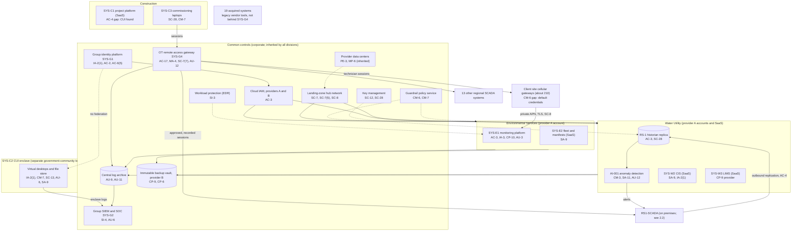
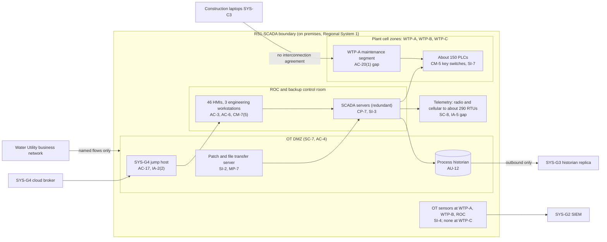

# Cloud and OT Architecture with Control Placement: Cris Santos Company Holdings | Water and Wastewater Systems | Multi-Sector

**Organization:** Cris Santos Company Holdings, Inc. | **Tier:** Multi-Sector | **Providers:** two public cloud providers, called provider A and provider B, plus a government-community cloud offering of provider A for the Construction CUI enclave (vendor-agnostic; see section 5)
**Scope:** the shared corporate cloud platform (SYS-G3 landing zones and data platform), the OT remote access gateway (SYS-G4), the division workloads that run on or connect to them, and the cloud-facing edge of the SSP system, RS1-SCADA (P02).

## 1. Design in one paragraph
Corporate runs one **landing zone** per provider: identity federation from SYS-G1, a hub network, guardrail policies, a central log archive, key management, EDR, and an immutable backup vault in provider B. Divisions get their own **accounts** inside the landing zone and inherit these guardrails. Provider A hosts the data platform (with RS-1's historian replica and the AI-001 anomaly detection model), the Environmental Services monitoring service (SYS-E1), and the cloud broker of the **OT remote access gateway** (SYS-G4), whose jump hosts sit in each regional OT DMZ. Two things deliberately sit outside the shared landing zone: **RS1-SCADA itself**, which stays on premises and only pushes data outward through its OT DMZ, and the **Construction CUI enclave** (SYS-C2), which runs in a separate tenant of a government-community cloud offering with its own identity, because covered defense information needs a cloud that meets FedRAMP Moderate equivalency (DFARS 252.204-7012(b)(2)(ii)(D)). Water Utility, Construction, and Environmental Services business systems are vendor SaaS.

## 2. Diagrams
### 2.1 Group landing zone, gateway, and division workloads

### 2.2 RS1-SCADA (SSP boundary) and its connections

**Target state (POAM-002, POAM-003, POAM-008, POAM-019; through 2027-03-31):** commissioning engineers use per-session approval like everyone else; Construction laptops reach the WTP-A maintenance segment only under an interconnection agreement and through the gateway; every commissioning change goes through RS-1 management of change; an OT sensor is added at WTP-C; and the 19 acquired systems move behind SYS-G4 by 2027-06-30 (POAM-013).

## 3. Common versus division-specific controls
`cloud-control-map.csv` has 52 rows across 24 components. The `control_scope` column shows who owns each placement:

| Scope | Rows | What it means |
|---|---|---|
| Common (group) | 24 | Provided once by corporate (SYS-G1 to SYS-G4) and inherited by every division account. Listed in the P02 common control catalog |
| SSP system (RS1-SCADA) | 6 | The cloud-facing edge of RS1-SCADA: outbound replication, the historian replica, OT sensors, and plant physical security |
| Division-specific (Water Utility) | 6 | AI-001 model serving, CIS, and LIMS |
| Division-specific (Construction) | 9 | CUI enclave, project platform, commissioning laptops |
| Division-specific (Environmental Services) | 7 | Multi-tenant monitoring service, client site gateways, fleet systems |

| Responsibility | Rows |
|---|---|
| Customer (the group or a division) | 41 |
| Shared (provider and group) | 8 |
| Provider | 3 |

**Rule of thumb.** Identity, network guardrails, logging, keys, backups, EDR, and the OT remote access path are **common**. A division cannot opt out of them, only request an exception under POL-01. Application behavior, tenant isolation, client devices, and anything that touches covered defense information are **division-specific**, because they depend on each division's regulators and clients. The CUI enclave is the one deliberate exception to common identity: it does not federate to SYS-G1, so Construction operates its identity controls itself.

## 4. Layers
| Layer | Common components | Division components | Key controls | Responsibility |
|---|---|---|---|---|
| Identity | SYS-G1, cloud IAM, SYS-G4 broker | CUI enclave identity tenant, CIS staff sign-in, SYS-E1 device certificates | AC-2, AC-3, AC-6(5), AC-17, IA-2(1), IA-3 | Customer (configuration); vendor (service) |
| Network | Hub network, gateway proxying | OT DMZ replication link, client gateway APN | SC-7, SC-7(5), SC-7(7), SC-8, SC-8(1), AC-4 | Customer, with provider backbone encryption shared |
| Compute | Guardrails, EDR | AI-001 serving, enclave virtual desktops, commissioning laptops, client gateways | CM-3, CM-6, CM-7, SI-3, SA-11 | Customer (guest OS, containers, devices, code) |
| Data | Keys, backup vault | Historian replica, SYS-E1 database, enclave file store | SC-12, SC-13, SC-28, CP-6, CP-9, CP-10 | Shared: provider encrypts; group owns keys, zoning, and retention |
| Logging and monitoring | Log archive, SIEM, gateway recordings | OT sensors, AI-001 alert log, enclave logs, SYS-E1 audit log | AU-3, AU-6, AU-9, AU-11, AU-12, SI-4, SI-4(4) | Shared: providers generate platform logs; group retains and reviews |
| SaaS dependencies | Identity and SIEM vendors | CIS, LIMS, project platform, fleet systems | SA-9, CP-9 | Provider for the service; customer for use and oversight |
| Physical | Provider data centers | RS-1 plants and control rooms | PE-3, MP-6 | Provider (inherited) for cloud; Water Utility for plants |

## 5. Service categories and provider equivalents
The design does not depend on a provider. This table gives each provider's name for each service category, for reading its shared responsibility documentation.

| Service category | AWS | Microsoft Azure | Google Cloud |
|---|---|---|---|
| Account structure and guardrails | AWS Organizations with service control policies | Management groups with Azure Policy | Resource hierarchy with Organization Policy |
| Government-community cloud region or offering | AWS GovCloud (US) | Azure Government | Assured Workloads |
| Managed time-series or analytical database | Amazon Timestream / Redshift | Azure Data Explorer / Synapse | Bigtable / BigQuery |
| Managed machine learning serving | Amazon SageMaker | Azure Machine Learning | Vertex AI |
| Key management | AWS KMS | Azure Key Vault | Cloud KMS |
| Audit logging | AWS CloudTrail | Azure Monitor activity log | Cloud Audit Logs |
| Backup with immutability | AWS Backup (vault lock) | Azure Backup (immutable vault) | Backup and DR Service |
| Private connectivity | AWS Direct Connect / PrivateLink | Azure ExpressRoute / Private Link | Cloud Interconnect / Private Service Connect |

Shared responsibility sources: SRC-AWS-SRM, SRC-AZURE-SRM, SRC-GCP-SRM in `00_universal-framework/sources/source-register.csv`. All three agree on the split used here: for IaaS the provider owns facilities, hosts, and virtualization; for PaaS the provider also owns the runtime; for SaaS the provider owns the application. The customer always keeps identities, access decisions, data classification, and data. Whether a specific government-community offering meets FedRAMP Moderate equivalency for a given service is confirmed from the provider's documentation for that service, not assumed from the offering name.

## 6. Findings from the mapping
1. **The weak point is the remote path, not the cloud.** Common cloud controls are sound and reused. The gateway (SYS-G4) is well built, but an exception waived per-session approval for 34 commissioning engineers, and Construction laptops connect to the WTP-A maintenance segment without an interconnection agreement (AC-17, AC-20(1); P01 GR-01; POAM-002, POAM-019).
2. **RS1-SCADA only pushes data out.** Historian replication is outbound-only from the OT DMZ (AC-4), so the cloud cannot be used as a path into OT. AI-001 alerts return to operators as notifications, not control commands.
3. **CUI has leaked outside the enclave** (AC-4 on SYS-C1, SC-28 and CM-7 on laptops). The enclave design is right; the problem is what engineers copy out of it (POAM-018).
4. **Environmental Services' edge is its weakest layer.** The platform enforces tenant isolation and device certificates, but 23 client site gateways still had default local web credentials (CM-6; POAM-022). This also matters for the 31 federal sites whose data is FCI under FAR 52.204-21.
5. **Monitoring coverage, not tooling, is the OT gap.** The SIEM and sensors work where deployed (the 6 largest systems, except WTP-C within RS-1). The other 52 water systems, including all 19 acquired systems, have no OT network monitoring (SI-4, SI-4(4); POAM-003).
