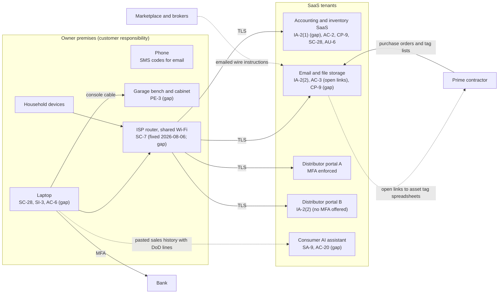

# SaaS Architecture and Control Placement: Cris Santos Company | Wholesale Trade | Sole Proprietorship

**Organization:** Cris Santos Company (IT hardware reseller) | **Tier:** Sole Proprietorship | **Provider:** SaaS only (no IaaS or PaaS)
**System:** Reseller Order Desk (ROD), as defined in the system profile (P02)

## 1. Diagram
Control IDs on each node are the ones in `cloud-control-map.csv`. Dashed lines are flows that carry FCI or money without an adequate safeguard today.

## 2. Layers
| Layer | Components | Key controls | Responsibility |
|---|---|---|---|
| Identity | SYS-01, SYS-02, SYS-03 accounts | IA-2(1), IA-2(2), AC-2 | Customer configures; vendor provides MFA (except distributor B) |
| Data | Order records, files and links, AI chats | CP-9, SC-28, AC-3, SA-9, AC-20 | Vendor protects data inside its service; the customer decides where FCI goes and who can open it |
| Endpoints | Laptop, phone | SC-28, SI-3, AC-6 | Customer |
| Network | ISP router and Wi-Fi shared with the household | SC-7 | Customer (the ISP supplies the device) |
| Physical | Garage bench and stock cabinet | PE-3 | Customer |
| Logging | SYS-01 sign-in history | AU-6 | Shared: vendor records, customer reviews |
| SaaS applications and hosting | All SaaS platforms | Inherited (AC-3 enforcement, SC-28, CP-9 in SYS-01) | Provider |

## 3. Shared responsibility for SaaS
All three major cloud providers' shared responsibility models (SRC-AWS-SRM, SRC-AZURE-SRM, SRC-GCP-SRM) agree on the SaaS split: the provider runs the application, the platform, and the facilities, and **the customer always keeps its identities and accounts, its data, and its devices.** That is why 11 of the 16 rows in the control map are the owner's alone, 3 are shared, and only 2 (SYS-01 backups and encryption) are the provider's. A vendor's SOC 2 report never covers the customer's three layers. No IaaS provider equivalents table is needed, because the business runs no infrastructure.

For CMMC Level 1, the SaaS vendors that hold FCI are part of the assessment scope through the owner's use of them (32 CFR 170.19(b)(1) and (3)). The owner's self-assessment covers the owner's settings in each service; it does not assess the vendor's platform.

## 4. Findings from the mapping
1. **The order management system has no MFA on its administrator account** (SYS-01). It is free to turn on. Tracked as P01 R-003.
2. **FCI leaves the boundary in two uncontrolled ways:** open file links to the prime and sales history pasted into a consumer AI assistant. Only settings and a rule can fix this, not the vendors. Tracked as R-006 and R-007.
3. **The home router is part of the security boundary.** It carries every business session and is shared with household devices. Its default password and remote management were found in P07 testing (R-008).
4. **Distributor portal B offers no MFA.** The owner cannot fix the provider gap, so the compensating rule is to place DoD orders only through portal A.
5. **Inherited controls depend on the vendor's SOC 2 report** and on the owner operating the complementary user entity controls (account removal, MFA, sign-in review) listed in P09.
