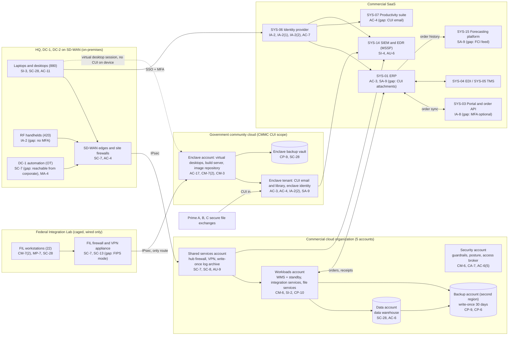

# Cloud Architecture and Control Placement: Cris Santos Company | Wholesale Trade | Mid-Market

**Organization:** Cris Santos Company, Inc. | **Tier:** Mid-Market | **Provider:** Vendor-agnostic public cloud (commercial region) and a government community cloud for the enclave (see section 5), plus SaaS
**System:** Distribution Operations Platform (DOP), as defined in the SSP (P02) | **Prepared:** 2026-07-31 by the Director of Information Technology and the Security Manager; updated 2026-09-17 with P07 results
**Control map:** `cloud-control-map.csv` (56 rows, 30 components)

## 1. Diagram

## 2. Landing zone design
The commercial landing zone separates duties across 5 accounts (subscriptions or projects, depending on the provider) under one cloud organization. The enclave is a separate environment with its own identity, so a compromise of the corporate environment does not reach CUI directly.

| Account | Purpose | Who administers | Key design decisions |
|---|---|---|---|
| **Security** | Organization root, guardrails, posture management and threat detection, privileged access broker | Security Manager and 1 analyst | No workloads. Root credentials sealed. Guardrails apply to every other account and cannot be disabled from them |
| **Shared services** | Network hub, cloud firewall, site-to-cloud VPN, DNS, patch service, log pipeline, write-once log archive | Infrastructure team (Director of Information Technology) | All traffic between sites, workloads, and the internet passes the hub. Logs from every account land in a 3-year write-once archive |
| **Workloads** | WMS servers and standby database, integration services (order APIs and middleware), file services, key management | Infrastructure and application teams | Separate subnets per workload. No internet ingress except the API gateway. Company-managed keys |
| **Data** | Data warehouse (also the AI-001 training data source) | Data team; Chief Financial Officer as owner | Bulk extracts limited to 6 named analysts |
| **Backup** | Backup vault with 30-day write-once retention in a second region | 2 named backup administrators | Separate credentials not federated to everyday accounts; backup role can write but not delete |

**Federal Integration Enclave.** A government-community productivity and identity tenant (FedRAMP High authorized) holds CUI email and the CUI library. A dedicated enclave cloud account in a FedRAMP Moderate authorized government region holds the virtual desktops, the configuration build server, the image repository, and an enclave backup vault. The FIL connects to the enclave account through its own firewall and VPN appliance, with no route to corporate networks or the internet. Corporate laptops reach the enclave only through virtual desktop sessions that block clipboard, drive mapping, and local printing, so CUI stays in the enclave.

## 3. Layers and shared responsibility per service
| Layer | Components | Key controls | Service model | Responsibility |
|---|---|---|---|---|
| Identity | Cloud federation, access broker, corporate IdP, enclave identity | IA-2, IA-2(1), IA-2(2), AC-2, AC-6, AC-6(5), AC-7 | PaaS / SaaS | Customer configures identities, roles, MFA, and reviews; provider runs the identity services |
| Network | Hub, cloud firewall, VPNs, SD-WAN edges, FIL firewall | SC-7, SC-7(5), SC-8, SC-13, AC-4 | PaaS / on-premises | Customer designs routes, rules, and segmentation; provider runs the gateway services |
| Compute | WMS, integration services, enclave desktops and build server | CM-6, CM-7(2), CM-3, SI-2, SI-3, AC-17 | IaaS / PaaS | Customer (guest OS, applications, EDR); provider for hosts and hypervisor |
| Data | File services, data warehouse, CUI library, keys, backups | SC-28, SC-12, SC-13, CP-9, CP-6, CP-4, CP-10, AC-3, AC-6 | IaaS / PaaS | Shared: provider encrypts and operates storage and databases; customer controls keys, access, retention, isolation, and restore testing |
| Logging and monitoring | Log pipeline and archive, posture service, SIEM, enclave audit logs | AU-2, AU-6, AU-9, AU-11, CA-7, RA-5, SI-4 | PaaS / SaaS | Shared: provider generates logs; customer enables, retains, forwards, and acts on them; MSSP monitors |
| SaaS applications | ERP, portal, EDI, TMS, productivity suite, forecasting platform | SA-9, AC-3, AC-4, IA-8, CP-9, AU-6, SC-5 | SaaS | Provider runs the application and infrastructure; customer keeps users, roles, data flows, and audit review |
| Physical | Provider data centers | PE-3 | All | Provider (inherited, evidenced by FedRAMP packages or SOC 2 reports) |

**Responsibility counts in `cloud-control-map.csv`:** 35 Customer, 15 Shared, 6 Provider. By service model: 14 IaaS, 21 PaaS, 18 SaaS, and 3 on-premises rows. 15 rows cover the government community enclave.

## 4. Service categories and provider equivalents
The design is independent of the provider. This table gives each provider's name for the service category, for reading its shared responsibility documentation (SRC-AWS-SRM, SRC-AZURE-SRM, SRC-GCP-SRM in `00_universal-framework/sources/source-register.csv`).

| Service category | AWS | Microsoft Azure | Google Cloud |
|---|---|---|---|
| Multi-account organization and guardrails | AWS Organizations, service control policies | Management groups, Azure Policy | Resource Manager folders, organization policies |
| Account, subscription, or project | Account | Subscription | Project |
| Network hub and cloud firewall | Transit Gateway; AWS Network Firewall | Virtual WAN hub; Azure Firewall | Network Connectivity Center; Cloud NGFW |
| Site-to-cloud VPN | Site-to-Site VPN | VPN Gateway | Cloud VPN |
| Virtual machines | EC2 | Virtual Machines | Compute Engine |
| Managed database with standby | RDS Multi-AZ | Azure SQL with geo-replication | Cloud SQL high availability |
| Object storage with write-once retention | S3 Object Lock | Blob immutability policies | Bucket lock |
| Backup service | AWS Backup (vault lock) | Azure Backup (immutable vault) | Backup and DR Service |
| Key management | AWS KMS | Azure Key Vault | Cloud KMS |
| Posture and threat detection | Security Hub, GuardDuty | Microsoft Defender for Cloud | Security Command Center |
| Government community regions | AWS GovCloud (US) | Azure Government | Assured Workloads |

**Service model split used here (all three providers agree):** for IaaS the provider owns facilities, hosts, and virtualization; for PaaS it also owns the platform software; for SaaS it also owns the application. The customer always keeps identities, access, data, and configuration.

## 5. CUI in the cloud
DFARS 252.204-7012(b)(2)(ii)(D) requires that a cloud service provider that stores, processes, or transmits covered defense information for the company meets security requirements equivalent to the FedRAMP Moderate baseline and the clause's incident terms. The enclave services are listed as FedRAMP Moderate (account) and FedRAMP High (tenant) authorized, checked by the Security Manager on 2026-07-17. The SSP references each provider's customer responsibility matrix, because the company's own configuration of those services stays in the CMMC assessment scope (32 CFR 170.16(c)(2) and 170.17(c)(5)).

The ERP (SOC 2 Type 2, no FedRAMP authorization or documented equivalency) and the commercial productivity tenant are **not** approved for CUI. The CUI found there (gap 1) must be removed, which is why the cleanup is a condition of the SSP decision.

## 6. Findings from the mapping
1. **CUI escaped the enclave (AC-4, SA-9).** The enclave design is sound, but CUI reached the ERP (37 orders) and the commercial email tenant (212 messages) through business processes, not technical failures: inside sales attached prime drawings to federal orders, and Prime C's program office emailed a general mailbox. Fix: attachment block on federal order types, an inbound mail rule that returns prime-domain CUI with instructions to use the enclave exchange, Prime C onboarding to the enclave, and a purge. POAM-001, due 2026-11-30.
2. **DC automation sits on the corporate network (SC-7, MA-4).** The sorter control servers accept file sharing and remote desktop from corporate VLANs, run an unsupported operating system, and carry the integrator's always-on remote tool. Fix: an OT VLAN with deny-by-default rules, a remote access gateway with per-session approval and MFA, and passive OT monitoring. POAM-004 and POAM-005, due 2027-03-31.
3. **Recovery is designed but slow (CP-10, CP-4).** The WMS standby meets the 30-minute RPO, and backups are isolated and write-once. The 2025-09 rebuild took 14 hours against an 8-hour RTO, and integration and file services have never been restored. POAM-011.
4. **Logging gaps sit in SaaS and the FIL (AU-6, AU-11).** ERP, WMS application, and portal logs are not in the SIEM, and the FIL firewall keeps 30 days of logs, which cannot support the 90-day image and data preservation duty in DFARS 252.204-7012(e) when an incident is found late. POAM-007 and POAM-008.
5. **Enclave administration is too broad (AC-6).** 6 standing global administrators in the enclave tenant are outside the access broker. POAM-003.
6. **Boundary check.** Every component in the SSP (P02 section 9) that runs in the cloud or SaaS appears in the diagram and has at least one row in the control map. Each account and the enclave have controls from at least 2 of the AC, AU, CM, IA, SC, and SI families or inherit them.
7. **Inherited controls rely on provider evidence.** Controls marked Provider or Shared rely on the government community cloud provider's FedRAMP authorization and on SOC 2 Type 2 reports for the commercial cloud and SaaS vendors, reviewed each year in P09 `vendor-soc2-review.csv`.
