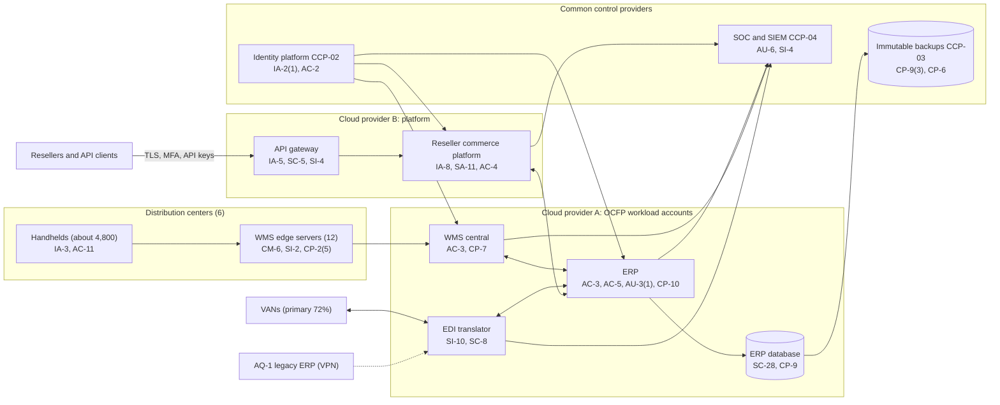

# System Security Plan: Order-to-Cash and Fulfillment Platform (OCFP)

**Organization:** Cris Santos Company, Inc. (publicly traded IT hardware and software distributor) | **Tier:** Enterprise | **Vertical:** Wholesale Trade
**Outline:** NIST SP 800-18 Rev. 2, System Security Plan Outline Example (June 2026) | **Version:** 2.0, 2026-09-14

## 1. System Name and Identifier
Order-to-Cash and Fulfillment Platform (**OCFP**), identifier CSC-SYS-OCFP-001. Tier-1 system in the enterprise application inventory.

## 2. System Overview
The OCFP is how the company makes money: it takes about 41,000 order lines per shipping day from EDI, the reseller commerce platform, APIs, and the sales desk; prices them, checks credit, screens federal orders, and allocates stock; releases them to 6 distribution centers for picking and shipping; and invoices about $19.2 million per shipping day. It also runs purchasing, receiving, and inventory for about 180,000 active SKUs.

**Why availability matters most.** Resellers can buy the same products from competing distributors within hours, so an OCFP outage loses business quickly (P05: order capture MTD 8 hours, fulfillment MTD 12 hours). Large IT distributors have suffered multi-day order-system outages from ransomware, which is why the board treats OCFP availability as an enterprise risk (P01 ER-01).

**Major components:**
- **SYS-01 ERP:** commercial ERP suite, customer-managed on Cloud provider A virtual machines and database servers, with a warm standby in a second region
- **SYS-02 WMS:** central WMS instance on Cloud provider A, two edge servers at each distribution center, and about 4,800 handhelds and wearable scanners
- **SYS-03 Reseller commerce platform:** company-built portal, quoting, subscription marketplace, and order APIs on Cloud provider B managed containers, behind the landing zone web application firewall
- **SYS-04 EDI and B2B integration:** EDI translator on Cloud provider A connected to two VANs, plus the integration layer that links the ERP, WMS, platform, TMS, and drop-ship partners

Users: about 6,800 named ERP users, about 6,100 WMS users (including temporary workers), 74 ERP technical administrators through PAM, and about 38,000 reseller platform users at 9,500 accounts with about 430 API integrations.

**What the OCFP holds.** Orders, pricing, customer and supplier master data, inventory, invoices, reseller business contacts and end-user license registrants (personal information), and **FCI** for every DoD order. The OCFP is part of the enterprise FCI scope (Final Level 1 (Self), affirmed 2026-01-15). It must **not** hold CUI; CUI belongs only in the FSCE (SYS-10). The 2026 CUI spill (section 4.3) is the main exception this plan addresses.

## 3. Laws, Regulations, and Policies Affecting the System
| ID | Requirement | Citation | How it affects the OCFP |
|---|---|---|---|
| N42-R04 | FAR Basic Safeguarding of Covered Contractor Information Systems | 48 CFR 52.204-21 | FCI in DoD orders; the 15 basic safeguarding requirements apply |
| N42-R02 | CMMC Program | 32 CFR Part 170; DFARS 252.204-7021 | Final Level 1 (Self) for the enterprise FCI scope; no Level 2 status, so CUI may not be processed here (252.204-7021(d)(2)) |
| N42-R03 | DFARS Safeguarding CDI and Cyber Incident Reporting | 48 CFR 252.204-7012 | Applies to any covered contractor information system that holds covered defense information; the OCFP is designed to hold none, so the CUI spill must be removed and prevented. Incident reporting (P08) |
| N42-R05 | Section 889 prohibition | 48 CFR 52.204-25 | Item-master screening and hard block on federal orders run in the ERP |
| DFARS | Sources of Electronic Parts | 48 CFR 252.246-7008 | Authorized-source sourcing order for federal orders is enforced in ERP purchasing rules |
| N42-R07 | SEC cybersecurity disclosure | Form 8-K Item 1.05; 17 CFR 229.106 | A material OCFP incident goes through the P08 materiality step |
| SOX | Internal control over financial reporting | Sarbanes-Oxley Act section 404 | ERP IT general controls are tested by the SOX program |
| N42-R08 | CCPA/CPRA | Cal. Civ. Code 1798.100 et seq. | Personal information of California reseller contacts and license registrants |
| N42-R01 | FTC Act Section 5 | 15 U.S.C. 45(a) | Reasonable security for personal information and accurate security representations to resellers |
| State | State breach notification laws | Each state where affected individuals reside (Florida worked example: Fla. Stat. 501.171) | Notification (P08) |
| Contract | Reseller platform terms; SOC 2 (SL-1) | P09 | 99.9% availability commitment; Security, Availability, Confidentiality, Processing Integrity |
| Internal | POL-01 to POL-05 and standards | P06 | Enterprise policy hierarchy |

Not applicable to the OCFP: N42-R06 (CTPAT applies to import security and business partners; the OCFP holds import records but the program's controls are run by Trade Compliance and Facilities); PCI DSS (card data stays in the processor's hosted payment fields).

## 4. System Status
### 4.1 System Security Plan Approval
Prepared by the ERP Platform Manager and the GRC team. Reviewed by the CISO, the Vice President, E-commerce, and the Vice President, Distribution Operations. Approved by the Chief Operating Officer on 2026-09-14.
### 4.2 System Authorization Decision
The company is not a federal agency, so there is no formal ATO. The equivalent internal decision:
- **Authorizing official equivalent:** Chief Operating Officer, with the CISO's recommendation.
- **Decision (2026-09-14):** continue operation with conditions, based on the Internal Audit assessment (P07) and the risk register (P01).
- **Conditions:** block CUI uploads on the platform (POAM-007 by 2026-10-15); remove shared WMS kiosk accounts before the next Level 1 affirmation (POAM-003 by 2026-10-31); restrict the AQ-1 VPN to named flows (POAM-002, interim by 2026-10-31); rotate reseller API credentials to short-lived tokens (POAM-011 by 2027-03-31); prove the 4-hour ERP RTO (POAM-010 by 2027-01-31).
- **Reauthorization:** annually, or after a major change (the AQ-1 cutover on 2027-03-31 is a major change).
### 4.3 System Operational Status
Operational. **CUI spill (2026):** between 2026-02 and 2026-07, integrator customers attached CUI-marked network drawings to 23 quote requests on SYS-03, which synchronized them to 23 ERP quote records. The files were purged on 2026-07-21 and the affected primes and contracting officers were told on 2026-07-22. Planned major modifications: CUI upload controls (POAM-007), AQ-1 cutover (2027-03-31), API token service (POAM-011), automated ERP recovery (POAM-010).

## 5. Role Identification and Responsible Personnel
| Role | Title | Responsibility |
|---|---|---|
| System owner | Vice President, Enterprise Applications | Accountable for the OCFP; approves access roles and changes |
| Business owners | Vice President, Distribution Operations (WMS); Vice President, E-commerce (platform) | Process and data decisions for their components |
| Authorizing official (equivalent) | Chief Operating Officer | Accepts residual risk to operate |
| System administrator | ERP Platform Manager | Day-to-day administration and change control |
| Information security | CISO; Director of Security Operations | Program oversight; SOC monitoring; incident response |
| Federal compliance | President, Federal Solutions (CMMC Affirming Official); Director, Government Contracts | FCI scope affirmation; Section 889 screening rules; DoD reporting |
| Privacy | Chief Privacy Officer | Personal information of reseller contacts and license registrants |
| Common control providers | See section 10.3 | Operate inherited controls |
| Independent assessor | Chief Audit Executive (Internal Audit) | Annual assessment (P07) |

## 6. System Information Types and System Categorization
Information types come from NIST SP 800-60 Vol. 2 Rev. 1. Impact levels follow FIPS 199.

| Information type | Confidentiality | Integrity | Availability | Rationale |
|---|---|---|---|---|
| Goods acquisition, inventory control, and logistics (orders, purchase orders, inventory, shipments, FCI) | Moderate | Moderate | **High (treated)** | Pricing and DoD order data are sensitive; wrong ship-to or screening data sends the wrong product. An enterprise-wide outage of order capture and fulfillment beyond one shipping day causes severe financial loss (P05 BP-01 and BP-02), so availability is treated as High |
| Financial management (invoices, credit, supplier bank details) | Moderate | Moderate | Moderate | Bank-detail and credit changes are fraud targets; cash processes tolerate 48 to 72 hours (P05 BP-11, BP-12) |
| Customer services (reseller accounts, contacts, end-user license registrants) | Moderate | Moderate | Moderate | Personal information under state laws and the CCPA |
| Information security (audit logs, credentials, API keys) | Moderate | Moderate | Moderate | Protects evidence for fraud and incident investigations |
| **OCFP category** | **Moderate** | **Moderate** | **High treated through supplements** | See the decision below |

**Categorization decision.** Under a strict FIPS 199 high-water mark, a High availability rating would make the whole system High. The company is not a federal agency and uses FIPS 199 as a model. The risk committee approved this tailoring on 2026-09-10:
- The OCFP uses the **SP 800-53B Moderate baseline**.
- It adds **11 High-baseline contingency controls** that protect availability: CP-2(2), CP-2(5), CP-3(1), CP-4(2), CP-6(2), CP-7(4), CP-8(3), CP-8(4), CP-9(3), CP-9(5), CP-10(4).
- The decision is reviewed annually. If the availability POA&M items (POAM-010, POAM-019) are not closed by 2027-06-30, the CISO will recommend full High categorization.

**Documented controls.** `control-implementation.csv` documents **151 controls**: 140 from the Moderate baseline (including the SR family, applied with NIST SP 800-161 Rev. 1) and 11 High-baseline availability supplements. The remaining Moderate-baseline controls (mostly enhancements in AC, AU, CM, IA, SC, and SI, and the PE environmental controls run by the cloud and colocation providers) are fully inherited from the common control catalog (section 10.3) and are listed there rather than repeated here.

**How the SR controls are applied.** SP 800-53 writes the SR controls for the components of an organization's own systems. The company applies them to OCFP service providers and, as an author decision, also to the products it distributes, because those products become components of customers' systems, including DoD systems.

## 7. Authorization Boundary Description
**Inside the boundary:** the ERP application and database servers, the WMS central instance and the 12 distribution-center edge servers, the handhelds, the reseller commerce platform containers and API gateway, the EDI translator, and the integration layer, in their workload accounts at Cloud providers A and B.

**Outside the boundary (common control providers and interconnected systems):**
- Landing zone services (network hubs, key management, log archive, backup accounts, standby regions): CCP-03
- Identity platform (SYS-07): CCP-02
- SOC, SIEM, EDR, scanners (SYS-08): CCP-04
- Enterprise network and colocation (SYS-09): CCP-05, CCP-07
- Interconnected: VANs, TMS (SYS-05), payment processor, drop-ship partners, carriers, the forecasting platform (AI-001), the AQ-1 legacy ERP and WMS (SYS-15, until cutover), and the FSCE (SYS-10, **no connection by design**)

The enterprise multi-cloud diagram is in P04 `cloud-architecture.md`.

## 8. Information Exchanges Summary
| Connected system / party | Direction | Data | Agreement |
|---|---|---|---|
| Primary and secondary VANs | Bidirectional (AS2 and VAN protocols over TLS) | Purchase orders, acknowledgments, ship notices, invoices (FCI for DoD orders) | VAN contracts; **no RTO stated, failover untested (POAM-019)** |
| TMS (SYS-05) and carriers | Bidirectional (APIs) | Shipments, labels, tracking (FCI ship-to for DoD orders) | TMS contract with security schedule; contract RTO 8 h |
| Reseller API clients (about 430) | Inbound orders; outbound status and invoices | Orders, pricing, invoices | Platform API terms; **static API keys (POAM-011)** |
| Payment processor | Hosted payment fields; tokens to the ERP | Payment tokens only | Processor agreement |
| Drop-ship partners | Bidirectional (portal and EDI) | Drop-ship orders, substitutions, ship confirmations (FCI) | Partner agreements with FAR 52.204-25 and DFARS 252.246-7008 flowdowns; **substitutions bypass screening (POAM-006)** |
| Forecasting platform (AI-001) | Outbound order history; inbound suggested and auto-released purchase orders | Order history (FCI), supplier data | Vendor contract with FCI safeguarding schedule (P10) |
| AQ-1 legacy ERP (SYS-15) | Bidirectional over the site-to-site VPN | AQ-1 EDI and intercompany orders | Interim interconnection agreement; **VPN too broad (POAM-002)** |
| Lifecycle services platform (SYS-11) | Bidirectional | Service orders and billing | Internal interface specification |
| Data platform (Cloud provider A) | Outbound nightly | Sales and inventory history for analytics | Internal data sharing agreement |

## 9. System Component Inventory
| Component | Type | Location / provider | Owner |
|---|---|---|---|
| ERP application servers (8) and database servers (2 plus standby) | IaaS virtual machines | Cloud provider A, primary region; standby in second region | ERP Platform Manager |
| WMS central instance (4 servers plus standby database) | IaaS virtual machines | Cloud provider A | Vice President, Distribution Operations |
| WMS edge servers (12, two per distribution center) | On-premises servers | FL-2, GA-1, TX-1, OH-1, NV-1, TX-2 (TX-2 edge servers ready for cutover) | Vice President, Distribution Operations |
| Handhelds and wearable scanners (about 4,800) | Mobile devices under MDM | Distribution centers | Director of Endpoint Engineering |
| Reseller commerce platform (about 60 services) and API gateway | Managed containers (PaaS) | Cloud provider B | Vice President, E-commerce |
| EDI translator and integration layer | IaaS and managed integration service | Cloud provider A | ERP Platform Manager |

## 10. Control Implementation Details
### 10.1 Control implementation status
See `control-implementation.csv` (151 controls).

| Status | Count |
|---|---|
| Implemented | 127 |
| Partially implemented | 22 |
| Planned | 2 |
| **Total** | **151** |

| Inheritance | Count |
|---|---|
| Common (fully inherited from a common control provider) | 109 |
| Hybrid (shared between a provider and the OCFP team) | 18 |
| System-specific | 24 |

The Planned controls are High-baseline availability supplements: CP-8(3) and CP-10(4). Partially implemented controls: AC-2, AC-4, AC-5, AT-3, AU-6, CM-3, CM-8, CP-10, IA-2, IA-5, IR-8, PS-4, RA-5, SA-9, SC-7, SI-2, SI-4, SR-3, SR-10, SR-11, CP-2(5), CP-8(4).

### 10.2 Control assessment status
Internal Audit assessed 44 of these controls from 2026-07-13 to 2026-08-28 using SP 800-53A Rev. 5 procedures and statistical sampling (P07 `assessment-plan.md`, `assessment-results.csv`). Weaknesses are in P07 `poam.csv`.

### 10.3 Common control providers and inheritance
Common and hybrid controls are inherited from the enterprise platform. Each provider publishes its controls in the enterprise **common control catalog** (maintained by the GRC team in the GRC platform) and is assessed on its own cycle; the OCFP inherits the results. The last column counts the rows in this plan that name the provider (common or hybrid).

| Provider | Name | Accountable role | Controls provided | Rows in this plan |
|---|---|---|---|---|
| CCP-01 | Enterprise GRC program | CISO (with the Chief Audit Executive for assessment) | Policies and standards (P06), risk method, assessment, POA&M, continuous monitoring | 20 |
| CCP-02 | Identity platform (SYS-07) | Director of Identity and Access Management | SSO, MFA, PAM, identity governance, account lifecycle | 19 |
| CCP-03 | Cloud landing zones (Cloud providers A and B) | Director of Cloud Platform Engineering | Guardrails, network policies, key management, encryption, backups, log archive, standby regions | 24 |
| CCP-04 | Security operations (SYS-08) | Director of Security Operations | 24x7 SOC, SIEM, EDR, vulnerability management, incident response | 23 |
| CCP-05 | Enterprise network (SYS-09) | Director of Network Engineering | SD-WAN, distribution-center networks, wireless, carrier diversity | 5 |
| CCP-06 | Endpoint and device engineering | Director of Endpoint Engineering | Workstation and handheld baselines, EDR agents, MDM, inventory, sanitization of retired devices | 6 |
| CCP-07 | Facilities, physical security, and colocation | Vice President, Corporate Security and Facilities | Server rooms, network closets, docks, visitor logs; colocation physical controls | 5 |
| CCP-08 | Human resources and workforce training | Chief Human Resources Officer | Screening, terminations, training, acknowledgments, sanctions | 10 |
| CCP-09 | Third-party risk management | Director of Third-Party Risk Management | Vendor tiering, SOC report reviews, contract security terms | 5 |
| CCP-10 | Product integrity program | Chief Supply Chain Officer | C-SCRM plan, approved supplier list, sourcing order, Section 889 screening rules, Product Authentication Lab | 10 |

**Inheritance rules:**
- A Common control is fully inherited; the OCFP team verifies only that the OCFP is onboarded (for example, SSO integration, log forwarding, backup policy tags).
- A Hybrid control names both parts in the implementation statement: the provider's part and the OCFP team's part.
- If a provider's assessment finds a weakness, the finding is linked to every inheriting system's POA&M. Example: POAM-001 (late separation of agency workers) is a CCP-02 and CCP-08 weakness that affects the OCFP because agency workers hold WMS accounts.

## 11. Digital Identity Acceptance Statement
- **Workforce users:** SSO with MFA (authenticator app with number matching, or a FIDO2 security key). Privileged users use phishing-resistant FIDO2 keys through PAM. This is comparable to NIST SP 800-63 AAL2 for users and AAL3-like protection for privileged users.
- **Distribution-center handheld users:** badge plus PIN tied to the user's identity on certificate-authenticated devices. Shared kiosk accounts are prohibited (POAM-003 removes the three found at OH-1).
- **Reseller users:** identity is vouched for by the reseller administrator under the platform terms; MFA has been required for all interactive users since 2026-04-01.
- **Reseller API clients:** today, static API keys (not acceptable long term). Target: short-lived OAuth client credentials with certificate binding and rotation, due 2027-03-31 (POAM-011).

## 12. Referenced Artifacts
Scenario facts (`../00_company-facts.md`), BIA (P05), multi-cloud architecture and control map (P04), enterprise risk register (P01), regulatory gap analysis (P03), policy hierarchy and policies (P06), Internal Audit assessment and POA&M (P07), supplier compromise runbook (P08), SOC 2 readiness for SL-1 (P09), AI portfolio including AI-001 (P10), OCFP contingency plan v3, enterprise common control catalog, FSCE CMMC SSP (separate document).

## 13. Acronym List and Glossary
- **CCP:** common control provider
- **CUI / FCI:** Controlled Unclassified Information / Federal Contract Information
- **EDI / VAN:** electronic data interchange / value-added network
- **FSCE:** Federal Solutions CUI Enclave
- **OCFP:** Order-to-Cash and Fulfillment Platform
- **PAM:** privileged access management
- **POA&M:** plan of action and milestones
- **TMS / WMS:** transportation / warehouse management system

## 14. System Security Plan Review and Change Records
| Version | Date | Change | Author |
|---|---|---|---|
| 1.0 | 2025-09-12 | Initial plan (Moderate baseline) | ERP Platform Manager |
| 1.1 | 2026-02-20 | Added AQ-1 interconnection and reseller MFA change | ERP Platform Manager |
| 2.0 | 2026-09-14 | Availability supplements; common control provider mapping; CUI spill; 2026 assessment results | ERP Platform Manager with GRC team |
