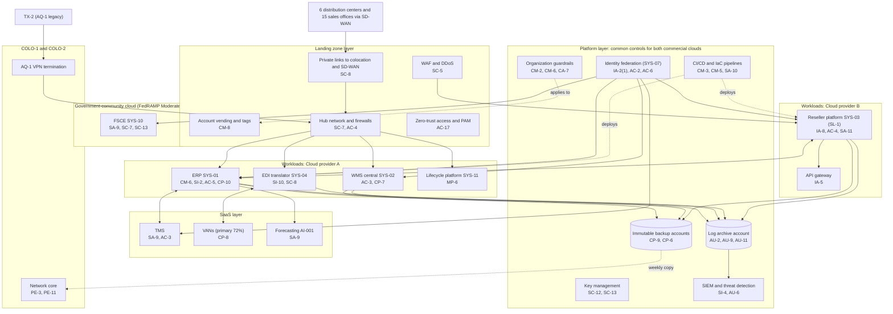

# Cloud Architecture and Control Placement: Cris Santos Company | Wholesale Trade | Enterprise

**Organization:** Cris Santos Company, Inc. (publicly traded IT hardware and software distributor) | **Tier:** Enterprise | **Provider:** Multi-cloud, vendor-agnostic: two public cloud providers (Cloud provider A and Cloud provider B), a government-community cloud offering for the FSCE, two colocation data centers, and SaaS (see section 4)
**Owner:** Director of Cloud Platform Engineering, with the CISO | **Date:** 2026-08-31 | **Related:** OCFP SSP (P02), enterprise BIA (P05)

## 1. Architecture in layers
The estate is organized in layers. Each lower layer provides **common controls** that the layers above inherit, so a workload team configures only what is specific to its system.

| Layer | What it is | Examples | Who runs it |
|---|---|---|---|
| **Platform** | Organization-wide services in both commercial clouds | Organization guardrails, identity federation, key management, log archive, SIEM feeds, vulnerability and posture management, immutable backup accounts, CI/CD pipelines | Cloud Platform Engineering; Security Operations; Identity team |
| **Landing zone** | The standard account pattern every workload lands in | Account vending with mandatory tags (including an FCI tag), hub-and-spoke networks with cloud firewalls, private links to colocation and SD-WAN, WAF and DDoS protection, zero-trust and PAM access, egress filtering | Cloud Platform Engineering; Network Engineering |
| **Workload** | Systems the company builds or runs | Cloud A: ERP (SYS-01), WMS central instance (SYS-02), EDI translator (SYS-04), lifecycle services platform (SYS-11), data platform. Cloud B: reseller commerce platform and API gateway (SYS-03, SL-1), AI and ML services | Application teams (for example, the ERP Platform Manager) |
| **Government-community cloud** | A separate tenant in an offering FedRAMP authorized at Moderate | The FSCE (SYS-10): CUI collaboration, file storage, virtual desktops, CUI exchange gateway | CMMC Program Office with Cloud Platform Engineering |
| **SaaS** | Vendor-operated applications | TMS, VANs, payment processor, productivity suite, forecasting platform (AI-001), MDM, payroll | Vendors, with company configuration and oversight |

Colocation COLO-1 (Georgia) and COLO-2 (Texas) host the network core, SIEM collectors, the AQ-1 VPN termination, and an offline copy of the immutable backups. Distribution-center OT (SYS-06) stays on-premises and is out of the cloud scope; it connects to the WMS only through the warehouse control system interface.

## 2. Diagram

The FSCE has no network path to the commercial clouds. Identity federation reaches it through a separate directory tenant for enclave users.

## 3. Responsibility by service model
Sources: SRC-AWS-SRM, SRC-AZURE-SRM, and SRC-GCP-SRM in `00_universal-framework/sources/source-register.csv`. The three published models agree on the split used here, so the design does not depend on which providers the company uses.

| Service model | Provider | Company (customer) | Shared |
|---|---|---|---|
| IaaS (ERP, WMS, EDI translator servers) | Facilities, hosts, hypervisor, physical network | Guest OS, applications, identities, data, network policy | Encryption (provider service, customer keys), logging |
| PaaS (managed containers, databases, AI services) | Also the platform runtime and its patching | Data, access, configuration, keys, application code | Backups, availability configuration, node pool updates |
| SaaS (TMS, VANs, productivity, forecasting) | Also the application | Users, roles, data, oversight of the vendor | Audit review (complementary user entity controls) |
| Government-community SaaS and IaaS (FSCE) | As above, plus the FedRAMP Moderate control set | Items in the provider's customer responsibility matrix | Encryption, logging, incident reporting coordination |
| Colocation | Building, power, cooling, perimeter | Racks, equipment, cage access lists | None |

## 4. Service categories and provider equivalents
| Service category | AWS | Microsoft Azure | Google Cloud |
|---|---|---|---|
| Organization guardrails | AWS Organizations service control policies | Azure Policy with management groups | Organization Policy Service |
| Account vending | AWS Control Tower account factory | Azure landing zone subscription vending | Resource Manager project creation |
| Key management | AWS KMS | Azure Key Vault | Cloud KMS |
| Audit logging | AWS CloudTrail | Azure Monitor activity log | Cloud Audit Logs |
| Threat detection | Amazon GuardDuty | Microsoft Defender for Cloud | Security Command Center |
| Managed containers | Amazon EKS | Azure Kubernetes Service | Google Kubernetes Engine |
| Web application firewall | AWS WAF | Azure Web Application Firewall | Cloud Armor |
| API gateway | Amazon API Gateway | Azure API Management | Apigee or API Gateway |
| Backup service | AWS Backup | Azure Backup | Backup and DR Service |
| Government-community cloud | AWS GovCloud (US) | Azure Government | Assured Workloads |

This table is for reading provider documentation only. The architecture, control map, and SSP describe service categories.

## 5. Common controls
`cloud-control-map.csv` has **60 rows** across 34 components: Platform 21, Landing zone 8, Workload 17, Government-community cloud 3, SaaS 8, Colocation 3. Responsibility: Customer 43, Shared 12, Provider 5.

**28 rows are published as common controls** (`common_control` = Yes) in the enterprise common control catalog. They map to the common control providers in the OCFP SSP (P02 section 10.3): identity (CCP-02), landing zones (CCP-03), security operations (CCP-04), network (CCP-05), and colocation (CCP-07). A workload inherits them by being deployed through account vending, which applies the guardrails, logging, network, key, and backup policies automatically.

**Rules for inheriting:**
1. A workload may claim a common control only if its account was created by account vending and passes the posture baseline.
2. Customer-side identity, data protection, and logging stay explicit at every layer: even a SaaS application has Customer rows for access (AC-3, AU-6), because those are always the company's responsibility.
3. SaaS rows cite the vendor's SOC 2 report, reviewed by the third-party risk team (P09 evidence map).
4. The FSCE inherits nothing from the commercial platform layer except identity governance processes; its controls are documented in its own CMMC SSP against the provider's customer responsibility matrix (32 CFR 170.17(c)(5)(iii)).

## 6. Validation against the OCFP SSP (P02)
Every OCFP component in the SSP boundary appears here with controls from each required family, directly or inherited:
| OCFP component | AC | AU | CM | IA | SC | SI / CP |
|---|---|---|---|---|---|---|
| ERP application and database | AC-5; AC-6 (inherited) | AU-2, AU-9 (inherited) | CM-6; CM-2 (inherited) | IA-2(1) (inherited) | SC-28; SC-7 (inherited) | SI-2; CP-10 |
| WMS central instance | AC-3 | AU-2 (inherited) | CM-6 (inherited) | IA-2(1) (inherited) | SC-7 (inherited) | CP-7 |
| EDI translator and integration layer | AC-4 (inherited) | AU-2 (inherited) | CM-3 (inherited) | IA-2(1) (inherited) | SC-8 | SI-10 |
| Reseller commerce platform and API gateway | AC-4 | AU-2 (inherited) | CM-3 (inherited) | IA-8; IA-5 | SC-5 (inherited) | SI-2; SA-11 |

## 7. Findings from the mapping
1. **AQ-1 connectivity.** The AQ-1 site-to-site VPN terminates at COLO-2 and reaches the EDI translator and ERP integration layer, bypassing landing zone segmentation (P07 SC-7). Fix: restrict to named flows now, then retire the VPN at cutover (POAM-002).
2. **CUI cannot be kept out by architecture alone.** The FSCE is cleanly separated, but customers can upload files to the commercial platform. Upload inspection for CUI markings is a workload control on SYS-03 (POAM-007).
3. **API credentials are a workload gap.** The landing zone provides WAF and rate limits, but static reseller API keys are the platform team's responsibility (POAM-011).
4. **Two clouds, one control set.** Guardrails, logging, and key policies are written once as code and applied to both commercial clouds. Differences are limited to service names (section 4).
5. **EDI concentration is SaaS with no platform fallback.** VAN failover must be handled by contract and testing, not architecture (POAM-019).
6. **AI services** run under enterprise terms with no training on company data. The AI governance committee reviews each new model deployment (P10).
