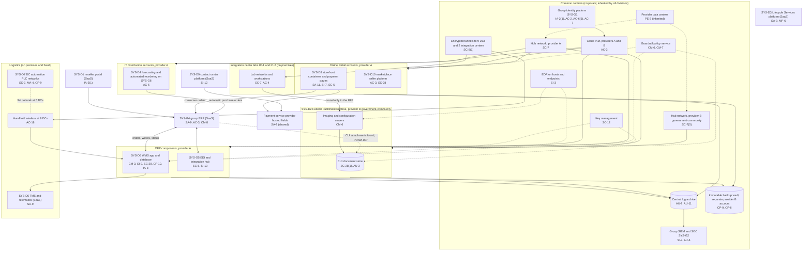
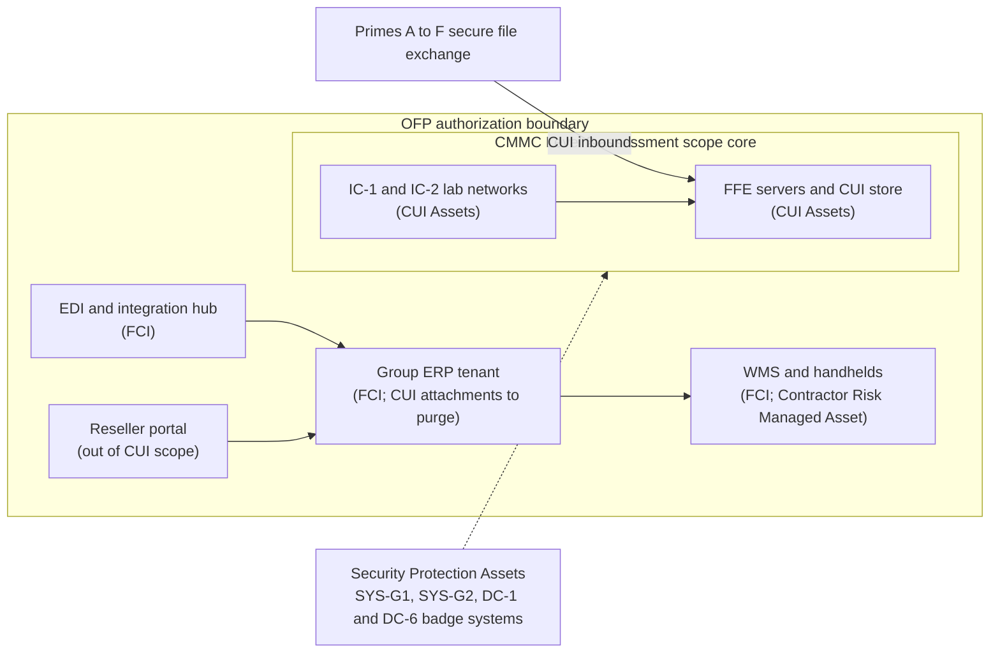

# Cloud Architecture and Control Placement: Cris Santos Company Holdings | Wholesale Trade | Multi-Sector

**Organization:** Cris Santos Company Holdings, Inc. | **Tier:** Multi-Sector | **Providers:** two public cloud providers, called provider A (commercial regions) and provider B (a government-community region for CUI, plus a separate account for the backup vault). Vendor-agnostic; see section 6.
**Scope:** the shared corporate cloud platform (SYS-G3 landing zones) plus the division workloads that run on it or connect to it. The SSP system (P02) is the Order-to-Fulfillment Platform (OFP).

## 1. Design in one paragraph
Corporate runs one **landing zone** per provider: identity federation from SYS-G1, a hub network, guardrail policies, central logging, key management, EDR, and the immutable backup vault. Divisions get their own **accounts** inside a landing zone and inherit these guardrails. Provider A hosts the commercial workloads: the WMS (Logistics), the EDI and integration hub, the data platform and the forecasting service (IT Distribution), the storefront and marketplace (Online Retail). Provider B's **government-community** region hosts only the Federal Fulfillment Enclave (FFE), whose services are FedRAMP authorized at Moderate or higher, so CUI never sits in the commercial landing zone by design. Several important systems are **SaaS** outside both landing zones (the group ERP, the reseller portal, the TMS, the contact center platform, the Lifecycle Services platform), and two are **on premises** in the DCs (handheld wireless and DC automation OT, and the integration center lab networks).

## 2. Diagrams
### 2.1 Group landing zones and division workloads

### 2.2 OFP boundary and the CMMC Level 2 scope

**Target state (POAM-006, POAM-007, POAM-008, due 2026-10-31 to 2027-01-31):** no CUI in the commercial ERP or collaboration tenant; data loss prevention rules stop CUI-marked files leaving the FFE; the IC-2 label printer moves inside the lab network; the C3PAO scope is the FFE, the two labs, and their security protection assets only.

## 3. Tenancy and identity decision
- **Decision.** All three divisions sign in through the group identity platform, SYS-G1, and get their own accounts inside a landing zone. No division has its own identity provider.
- **Split by data, not by division.** SYS-G1 has a separate government-community tenant for Federal Fulfillment Enclave users. The FFE runs only in provider B's government-community region, so CUI never sits in the commercial landing zone by design.
- **Why.** CUI in an external cloud must meet FedRAMP Moderate equivalency (DFARS 252.204-7012(b)(2)(ii)(D)).
- **What limits blast radius.** Phishing-resistant MFA for administrators and just-in-time PAM elevation with session recording. No local cloud users except sealed break-glass accounts. Guardrails limit FFE accounts to services authorized at FedRAMP Moderate or higher. The backup vault sits in a separate provider B account with a backup identity separate from production.
- **Known gaps.** CUI reached the commercial ERP and collaboration tenant through people and process (GR-03, POAM-007, POAM-008). Shared handheld logins remain at DC-8 and DC-9 (POAM-001). Three DC automation vendors keep persistent tunnels outside PAM (POAM-014).
- **Cross-division risks:** GR-02, GR-03, GR-08 in [risk-register.csv](../step-04_P01_risk-register/risk-register.csv).

## 4. Common versus division-specific controls
`cloud-control-map.csv` has 50 rows across 33 components. The `control_scope` column shows who owns each placement:

| Scope | Rows | What it means |
|---|---|---|
| Common (group) | 19 | Provided once by corporate (SYS-G1, SYS-G2, SYS-G3) and inherited by every division account. Listed in the P02 common control catalog |
| Shared system (OFP) | 17 | Controls of the shared corporate system documented in the P02 SSP, including the FFE |
| Division-specific (IT Distribution) | 3 | Forecasting service and Lifecycle Services platform |
| Division-specific (Logistics) | 4 | TMS and DC automation OT |
| Division-specific (Online Retail) | 7 | Storefront, payment pages, payment service provider, contact center, marketplace |

| Responsibility | Rows |
|---|---|
| Customer (the group or a division) | 35 |
| Shared (provider and group) | 13 |
| Provider | 2 |

**Rule of thumb.** Identity, network guardrails, logging, keys, backups, and EDR are **common**. A division cannot opt out, only request an exception through POL-01. Application behavior, data access within the application, customer-facing identity, payment pages, and OT are **division-specific**, because they depend on each division's regulators, card brands, and customers.

## 5. Layers
| Layer | Common components | Division components | Key controls | Responsibility |
|---|---|---|---|---|
| Identity | SYS-G1, cloud IAM | WMS client console, reseller portal, marketplace seller accounts | AC-2, AC-3, AC-6(5), IA-2(1), IA-8 | Customer (configuration); vendor (service) |
| Network | Hubs, encrypted tunnels | IC lab networks, DC handheld wireless, DC OT networks, storefront edge | SC-7, SC-7(5), SC-8(1), AC-18, SC-5 | Customer; provider DDoS protection shared |
| Compute | EDR, guardrails | WMS containers, FFE servers, storefront containers, forecasting | CM-3, CM-6, CM-7, SI-2, SI-3, SA-11 | Customer (images, code); provider (managed runtimes) |
| Data | Keys, backup vault | FFE CUI store, WMS database, marketplace seller data | SC-12, SC-28, SC-28(1), CP-9, CP-10, SI-12 | Shared: provider encrypts and replicates; the group owns keys, retention, and data placement |
| Logging and monitoring | Log archive, SIEM | FFE document access logs, payment page integrity alerts | AU-3, AU-6, AU-9, AU-11, SI-4, SI-7 | Shared: providers generate platform logs; the group retains and reviews |
| SaaS dependencies | Identity, SIEM, EDR vendors | ERP, portal, TMS, contact center, Lifecycle platform, PSP | SA-9 | Provider for the service; customer for use, configuration, and oversight |
| Physical | Provider data centers | DC buildings, integration center cages (P02, not cloud) | PE-3 | Provider (inherited) in the cloud; Logistics on premises |

## 6. Service categories and provider equivalents
The design does not depend on a provider. This table gives each provider's name for each service category, for reading its shared responsibility documentation.

| Service category | AWS | Microsoft Azure | Google Cloud |
|---|---|---|---|
| Government-community region | AWS GovCloud (US) | Azure Government | Assured Workloads (US regions) |
| Account structure and guardrails | AWS Organizations with service control policies | Management groups with Azure Policy | Resource hierarchy with Organization Policy |
| Managed containers | Amazon EKS | Azure Kubernetes Service | Google Kubernetes Engine |
| Managed relational database | Amazon RDS | Azure SQL Database | Cloud SQL |
| Object storage | Amazon S3 | Azure Blob Storage | Cloud Storage |
| Key management | AWS KMS | Azure Key Vault | Cloud KMS |
| Audit logging | AWS CloudTrail | Azure Monitor activity log | Cloud Audit Logs |
| Backup with immutability | AWS Backup (vault lock) | Azure Backup (immutable vault) | Backup and DR Service |
| Private connectivity | AWS Site-to-Site VPN / Direct Connect | Azure VPN Gateway / ExpressRoute | Cloud VPN / Cloud Interconnect |

Shared responsibility sources: SRC-AWS-SRM, SRC-AZURE-SRM, SRC-GCP-SRM in `00_universal-framework/sources/source-register.csv`. All three agree on the split used here: for IaaS the provider owns facilities, hosts, and virtualization; for PaaS the provider also owns the runtime; for SaaS the provider owns the application. The customer always keeps identities, access decisions, data classification, and data. Whether a specific service is FedRAMP authorized at Moderate or higher is checked against each provider's authorization listing before the FFE uses it.

## 7. Findings from the mapping
1. **The enclave design is sound; leakage around it is the problem.** The FFE sits in a government-community region with FIPS-validated encryption and deny-by-default hubs. CUI reached the commercial ERP and collaboration tenant through people and process, not through a network path (AC-3, AC-4, SA-9; P01 ID-001; POAM-007, POAM-008).
2. **The ERP is a SaaS dependency with no FedRAMP equivalency evidence.** That is acceptable only if it holds no CUI. The fix is to keep CUI out, not to seek equivalency for the ERP (DFARS 252.204-7012(b)(2)(ii)(D)).
3. **Integration center labs are on-premises CUI assets inside Logistics buildings.** Their network (SC-7) and physical protection (PE-3) depend on DC operations, which is why the DC-1 and DC-6 badge systems are security protection assets.
4. **DC automation is outside every landing zone and outside SOC monitoring.** Flat networks at 5 DCs, persistent vendor tunnels at 3, and PLC backups on laptops at 4 make OT the weakest division-specific layer (LW-001 to LW-003; POAM-005, POAM-014, POAM-016).
5. **Online Retail's card data scope is small by design but leaks at the edges.** Hosted fields keep card numbers off the storefront, but the payment pages that embed them still need script control (SI-7), and the contact center records card data it should never keep (SI-12).
6. **Common controls are strong and reused.** One identity platform, one SIEM, one backup design, assessed once by internal audit (P07). The weak link is documentation of inheritance for Logistics (P02, POAM-022), not the controls themselves.
