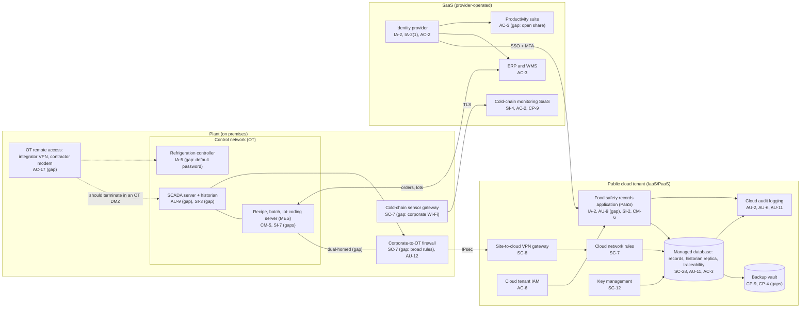

# Cloud Architecture and Control Placement: Cris Santos Company | Food and Agriculture | Small

**Organization:** Cris Santos Company, LLC (meat processing plant with a smoked seafood room) | **Tier:** Small | **Provider:** Vendor-agnostic (see section 3)
**System:** Plant Production and Cold-Chain Monitoring System (PPCM), as defined in the SSP (P02)

## 1. Diagram

The cloud tenant holds the plant's **records**, not its **controls**. Process control stays on premises; the cloud receives a copy of CCP data and hosts the application where QA staff sign HACCP, seafood HACCP, and food defense records. The diagram shows the cloud and SaaS layers and the on-premises OT components they connect to.

## 2. Layers
| Layer | Components | Key controls | Responsibility |
|---|---|---|---|
| Identity | Identity provider, cloud IAM, OT remote access | IA-2, IA-2(1), AC-2, AC-6, AC-17 | Customer (configuration); provider (identity service) |
| Network / edge | Corporate-to-OT firewall, site-to-cloud VPN, cloud network rules, sensor gateway segment | SC-7, SC-8, AU-12 | Customer; provider runs the VPN gateway service |
| Compute / application | Records application (PaaS), SCADA and historian, MES, refrigeration controller | CM-5, CM-6, SI-2, SI-3, SI-7, IA-5 | Shared for PaaS (provider runtime, customer code and settings); customer for all OT |
| Data | Managed database, backup vault, key management | SC-28, SC-12, AU-9, AU-11, CP-9, CP-4 | Shared: provider encrypts and stores; customer sets retention, isolation, and record locking |
| Logging / monitoring | Cloud audit logs, firewall logs, cold-chain alerting | AU-2, AU-6, AU-11, SI-4 | Shared: provider generates; customer retains, reviews, and routes alerts |
| SaaS applications | Cold-chain monitoring, ERP and WMS, productivity suite | AC-2, AC-3, CP-9, SI-4 | Provider (application and infrastructure); customer (users, roles, thresholds, data) |
| Physical / hypervisor | Provider data centers | PE-3 | Provider (inherited) |

**Why the records layer matters to regulators.** FSIS accepts computer records only with "appropriate controls ... to ensure the integrity of the electronic data and signatures" (9 CFR 417.5(d)); FDA's seafood HACCP rule says the same (21 CFR 123.9(f)), and food defense records must be "accurate, indelible, and legible" (21 CFR 121.305(c)). In the cloud, those duties fall on the **customer** side of every shared responsibility model: the provider keeps the database running and encrypted, but only the company can turn on audit trails, lock signed records, and give each person a named account.

## 3. Service categories and provider equivalents
The company's design is independent of the provider. This table gives each provider's name for each service category, for reading its shared responsibility documentation.

| Service category | AWS | Microsoft Azure | Google Cloud |
|---|---|---|---|
| PaaS application service | AWS Elastic Beanstalk | Azure App Service | App Engine |
| Managed relational database | Amazon RDS | Azure SQL Database | Cloud SQL |
| Backup service | AWS Backup | Azure Backup | Backup and DR Service |
| Identity and access management | AWS IAM | Azure role-based access control with Microsoft Entra ID | Cloud IAM |
| Key management | AWS KMS | Azure Key Vault | Cloud KMS |
| Audit logging | AWS CloudTrail | Azure Monitor activity log | Cloud Audit Logs |
| Site-to-site VPN | AWS Site-to-Site VPN | Azure VPN Gateway | Cloud VPN |
| Network filtering | Security groups | Network security groups | VPC firewall rules |

Shared responsibility sources: SRC-AWS-SRM, SRC-AZURE-SRM, SRC-GCP-SRM in `00_universal/sources/source-register.csv`. All three models agree on the split used here:
- **IaaS:** the provider owns facilities, hosts, and virtualization. The customer owns guest operating systems, applications, network configuration, identities, and data.
- **PaaS:** the provider also owns the runtime and platform patching. The customer owns application code, configuration, identities, and data.
- **SaaS:** the provider also owns the application. The customer keeps identities, access, data, and alert settings.

The cold-chain monitoring SaaS is not covered by the three cloud providers' models; its split comes from the vendor's SOC 2 report, reviewed in P09.

## 4. Findings from the mapping
1. **Records integrity is a customer control that is missing (AU-9).** The records application and historian let a shared administrator edit signed CCP and food defense records without a trace. Fix: audit trail, record locking after sign-off, named accounts. Tracked as P01 R-008 and POAM-011.
2. **The cloud does not protect the plant from the corporate network (SC-7).** The historian replica is well isolated in the cloud, but on premises the MES is dual-homed and the corporate-to-OT firewall allows broad rules. The weakest point of the design is on the plant floor, not in the tenant. Tracked as R-001 and POAM-001.
3. **Backups share the production account (CP-9).** A compromised cloud administrator could delete both the records and their backups. Fix: separate backup account with immutable retention. Tracked as R-007 and POAM-006.
4. **Cold-chain alerting is a shared control with a single point of failure (SI-4).** The vendor sends alerts, but the company configured one SMS recipient. Fix: escalating alerts to three roles. Tracked as R-005.
5. **Inherited controls rely on vendor SOC 2 reports.** Rows marked Provider or Shared for the cold-chain SaaS depend on the vendor's SOC 2 Type 2 report (P09). The ERP, WMS, and identity vendors' reports have not yet been reviewed (POAM-020).
6. **Every component in the diagram implements or inherits at least one AC, AU, CM, IA, SC, or SI control** (see `cloud-control-map.csv`, 34 rows).
