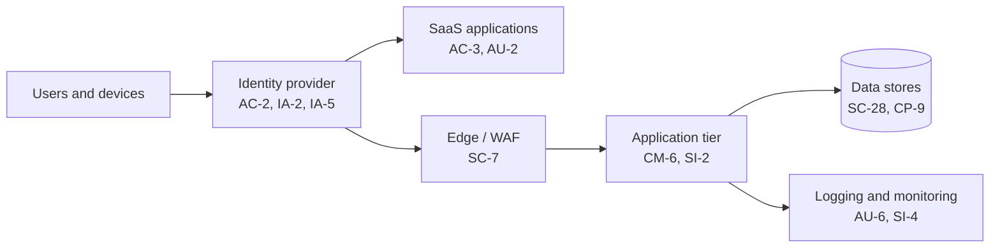

# Cloud Architecture and Control Placement: Cris Santos Company | Water and Wastewater Systems | Small

**Organization:** Cris Santos Company (Community water system (drinking water supply and treatment)) | **Tier:** Small | **Provider:** [FILL: AWS | Azure | GCP | SaaS only]

## Diagram

[FILL: Replace with the scenario's real components. Keep the control IDs on each node.]

## Layers
| Layer | Components | Key controls | Responsibility |
|---|---|---|---|
| Identity | [FILL] | AC-2, IA-2, IA-5 | Customer |
| Network / edge | [FILL] | SC-7 | Shared |
| Compute / application | [FILL] | CM-6, SI-2 | [depends on service model] |
| Data | [FILL] | SC-28, CP-9 | Customer |
| Logging / monitoring | [FILL] | AU-2, AU-6, SI-4 | Shared |
| Physical / hypervisor | Provider data centers | PE family | Provider |
