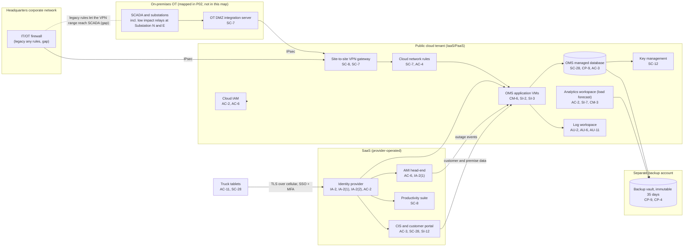

# Cloud Architecture and Control Placement: Cris Santos Company | Utilities | Small

**Organization:** Cris Santos Company, LLC (electric distribution utility) | **Tier:** Small | **Provider:** Vendor-agnostic (see section 3)
**System:** the cloud-hosted part of the Distribution Operations Platform (OMS and GIS), plus the analytics workspace and the SaaS services around it. The SCADA and substation components are mapped in the SSP (P02).

## 1. Diagram

## 2. Layers
| Layer | Components | Key controls | Responsibility |
|---|---|---|---|
| Identity | Identity provider, cloud IAM roles | AC-2, AC-6, IA-2, IA-2(1), IA-2(2) | Customer (configuration); provider (service) |
| Network | Site-to-site VPN, cloud network rules, OT DMZ integration server | SC-7, SC-8, AC-4 | Customer (rules and tunnels); provider (gateway service) |
| Compute | OMS application VMs, analytics workspace, truck tablets | CM-6, CM-3, SI-2, SI-3, AC-11 | Customer (guest OS, application, models, devices) |
| Data | OMS managed database, backup vault, key management | SC-28, CP-9, CP-4, AC-3, SC-12, SI-7 | Shared: provider encrypts and runs the database service; the customer sets access, keys, retention, and isolation |
| Logging | Log workspace | AU-2, AU-6, AU-11 | Shared: provider generates control-plane events; customer collects, retains, and reviews |
| SaaS | CIS and portal, AMI head-end, productivity suite | AC-3, AC-6, SC-28, SI-12, SC-8 | Provider (application and infrastructure); customer (users, roles, data rules) |
| Physical | Provider data centers | PE-3 | Provider (inherited) |

## 3. Service categories and provider equivalents
The company's design is independent of the provider. This table gives each provider's name for each service category, to use when reading its shared responsibility documentation.

| Service category | AWS | Microsoft Azure | Google Cloud |
|---|---|---|---|
| Virtual machines | Amazon EC2 | Azure Virtual Machines | Compute Engine |
| Managed relational database | Amazon RDS | Azure SQL Database | Cloud SQL |
| Managed analytics and notebooks | Amazon SageMaker | Azure Machine Learning | Vertex AI |
| Backup service | AWS Backup | Azure Backup | Backup and DR Service |
| Identity and access management | AWS IAM | Azure role-based access control with Microsoft Entra ID | Cloud IAM |
| Key management | AWS KMS | Azure Key Vault | Cloud KMS |
| Audit logging and log workspace | AWS CloudTrail and CloudWatch Logs | Azure Monitor and Log Analytics | Cloud Audit Logs and Cloud Logging |
| Site-to-site VPN | AWS Site-to-Site VPN | Azure VPN Gateway | Cloud VPN |
| Network filtering | Security groups | Network security groups | VPC firewall rules |

Shared responsibility sources: SRC-AWS-SRM, SRC-AZURE-SRM, SRC-GCP-SRM in `00_universal/sources/source-register.csv`. All three models agree on the split used here:
- **IaaS:** the provider owns physical facilities, hosts, and the virtualization layer. The customer owns the guest operating system, applications, network configuration, identities, and data.
- **PaaS (managed database, analytics workspace, log workspace):** the provider also runs the platform software and patches it. The customer keeps identities, access rules, data, keys it chooses to manage, and its own code and models.
- **SaaS:** the provider also owns the application. The customer keeps identities, access, data, and devices.

## 4. Findings from the mapping
1. **The cloud tenant can reach SCADA directly (SC-7, AC-4).** Two of the 14 legacy any rules on the IT/OT firewall include the cloud VPN address range. A compromised OMS VM could reach the SCADA network without passing the OT DMZ. Fix: remove those rules and make the OT DMZ integration server the only path. Only outbound SCADA status to the OMS is needed. Tracked as P01 R-002 and P07 POAM-003.
2. **Keep BES Cyber Systems and their access controls out of the cloud.** Today no low impact BES Cyber System, and no Cyber Asset that provides the CIP-003-9 Section 3.1 access controls, sits in or is managed from the cloud tenant. Any future plan to manage the Substation N or E gateways or relays from a cloud service must first get a CIP-003 review from the NERC Compliance Coordinator.
3. **The analytics workspace uses a shared key (AC-2, SI-7, CM-3).** Three users share one access key. Model versions go live without approval, and inputs are not checked for integrity. Fix: named accounts, an approval step, and input range checks (P10; P01 R-018 and R-019).
4. **Cloud backups are in good shape (CP-9, CP-4).** The backup vault is in a separate account with 35 days of immutable retention, and an OMS restore was tested on 2026-05-12 (2 h 40 min, inside the 4-hour RTO for BP-02 in P05). This is the model for the SCADA backup redesign (POAM-005).
5. **Inherited controls rely on vendor reports.** Controls marked Provider or Shared for the CIS and AMI depend on those vendors' SOC 2 reports. The AMI report is reviewed in P09. Bulk remote disconnect in the AMI and bulk export in the CIS are open to too many users; both are customer-side settings.
