# Cloud Architecture and Control Placement: Cris Santos Company | Manufacturing | Small

**Organization:** Cris Santos Company, LLC (connected medical device manufacturer) | **Tier:** Small | **Provider:** Vendor-agnostic (see section 3)
**System:** Device Cloud Service (DCS), as defined in the SSP (P02)

## 1. Diagram

```mermaid
flowchart LR
  subgraph Hospitals["Hospital customers (40, hospital-operated)"]
    PM2["PM-2 monitors<br/>IA-3 (device certificates), SI-7 (secure boot)"]
    PM1["PM-1 monitors<br/>IA-3 gap: shared hospital key"]
    EHR["EHR and clinical communication systems"]
    HIDP["Hospital identity providers"]
    CLIN["Clinician browsers"]
  end
  subgraph SaaS["SaaS (provider-operated)"]
    IDP["Workforce identity provider<br/>IA-2(1), AC-2, AC-7"]
    LOGS["Log analytics service<br/>AU-6, AU-11, SA-9 (gap: no BAA)"]
    TIX["Support ticketing (BAA)<br/>SA-9"]
  end
  subgraph Tenant["Public cloud tenant (IaaS/PaaS)"]
    EDGE["WAF and DDoS protection<br/>SC-5, SC-7"]
    ING["Device ingestion gateway<br/>SC-8, IA-3"]
    VPN["Site-to-site VPN<br/>SC-8, CA-3"]
    subgraph K8S["Container platform: CM-2, CM-6, SI-2, RA-5"]
      PROC["Ingestion and processing"]
      PORT["Clinician portal and API<br/>AC-3, IA-8, AC-12"]
      HL7["HL7 interface service"]
      UPD["Firmware update service<br/>SI-7, CM-3"]
    end
    DB[("Clinical data store<br/>AC-3, SC-28, CP-9")]
    OBJ[("Object storage: reports, firmware<br/>SC-28")]
    KMS["Key management and device CA<br/>SC-12, SC-13"]
    SEC["Secrets manager<br/>IA-5"]
    BAS["Bastion<br/>AC-17"]
    AUD["Cloud audit logging<br/>AU-9, AU-12"]
    DR[("Second-region backup copy<br/>CP-9 (gap: not immutable, untested)")]
  end
  subgraph Onprem["Company facility"]
    ENG["Support and DevOps laptops<br/>SI-3, SC-28"]
    BUILD["Build and signing server (outside boundary)<br/>SC-12 gap: key file, no HSM"]
  end
  PM2 -->|mutual TLS| ING
  PM1 -->|TLS + shared key| ING
  ING --> PROC
  CLIN --> EDGE --> PORT
  HIDP -.->|federation| PORT
  PROC --> DB
  PORT --> DB
  HL7 -->|HL7 over VPN or TLS| EHR
  VPN --- HL7
  UPD -->|signed images| PM2
  UPD --> OBJ
  BUILD -->|signed firmware upload| OBJ
  DB --> DR
  KMS --- ING
  KMS --- DB
  SEC --- K8S
  ENG -->|SSO + hardware key| IDP
  IDP --> BAS --> K8S
  K8S -->|application logs with PHI| LOGS
  AUD --> LOGS
  ENG --> TIX
```

## 2. Layers
| Layer | Components | Key controls | Responsibility |
|---|---|---|---|
| Identity | Workforce identity provider, cloud IAM, clinician federation, device certificates | AC-2, AC-5, AC-6, IA-2(1), IA-3, IA-8, AC-17 | Customer configures; providers run the services |
| Network / edge | WAF and DDoS protection, virtual network, VPN gateway, ingestion gateway | SC-5, SC-7, SC-8, AC-4, CA-3 | Shared: provider runs edge and gateways; company sets rules and interconnection terms |
| Compute / application | Managed container platform and the company's services, including the firmware update service | CM-2, CM-3, CM-6, SI-2, SI-7, RA-5 | Shared (PaaS): provider patches the control plane and nodes; company owns images, code, and configuration |
| Data | Managed database, object storage, key management, secrets manager | AC-3, SC-12, SC-13, SC-28, CP-9, CP-4, IA-5 | Shared: provider encrypts and backs up; company sets keys, access, retention, and tests restores |
| Logging / monitoring | Cloud audit logging, log analytics service | AU-6, AU-9, AU-11, AU-12, SA-9 | Shared: provider generates; company retains, reviews, and contracts |
| SaaS | Identity provider, log analytics, support ticketing | SA-9, IA-2(1) | Provider runs the application; company keeps identities, data, and BAAs |
| Physical / hypervisor | Provider data centers | PE family | Provider (inherited) |

## 3. Service categories and provider equivalents
The device cloud's design does not depend on a particular provider. This table gives each provider's name for each service category, for use when reading that provider's shared responsibility documentation.

| Service category | AWS | Microsoft Azure | Google Cloud |
|---|---|---|---|
| Managed container orchestration | Amazon EKS | Azure Kubernetes Service | Google Kubernetes Engine |
| Managed relational database | Amazon RDS | Azure Database for PostgreSQL | Cloud SQL |
| Object storage | Amazon S3 | Azure Blob Storage | Cloud Storage |
| Key management | AWS KMS | Azure Key Vault | Cloud KMS |
| Private certificate authority | AWS Private CA | Azure Key Vault certificates | Certificate Authority Service |
| Secrets manager | AWS Secrets Manager | Azure Key Vault secrets | Secret Manager |
| Web application firewall | AWS WAF | Azure Web Application Firewall | Cloud Armor |
| Site-to-site VPN | AWS Site-to-Site VPN | Azure VPN Gateway | Cloud VPN |
| Bastion | AWS Systems Manager Session Manager | Azure Bastion | Identity-Aware Proxy |
| Audit logging | AWS CloudTrail | Azure Monitor activity log | Cloud Audit Logs |

Shared responsibility sources: SRC-AWS-SRM, SRC-AZURE-SRM, and SRC-GCP-SRM in `00_universal/sources/source-register.csv`. All three models agree on the split used here:
- **IaaS:** the provider owns the facilities, hosts, and virtualization layer. The customer owns the network configuration, identities, data, and workloads.
- **PaaS:** the provider also runs the managed platform (container control plane, database engine). The customer keeps the application, its configuration, access, keys policy, and data.
- **SaaS:** the provider runs the application. The customer keeps identities, access, data, and the contract terms (here, BAAs).

**Business associate note:** the cloud provider stores PHI for the company, so it is a subcontractor business associate. A subcontractor BAA is in place. The log analytics vendor also receives PHI but has no BAA (finding 2).

## 4. Findings from the mapping
1. **The firmware signing key is the weakest link in the device update path (SC-12, SI-7).** The update service only distributes signed images, and PM-2 verifies signatures. But the private signing key is a file on an on-premises build server. Anyone who steals it can sign firmware that every PM-2 will accept. Fix: non-exportable keys in an HSM or the cloud key management service, with two-person approval for release signing. Tracked as P01 R-002 and P07 POAM-003.
2. **PHI leaves the boundary in logs (SA-9, AU-11).** Application logs carry patient names and MRNs to a log analytics SaaS with no subcontractor BAA. Fix: mask identifiers at the source, then sign a BAA or move logs to the cloud tenant's own log service. Tracked as P01 R-009.
3. **Backups share administrators with production (CP-9, AC-5).** One compromised administrator could delete the database and its second-region copy. Fix: immutable retention in a separate account with separate roles. Tracked as P01 R-017.
4. **PM-1 devices use a shared hospital key (IA-3).** The ingestion gateway cannot tell one PM-1 from another. Fix: rotate and narrow the keys now; migrate PM-1 customers before the June 2027 end of support. Tracked as P01 R-014.
5. **Inherited controls rest on the provider's SOC 2 Type 2 report.** Physical, hypervisor, and managed-service controls marked Provider depend on that report, reviewed in P09 Part B. The report's complementary user entity controls include key management and access configuration. Those are the company's responsibility, and findings 1 and 3 show gaps in them.
