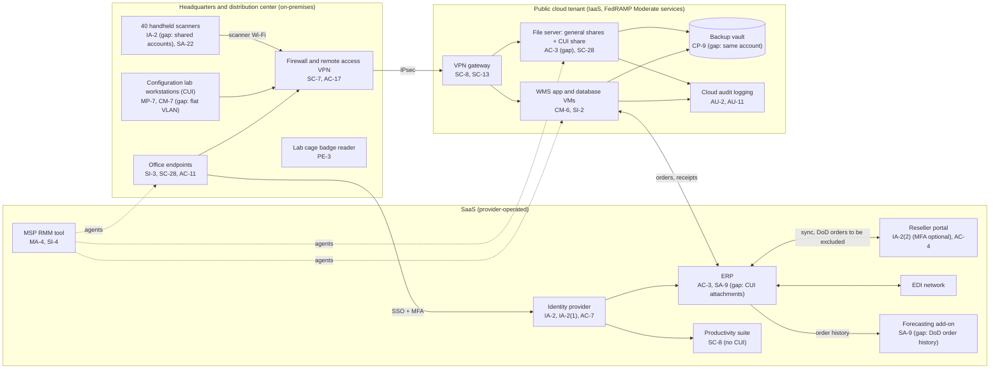

# Cloud Architecture and Control Placement: Cris Santos Company | Wholesale Trade | Small

**Organization:** Cris Santos Company, LLC (IT hardware and software wholesale distributor) | **Tier:** Small | **Provider:** Vendor-agnostic (see section 3)
**System:** Order-to-Fulfillment Platform (OFP), as defined in the SSP (P02) | **Control map:** `cloud-control-map.csv` (34 rows: 20 customer, 11 shared, 3 provider)

## 1. Diagram

## 2. Layers
| Layer | Components | Key controls | Responsibility |
|---|---|---|---|
| Identity | Identity provider, cloud IAM roles | AC-2, AC-5, AC-6, AC-7, IA-2, IA-2(1), IA-2(2) | Customer (configuration), provider (service) |
| Network / edge | Office firewall and VPN, site-to-site VPN, cloud network security rules, office and lab network | SC-7, SC-8, SC-13, AC-4, AC-17 | Customer, except the provider-run VPN gateway service |
| Compute / application | WMS servers, file server | CM-6, SI-2, SI-3, AC-3, RA-5 | Customer (guest operating system, applications, shares) |
| Data | Server storage, key service, backup vault | SC-28, SC-12, CP-9 | Shared: provider encrypts and runs the services; customer configures keys, retention, and isolation |
| Logging / monitoring | Cloud audit logs, identity provider sign-in logs, RMM tool | AU-2, AU-6, AU-11, SI-4 | Shared: provider generates; customer retains and reviews |
| SaaS applications | ERP, portal, forecasting add-on, productivity suite, RMM tool | AC-3, AC-4, SA-9, SC-8, MA-4 | Provider (application and infrastructure); customer (users, roles, data, and what data is sent) |
| Physical | Provider data centers; lab cage | PE-3 | Provider (inherited) for data centers; customer for the site |

## 3. Service categories and provider equivalents
The company's design is independent of the provider. This table gives each provider's name for each service category, to use when reading its shared responsibility documentation.

| Service category | AWS | Microsoft Azure | Google Cloud |
|---|---|---|---|
| Virtual machines | Amazon EC2 | Azure Virtual Machines | Compute Engine |
| Block and file storage | Amazon EBS; Amazon FSx | Azure Managed Disks; Azure Files | Persistent Disk; Filestore |
| Backup service | AWS Backup | Azure Backup | Backup and DR Service |
| Identity and access management | AWS IAM | Azure role-based access control with Microsoft Entra ID | Cloud IAM |
| Key management | AWS KMS | Azure Key Vault | Cloud KMS |
| Audit logging | AWS CloudTrail | Azure Monitor activity log | Cloud Audit Logs |
| Site-to-site VPN | AWS Site-to-Site VPN | Azure VPN Gateway | Cloud VPN |
| Network filtering | Security groups | Network security groups | VPC firewall rules |

Shared responsibility sources: SRC-AWS-SRM, SRC-AZURE-SRM, SRC-GCP-SRM in `00_universal/sources/source-register.csv`. All three models agree on the split used here:
- **IaaS:** the provider owns physical facilities, hosts, and the virtualization layer. The customer owns the guest operating system, applications, network configuration, identities, and data.
- **SaaS:** the provider also owns the application. The customer keeps identities, access, data, and devices.

**CUI in the cloud.** DFARS 252.204-7012(b)(2)(ii)(D) requires a cloud service provider that stores, processes, or transmits covered defense information for the company to meet security requirements equivalent to the FedRAMP Moderate baseline. The IT Manager confirmed on 2026-07-15 that the IaaS services in use are listed as FedRAMP Moderate authorized. The SSP must also reference each provider's customer responsibility matrix, because the company's own infrastructure that connects to the provider stays in the CMMC assessment scope (32 CFR 170.16(c)(2) and 170.17(c)(5)).

## 4. Findings from the mapping
1. **CUI sits in a SaaS without FedRAMP equivalency (SA-9).** 14 DoD sales orders in the ERP carry CUI attachments. The ERP vendor has a SOC 2 Type 2 report but no FedRAMP Moderate authorization or documented equivalency. Fix: purge the attachments, block attachments on DoD order types, and keep CUI only on the file server CUI share in the cloud tenant. Tracked as P03 G-133, P01 R-004, and P07 POAM-002. Due 2026-09-30.
2. **CUI share open to everyone (AC-3) and flat lab network (AC-4, SC-7).** The CUI enclave project creates a restricted CUI share for 9 named users, moves the lab bench network to its own VLAN that can reach only the CUI share, and requires MFA for CUI share access. Tracked as POAM-001, POAM-003, and POAM-004. Due 2026-12-15.
3. **Backup isolation (CP-9).** The backup vault shares the production account and administrator roles. A ransomware actor with cloud administrator rights could delete backups. Fix: a separate backup account with immutable (write-once) retention, and quarterly restore tests. Tracked as P01 R-008 and POAM-006.
4. **Log retention and review (AU-6, AU-11).** Cloud logs keep 90 days and identity logs 30 days, and nobody reviews them. DFARS 252.204-7012(e) requires keeping images and monitoring data for at least 90 days after a DIBNet report, which is not possible when logs roll over before an incident is found. Fix: a central log store with 1-year retention that server administrators cannot delete, and a weekly review.
5. **The MSP is an External Service Provider (MA-4, SI-4).** Its RMM tool (SYS-13) has agents on every Windows endpoint and server and stores Security Protection Data, so it is in the CMMC assessment scope (32 CFR 170.19(c)(2)). Fix: a written customer responsibility matrix, session approval and timeouts, and MFA confirmed for all MSP staff. Tracked as P01 R-010.
6. **DoD order history leaves the boundary (SA-9).** The forecasting add-on (SYS-12) receives full order history, including DoD orders with FCI, under vendor terms that contain no FAR 52.204-21 safeguards. Fix: filter DoD orders out of the feed by 2026-10-31 (P10, P01 R-029).
7. **Inherited controls rely on vendor evidence.** Controls marked Provider or Shared depend on the cloud provider's FedRAMP authorization and on the ERP and portal vendors' SOC 2 reports. The portal vendor's report is reviewed in P09.
