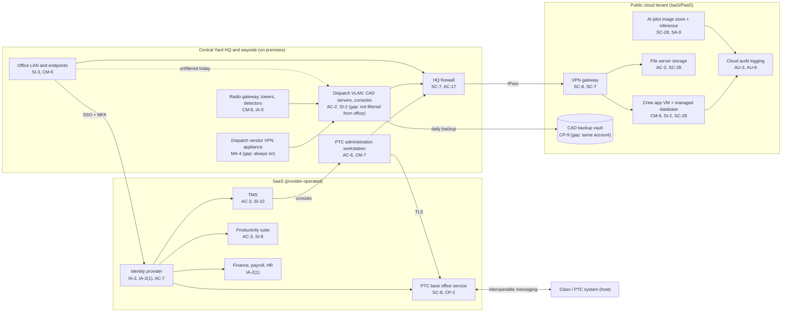

# Cloud Architecture and Control Placement: Cris Santos Company | Transportation Systems | Small

**Organization:** Cris Santos Company, LLC (Class III short line freight railroad) | **Tier:** Small | **Provider:** Vendor-agnostic (see section 3)
**Scope:** one public cloud tenant (IaaS/PaaS, SYS-09) plus the SaaS services the railroad depends on, and how they connect to the Train Dispatch and PTC Operations Platform (TDPO) defined in the SSP (P02)

## 1. Diagram

The CAD servers and the OT network stay on premises. The cloud tenant holds the crew application, the file server, the CAD backup vault, and the AI pilot. The PTC back office and the TMS are SaaS.

## 2. Layers
| Layer | Components | Key controls | Responsibility |
|---|---|---|---|
| Identity | Identity provider, cloud IAM roles, PTC portal accounts | AC-2, AC-6, IA-2, IA-2(1), AC-7 | Customer (configuration), provider (service) |
| Network / edge | HQ firewall, site-to-site VPN, cloud network rules | SC-7, SC-8, AC-17 | Customer; provider runs the VPN gateway service |
| Compute / application | Crew application VM, AI inference service | CM-6, SI-2, SI-3, SA-9 | Customer (guest OS and application); provider (PaaS runtime) |
| Data | Managed database, file storage, CAD backup vault, AI image store | SC-28, CP-9, CP-6, AC-3 | Shared: provider encrypts; customer sets access, retention, and isolation |
| Logging / monitoring | Cloud audit logs, identity sign-in logs | AU-2, AU-6, AU-11 | Shared: provider generates; customer retains and reviews |
| SaaS applications | TMS, PTC back office, productivity suite, finance and HR | AC-3, SC-8, CP-2, SI-10 | Provider (application and infrastructure); customer (users, roles, data) |
| Physical / hypervisor | Provider data centers | PE family (PE-3) | Provider (inherited) |

`cloud-control-map.csv` holds 31 control placements: 16 Customer, 12 Shared, and 3 Provider. By service model: 15 IaaS, 3 PaaS, 13 SaaS.

## 3. Service categories and provider equivalents
The railroad's design does not depend on a provider. This table gives each provider's name for each service category, to use when reading its shared responsibility documentation.

| Service category | AWS | Microsoft Azure | Google Cloud |
|---|---|---|---|
| Virtual machines | Amazon EC2 | Azure Virtual Machines | Compute Engine |
| Managed relational database | Amazon RDS | Azure SQL Database | Cloud SQL |
| Object and file storage | Amazon S3; Amazon FSx | Azure Blob Storage; Azure Files | Cloud Storage; Filestore |
| Backup service | AWS Backup | Azure Backup | Backup and DR Service |
| Identity and access management | AWS IAM | Azure role-based access control with Microsoft Entra ID | Cloud IAM |
| Audit logging | AWS CloudTrail | Azure Monitor activity log | Cloud Audit Logs |
| Site-to-site VPN | AWS Site-to-Site VPN | Azure VPN Gateway | Cloud VPN |
| Network filtering | Security groups | Network security groups | VPC firewall rules |

Shared responsibility sources: SRC-AWS-SRM, SRC-AZURE-SRM, SRC-GCP-SRM in `00_universal/sources/source-register.csv`. All three models agree on the split used here:
- **IaaS:** the provider owns facilities, hosts, and the virtualization layer. The customer owns the guest operating system, applications, network configuration, identities, and data.
- **PaaS:** the provider also runs the operating system and runtime (the managed database and the AI inference service). The customer keeps data, access, and configuration.
- **SaaS:** the provider also owns the application. The customer keeps identities, access, data, and devices.

## 4. Findings from the mapping
1. **Backups share the fate of production (CP-9, CP-6).** The CAD backup vault is in the same account, and under the same administrator roles, as the workloads. An attacker with cloud admin rights could delete it. Fix: a separate backup account with immutable retention, plus a weekly offline copy at North Yard. Tracked as P01 R-003 and P07 POAM-004.
2. **The cloud is reachable from the whole office LAN.** The VPN tunnel starts at the HQ firewall, which does not restrict which internal hosts use it. The dispatch VLAN is not filtered from the office LAN either. Fix with the restricted operations zone (P07 POAM-008).
3. **The PTC back office has no restoration commitment (CP-2).** Only an availability percentage is stated. 49 CFR 236.1033(f) expects the railroad "or its vendor or supplier" to have a prioritized service restoration and mitigation plan. Fix: obtain the vendor's plan and add restoration targets to the contract (P01 R-013; P07 POAM-005 and POAM-018).
4. **Logs exist but are not kept or read (AU-6, AU-11).** Cloud audit logs use default retention, and on-premises logs overwrite in about 14 days. Fix: a log workspace in the tenant with 1-year retention and weekly review (POAM-014).
5. **SSI in the SaaS file area (AC-3).** TSA-marked SSI is readable by all office users. That is a gap against 49 CFR 1520.9(a) (P03 G-017; P01 R-017).
6. **Inherited controls rely on vendor SOC 2 reports.** Provider rows in `cloud-control-map.csv` depend on the cloud, TMS, and PTC back office vendors' reports. The PTC back office report is reviewed in P09.
