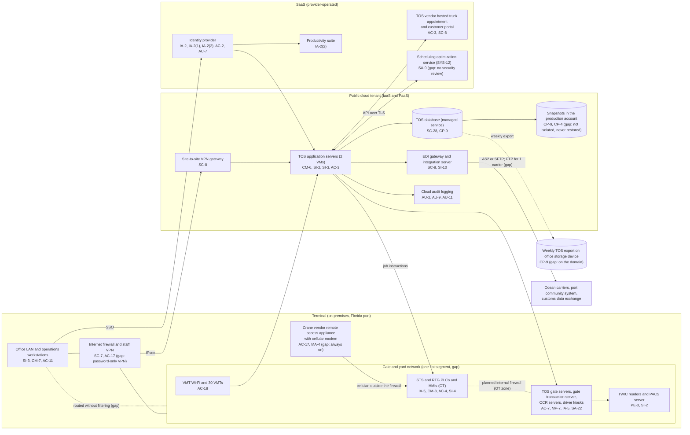

# Cloud Architecture and Control Placement: Cris Santos Company | Transportation and Warehousing | Small

**Organization:** Cris Santos Company, LLC (marine cargo terminal operator) | **Tier:** Small | **Provider:** Vendor-agnostic public cloud (IaaS and PaaS) plus SaaS (see section 3)
**System:** Terminal Operations and Gate Platform (TOGP), as defined in the SSP (P02) | **Prepared:** 2026-07-31 by the IT Manager with the MSP | **Approved:** General Manager, 2026-09-04
**Handling:** This diagram is the first version of the network map required by 33 CFR 101.650(b)(4). The full map, with OT detail, will go into the Cybersecurity Plan and is SSI (101.630(b)).

## 1. Diagram
The diagram shows the architecture as it is today. Items marked "gap" are weaknesses tracked in the P07 POA&M. The dashed line is the planned internal firewall that will create an OT zone (P01 R-002, due 2027-03-31).

## 2. Layers
| Layer | Components | Key controls | Responsibility |
|---|---|---|---|
| Identity | Identity provider, cloud IAM roles, TOS roles | AC-2, AC-6, IA-2, IA-2(1), IA-2(2), IA-5, AC-7 | Customer (users, MFA policy, roles); provider (the identity service) |
| Network / edge | Terminal firewall, staff VPN, site-to-site VPN, cloud network rules, gate and yard network, VMT Wi-Fi, crane vendor appliance | SC-7, AC-4, AC-17, AC-18, SC-8, MA-4 | Customer. The provider runs the VPN gateway service only |
| Compute / application | TOS application servers, EDI gateway and integration server (cloud VMs); gate servers, OCR servers, kiosks (on premises) | CM-6, CM-7, SI-2, SI-3, SA-22, MP-7 | Customer for guest operating systems and applications; TOS vendor supports the TOS software |
| Data | TOS database (managed service), snapshots, weekly export | SC-28, CP-9, CP-4 | Shared: the provider runs the database engine, encryption and snapshot service; the company chooses keys, retention, isolation and restore testing |
| Logging / monitoring | Cloud audit logs, identity provider sign-in logs, TOS and gate server logs, firewall logs | AU-2, AU-9, AU-11, SI-4 | Shared: the provider generates cloud logs; the company retains, protects and reviews all logs |
| SaaS applications | Identity provider, TOS vendor hosted portal, scheduling optimization service, productivity suite | AC-3, SC-8, SA-9 | Provider (application and infrastructure); customer (users, roles, data and the connection to the TOS) |
| OT | STS and RTG PLCs, HMIs, VMTs | IA-5, CM-8, AC-4, SI-4 | Customer (owner); the crane vendor supports controllers under a service contract |
| Physical / hypervisor | Provider data centers | PE-3 and the PE family | Provider (inherited; evidence is the provider's SOC 2 report) |

The control map lists 43 component and control pairs (`cloud-control-map.csv`): 32 Customer, 8 Shared and 3 Provider. By service model, 16 are on premises, 14 IaaS, 4 PaaS and 9 SaaS. Most responsibilities stay with the company because most of the TOGP is company-managed: IaaS virtual machines, on-premises gate systems and OT.

## 3. Service categories and provider equivalents
The company's design does not depend on one provider. This table gives each provider's name for each service category, to use when reading its shared responsibility documentation.

| Service category | AWS | Microsoft Azure | Google Cloud |
|---|---|---|---|
| Virtual machines | Amazon EC2 | Azure Virtual Machines | Compute Engine |
| Managed relational database | Amazon RDS | Azure SQL Database | Cloud SQL |
| Database snapshots and backup | Amazon RDS snapshots; AWS Backup | Azure SQL backups; Azure Backup | Cloud SQL backups; Backup and DR Service |
| Identity and access management | AWS IAM | Azure role-based access control with Microsoft Entra ID | Cloud IAM |
| Key management | AWS KMS | Azure Key Vault | Cloud KMS |
| Audit logging | AWS CloudTrail | Azure Monitor activity log | Cloud Audit Logs |
| Site-to-site VPN | AWS Site-to-Site VPN | Azure VPN Gateway | Cloud VPN |
| Network filtering | Security groups | Network security groups | VPC firewall rules |

Shared responsibility sources: SRC-AWS-SRM, SRC-AZURE-SRM and SRC-GCP-SRM in `00_universal/sources/source-register.csv`. All three models agree on the split used here:
- **IaaS:** the provider owns physical facilities, hosts and the virtualization layer. The customer owns the guest operating system, applications, network configuration, identities and data.
- **PaaS (managed database):** the provider also patches and operates the database engine and runs the snapshot service. The customer still owns access, encryption key choices, backup retention and isolation, and restore testing.
- **SaaS:** the provider also owns the application. The customer keeps identities, access, data, devices, and any integration it builds.

**The Coast Guard rule does not move with the provider.** Subpart F makes the owner or operator responsible for compliance (33 CFR 101.620(a)), and critical IT or OT systems include systems whose operation or maintenance is delegated to another party (101.615). So the company must show, for example, that cloud and SaaS logs are protected (101.650(c)(1)) and that backups are protected and tested (101.650(g)(4)), even where a provider runs the service.

## 4. Findings from the mapping
1. **Backup isolation (CP-9, CP-4).** TOS database snapshots share the production account and administrator roles. The weekly export sits on a domain-joined device on the office LAN. A ransomware actor with administrator rights could delete both. Nothing has ever been restored. Fix: copy snapshots to a separate backup account with immutable retention in a second region; move the weekly export off the domain; back up gate server images and PLC programs; restore test every quarter. Tracked as P01 R-004, P07 POAM-004 and POAM-005.
2. **No enforced boundary between IT and OT (SC-7, AC-4, SI-4).** Office-to-yard routing is not filtered. The gate servers, OCR, TWIC readers, VMT Wi-Fi and crane controllers share one segment. The crane vendor's appliance reaches the controllers over its own cellular link, outside the firewall. Fix: an internal firewall with an OT zone that allows only the TOS equipment interface, VMT and PACS flows, with every IT-OT connection logged (101.650(h)); remove the cellular modem and move vendor access to a session-based service with MFA and recording (101.650(e)(3)(v), (f)(3)). Tracked as P01 R-002 and R-003, P07 POAM-002, POAM-003, POAM-006 to POAM-008.
3. **Log retention and protection (AU-9, AU-11).** Cloud audit logs are protected by the provider but kept for default periods only. TOS, gate server and firewall logs are local, kept 7 to 30 days, and can be deleted by local administrators. Fix: central log collection with 1-year retention and access limited to privileged users (101.650(c)(1)). Tracked as P01 R-021 and P07 POAM-023.
4. **TOS vendor standing access (AC-17, SA-9).** The TOS vendor's remote support account sits permanently in the TOS administrator group and its sessions are not reviewed. Fix: enable the account per support ticket and review its activity (101.650(f)(3)). Tracked as P01 R-018 and P07 POAM-024.
5. **One carrier still uses plain FTP (SC-8).** Bay plans and container status for one service travel unencrypted. Fix: move the carrier to SFTP or AS2 by 2026-11-30. Tracked as P01 R-011.
6. **Inherited controls rely on SOC 2 reports.** Controls marked Provider or Shared depend on the cloud, identity and TOS vendors' SOC 2 reports. The TOS vendor's report is reviewed in P09 Part B; the cloud and identity provider reports are to be reviewed by 2026-12-31. The scheduling optimization vendor has provided no assurance report yet (P10).
