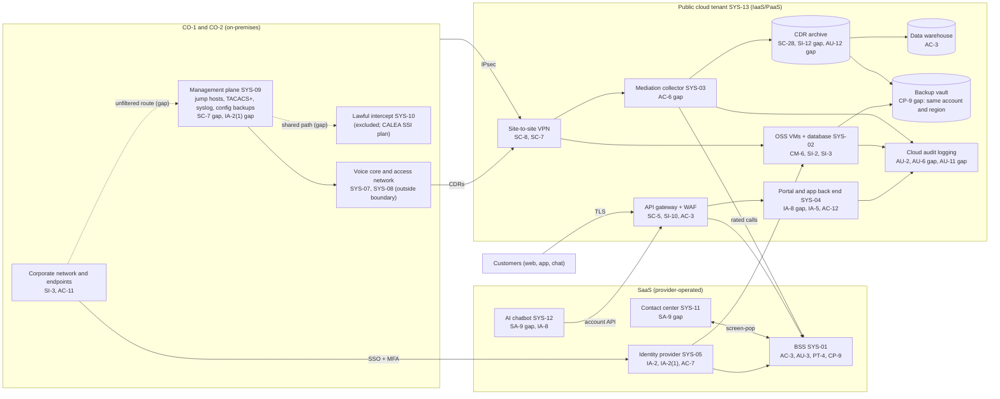

# Cloud Architecture and Control Placement: Cris Santos Company | Communications | Small

**Organization:** Cris Santos Company, LLC (regional broadband and wired telecommunications carrier) | **Tier:** Small | **Provider:** Vendor-agnostic (see section 3)
**System:** Network Operations and Customer Billing Platform (OSS/BSS), as defined in the SSP (P02) | **Prepared:** 2026-08-21 by the IT Manager | **Approved:** COO, 2026-09-04

## 1. Diagram

## 2. Layers
| Layer | Components | Key controls | Responsibility |
|---|---|---|---|
| Identity | Identity provider, cloud IAM roles, TACACS+ | AC-2, AC-6, IA-2, IA-2(1), AC-7 | Customer (configuration, accounts, roles); provider (identity service) |
| Network / edge | Site-to-site VPN, virtual network rules, API gateway and web application firewall, management plane boundary | SC-7, AC-4, SC-5, SC-8 | Customer (rules and routes); provider (gateway and edge services) |
| Compute / application | OSS VMs, mediation collector VM, portal PaaS web app | CM-6, SI-2, SI-3, RA-5, IA-8 | Customer (guest OS, code, customer authentication); provider (PaaS runtime) |
| Data | CDR archive, OSS database, data warehouse, backup vault, key service | SC-28, SC-12, SI-12, CP-9, CP-4 | Shared: provider encrypts and runs the services; customer configures keys, retention, isolation, and access |
| Logging / monitoring | Cloud audit logs, identity provider logs, BSS audit trail, syslog | AU-2, AU-3, AU-6, AU-11, AU-12 | Shared: provider generates; customer defines events, retains, and reviews |
| SaaS applications | BSS, contact center, chatbot, productivity suite | AC-3, AU-3, CP-9, PT-4, SA-9 | Provider (application and infrastructure); customer (users, roles, CPNI flags, vendor oversight) |
| Physical / hypervisor | Provider data centers | PE family | Provider (inherited, per SOC 2 reports) |

## 3. Service categories and provider equivalents
The design is independent of the provider. This table gives each provider's name for each service category, to use when reading its shared responsibility documentation.

| Service category | AWS | Microsoft Azure | Google Cloud |
|---|---|---|---|
| Virtual machines | Amazon EC2 | Azure Virtual Machines | Compute Engine |
| Managed web app platform | AWS Elastic Beanstalk | Azure App Service | App Engine |
| API gateway | Amazon API Gateway | Azure API Management | Apigee API Management |
| Web application firewall | AWS WAF | Azure Web Application Firewall | Google Cloud Armor |
| Object storage | Amazon S3 | Azure Blob Storage | Cloud Storage |
| Managed relational database | Amazon RDS | Azure SQL Database | Cloud SQL |
| Backup service | AWS Backup | Azure Backup | Backup and DR Service |
| Identity and access management | AWS IAM | Azure role-based access control with Microsoft Entra ID | Cloud IAM |
| Key management | AWS KMS | Azure Key Vault | Cloud KMS |
| Audit logging | AWS CloudTrail | Azure Monitor activity log | Cloud Audit Logs |
| Site-to-site VPN | AWS Site-to-Site VPN | Azure VPN Gateway | Cloud VPN |
| Network filtering | Security groups | Network security groups | VPC firewall rules |

Shared responsibility sources: SRC-AWS-SRM, SRC-AZURE-SRM, SRC-GCP-SRM in `00_universal/sources/source-register.csv`. All three models agree on the split used here:
- **IaaS:** the provider owns physical facilities, hosts, and the virtualization layer. The customer owns the guest operating system, applications, network configuration, identities, and data.
- **PaaS:** the provider also owns the runtime and its patching. The customer owns application code, configuration, identities, and data.
- **SaaS:** the provider also owns the application. The customer keeps identities, access, data, and devices, and for the BSS, the CPNI approval flags and authentication settings that the CPNI rules place on the carrier.

**The carrier keeps the CPNI duty.** Using a vendor does not move the 47 CFR 64.2010 obligations. The BSS vendor, the chatbot vendor, and the contact center vendor operate controls, but the company must configure them, oversee them, and answer for them.

## 4. Control map summary
`cloud-control-map.csv` has **43 rows** across **18 components**: 31 Customer, 9 Shared, and 3 Provider responsibilities. Every component in the diagram inside the boundary has at least one row. The on-premises management plane is included because the cloud tenant's VPN and the mediation feed depend on it.

## 5. Findings from the mapping
1. **Backup isolation (CP-9, CP-4).** The backup vault shares the production account, region, and administrator roles, and no restore has been tested. A ransomware actor with cloud administrator rights could delete the backups. Fix: separate backup account with immutable retention and a second-region copy; quarterly restore tests. Tracked as P01 R-008 and P07 POAM-008.
2. **Over-privileged mediation service account (AC-6).** The account that pulls CDRs from CO-1 can also write and delete across the whole archive. In the P08 scenario this is how the intruder reads 36 months of call detail. Fix: read-only pull role, separate write role, object-level read logging. Tracked as P01 R-002 and POAM-007.
3. **CDR archive retention and logging (SI-12, AU-12).** 36 months are online and object reads are not logged, so the company could not tell which records were taken. Fix: lifecycle rule to move older records offline and enable read logging. Tracked as P01 R-029.
4. **Chatbot API scope (AC-3, SI-10).** The chatbot's API client can call every account endpoint. Fix: a dedicated client limited to read-only billing and outage endpoints, with an allow-list of actions (P10).
5. **Log retention and review (AU-6, AU-11).** Cloud and identity logs use default retention and nobody reviews them. Fix: 1-year log workspace fed to the managed detection service (POAM-005).
6. **VPN route scope (SC-7).** The tunnels accept the whole corporate range. Fix: restrict to the mediation collector and OSS subnets as part of the segmentation project.
7. **Inherited controls rely on vendor SOC 2 reports.** Statements marked Provider in the map, and "Common/Inherited" in P02, depend on the BSS, identity, and cloud providers' reports. The BSS report is reviewed in P09 Part B. The contact center and chatbot vendors have not supplied reports (P01 R-022).
