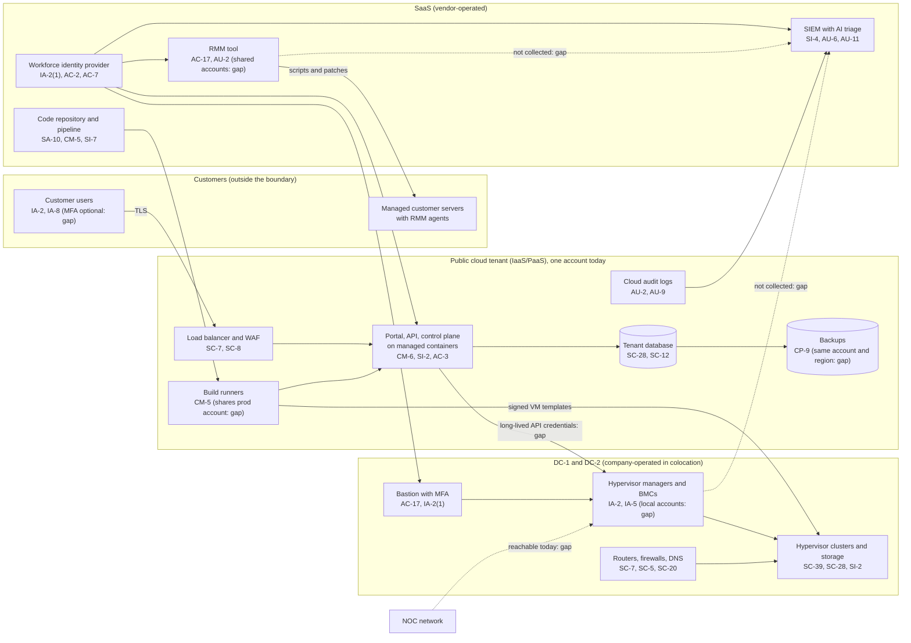

# Cloud Architecture and Control Placement: Cris Santos Company | Information Technology | Small

**Organization:** Cris Santos Company, LLC (cloud hosting and managed infrastructure provider) | **Tier:** Small | **Provider:** Vendor-agnostic public cloud tenant plus SaaS (see section 3)
**System:** Hosting Control Plane and Customer Portal (HCP), as defined in the SSP (P02) | **Prepared:** 2026-07-31 by the Engineering Manager (Control Plane) and the IT Manager | **Approved:** COO, 2026-09-25

## 1. Diagram

Dotted lines are paths that exist today but should not (NOC to management network) or data flows that are missing (management-plane and RMM logs to the SIEM).

## 2. Layers
| Layer | Components | Key controls | Responsibility |
|---|---|---|---|
| Identity | Workforce identity provider, cloud IAM, secrets manager, hypervisor and BMC local accounts, RMM technician accounts | AC-2, AC-5, AC-6, IA-2(1), IA-5 | Company, except the identity service itself (vendor) |
| Network / edge | Cloud network rules, load balancer and WAF, management network and bastion, edge routers, DDoS scrubbing, DNS | SC-5, SC-7, SC-8, SC-20 | Shared: cloud provider and scrubbing service run the services; company configures them |
| Compute / application | Managed containers for SYS-01 and SYS-02, build runners, the company's own hypervisor clusters | CM-5, CM-6, SI-2, SI-7, SC-39 | Shared for the managed container platform; company for build runners and hypervisors |
| Data | Tenant database, key management, backups, private cloud storage | SC-12, SC-13, SC-28, CP-6, CP-9 | Shared: provider encrypts and stores; company chooses keys, retention, isolation, and restore testing |
| Logging / monitoring | Cloud audit logs, identity logs, SIEM with AI triage, RMM audit logs | AU-2, AU-6, AU-9, AU-11, SI-4 | Shared: vendors generate and store; company collects, retains, and reviews |
| SaaS | Identity provider, code hosting, RMM, SIEM | AC-17, SA-10, SR-6 | Vendor runs the application; company owns accounts, settings, and vendor oversight |
| Physical | Colocation facilities DC-1 and DC-2 | PE-3, PE-11, PE-14 | Colocation providers (inherited), except cage locks and the company's access list |

`cloud-control-map.csv` has 34 control placements: 15 Customer (company), 16 Shared, 3 Provider.

## 3. Service categories and provider equivalents
The design is independent of the provider. This table gives each major provider's name for each service category, for reading its shared responsibility documentation.

| Service category | AWS | Microsoft Azure | Google Cloud |
|---|---|---|---|
| Managed containers | Amazon EKS or ECS | Azure Kubernetes Service | Google Kubernetes Engine |
| Managed relational database | Amazon RDS | Azure Database for PostgreSQL or MySQL | Cloud SQL |
| Object storage with object lock | Amazon S3 (Object Lock) | Azure Blob Storage (immutable storage) | Cloud Storage (bucket lock) |
| Key management and cloud HSM | AWS KMS; AWS CloudHSM | Azure Key Vault; Azure Managed HSM | Cloud KMS; Cloud HSM |
| Secrets manager | AWS Secrets Manager | Azure Key Vault secrets | Secret Manager |
| Audit logging | AWS CloudTrail | Azure Monitor activity log | Cloud Audit Logs |
| Load balancer and WAF | Elastic Load Balancing; AWS WAF | Application Gateway with WAF | Cloud Load Balancing; Cloud Armor |
| Separate accounts | AWS Organizations accounts | Azure subscriptions | Google Cloud projects |

Shared responsibility sources: SRC-AWS-SRM, SRC-AZURE-SRM, SRC-GCP-SRM in `00_universal/sources/source-register.csv`. All three agree on the split used here: the provider owns facilities, hardware, and the virtualization layer; for managed (PaaS) services it also patches the platform; the customer owns identities, configuration, network rules, keys it manages, and data.

## 4. Findings from the mapping
1. **One cloud account holds everything (AC-6, CP-9, CM-5).** Production, non-production, build runners, and backups share one account and region. A stolen administrator or build credential reaches all of them. Fix: separate production, build, and backup accounts, with object lock and a second region for backups. Tracked as P01 R-002, R-004, R-011 and POAM-005, POAM-007, POAM-017.
2. **The control plane is a master key (IA-5, AC-6).** SYS-02 holds long-lived credentials to every hypervisor manager. Fix: short-lived, scoped credentials issued per job, and alerts on bulk snapshot or delete actions (R-002).
3. **Management-plane visibility is missing (AU-2, SI-4).** The SIEM sees the cloud tenant and identity provider but not the hypervisors, BMCs, network devices, or RMM tool, which are the paths in the top risks. Fix: onboard those sources with 1-year retention (R-015; POAM-010, POAM-012).
4. **Vendor-operated tools carry customer-wide access (AC-17, SR-6).** The RMM vendor's service can run scripts on 1,900 customer servers, but its security has never been reviewed and the contract has no incident notice terms (R-025; POAM-020).
5. **Validated cryptography is undocumented (SC-13, SC-28).** The key management service and self-encrypting drives protect data, but nobody has recorded which cryptographic modules are used or whether they are FIPS 140 validated. FedRAMP requires that documentation for services protecting federal customer data (CMU-CSO-CMD) and says Class C providers should use validated modules (CMU-CSO-UVM). Tracked as R-031 and POAM-021.

## 5. The company's own shared responsibility model
The company is a customer of the public cloud provider and SaaS vendors, and also a **provider** of IaaS to its customers. The MSA's shared responsibility schedule for the managed private cloud:

| Area | Company | Customer |
|---|---|---|
| Facilities, hardware, hypervisors, storage, tenant network isolation | Yes | No |
| Guest operating system, applications, and data in the VM | No, unless the customer buys managed services | Yes |
| Patching of guest operating systems | Only for managed services customers (through the RMM tool) | Everyone else |
| Backups of VM data | Only for the paid replication tier (about 30% of VMs) | Everyone else (P05) |
| Portal accounts and MFA for customer users | Provides MFA; not yet required (gap) | Enrolls users and enables MFA |
| Encryption of VM volumes | Self-encrypting drives only; volume encryption not default (gap) | May encrypt inside the guest |

The managed services line changes the model. The RMM tool gives the company administrative reach into customer servers, so a compromise of that tool is the company's incident even though the servers belong to customers (P08).
