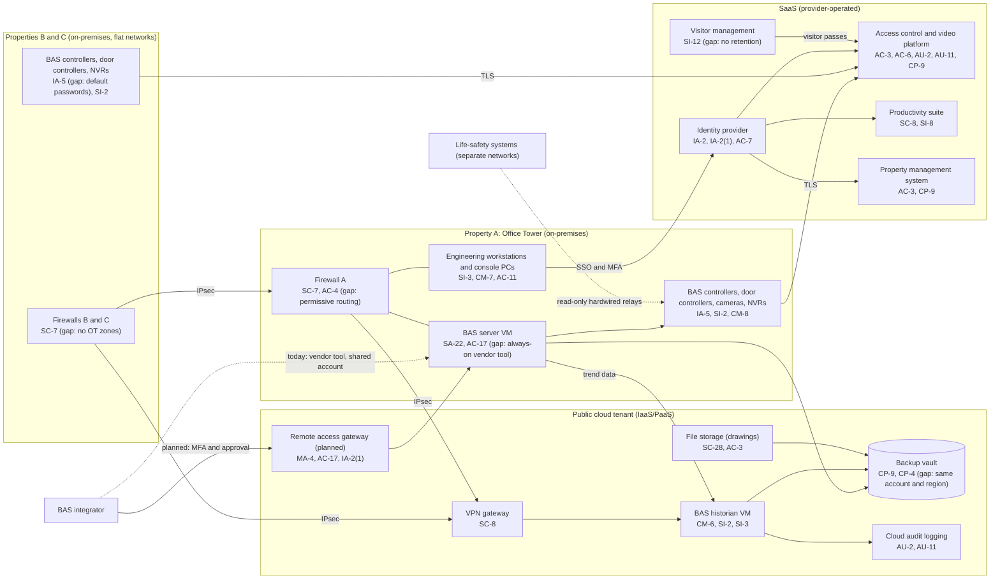

# Cloud Architecture and Control Placement: Cris Santos Company | Commercial Facilities | Small

**Organization:** Cris Santos Company, LLC (commercial office and retail property owner-operator) | **Tier:** Small | **Provider:** Vendor-agnostic (see section 3)
**System:** Building Automation and Access Control System (BAACS), as defined in the SSP (P02), plus the corporate SaaS services it depends on

## 1. Diagram
The diagram shows today's design. Items marked "planned" are POA&M fixes (P07).

## 2. Layers
| Layer | Components | Key controls | Responsibility |
|---|---|---|---|
| Identity | Identity provider, cloud IAM roles, platform portal roles, BAS local accounts | AC-2, AC-6, IA-2, IA-2(1), IA-5, AC-7 | Customer (configuration and accounts); provider (identity service) |
| Network / edge | Property firewalls, OT segments, site-to-site VPN, cloud network rules, planned remote access gateway | SC-7, AC-4, SC-8, AC-17, MA-4 | Customer (the MSP administers the firewalls) |
| Compute / application | BAS server (on-premises), historian VM (cloud), access control and video platform (SaaS) | CM-6, SI-2, SI-3, SA-22, CM-3 | Customer for the BAS server and historian guest OS; provider for the SaaS platform |
| OT devices | Field controllers, door controllers, readers, cameras, NVRs | IA-5, SI-2, CM-8, SC-28 | Customer (integrators service the devices under contract) |
| Data | File storage, backup vault, NVR disks, platform credential database | SC-28, CP-9, CP-4, SI-12 | Shared: providers encrypt; the company configures isolation, retention, and restore testing |
| Logging / monitoring | Cloud audit logs, identity provider sign-in logs, platform event logs, firewall logs | AU-2, AU-6, AU-11 | Shared: providers generate; the company retains and reviews |
| Physical / hypervisor | Provider data centers; the Property A server room | PE-3 | Provider (inherited) for cloud; customer for the server room |

## 3. Service categories and provider equivalents
The company's design is independent of the cloud provider. This table gives each major provider's name for each service category, for use when reading its shared responsibility documentation.

| Service category | AWS | Microsoft Azure | Google Cloud |
|---|---|---|---|
| Virtual machines | Amazon EC2 | Azure Virtual Machines | Compute Engine |
| Object storage | Amazon S3 | Azure Blob Storage | Cloud Storage |
| Backup service | AWS Backup | Azure Backup | Backup and DR Service |
| Identity and access management | AWS IAM | Azure role-based access control with Microsoft Entra ID | Cloud IAM |
| Audit logging | AWS CloudTrail | Azure Monitor activity log | Cloud Audit Logs |
| Site-to-site VPN | AWS Site-to-Site VPN | Azure VPN Gateway | Cloud VPN |
| Network filtering | Security groups | Network security groups | VPC firewall rules |

Shared responsibility sources: SRC-AWS-SRM, SRC-AZURE-SRM, SRC-GCP-SRM in `00_universal/sources/source-register.csv`. All three models agree on the split used here:
- **IaaS:** the provider owns physical facilities, hosts, and the virtualization layer. The customer owns the guest operating system, applications, network configuration, identities, and data.
- **SaaS:** the provider also owns the application. The customer keeps identities, roles, data, retention settings, and the devices that connect to it.

**The access control and video platform is a special case.** It is SaaS in the cloud but it runs the company's on-premises door controllers and NVRs. The vendor secures the cloud service (its SOC 2 report, reviewed in P09). The company secures everything on site: device passwords, firmware, network placement, and the physical devices. This split is written into `cloud-control-map.csv` as separate rows for the platform and the devices.

## 4. Findings from the mapping
`cloud-control-map.csv` has 40 rows across 19 components: 23 Customer, 11 Shared, and 6 Provider responsibilities.

1. **Backup isolation (CP-9, CP-4).** The backup vault shares the production account, region, and administrator roles, and no restore has been tested. An attacker with cloud administrator rights could delete the BAS server image. Fix: separate backup account, immutable retention, a second region, and a quarterly restore test. Tracked as P01 R-002 and POAM-004 and POAM-005.
2. **Remote access belongs in a controlled gateway (AC-17, MA-4).** The integrator's always-on tool on the BAS server bypasses the identity provider. The planned remote access gateway in the cloud tenant puts integrator sessions behind MFA, per-session approval, and recording (P01 R-001, POAM-001 and POAM-002).
3. **The cloud platform does not protect the on-site devices.** The vendor's controls stop at its cloud service. Default passwords on 2 NVRs and 12 field controllers, unencrypted NVR disks, and firmware patched only on integrator visits are all company responsibilities (POAM-009, POAM-016).
4. **Vendor-enabled features need company approval (CM-3).** The platform vendor turned on tailgating detection as a pilot without the company's approval. New analytics or biometric features now require COO approval (P10, P01 R-025).
5. **Inherited controls rely on vendor SOC 2 reports.** Rows marked "Provider" depend on the access control platform, identity provider, and cloud provider reports. The access control platform report is reviewed in P09.
