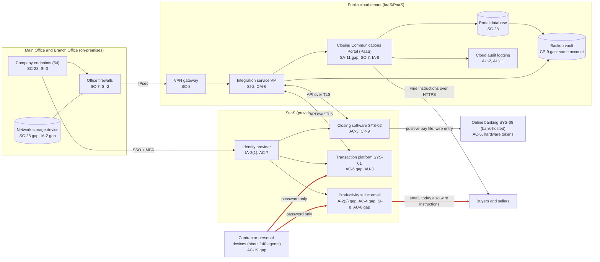

# Cloud Architecture and Control Placement: Cris Santos Company | Real Estate | Small

**Organization:** Cris Santos Company, LLC (residential real estate brokerage with an in-house Closing Services division) | **Tier:** Small | **Provider:** Vendor-agnostic (see section 3)
**System:** Transaction Management and Closing Communications System (TMCC), as defined in the SSP (P02)
**Prepared:** 2026-08-31 by the IT Manager | **Approved:** COO, 2026-09-21

## 1. Diagram
The highlighted (thick red) links are the path a business email compromise (BEC) attacker uses: sign in to a contractor mailbox with a stolen password, then send or change wire instructions by email. Most of the controls on that path are the company's, not the providers'.

## 2. Layers
| Layer | Components | Key controls | Responsibility |
|---|---|---|---|
| Identity | Identity provider, productivity suite directory (contractors), cloud IAM | IA-2(1), IA-2(2), AC-2, AC-6, AC-7 | Customer (configuration and who gets MFA), provider (service) |
| Email | Productivity suite | CM-6, AC-4, SI-8, AU-6, SC-8, CP-9 | Shared: the provider filters and logs; the company decides authentication, forwarding, retention, and backup |
| Network / edge | Office firewalls, site-to-site VPN, cloud network rules, portal HTTPS endpoint | SC-7, SC-8 | Customer |
| Compute / application | Portal (PaaS), integration service VM | SA-11, CM-3, CM-6, SI-2 | PaaS: provider patches the runtime, company owns the code. IaaS: company owns the guest OS and application |
| Data | Portal database, backup vault, storage device, endpoints | SC-28, CP-9, CP-4 | Shared: provider encrypts at rest; company configures keys, retention, and isolation |
| Logging / monitoring | Cloud audit logs, suite and identity sign-in logs, SaaS audit trails | AU-2, AU-3, AU-6, AU-11 | Shared: provider generates; company retains and reviews |
| SaaS applications | Transaction platform, closing software | AC-3, AC-6, AU-3, CP-9 | Provider (application and infrastructure); customer (users, roles, data) |
| Money movement | Online banking (outside the boundary) | AC-5 | Shared: the bank enforces the approval rules and tokens the company configures |
| Physical / hypervisor | Provider data centers | PE-3 | Provider (inherited) |

## 3. Service categories and provider equivalents
The company's design is independent of the provider. This table gives each provider's name for each service category, to use when reading its shared responsibility documentation.

| Service category | AWS | Microsoft Azure | Google Cloud |
|---|---|---|---|
| Managed web application platform (portal) | AWS Elastic Beanstalk or AWS App Runner | Azure App Service | App Engine or Cloud Run |
| Managed relational database | Amazon RDS | Azure SQL Database | Cloud SQL |
| Virtual machines | Amazon EC2 | Azure Virtual Machines | Compute Engine |
| Backup service | AWS Backup | Azure Backup | Backup and DR Service |
| Identity and access management | AWS IAM | Azure role-based access control with Microsoft Entra ID | Cloud IAM |
| Key management | AWS KMS | Azure Key Vault | Cloud KMS |
| Web application firewall | AWS WAF | Azure Web Application Firewall | Cloud Armor |
| Audit logging | AWS CloudTrail | Azure Monitor activity log | Cloud Audit Logs |
| Site-to-site VPN | AWS Site-to-Site VPN | Azure VPN Gateway | Cloud VPN |
| Network filtering | Security groups | Network security groups | VPC firewall rules |

Shared responsibility sources: SRC-AWS-SRM, SRC-AZURE-SRM, SRC-GCP-SRM in `00_universal/sources/source-register.csv`. All three models agree on the split used here:
- **IaaS:** the provider owns physical facilities, hosts, and the virtualization layer. The customer owns the guest operating system, applications, network configuration, identities, and data.
- **PaaS:** the provider also owns the operating system and runtime. The customer owns the application code, its configuration, identities, and data.
- **SaaS:** the provider also owns the application. The customer keeps identities, access settings, data, and devices.

The mapping has 42 control placements (`cloud-control-map.csv`): 27 customer, 10 shared, and 5 provider.

## 4. Findings from the mapping
1. **The BEC path runs through customer-owned settings.** The providers supply MFA, forwarding controls, impersonation filters, and audit logs. The company has not turned them on for contractor accounts (IA-2(2), CM-6, AC-4, AU-6). No provider control closes this gap. Tracked as POAM-001, POAM-006, POAM-007, and POAM-017.
2. **Backup isolation (CP-9).** The backup vault shares the production account and administrators, and email and transaction data have no independent copy. A ransomware actor with cloud administrator rights, or an attacker with a compromised mailbox administrator, could delete both. Fix: a separate backup account with immutable retention, plus third-party SaaS backup (P01 R-006, POAM-004). The provider's own availability measures do not protect against deletion by the customer's own compromised administrator.
3. **The portal is company code on a provider platform (SA-11, SC-7, IA-8).** PaaS moves operating system patching to the provider, but the application, its sign-in design, and its exposure are the company's. The portal has never been tested, has no web application firewall, and sends sign-in codes to the same mailbox a BEC attacker may control. Fix: penetration test by 2026-11-15, web application firewall, stronger client sign-in (POAM-023).
4. **Secrets on the integration VM (CM-6).** The API keys that can read and change transaction and closing data sit in a configuration file on the VM. Move them to the key management service and rotate them after the move.
5. **Inherited controls rely on vendor reports.** Controls marked "Provider" or "Common/Inherited" depend on the vendors' SOC 2 reports. The transaction platform report was reviewed in P09. The closing software vendor's recovery commitments are not documented (POAM-013).
6. **PCI DSS scope stays outside.** Rent card payments run on the property management platform's hosted payment page. No card data enters this architecture. Keep it that way; any change that would bring card data into the tenant needs a PCI scoping review first.
