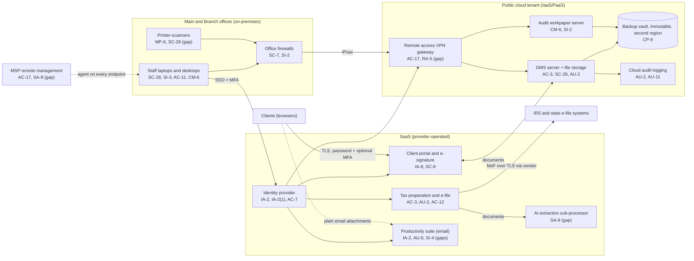

# Cloud Architecture and Control Placement: Cris Santos Company | Professional, Scientific, and Technical Services | Small

**Organization:** Cris Santos Company, LLC (CPA and tax preparation firm) | **Tier:** Small | **Provider:** Vendor-agnostic (see section 3)
**System:** Tax Preparation and Client Portal Platform (TPCP), as defined in the SSP (P02)

## 1. Diagram

## 2. Layers
| Layer | Components | Key controls | Responsibility |
|---|---|---|---|
| Identity | Identity provider, cloud IAM roles, portal client accounts | AC-2, IA-2, IA-2(1), IA-5, IA-8, AC-7 | Customer (configuration and accounts); provider (service) |
| Network / edge | Office firewalls, site-to-site VPN, remote access VPN gateway, cloud network rules | SC-7, SC-8, AC-17, RA-5 | Customer; provider runs the gateway service |
| Compute / application | DMS server VM, audit workpaper server VM | CM-6, SI-2, SI-3 | Customer (guest OS and application) |
| Data | Cloud file storage, VM disks, backup vault | SC-28, CP-9, SC-12 | Shared: provider encrypts; customer configures access, retention, and isolation |
| Logging / monitoring | Cloud audit logs, identity sign-in logs, mailbox audit, tax software activity | AU-2, AU-6, AU-11, SI-4 | Shared: provider generates; customer retains, reviews, and alerts |
| SaaS applications | Tax software, client portal, productivity suite, practice management | AC-3, AC-12, SC-8, SI-7 | Provider (application and infrastructure); customer (users, roles, data, settings such as MFA and forwarding) |
| Physical / hypervisor | Provider data centers | PE family | Provider (inherited) |

## 3. Service categories and provider equivalents
The firm's design does not depend on a particular provider. This table gives each provider's name for each service category, for reading its shared responsibility documentation.

| Service category | AWS | Microsoft Azure | Google Cloud |
|---|---|---|---|
| Virtual machines | Amazon EC2 | Azure Virtual Machines | Compute Engine |
| Managed file storage | Amazon FSx | Azure Files | Filestore |
| Backup service | AWS Backup | Azure Backup | Backup and DR Service |
| Identity and access management | AWS IAM | Azure role-based access control with Microsoft Entra ID | Cloud IAM |
| Key management | AWS KMS | Azure Key Vault | Cloud KMS |
| Audit logging | AWS CloudTrail | Azure Monitor activity log | Cloud Audit Logs |
| VPN (site-to-site and client) | AWS Site-to-Site VPN and AWS Client VPN | Azure VPN Gateway | Cloud VPN |
| Network filtering | Security groups | Network security groups | VPC firewall rules |

Shared responsibility sources: SRC-AWS-SRM, SRC-AZURE-SRM, and SRC-GCP-SRM in `00_universal/sources/source-register.csv`. All three models agree on the split used here:
- **IaaS:** the provider owns physical facilities, hosts, and the virtualization layer. The customer owns the guest operating system, applications, network configuration, identities, and data.
- **SaaS:** the provider also owns the application. The customer keeps identities, access, data, devices, and the security settings the application exposes.

## 4. Findings from the mapping
1. **Email settings are the firm's responsibility, not the provider's (IA-2, SI-4).** The productivity suite vendor runs the service, but the firm chose to allow legacy authentication, external auto-forwarding, and push MFA without number matching. These settings are the main path in the P08 scenario. Fix: block legacy authentication and forwarding, turn on number matching, and alert on new inbox rules (P01 R-001, R-033).
2. **The VPN gateway is the only internet-facing firm-managed service (RA-5, SI-2).** It has not been scanned since 2025-03. Fix: monthly scans and inclusion in the 2026-11 penetration test (R-011).
3. **The AI extraction sub-processor sits outside the firm's contract chain (SA-9).** Documents leave the tax software vendor for a sub-processor the firm has not reviewed. The location of processing matters under 26 CFR 301.7216-3(b)(4) (SSNs of Form 1040 filers). Fix: contract confirmation of U.S.-only processing and no training use (R-013, P10).
4. **Client portal MFA is a customer setting (IA-8).** The vendor supports mandatory MFA; the firm left it optional. Fix: require it before the 2027 filing season (R-007).
5. **The MSP agent bypasses the identity provider (AC-17, SA-9).** The MSP's remote management tool reaches every endpoint with its own credentials. Fix: source restrictions, MFA evidence, and contract security terms (R-018).
6. **Backups are sound, but recovery is unproven (CP-9, CP-4).** The vault is immutable, in a second region, and administered under a separate role. The workpaper server has never been restored (R-028).
7. **Inherited controls rely on vendor SOC 2 reports.** Controls marked "Common/Inherited" in P02 depend on the tax software, portal, identity, and cloud providers' reports. The tax software report is reviewed in P09; the others are due under POAM-010.
