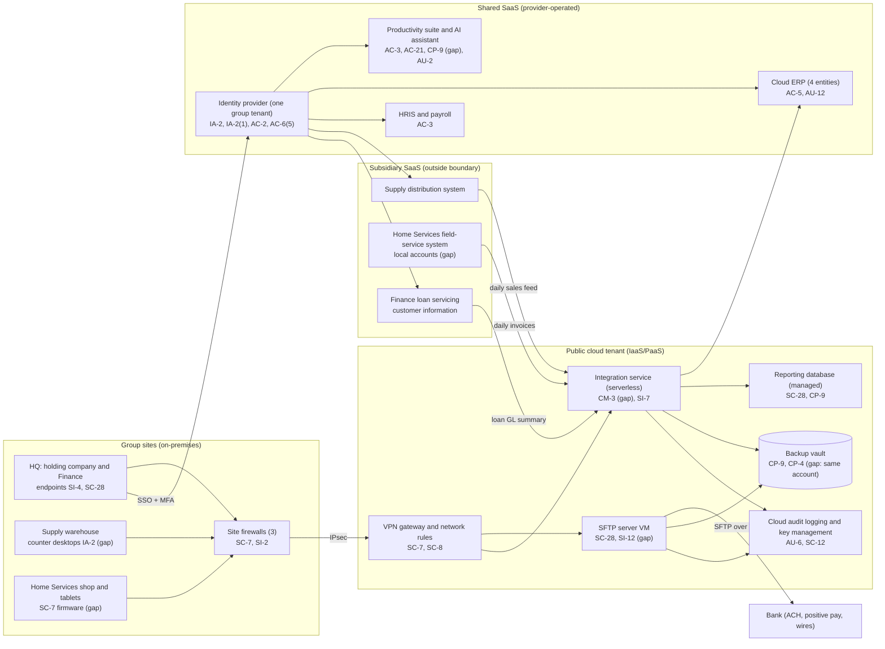

# Cloud Architecture and Control Placement: Cris Santos Company | Management of Companies | Small

**Organization:** Cris Santos Company, LLC (holding company with three operating subsidiaries) | **Tier:** Small | **Provider:** Vendor-agnostic (see section 3)
**System:** Shared Corporate Services Platform (SCSP), as defined in the SSP (P02)

## 1. Diagram

## 2. Layers
| Layer | Components | Key controls | Responsibility |
|---|---|---|---|
| Identity | Identity provider tenant, cloud IAM roles | AC-2, AC-6(5), IA-2, IA-2(1), IA-2(2), AC-7 | Customer (accounts, roles, MFA policy); provider (service) |
| Network / edge | Site firewalls, site-to-site VPN, cloud network rules | SC-7, SC-8 | Customer |
| Compute / application | SFTP VM, serverless integration service, device management | SI-2, CM-3, CM-6, SI-7 | Customer for the guest OS and code (IaaS); provider for the runtime (PaaS) |
| Data | SFTP disk, reporting database, backup vault, key management, suite storage | SC-28, SC-12, CP-9, CP-4, SI-12 | Shared: provider encrypts; the group configures keys, retention, isolation, and restore tests |
| Logging / monitoring | Identity and suite audit logs, cloud audit logs, ERP audit trail, EDR | AU-2, AU-6, AU-11, AU-12, SI-4 | Shared: provider generates; the group retains and reviews |
| SaaS applications | ERP, productivity suite and AI assistant, HRIS | AC-3, AC-5, AC-21, PL-4 | Provider (application and infrastructure); customer (users, roles, sharing, data) |
| Physical / hypervisor | Provider data centers | PE family | Provider (inherited) |

## 3. Service categories and provider equivalents
The group's design is independent of the provider. This table gives each provider's name for each service category, to use when reading its shared responsibility documentation.

| Service category | AWS | Microsoft Azure | Google Cloud |
|---|---|---|---|
| Virtual machines | Amazon EC2 | Azure Virtual Machines | Compute Engine |
| Serverless functions | AWS Lambda | Azure Functions | Cloud Run functions |
| Managed relational database | Amazon RDS | Azure SQL Database | Cloud SQL |
| Backup service | AWS Backup | Azure Backup | Backup and DR Service |
| Identity and access management | AWS IAM | Azure role-based access control with Microsoft Entra ID | Cloud IAM |
| Key management | AWS KMS | Azure Key Vault | Cloud KMS |
| Audit logging | AWS CloudTrail | Azure Monitor activity log | Cloud Audit Logs |
| Site-to-site VPN | AWS Site-to-Site VPN | Azure VPN Gateway | Cloud VPN |
| Network filtering | Security groups | Network security groups | VPC firewall rules |

Shared responsibility sources: SRC-AWS-SRM, SRC-AZURE-SRM, SRC-GCP-SRM in `00_universal/sources/source-register.csv`. All three models agree on the split used here:
- **IaaS:** the provider owns physical facilities, hosts, and the virtualization layer. The customer owns the guest operating system, applications, network configuration, identities, and data.
- **PaaS:** the provider also owns the runtime and database engine. The customer owns code, configuration, access, and data.
- **SaaS:** the provider also owns the application. The customer keeps identities, access, sharing settings, data, and devices.

For SaaS rows, the provider side is evidenced by each vendor's SOC 2 report (P09); the ERP vendor's report was reviewed first.

## 4. Findings from the mapping
1. **One identity tenant is the front door to every subsidiary (IA-2(1), AC-6(5)).** Seven standing global administrators, push MFA, and no break-glass accounts. A single stolen admin session reaches all four entities. Fix: 2 standing admins plus 2 break-glass accounts, hardware keys, device-based conditional access. Tracked as P01 R-001 and R-003 and P07 POAM-003 and POAM-004.
2. **Backup isolation (CP-9, CP-4).** The backup vault shares the production account, region, and administrator roles, and email and files have no independent backup. Fix: separate backup account with immutable retention in a second region; third-party suite backup; quarterly restore tests. Tracked as P01 R-004 and R-005 and P07 POAM-008 and POAM-009.
3. **Finance customer information sits on the shared platform (SC-28, SI-12, AC-21).** ACH files on the SFTP server hold consumer bank account numbers, are kept indefinitely, and are readable by any IT administrator. Loan documents sat on an all-employee collaboration site. These are Safeguards Rule issues for Finance (16 CFR 314.4(c)(1)(ii), (c)(3), (c)(6)) caused by how the holding company runs shared services. Fix: customer-managed key and restricted access on SFTP files, 90-day deletion, sensitivity labels on Finance sites.
4. **The AI assistant inherits every permission error (AC-3).** It is not a new data path; it makes existing over-sharing easy to find. Clean up permissions before any expansion (P10).
5. **Logs exist but are short-lived and unread (AU-6, AU-11).** Export identity, suite, and cloud logs to a log workspace with 1-year retention and weekly review.
6. **Subsidiary systems sit outside the boundary but inside the risk.** SYS-11 uses local accounts and feeds the integration service; bringing it into single sign-on is the fix (P01 R-009).
7. **Boundary check.** Every component in the diagram inside the SCSP boundary has at least one row in `cloud-control-map.csv`, and the component list matches the SSP inventory (P02 section 9). The bank and the three subsidiary systems are external connections, recorded in P02 section 8.
