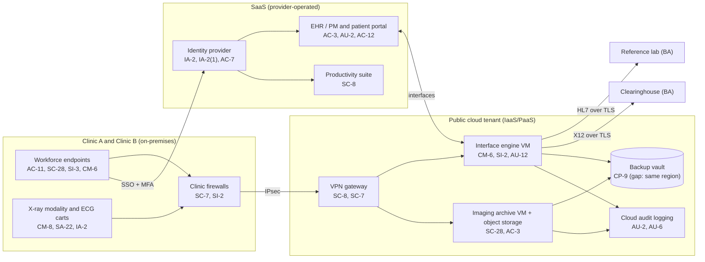

# Cloud Architecture and Control Placement: Cris Santos Company | Health Care | Small

**Organization:** Cris Santos Company, LLC (multi-specialty physician practice) | **Tier:** Small | **Provider:** Vendor-agnostic (see section 3)
**System:** Clinical and Revenue Cycle Platform (CRCP), as defined in the SSP (P02)

## 1. Diagram

## 2. Layers
| Layer | Components | Key controls | Responsibility |
|---|---|---|---|
| Identity | Identity provider, cloud IAM roles | AC-2, IA-2, IA-2(1), IA-5, AC-7 | Customer (configuration), provider (service) |
| Network / edge | Clinic firewalls, site-to-site VPN, cloud network security rules | SC-7, SC-8 | Customer |
| Compute / application | Interface engine VM, imaging archive VM | CM-6, CM-7, SI-2, SI-3 | Customer (guest OS and application) |
| Data | Object storage, VM disks, backup vault | SC-28, CP-9, SC-13 | Shared: provider encrypts, customer configures keys, retention, and isolation |
| Logging / monitoring | Cloud audit logs, identity provider sign-in logs, EHR audit | AU-2, AU-6, AU-11, AU-12, SI-4 | Shared: provider generates, customer retains and reviews |
| SaaS applications | EHR/PM, productivity suite | AC-3, AC-12, AU-3, SI-7 | Provider (application and infrastructure), customer (users, roles, data) |
| Physical / hypervisor | Provider data centers | PE family | Provider (inherited) |

## 3. Service categories and provider equivalents
The practice's design is independent of the provider. This table gives each provider's name for each service category, to use when reading its shared responsibility documentation.

| Service category | AWS | Microsoft Azure | Google Cloud |
|---|---|---|---|
| Virtual machines | Amazon EC2 | Azure Virtual Machines | Compute Engine |
| Object storage | Amazon S3 | Azure Blob Storage | Cloud Storage |
| Backup service | AWS Backup | Azure Backup | Backup and DR Service |
| Identity and access management | AWS IAM | Azure role-based access control with Microsoft Entra ID | Cloud IAM |
| Key management | AWS KMS | Azure Key Vault | Cloud KMS |
| Audit logging | AWS CloudTrail | Azure Monitor activity log | Cloud Audit Logs |
| Site-to-site VPN | AWS Site-to-Site VPN | Azure VPN Gateway | Cloud VPN |
| Network filtering | Security groups | Network security groups | VPC firewall rules |

Shared responsibility sources: SRC-AWS-SRM, SRC-AZURE-SRM, SRC-GCP-SRM in `00_universal/sources/source-register.csv`. All three models agree on the split used here:
- **IaaS:** the provider owns physical facilities, hosts, and the virtualization layer. The customer owns the guest operating system, applications, network configuration, identities, and data.
- **SaaS:** the provider also owns the application. The customer keeps identities, access, data, and devices.

## 4. Findings from the mapping
1. **Backup isolation (CP-9).** The backup vault shares the production region, account, and administrator roles. A ransomware actor with cloud admin rights could delete backups. Fix: move to a separate account with immutable (write-once) retention and a second region. Tracked as P01 R-005 and P07 POAM-003.
2. **Log retention and review (AU-6, AU-11).** Cloud and identity logs use default retention and nobody reviews them. Fix: export to a log workspace with 1-year retention, plus a weekly review.
3. **Imaging archive exposure (SC-7).** The archive VM is reachable only over the VPN (confirmed). The radiology group's remote viewer uses the EHR vendor's image-sharing link instead of direct access. **Keep it that way.**
4. **Inherited controls rely on vendor SOC 2 reports.** Control statements marked "Common/Inherited" in P02 depend on the EHR, identity, and cloud providers' SOC 2 reports, reviewed in P09.
