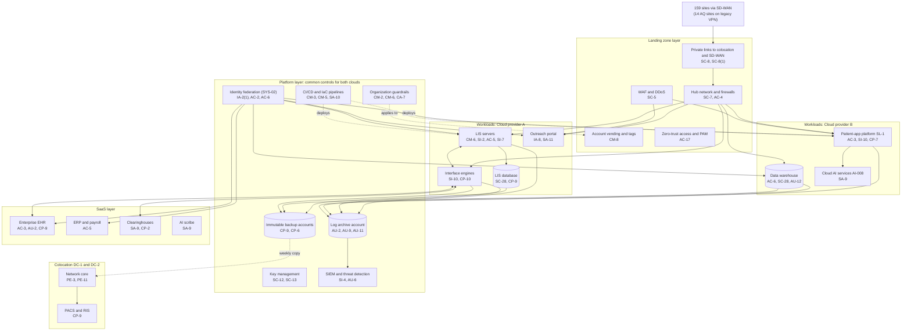

# Cloud Architecture and Control Placement: Cris Santos Company | Health Care | Enterprise

**Organization:** Cris Santos Company, Inc. (publicly traded multi-specialty medical group) | **Tier:** Enterprise | **Provider:** Multi-cloud, vendor-agnostic: two public cloud providers (called Cloud provider A and Cloud provider B), two colocation data centers, and SaaS (see section 4)
**Owner:** Director of Cloud Platform Engineering, with the CISO | **Date:** 2026-08-31 | **Related:** LIS SSP (P02), enterprise BIA (P05)

## 1. Architecture in layers
The estate is organized in four layers. Each lower layer provides **common controls** that the layers above inherit, so a workload team configures only what is specific to its system.

| Layer | What it is | Examples | Who runs it |
|---|---|---|---|
| **Platform** | Organization-wide services in both clouds | Cloud organization guardrails, identity federation, key management, log archive, SIEM feeds, vulnerability and posture management, immutable backup accounts, CI/CD pipelines | Cloud Platform Engineering; Security Operations; Identity team |
| **Landing zone** | The standard account (subscription or project) pattern every workload lands in | Account vending with mandatory tags, hub-and-spoke network with cloud firewalls, private connectivity to colocation and SD-WAN, WAF and DDoS protection, private DNS, zero-trust and PAM access | Cloud Platform Engineering; Network Engineering |
| **Workload** | Systems built or run by the group | Cloud A: LIS, LIS database, interface engines, lab outreach portal. Cloud B: patient-app platform (SL-1), data warehouse, cloud AI services | Application teams (for example, the LIS Application Manager) |
| **SaaS** | Vendor-operated applications | Enterprise EHR/PM, ERP and payroll, productivity suite, clearinghouses, AI scribe | Vendors, with the group's configuration and oversight |

Colocation DC-1 (Florida) and DC-2 (Georgia) host PACS, the network core, and an offline copy of the immutable backups.

## 2. Diagram

## 3. Responsibility by service model
Sources: SRC-AWS-SRM, SRC-AZURE-SRM, and SRC-GCP-SRM in `00_universal/sources/source-register.csv`. The three published models agree on the split used here, so the design does not depend on which two providers the group uses.

| Service model | Provider | Group (customer) | Shared |
|---|---|---|---|
| IaaS (LIS servers, interface engines) | Facilities, hosts, hypervisor, physical network | Guest OS, applications, identities, data, network policy | Encryption (provider service, customer keys), logging |
| PaaS (LIS database, warehouse, containers, AI services) | Also the platform runtime and its patching | Data, access, configuration, keys, application code | Backups, availability configuration |
| SaaS (EHR, ERP, clearinghouse, AI scribe) | Also the application | Users, roles, data, oversight of the vendor | Audit review (complementary user entity controls) |
| Colocation | Building, power, cooling, perimeter | Racks, equipment, cage access lists | None |

## 4. Service categories and provider equivalents
| Service category | AWS | Microsoft Azure | Google Cloud |
|---|---|---|---|
| Organization guardrails | AWS Organizations service control policies | Azure Policy with management groups | Organization Policy Service |
| Account vending | AWS Control Tower account factory | Azure landing zone subscription vending | Resource Manager project creation |
| Key management | AWS KMS | Azure Key Vault | Cloud KMS |
| Audit logging | AWS CloudTrail | Azure Monitor activity log | Cloud Audit Logs |
| Threat detection | Amazon GuardDuty | Microsoft Defender for Cloud | Security Command Center |
| Posture management | AWS Security Hub | Microsoft Defender for Cloud | Security Command Center |
| Managed relational database | Amazon RDS | Azure SQL Database | Cloud SQL |
| Managed containers | Amazon EKS | Azure Kubernetes Service | Google Kubernetes Engine |
| Web application firewall | AWS WAF | Azure Web Application Firewall | Cloud Armor |
| Backup service | AWS Backup | Azure Backup | Backup and DR Service |

This table is for reading provider documentation only. The architecture, control map, and SSP describe service categories.

## 5. Common controls
`cloud-control-map.csv` has **62 rows** across 29 components: Platform 20, Landing zone 8, Workload 20, SaaS 11, Colocation 3. Responsibility: Customer 38, Shared 17, Provider 7.

**30 rows are published as common controls** (`common_control` = Yes) in the enterprise common control catalog. They map to the common control providers in the LIS SSP (P02 section 10.3): identity (CCP-02), landing zone (CCP-03), security operations (CCP-04), network (CCP-05), and colocation (CCP-07). A workload inherits them by being deployed through account vending, which applies the guardrails, logging, network, key, and backup policies automatically.

**Rules for inheriting:**
1. A workload may claim a common control only if its account was created by account vending and passes the posture baseline.
2. Customer-side identity, data protection, and logging stay explicit at every layer: even a SaaS application has Customer rows for access (AC-3, AU-6) because those are always the group's responsibility.
3. SaaS rows cite the vendor's SOC 2 report, reviewed by the third-party risk team (P09 evidence map).

## 6. Validation against the LIS SSP (P02)
Every LIS component in the SSP boundary appears here with controls from each required family, directly or inherited:
| LIS component | AC | AU | CM | IA | SC | SI |
|---|---|---|---|---|---|---|
| LIS application servers | AC-5 | AU-2, AU-9 (inherited) | CM-6, CM-2 (inherited) | IA-2(1) (inherited) | SC-7 (inherited) | SI-2, SI-3, SI-7 |
| LIS database | AC-6 (inherited) | AU-2 (inherited) | CM-6 (inherited) | IA-2(1) (inherited) | SC-28 | SI-2 (shared) |
| Interface engines | AC-4 (inherited) | AU-2 (inherited) | CM-3 (inherited) | IA-2(1) (inherited) | SC-8(1) (inherited) | SI-10 |
| Outreach portal | AC-6 (inherited) | AU-2 (inherited) | CM-3 (inherited) | IA-8 | SC-5 (inherited) | SA-11 and SI-4 (inherited) |

## 7. Findings from the mapping
1. **Acquired-practice connectivity.** 14 AQ sites connect over legacy site VPNs straight to the hub, bypassing SD-WAN segmentation, and reach the interface engines (P07 SC-7). Fix: restrict VPN access lists now, then migrate to SD-WAN (POAM-016).
2. **Result integrity is a workload responsibility.** No platform service can reconcile LIS results with the EHR; the LIS team owns SI-7 (POAM-006).
3. **Two clouds, one control set.** Guardrails, logging, and key policies are written once as code and applied to both clouds. Differences are limited to service names (section 4).
4. **Log coverage.** Platform logging covers every cloud account, but two AQ EHRs (outside the clouds) are not yet in the SIEM (POAM-005).
5. **Clearinghouse is SaaS with no platform fallback.** Concentration risk must be handled by contract and procedure, not architecture (POAM-019).
6. **AI services** run under the cloud provider's BAA with no training on customer data. The AI council reviews each new model deployment (P10).
