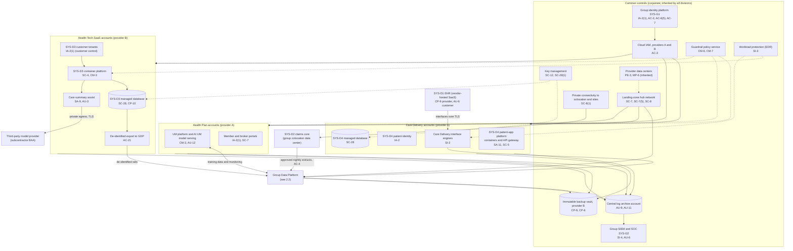
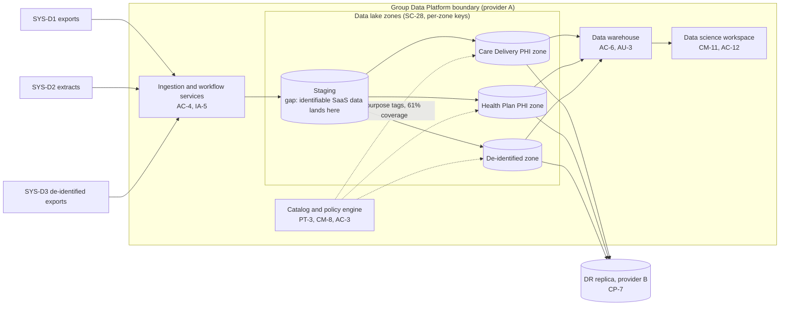

# Cloud Architecture and Control Placement: Cris Santos Company Holdings | Health Care | Multi-Sector

**Organization:** Cris Santos Company Holdings, Inc. | **Tier:** Multi-Sector | **Providers:** two public cloud providers, called provider A and provider B (vendor-agnostic; see section 4)
**Scope:** the shared corporate cloud platform (SYS-G3 landing zones and the Group Data Platform) plus the division workloads that run on it. The SSP system (P02) is the Group Data Platform.

## 1. Design in one paragraph
Corporate runs one **landing zone** per provider: identity federation from SYS-G1, a hub network, guardrail policies, a central log archive, key management, EDR, and an immutable backup vault. Divisions get their own **accounts** (subscriptions or projects) inside the landing zone and inherit these guardrails. Provider A hosts the corporate hub, the Group Data Platform (GDP), Care Delivery's patient-app platform (SYS-D4) and interface engines, and the Health Plan's UM platform and portals. Provider B hosts the SaaS production service (SYS-D3), the GDP disaster recovery replica, and the backup vault. Two division systems sit outside the cloud platform: the Care Delivery EHR (SYS-D1, hosted by the EHR vendor) and the Health Plan claims core (SYS-D2, in a group colocation data center, linked privately).

## 2. Diagrams
### 2.1 Group landing zone and division workloads

### 2.2 Group Data Platform (SSP boundary)

**Target state (POAM-006 and POAM-007, due 2027-03-31):** the Care Delivery and Health Plan zones move to separate accounts with separate keys; every table carries a covered entity and purpose tag enforced by the policy engine; SaaS data is de-identified inside SYS-D3 before export, so identifiable SaaS data never reaches staging; cross-division analysis uses approved, minimum-necessary views only.

## 3. Common versus division-specific controls
`cloud-control-map.csv` has 53 rows across 30 components. The `control_scope` column shows who owns each placement:

| Scope | Rows | What it means |
|---|---|---|
| Common (group) | 22 | Provided once by corporate (SYS-G1, SYS-G2, SYS-G3) and inherited by every division account. Listed in the P02 common control catalog |
| Shared system (Group Data Platform) | 11 | Controls of the shared corporate system documented in the P02 SSP |
| Division-specific (Care Delivery) | 7 | Patient-app platform, interface engines, EHR customer duties |
| Division-specific (Health Plan) | 5 | UM model, portals, claims link |
| Division-specific (Health-Tech SaaS) | 8 | Multi-tenant service, AI feature, de-identified export |

| Responsibility | Rows |
|---|---|
| Customer (the group or a division) | 41 |
| Shared (provider and group) | 8 |
| Provider | 4 |

**Rule of thumb.** Identity, network guardrails, logging, keys, backups, and EDR are **common**. A division cannot opt out of them, only request an exception through POL-01. Application behavior, data access within the application, and customer-facing identity are **division-specific**, because they depend on each division's regulators and customers.

## 4. Layers
| Layer | Common components | Division components | Key controls | Responsibility |
|---|---|---|---|---|
| Identity | SYS-G1, cloud IAM | Patient identity (SYS-D4), member and broker portals, SaaS customer tenants | AC-2, AC-3, AC-6(5), IA-2, IA-2(1) | Customer (configuration); vendor (service) |
| Network | Hub network, private links | API gateways, WAF | SC-7, SC-7(5), SC-8, SC-8(1), SC-5 | Customer, with provider DDoS protection shared |
| Compute | EDR on all hosts | Containers, interface engines, UM serving, GDP workspace | SI-2, SI-3, CM-3, CM-11, SC-4 | Customer (guest OS, containers, code) |
| Data | Keys, backup vault | GDP zones, division databases | SC-12, SC-28, SC-28(1), CP-9, CP-6, AC-4, PT-3 | Shared: provider encrypts; group owns keys, zoning, and retention |
| Logging and monitoring | Log archive, SIEM | Application and model decision logs | AU-3, AU-6, AU-9, AU-11, AU-12, SI-4 | Shared: providers generate platform logs; group retains and reviews |
| SaaS dependencies | Identity and SIEM vendors | EHR vendor, model provider | SA-9, CP-9, AU-6 | Provider for the service; customer for use and oversight |
| Physical | Provider data centers | none | PE-3, MP-6 | Provider (inherited) |

## 5. Service categories and provider equivalents
The design does not depend on a provider. This table gives each provider's name for each service category, for reading its shared responsibility documentation.

| Service category | AWS | Microsoft Azure | Google Cloud |
|---|---|---|---|
| Account structure and guardrails | AWS Organizations with service control policies | Management groups with Azure Policy | Resource hierarchy with Organization Policy |
| Object storage (data lake) | Amazon S3 | Azure Blob Storage / Data Lake Storage | Cloud Storage |
| Managed analytical database | Amazon Redshift | Azure Synapse Analytics | BigQuery |
| Managed containers | Amazon EKS | Azure Kubernetes Service | Google Kubernetes Engine |
| Key management | AWS KMS | Azure Key Vault | Cloud KMS |
| Audit logging | AWS CloudTrail | Azure Monitor activity log | Cloud Audit Logs |
| Backup with immutability | AWS Backup (vault lock) | Azure Backup (immutable vault) | Backup and DR Service |
| Private connectivity | AWS Direct Connect / PrivateLink | Azure ExpressRoute / Private Link | Cloud Interconnect / Private Service Connect |

Shared responsibility sources: SRC-AWS-SRM, SRC-AZURE-SRM, SRC-GCP-SRM in `00_universal/sources/source-register.csv`. All three agree on the split used here: for IaaS the provider owns facilities, hosts, and virtualization; for PaaS the provider also owns the runtime; for SaaS the provider owns the application. The customer always keeps identities, access decisions, data classification, and data.

## 6. Findings from the mapping
1. **Zoning, not encryption, is the GDP's weak point.** Encryption and keys are sound (SC-28, SC-12). The gap is that two covered entities' PHI share storage areas and the policy engine enforces purpose on only 61% of tables (AC-3, PT-3; P01 GR-01; POAM-006).
2. **The staging area breaks the de-identification promise** (AC-4). Identifiable SaaS data can land before de-identification runs. Moving de-identification into SYS-D3 removes the problem at the source (POAM-007).
3. **The model provider is a new external dependency** outside both landing zones (SA-9). It needs monitoring and per-patient request logging (AU-3) to support 164.410(c)(1) notices (POAM-018).
4. **Common controls are strong and reused.** One identity platform, one SIEM, one backup design. This is what lets group internal audit assess them once (P07). The weak link is documentation of inheritance for the Health Plan (P02, POAM-015), not the controls themselves.
5. **Two systems sit outside the platform.** The EHR relies on the vendor's SOC 2 report and contract (CP-9 provider), and the claims core relies on the colocation link and nightly extracts (AC-4). Both are covered by division-specific rows.
