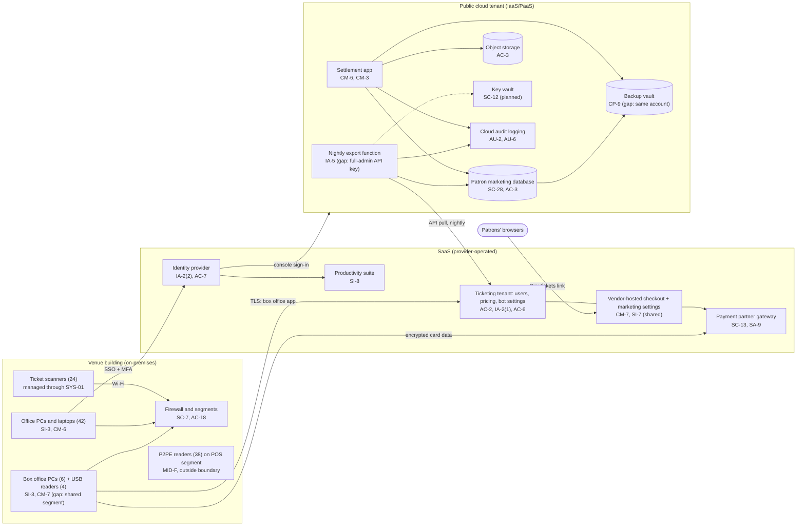

# Cloud Architecture and Control Placement: Cris Santos Company | Arts, Entertainment, and Recreation | Small

**Organization:** Cris Santos Company, LLC (live event venue operator with ticketing) | **Tier:** Small | **Provider:** Vendor-agnostic (see section 3)
**System:** Ticketing and Venue Operations Platform (TVOP), as defined in the SSP (P02)

## 1. Diagram

## 2. Layers
| Layer | Components | Key controls | Responsibility |
|---|---|---|---|
| Identity | Ticketing venue users, identity provider, cloud IAM | AC-2, AC-6, AC-7, IA-2(1), IA-2(2), IA-5 | Customer (accounts, MFA settings, roles); provider (the service) |
| Network / edge | Venue firewall and segments, cloud network rules | SC-7, AC-18 | Customer |
| Compute / application | Box office PCs, export function, settlement app | SI-2, SI-3, CM-3, CM-6, CM-7 | Customer for PCs and code; shared for the PaaS runtimes |
| Data | Patron database, object storage, key vault, backup vault | SC-28, SC-12, AC-3, CP-9 | Shared: provider encrypts and runs the services; company configures access, keys, retention, and isolation |
| Logging / monitoring | Ticketing audit log, cloud audit logs, identity provider sign-ins | AU-2, AU-6, AU-11 | Shared: providers generate logs; company exports, retains, and reviews them |
| SaaS applications | Ticketing platform and checkout, payment gateway, productivity suite | SC-13, SI-7, SI-8, SA-9 | Provider for the application; customer for users, settings, and what it adds to pages |
| Physical / hypervisor | Provider data centers | PE-3 | Provider (inherited) |

## 3. Service categories and provider equivalents
The company's design does not depend on one provider. This table gives each provider's name for each service category, to use when reading its shared responsibility documentation.

| Service category | AWS | Microsoft Azure | Google Cloud |
|---|---|---|---|
| Managed relational database | Amazon RDS | Azure SQL Database | Cloud SQL |
| Application hosting (PaaS) | AWS Elastic Beanstalk or AWS App Runner | Azure App Service | Cloud Run |
| Serverless functions | AWS Lambda | Azure Functions | Cloud Run functions |
| Object storage | Amazon S3 | Azure Blob Storage | Cloud Storage |
| Key and secret storage | AWS Secrets Manager and AWS KMS | Azure Key Vault | Secret Manager and Cloud KMS |
| Backup service | AWS Backup | Azure Backup | Backup and DR Service |
| Identity and access management | AWS IAM | Azure role-based access control with Microsoft Entra ID | Cloud IAM |
| Audit logging | AWS CloudTrail | Azure Monitor activity log | Cloud Audit Logs |

Shared responsibility sources: SRC-AWS-SRM, SRC-AZURE-SRM, SRC-GCP-SRM in `00_universal/sources/source-register.csv`. All three models agree on the split used here:
- **IaaS:** the provider owns facilities, hosts, and virtualization. The customer owns operating systems, applications, network configuration, identities, and data.
- **PaaS:** the provider also runs the operating system and runtime. The customer keeps application code, configuration, identities, secrets, and data.
- **SaaS:** the provider also owns the application. The customer keeps users, access, settings, data, and devices.

**The ticketing platform needs its own split,** because PCI DSS applies to it. The vendor's service provider AOC covers the checkout page code, card data handling, and its infrastructure. The vendor's responsibility matrix (fictional) assigns to the customer: venue user accounts and MFA enforcement, admin roles, API keys, and **anything the customer adds to event or checkout pages through marketing settings**. That last item is where the P08 scenario starts.

## 4. Findings from the mapping
1. **The company can change the vendor's payment page (CM-7, SI-7).** Marketing settings let the agency place scripts on the checkout page. The vendor's PCI DSS controls do not cover those scripts. Fix: remove all company-added scripts from checkout, limit marketing settings to event pages, and ask the vendor for alerts on setting changes. Tracked as P01 R-002 and P07 POAM-007 and POAM-008.
2. **A cloud secret can change the ticketing platform (IA-5, SC-12).** The export function holds a full-admin ticketing API key in plain function settings. Anyone who reads that setting can export all patron records or change checkout settings. Fix: a read-only key scoped to patron reports, stored in the key vault. Tracked as P01 R-008 and POAM-005.
3. **Backup isolation (CP-9).** The backup vault shares the account, region, and administrators with production. Fix: a separate backup account with immutable retention. Tracked as P01 R-010 and POAM-020.
4. **Logs exist but nobody keeps or reads them (AU-6, AU-11).** The ticketing audit log (90 days), cloud audit logs, and identity provider sign-ins should flow to one log service with 12-month retention and alerts. Tracked as POAM-011 and POAM-012.
5. **The box office is the only on-premises card data path.** After the move to standalone validated P2PE devices (2026-11-15), no company-managed component in this diagram handles clear card data. The PCs and the corporate segment still need the controls in this map for FTC reasonable security.
6. **Inherited controls rely on vendor assurance.** Rows marked Provider depend on the ticketing vendor's PCI DSS AOC and SOC 2 report and the cloud provider's SOC 2 report, reviewed in P09.
