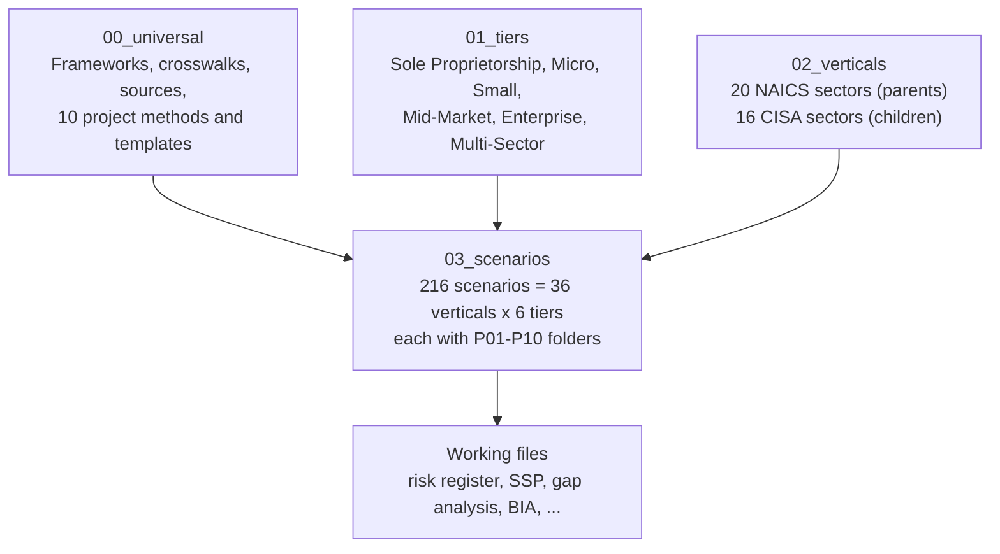

# GRC Projects: Cris Santos Company

A portfolio of the 10 projects in the [GRC Project List](https://nicoleenesse.notion.site/GRC-Project-List-3bf8eef497be8080afc3ee1cbd34bf68), all built around one fictitious organization, **Cris Santos Company**. The company is shown at six sizes across every NAICS 2022 sector and CISA critical infrastructure sector.

The design demonstrates **scalability**. One universal method produces each deliverable. Company size changes how deep the deliverable goes, and the industry changes which regulations apply.

## Start here

| If you want to... | Open |
|---|---|
| Understand the plan and the order of work | [PLAN.md](PLAN.md) |
| Pick a sample for a meeting | [03_scenarios/INDEX.md](03_scenarios/INDEX.md), then a scenario's `README.md` |
| See how a deliverable is done, for any company | [00_universal/projects/](00_universal/projects/) |
| Update after a regulation changes | [docs/how-to-update.md](docs/how-to-update.md) |
| Run a meeting from a sample | [docs/meeting-guide.md](docs/meeting-guide.md) |

## How it is organized (macro to granular)



| Layer | Folder | Changes when | Who edits |
|---|---|---|---|
| L0 Universal | `00_universal/` | NIST, AICPA, or cross-sector US law changes | You, then rebuild |
| L1 Size tier | `01_tiers/` | Size definitions or scaling expectations change | You, then rebuild |
| L2 Vertical | `02_verticals/` | A sector regulation changes | You, then rebuild |
| L3 Scenario | `03_scenarios/` | Generated. Working files are yours and are never overwritten | Generator plus you |

## Rebuild

```bash
python3 tools/refresh_sba_standards.py    # pull current SBA size standards from eCFR
python3 tools/refresh_csf_crosswalks.py   # pull CSF 2.0 core and official NIST mappings
python3 tools/build_scenarios.py          # regenerate overlays, briefs, and project context
python3 tools/validate.py                 # check IDs, links, and data consistency
```

## Scope and ground rules

- **United States only.** Federal law plus state law where it applies across sectors.
- **Authoritative sources only.** Every source is listed in [`00_universal/sources/source-register.csv`](00_universal/sources/source-register.csv) with its version and last-verified date. Vertical requirements carry a `verified` flag.
- **Fictitious company.** Size and financial figures are invented but consistent with SBA (13 CFR 121.201) and Census definitions.
- **Not legal advice.** Applicability of any regulation must be confirmed against the cited source.
