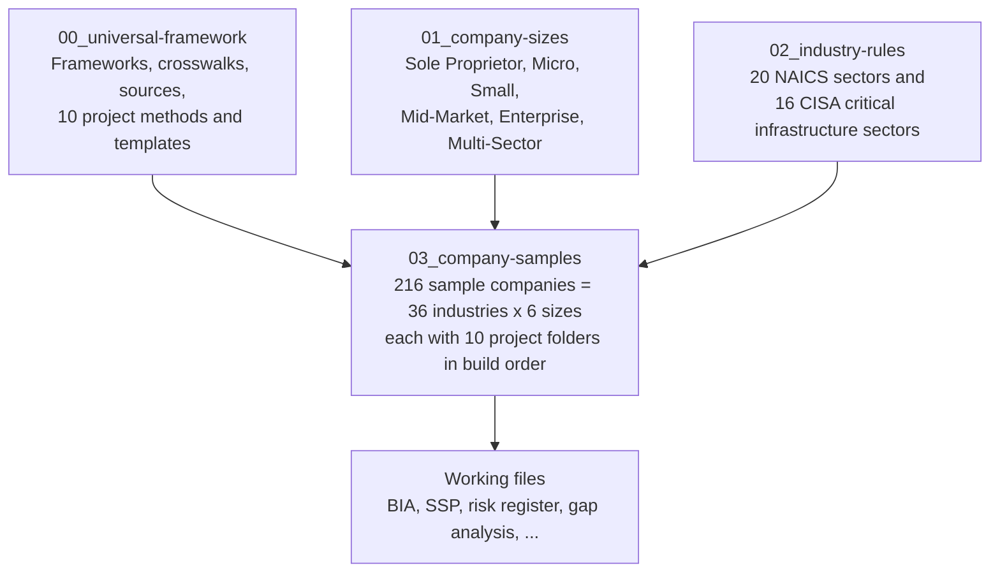

# GRC Projects: Cris Santos Company

A portfolio of the 10 projects in the [GRC Project List](https://nicoleenesse.notion.site/GRC-Project-List-3bf8eef497be8080afc3ee1cbd34bf68), all built around one fictitious organization, **Cris Santos Company**. The company is shown at six sizes across every NAICS 2022 sector and CISA critical infrastructure sector.

The design demonstrates **scalability**. One universal method produces each deliverable. Company size changes how deep the deliverable goes and who does the work; the industry changes which regulations apply.

## Start here

| If you want to... | Open |
|---|---|
| See what has been accomplished | [ACCOMPLISHMENTS.md](ACCOMPLISHMENTS.md) |
| Read any sample company as a plain-English story: browse, search by rule, compare sizes, or take a guided tour | [docs/explorer.html](docs/explorer.html). Download it and open it in a browser, or turn on GitHub Pages (Settings, Pages, branch `main`, folder `/docs`) and open `explorer.html` there |
| Pick a sample company for a meeting | [03_company-samples/INDEX.md](03_company-samples/INDEX.md), then that company's `README.md` |
| Learn the best order to build the 10 projects, and how size changes them | [docs/how-to-build-the-10-projects.md](docs/how-to-build-the-10-projects.md) |
| Run a meeting from a sample | [docs/meeting-guide.md](docs/meeting-guide.md) |
| See how a project is done, for any company | [00_universal-framework/projects/](00_universal-framework/projects/) |
| Understand the plan, decisions, and phase records | [PLAN.md](PLAN.md) |
| Update after a regulation changes | [docs/how-to-update.md](docs/how-to-update.md) |

## How the folders are named

Every name says what it holds. A sample company's path reads as **industry / size and business / build step and project**:

```
03_company-samples/
  health-care/                                         industry
    size-3_small_multi-specialty-practice/             company size + what the business does
      00_company-facts.md                              the facts every project uses (read second)
      README.md                                        one-page meeting brief (read first)
      step-01_P05_business-impact-analysis/            build step 1 = Notion project P05
      step-02_P02_system-security-plan/
      ...
      step-10_P10_ai-governance/
  utilities_energy-critical-infrastructure/            a CISA critical infrastructure sector inside Utilities
    size-3_small_gas-transmission-pipeline/
```

- **Sizes:** `size-1_sole-proprietor` (owner only), `size-2_micro` (1-9 employees), `size-3_small` (10 or more employees, within the SBA small-business standard for its industry), `size-4_mid-market` (above the SBA standard, under 1,000 employees), `size-5_enterprise` (1,000 or more), `size-6_multi-sector` (1,000 or more, with divisions in three industries). Definitions: [`01_company-sizes/tiers.csv`](01_company-sizes/tiers.csv).
- **Steps vs. project numbers:** `step-NN` is the order to build in; `PNN` is the project's number in the Notion list. The [build guide](docs/how-to-build-the-10-projects.md) explains why the order differs.
- **Done vs. planned:** a folder with `00_company-facts.md` is a finished sample. Other folders hold the brief and blank templates, ready to fill in.

## How it is organized (macro to granular)



| Layer | Folder | Changes when | Who edits |
|---|---|---|---|
| Universal framework | `00_universal-framework/` | NIST, AICPA, or cross-sector US law changes | You, then rebuild |
| Company sizes | `01_company-sizes/` | Size definitions or depth expectations change | You, then rebuild |
| Industry rules | `02_industry-rules/` | A sector regulation changes | You, then rebuild |
| Company samples | `03_company-samples/` | Generated briefs; the working files are yours and are never overwritten | Generator plus you |

## Rebuild

```bash
python3 tools/refresh_sba_standards.py    # pull current SBA size standards from eCFR
python3 tools/refresh_csf_crosswalks.py   # pull CSF 2.0 core and official NIST mappings
python3 tools/build_scenarios.py          # regenerate industry overlays, company briefs, and project context
python3 tools/build_explorer.py           # regenerate docs/explorer.html from the finished samples
python3 tools/validate.py                 # check IDs, links, folder names, and finished samples
```

## Scope and ground rules

- **United States only.** Federal law plus state law where it applies across sectors. Every company is headquartered in Florida.
- **Authoritative sources only.** Every source is listed in [`00_universal-framework/sources/source-register.csv`](00_universal-framework/sources/source-register.csv) with its version and last-verified date. Industry requirements carry a `verified` flag.
- **Fictitious company.** Size and financial figures are invented but consistent with SBA (13 CFR 121.201) and Census definitions.
- **Not legal advice.** Applicability of any regulation must be confirmed against the cited source.
