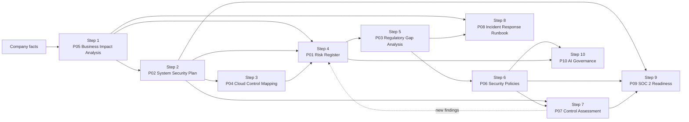

# How to build the 10 projects, and how company size changes them

This is the teaching guide for the library. It explains **the order to build the 10 projects**, **what each one needs from the others**, and **where company size changes who does the work and what comes first**. Every sample company in [`03_company-samples/`](../03_company-samples/INDEX.md) was built this way, and its project folders are numbered in this order (`step-01` to `step-10`).

The project numbers (P01 to P10) come from the original Notion GRC Project List, which orders them by career value. The step numbers are the order that makes each project easier because the earlier ones already produced what it needs.

---

## 1. The build order at a glance

| Step | Project | Must have first (hard prerequisite) | Easier if done first (soft) | What it hands to later steps |
|---|---|---|---|---|
| 0 | **Company facts** (`00_company-facts.md`) | Nothing | Nothing | Who the company is, its systems, its current security posture, its numbered gaps. Every project cites these. |
| 1 | **P05 Business Impact Analysis** | Company facts | Nothing | Which processes matter, how long each can be down (MTD, RTO, RPO), and which systems they depend on |
| 2 | **P02 System Security Plan** | P05, to pick the system that matters most and set its availability impact | Nothing | The system boundary, its security category, and a statement for every control |
| 3 | **P04 Cloud Control Mapping** | P02, for the boundary and control list | Nothing | Which controls the company runs, which the cloud provider runs, and which are shared |
| 4 | **P01 Risk Register** | P05 impact levels | P02 and P04, so risks name real systems and real controls | Scored risks with owners; the risk IDs every later project cites |
| 5 | **P03 Regulatory Gap Analysis** | Company facts, and a check of **whether the rule applies at this size** | P01 and P02, so gaps link to risks and controls | Met and not met requirements, gap IDs, and the list of notification duties |
| 6 | **P06 Security Policies** | P03 gaps | P01 risks | Policy statements that later become test criteria |
| 7 | **P07 Control Assessment** | P02 control statements and P06 policies (the "should") | Nothing | Test results, a POA&M (fix list), and new findings that go back into P01 |
| 8 | **P08 Incident Response Runbook** | P05 recovery order and P03 notification duties | P01 top risks, to choose the incident type | Who to call, in what order, by which deadline |
| 9 | **P09 SOC 2 Readiness** | Evidence from P02, P06, and P07 | Nothing | A readiness score, or a review of a key vendor's SOC 2 report when the company is not a service organization |
| 10 | **P10 AI Governance** | P06 policies (acceptable use) and the P01 risk method | P03, for AI-specific rules | An AI inventory, a risk tier per use case, bias test results, and a decision |

### Why this order works

- **Start with impact, not threats.** The BIA (step 1) tells you what the business cannot live without. Everything after it is scoped to that. Doing the risk register first usually produces a generic list of threats; doing it fourth produces risks tied to real systems, real downtime limits, and real control gaps.
- **Describe the system before judging it.** Every sample is an operating business. The SSP (step 2) and cloud mapping (step 3) record the system as found, the RMF task of documenting the system's characteristics (NIST SP 800-37 Rev. 2, Task C-1). For a new system, the RMF Prepare step would do the risk assessment (Task P-14) and set requirements (Task P-15) before controls are selected. Here, steps 4 to 7 add risks, gaps, policies, and test results, and the SSP is then updated to the as-implemented state (Tasks S-4 and I-2). That is why every sample's SSP cites P01, P03, P06, and P07. The BIA stays first because SP 800-37 lists it as an input to the system risk assessment (Task P-14).
- **Check applicability before analyzing a regulation.** Step 5 always opens with "does this rule actually bind this company at this size?" In Phase 4 this check changed the answer for many industries: the TSA pipeline and rail directives only reach designated operators, the NRC reactor cyber rule does not reach a waste processor, FedRAMP does not apply without a federal customer, and the FDA food defense rule exempts farms. Record the finding with its citation, then analyze the rule that does bind.
- **Write policies from gaps, then test against them.** Policies (step 6) answer the gaps found in step 5. The control assessment (step 7) tests against those policies and the SSP. Testing earlier leaves you without criteria.
- **Close the loop.** The control assessment always finds something new (in these samples, often a default password). That finding goes back into the risk register as a new risk and into the POA&M.
- **Build the runbook from the BIA and the notification list.** The recovery order comes from step 1 and the deadlines come from step 5, so the runbook (step 8) is mostly assembly.
- **Check fit before SOC 2 and AI work.** Step 9 opens by asking whether the company is a service organization. If it is not, the step is a questionnaire self-check plus a review of a key vendor's SOC 2 report, and it says no report will be sought. Every Sole Proprietor and Micro sample states this. Step 10 opens by listing the AI tools actually in use. If there are none, record an empty inventory with the date and stop. All 10 folders stay in every sample so sizes compare side by side.
- **Reuse evidence for SOC 2.** Step 9 reuses the SSP statements, policies, and test results. Done first, it would repeat all three.
- **Govern AI last, with the tools already built.** AI governance (step 10) applies the acceptable-use policy and the risk scoring method that already exist.

---

## 2. Where company size matters

The method is the same at every size. What changes is **how deep each project goes, who does the work, and which projects come first**.

### 2.1 Who does the work (overlapping responsibilities)

| Size | Who owns security and compliance | What overlaps | Example from the Health Care samples |
|---|---|---|---|
| **1. Sole proprietor** | The owner, with outside IT help as needed | Everything. The owner is every risk owner, the policy approver, the incident commander, and the person being assessed | The physician-owner is owner, Privacy Officer, Security Officer, and risk acceptor |
| **2. Micro** (1-9 employees) | Owner or office manager, supported by a managed service provider (MSP) | One person holds privacy and security roles together; the MSP runs most technical controls | The office manager is both Privacy and Security Officer; the owner physician accepts risk |
| **3. Small** (10+, within the SBA standard) | IT manager with part-time security and compliance duties | Security is one part of the IT job; executives accept risk by level | The IT Manager is Security Officer; the Medical Director is Privacy Officer; the owner accepts High risks |
| **4. Mid-market** (above the SBA standard, under 1,000) | Security manager or part-time virtual CISO, a small GRC function, co-sourced internal audit | Roles separate, but the vCISO covers strategy and board reporting | A vCISO sets strategy; the IT Director is Security Officer; the COO sponsors the program |
| **5. Enterprise** (1,000+) | CISO, a dedicated GRC team, internal audit, three lines of defense | Little overlap; independence matters (assessors must not assess their own work) | A CISO leads; a Director of Security Operations is Security Officer; a disclosure committee handles SEC materiality |
| **6. Multi-sector** | Group CISO and Chief Risk Officer, plus division leads | Group sets standards once; each division keeps its own regulator-facing roles | Each covered division names its own HIPAA officers; risk acceptance rises from division lead to board |

**Teaching point:** at small sizes the same person does and checks the work, so the samples say so openly and use outside help (an MSP, an assessor, a vendor's SOC 2 report) as the independent check. At larger sizes the samples separate those roles on purpose.

**Compensating controls when one person does everything (Sole Proprietor and Micro).** Some SP 800-53 controls assume a second person. These are the substitutes the samples use. Baselines are from `00_universal-framework/frameworks/sp800-53r5_controls.csv`.

| Control | Why it is hard with one person | Compensating control |
|---|---|---|
| AC-5 Separation of duties (Moderate baseline) | The owner both starts and approves payments and changes | The platform enforces a second approval where it can (bank dual approval, payment holds), and an outside bookkeeper or CPA reviews statements each month |
| AU-9 Protection of audit information | The only administrator could delete the logs | Logs stay where the owner cannot delete them: the SaaS provider's retained audit log or write-once storage |
| CM-3 Configuration change control (Moderate baseline) | There is no change board | CM-3(g) lets the organization name its own change control element: a change log, a backup before each change, and an MSP or vendor check for high-risk changes |
| CA-2(1) and CA-7(1) Independent assessors and independent assessment (Moderate baseline) | Nobody independent works there | P07 states the limited independence openly, an outside reviewer checks at a set interval, and vendor SOC 2 reports cover inherited controls. Base CA-2 still applies as a self-assessment |

### 2.2 How deep each project goes

| Step | Project | 1. Sole proprietor | 2. Micro | 3. Small | 4. Mid-market | 5. Enterprise | 6. Multi-sector |
|---|---|---|---|---|---|---|---|
| 1 | P05 BIA | 3-5 functions | 5-10 functions | All processes | All units; dollar impact | Enterprise-wide; third parties | Group plus divisions; shared services |
| 2 | P02 SSP | Short-form plan for the SaaS stack | Standard outline; MSP controls inherited | Full SP 800-18 plan for one system | Full plan with baseline tailoring | High-value system; common controls | Shared corporate system or one per division |
| 3 | P04 Cloud | SaaS only | SaaS plus one workload | One cloud plus SaaS | Multi-account landing zone | Multi-cloud platform | Shared platform plus division workloads |
| 4 | P01 Risk | 10-15 risks | 15-25 risks | 25-40, scored with SP 800-30 tables | 40-60 with risk appetite | 60+, rolled into enterprise risk | Division registers roll up to group |
| 5 | P03 Gaps | Checklist, self-attested | Documentary evidence | Evidence plus control crosswalk | All rules for the main business line | All rules, regulator-ready | Regulation-by-division matrix |
| 6 | P06 Policies | 1 consolidated policy | 3 policies | 5 policies | 5 plus standards | Full hierarchy with exceptions | Group policies with division supplements |
| 7 | P07 Assessment | 6-10 controls, self-review | 10-15, MSP evidence | 15-25, formal plan | 25-40 with sampling | 40+, independent | Common controls once, divisions sampled |
| 8 | P08 Runbook | First 24 hours, who to call | Full lifecycle; MSP and insurer | Full runbook with legal deadlines | Two incident types; crisis and legal | SEC materiality step | Incident spanning divisions |
| 9 | P09 SOC 2 | Security criteria only | Security plus one category | Security plus relevant categories | Ready for a Type 2 audit | Type 2 across service lines | Scoping per division |
| 10 | P10 AI | One third-party tool | One use case | 1-2 use cases, bias testing | Use-case portfolio | Governance committee | Group program, division use cases |

The same table, with the exact wording, is in [`01_company-sizes/tier-project-scaling.csv`](../01_company-sizes/tier-project-scaling.csv).

### 2.3 What to do first at each size (priorities)

The build order in section 1 still applies. What changes is **where to stop when time is short** and **which project the business case rests on**.

| Size | Do first | Why | Can wait or stay light |
|---|---|---|---|
| **Sole proprietor** | BIA, risk register, incident runbook | One laptop or account loss can end the business; the owner needs a 24-hour plan | SSP and SOC 2 stay short; cloud mapping covers SaaS settings only |
| **Micro** | BIA, gap analysis, incident runbook | Regulators and insurers ask first for a risk analysis and a response plan; the MSP contract decides who does what | Formal control assessment stays small; SOC 2 is usually a vendor review |
| **Small** | All 10, in order | The primary regulation expects documented analysis, policies, and testing; the samples show the full chain | P10 covers only 1-2 AI use cases |
| **Mid-market** | Gap analysis across every rule for the main line of business, then the assessment | More regulators apply, and the risk appetite has to be written down for the board | None skipped; depth grows |
| **Enterprise** | Risk register tied to enterprise risk, SSP for the highest-value system, runbook with a disclosure step | Board, auditors, and SEC disclosure rules drive the work | Nothing; independence and sampling are the new work |
| **Multi-sector** | Group standards, then division gap analyses | Common controls are built once at the group; each division answers to its own regulator | Division depth varies with its regulator |

---

## 3. Worked example: one company, all 10 steps

The Health Care small sample, [a multi-specialty physician practice](../03_company-samples/health-care/size-3_small_multi-specialty-practice/README.md), shows the chain end to end:

1. **BIA:** the EHR and clinical workflows can be down for 8 hours at most; the imaging archive for 24.
2. **SSP:** the plan covers the Clinical and Revenue Cycle Platform, the system the BIA ranked highest.
3. **Cloud mapping:** the practice-managed cloud workloads are mapped control by control; the EHR vendor's controls are inherited.
4. **Risk register:** 31 risks scored with NIST SP 800-30 Tables G-5 and I-2; the top risks name the systems from steps 2 and 3.
5. **Gap analysis:** 69 HIPAA Security Rule requirements, with the official NIST mapping; the gaps link to risks.
6. **Policies:** five policies answer the gaps.
7. **Control assessment:** 22 controls and 164 test statements; testing found default passwords on four vital-sign monitors, which went back into the risk register.
8. **Runbook:** ransomware with data theft; the recovery order comes from the BIA and the deadlines from the gap analysis (HIPAA, Florida).
9. **SOC 2:** a readiness self-check for a health system partner, plus a review of the EHR vendor's SOC 2 report, reusing steps 2, 6, and 7.
10. **AI governance:** an AI scribe pilot, tiered and tested with the risk method from step 4 and the policies from step 6.

To see the same project at every size, open one step folder across the Health Care size ladder, for example `step-04_P01_risk-register` in each of the six [Health Care samples](../03_company-samples/INDEX.md).
