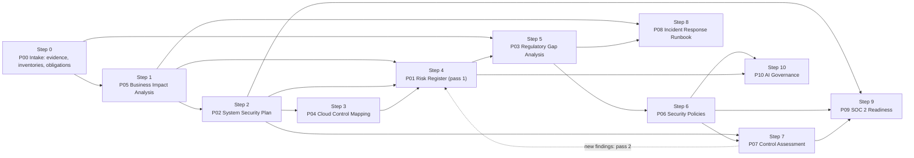

# How to build the 10 projects, and how company size changes them

This is the teaching guide for the library. It explains **where the facts come from**, **the order to build the 10 projects**, **what each one needs from the others**, and **where company size changes who does the work and what starts it**. Every sample company in [`03_company-samples/`](../03_company-samples/INDEX.md) has its project folders numbered in this order.

The project numbers (P01 to P10) come from the original Notion GRC Project List, which orders them by career value. The step numbers are the order that makes each project easier, because the earlier ones already produced what it needs. Step 0 (intake) was added in October 2026 after an audit found that the samples started from conclusions instead of evidence.

> **Transition note.** The six Health Care samples are the pilot for the evidence-based build described here: each has a `step-00_P00_intake` folder, and every finding cites a dated evidence ID. The other 210 samples still start from a "current security posture" section in their facts file and will be converted after the pilot is reviewed.

---

## 1. Facts come first, and they come from records

A real engagement does not start with a list of what is wrong. It starts with the company's own records, collected and dated before anyone judges them. Everything later is reasoned from those records.

**Observations versus findings.** An *observation* is what a source shows: "the endpoint console lists 70 computers; 12 report disk encryption on." A *finding* is a judgment against a requirement: "58 computers holding ePHI are not encrypted, so 164.312(a)(2)(iv) is partially met." Intake records observations only. The gap analysis (P03) and the control assessment (P07) turn observations into findings, and each finding cites the evidence ID it rests on. A finding with no evidence behind it is an assumption, and the validator rejects an evidence ID that does not exist.

### Where the data normally comes from, and when it is collected

| Data | System of record (larger companies) | Smaller companies | Collected at |
|---|---|---|---|
| Users and access | Identity provider export; HR system roster and termination report | Vendor admin consoles; payroll provider | Intake, refreshed for P07 sampling |
| Devices | Endpoint management or EDR console; CMDB | MSP asset report; a walk-through count | Intake |
| Cloud and SaaS | Cloud account inventory; SSO app list; SaaS management | Card statements and vendor invoices | Intake |
| Suppliers and contracts | Accounts payable vendor master; contract register; BAAs and DPAs | Vendor invoices; signed agreements folder | Intake |
| Which rules apply | Licenses, contracts, regulator correspondence, counsel review | Licenses; payer and customer agreements | Intake (obligations register); P03 analyzes |
| Current state | Prior audits and exams; insurer questionnaires; incident tickets; scan and pen-test results; current policies | Insurer questionnaire; MSP reports; the policies folder | Intake |
| Downtime cost and limits | General ledger and revenue reports; SLAs; process owner interviews | Bank statements; the owner's own estimate, written down and signed | P05 fieldwork |
| Likelihood inputs | Incident tickets; scan results; sector advisories; insurer data | Past incidents the owner can document | P01 fieldwork |
| Cloud split of duties | The provider's shared responsibility description and SOC 2 report | The SaaS vendor's security page and SOC 2 report | P04 |
| Control evidence | Configuration exports, logs, tickets and samples drawn from the intake populations | Screenshots and vendor reports | P07 fieldwork |
| AI tools in use | SaaS discovery, procurement, expense reports, staff survey | Card statements and a short staff survey | Intake, then P10 |

One evidence register backs the whole engagement. Intake creates the first rows; BIA interviews, risk and gap interviews, and control tests add their own rows with the phase that collected them. Anything asked for but not received goes on an open-requests list instead of being filled in with a guess.

---

## 2. The build order

The six phases of a real program map onto the steps like this: **Intake** (step 0), **Baseline** (steps 1 to 3: what matters, what the system is, who runs which control), **Assess** (steps 4 and 5: what could go wrong, which requirements are unmet), **Fix** (step 6: the rules people will follow), **Prove** (steps 7 and 9: test it, and show it to customers), and **Operate** (steps 8 and 10: respond to the bad day, govern new technology).

| Step | Project | Must have first (hard prerequisite) | Easier if done first (soft) | Evidence it adds | What it hands to later steps |
|---|---|---|---|---|---|
| 0 | **P00 Intake** | Nothing | Nothing | Exports, documents, walk-throughs, intake interviews | Dated evidence IDs; asset, data, vendor and AI inventories; which rules apply and why |
| 1 | **P05 BIA** | Intake (processes, owners, revenue) | Nothing | Owner interviews; revenue and SLA records | Critical processes, downtime limits (MTD, RTO, RPO) and dependencies, each with its source |
| 2 | **P02 SSP** | P05, to pick the system that matters most; the asset inventory for the boundary | Nothing | Configuration exports already in intake | The boundary, its security category, and an as-found statement for every control |
| 3 | **P04 Cloud Control Mapping** | P02 boundary and control list | Provider SOC 2 and shared responsibility documents | Provider assurance reports | Which controls the company runs, which the provider runs, which are shared |
| 4 | **P01 Risk Register** | P05 impact levels | P02 and P04, so risks name real systems and controls | Risk interviews; incident and scan history | Scored risks with a likelihood basis, owners and IDs. Pass 2 adds what P07 finds |
| 5 | **P03 Regulatory Gap Analysis** | The intake obligations register | P01 and P02, so gaps link to risks and controls | Gap interviews; scans | Met and not met requirements, each citing evidence; notification duties |
| 6 | **P06 Security Policies** | P03 gaps | P01 risks | None (it writes the "should") | Policy statements that become test criteria |
| 7 | **P07 Control Assessment** | P02 control statements and P06 policies | Intake populations to sample from | Tests, samples and interviews | Results marked operating, design only, or not implemented; a POA&M; new findings for P01 pass 2 |
| 8 | **P08 Incident Response Runbook** | P05 recovery order and the notification duties | P01 top risks, to choose the incident | Contacts from the vendor register | Who to call, in what order, by which deadline |
| 9 | **P09 SOC 2 Readiness** | Evidence from P02, P06 and P07 | Vendor SOC 2 reports from intake | None new | A readiness score, or a review of a key vendor's report when the company is not a service organization |
| 10 | **P10 AI Governance** | P06 acceptable use; the P01 risk method; the AI tools found at intake | P03, for AI-specific rules | AI tool discovery | A risk tier per use case, test results and a decision |

### Why this order works

- **Collect before you judge.** Intake (step 0) is the only step that does not depend on another. It dates every fact, so later steps can show what they relied on and when it was true. NIST SP 800-37 Rev. 2 puts these tasks in its Prepare step: asset identification (Task P-10), information types (P-12), the information life cycle (P-13), and requirements definition (P-15). CSF 2.0 lists them as ID.AM-01, ID.AM-02, ID.AM-04, ID.AM-07 and GV.OC-03.
- **Decide which rules apply before using them.** The BIA rates regulatory impact and the SSP sets a security category from information types, so both need the applicability decision. That is why it moved from the start of P03 to the intake obligations register. P03 still does the requirement-by-requirement analysis.
- **Start the analysis with impact, not threats.** The BIA (step 1) tells you what the business cannot live without, and everything after it is scoped to that. SP 800-37 lists the BIA as an input to the system risk assessment (Task P-14).
- **Describe the system before judging it.** Every sample is an operating business. The SSP (step 2) and cloud mapping (step 3) record the system as found (SP 800-37 Task C-1). Steps 4 to 7 add risks, gaps, policies and test results, and the SSP is then updated to the as-implemented state (Tasks S-4 and I-2).
- **Risk and gap work run side by side.** For a HIPAA covered entity, the risk analysis and the gap analysis share one fieldwork window and share findings. The register shows this honestly: pass 1 closes with that fieldwork, and pass 2 adds what the control assessment finds.
- **Write policies from gaps, then test against them, and say what a test can show.** A policy approved last week has not operated yet. P07 tests operation of controls that already existed, reviews only the design of controls the new policies introduce, and marks what did not exist at all. A follow-up assessment tests the new controls after at least one quarter of operation.
- **Build the runbook from the BIA and the notification duties.** The recovery order comes from step 1 and the deadlines from the obligations register and step 5, so the runbook (step 8) is mostly assembly.
- **Check fit before SOC 2 and AI work.** Step 9 opens by asking whether the company is a service organization. If not, it is a self-check plus a review of a key vendor's SOC 2 report. Step 10 starts from the AI tools found at intake. If there are none, it records an empty inventory with the date and stops.
- **Reuse evidence for SOC 2, and govern AI with tools already built.** Step 9 reuses the SSP statements, policies and test results. Step 10 applies the acceptable-use policy and the risk method that already exist.

---

## 3. What usually starts the work at each size

Real companies rarely start a GRC program for its own sake. An outside event starts it, and that event decides which project is urgent. The build order above still holds; the trigger decides **where to start intake and which deliverable the business case rests on**.

| Size | Typical trigger | What it asks for first | Intake starts from | First deliverables |
|---|---|---|---|---|
| **1. Sole proprietor** | A cyber insurance application or renewal; a lost laptop or hacked account; a client's security questionnaire | Proof of basic controls (MFA, backups) and a plan for the first 24 hours | The insurer questionnaire, vendor portals, bank and card statements | Intake, BIA, P08 runbook |
| **2. Micro** | Insurer questionnaire; onboarding a managed service provider; a regulator's or payer's requirement (for health care, the HIPAA risk analysis, 45 CFR 164.308(a)(1)(ii)(A)) | A risk analysis and a response plan | The MSP's reports, vendor consoles, the contracts folder | Intake, BIA, P01, P08 |
| **3. Small** | A regulatory requirement; a larger customer's due-diligence request; a first incident | Documented analysis, policies and testing | Identity, endpoint and HR exports; prior assessments; the incident log | All steps in order |
| **4. Mid-market** | A customer asks for a SOC 2 report; a lender, investor or acquirer runs due diligence; a new rule reaches the main business line | Evidence that controls work over time | CMDB, HR system, AP vendor master, contract register, scans | Intake, P03 across all rules, P07, then P09 |
| **5. Enterprise** | The annual audit cycle; a regulator's examination; SEC disclosure duties | Independent testing and board reporting | Enterprise systems of record and internal audit workpapers | Intake, P01 tied to enterprise risk, P07 with independence, P08 with a disclosure step |
| **6. Multi-sector** | Acquiring or integrating a division; setting group-wide standards; one division's regulator | Common controls once, division duties kept separate | Group and division systems of record; intercompany agreements | Intake per division, group policies, division gap analyses |

---

## 4. Where company size matters

The method is the same at every size. What changes is **how deep each project goes, who does the work, and which projects come first**.

### 4.1 Who does the work (overlapping responsibilities)

| Size | Who owns security and compliance | What overlaps | Example from the Health Care samples |
|---|---|---|---|
| **1. Sole proprietor** | The owner, with outside IT help as needed | Everything. The owner is every risk owner, the policy approver, the incident commander, and the person being assessed | The physician-owner is owner, Privacy Officer, Security Officer, and risk acceptor |
| **2. Micro** (1-9 employees) | Owner or office manager, supported by a managed service provider (MSP) | One person holds privacy and security roles together; the MSP runs most technical controls | The office manager is both Privacy and Security Officer; the owner physician accepts risk |
| **3. Small** (10+, within the SBA standard) | IT manager with part-time security and compliance duties | Security is one part of the IT job; executives accept risk by level | The IT Manager is Security Officer; the Medical Director is Privacy Officer; the owner accepts High risks |
| **4. Mid-market** (above the SBA standard, under 1,000) | Security manager or part-time virtual CISO, a small GRC function, co-sourced internal audit | Roles separate, but the vCISO covers strategy and board reporting | A vCISO sets strategy; the IT Director is Security Officer; the COO sponsors the program |
| **5. Enterprise** (1,000+) | CISO, a dedicated GRC team, internal audit, three lines of defense | Little overlap; independence matters (assessors must not assess their own work) | A CISO leads; a Director of Security Operations is Security Officer; a disclosure committee handles SEC materiality |
| **6. Multi-sector** | Group CISO and Chief Risk Officer, plus division leads | Group sets standards once; each division keeps its own regulator-facing roles | Each covered division names its own HIPAA officers; risk acceptance rises from division lead to board |

**Teaching point:** at small sizes the same person does and checks the work, so the samples say so openly and use outside help (an MSP, an assessor, a vendor's SOC 2 report) as the independent check. At larger sizes the samples separate those roles on purpose.

**Compensating controls when one person does everything (Sole Proprietor and Micro).** Some SP 800-53 controls assume a second person. These are the substitutes the samples use. Baselines are from `00_universal-framework/frameworks/sp800-53r5_controls.csv`.

| Control | Why it is hard with one person | Compensating control |
|---|---|---|
| AC-5 Separation of duties (Moderate baseline) | The owner both starts and approves payments and changes | The platform enforces a second approval where it can (bank dual approval, payment holds), and an outside bookkeeper or CPA reviews statements each month |
| AU-9 Protection of audit information | The only administrator could delete the logs | Logs stay where the owner cannot delete them: the SaaS provider's retained audit log or write-once storage |
| CM-3 Configuration change control (Moderate baseline) | There is no change board | CM-3(g) lets the organization name its own change control element: a change log, a backup before each change, and an MSP or vendor check for high-risk changes |
| CA-2(1) and CA-7(1) Independent assessors and independent assessment (Moderate baseline) | Nobody independent works there | P07 states the limited independence openly, an outside reviewer checks at a set interval, and vendor SOC 2 reports cover inherited controls. Base CA-2 still applies as a self-assessment |

### 4.2 How deep each project goes

| Step | Project | 1. Sole proprietor | 2. Micro | 3. Small | 4. Mid-market | 5. Enterprise | 6. Multi-sector |
|---|---|---|---|---|---|---|---|
| 0 | P00 Intake | Evidence list; one-page inventory | Evidence register; inventories; obligations | Dated register; full inventories; obligations with legal basis | Inventories reconciled across sources | Register by business unit; counsel-reviewed obligations | Register per division; group inventories |
| 1 | P05 BIA | 3-5 functions | 5-10 functions | All processes | All units; dollar impact | Enterprise-wide; third parties | Group plus divisions; shared services |
| 2 | P02 SSP | Short-form plan for the SaaS stack | Standard outline; MSP controls inherited | Full SP 800-18 plan for one system | Full plan with baseline tailoring | High-value system; common controls | Shared corporate system or one per division |
| 3 | P04 Cloud | SaaS only | SaaS plus one workload | One cloud plus SaaS | Multi-account landing zone | Multi-cloud platform | Shared platform plus division workloads |
| 4 | P01 Risk | 10-15 risks | 15-25 risks | 25-40, scored with SP 800-30 tables | 40-60 with risk appetite | 60+, rolled into enterprise risk | Division registers roll up to group |
| 5 | P03 Gaps | Checklist, self-attested | Documentary evidence | Evidence plus control crosswalk | All rules for the main business line | All rules, regulator-ready | Regulation-by-division matrix |
| 6 | P06 Policies | 1 consolidated policy | 3 policies | 5 policies | 5 plus standards | Full hierarchy with exceptions | Group policies with division supplements |
| 7 | P07 Assessment | 6-10 controls, self-review | 10-15, MSP evidence | 15-25, formal plan | 25-40 with sampling | 40+, independent | Common controls once, divisions sampled |
| 8 | P08 Runbook | First 24 hours, who to call | Full lifecycle; MSP and insurer | Full runbook with legal deadlines | Two incident types; crisis and legal | SEC materiality step | Incident spanning divisions |
| 9 | P09 SOC 2 | Security criteria only | Security plus one category | Security plus relevant categories | Ready for a Type 2 audit | Type 2 across service lines | Scoping per division |
| 10 | P10 AI | One third-party tool | One use case | 1-2 use cases, bias testing | Use-case portfolio | Governance committee | Group program, division use cases |

The same table, with the exact wording, is in [`01_company-sizes/tier-project-scaling.csv`](../01_company-sizes/tier-project-scaling.csv).

---

## 5. Worked example: one company, all 11 steps

The Health Care small sample, [a multi-specialty physician practice](../03_company-samples/health-care/size-3_small_multi-specialty-practice/README.md), shows the chain end to end:

0. **Intake (2026-06-29 to 2026-07-10):** 33 dated items from the practice's own systems: the identity provider and HR exports, the MSP's endpoint console, the cloud inventory, backup reports, the policies folder, the BAA inventory, two walk-throughs and a staff survey on AI tools. The obligations register decides that the HIPAA Security, Privacy and Breach Notification Rules, Section 1557 and Florida's breach law apply, and that 42 CFR Part 2 and the FTC rule do not. Later fieldwork adds 26 more items, for 59 in all.
1. **BIA:** owner interviews (EV-032) and the revenue report (EV-028) set the downtime limits: the EHR and clinical workflows can be down for 8 hours at most; the imaging archive for 24.
2. **SSP:** the plan covers the Clinical and Revenue Cycle Platform, drawn from the asset inventory.
3. **Cloud mapping:** the practice-managed cloud workloads are mapped control by control; the EHR vendor's controls are inherited, backed by its SOC 2 report (EV-022).
4. **Risk register:** 31 risks scored with NIST SP 800-30 Tables G-5 and I-2. Each likelihood cites its basis, such as the ticket history (EV-017) or the endpoint export (EV-006).
5. **Gap analysis:** 69 HIPAA Security Rule requirements; each status cites the evidence ID behind it.
6. **Policies:** five policies answer the gaps.
7. **Control assessment:** 22 controls and 164 test statements: 75 tested for operating effectiveness, 9 for design only (draft policies and the first risk analysis), and 80 with nothing to test. Testing found default passwords on four vital-sign monitors (EV-IA-5), which became risk R-031 in pass 2.
8. **Runbook:** ransomware with data theft; the recovery order comes from the BIA and the deadlines from the obligations register (HIPAA, Florida).
9. **SOC 2:** a readiness self-check for a health system partner, plus a review of the EHR vendor's SOC 2 report, reusing steps 2, 6 and 7.
10. **AI governance:** the AI scribe pilot and the public chatbots found at intake (EV-031), tiered with the risk method from step 4 and the policies from step 6.

To see the same project at every size, open one step folder across the Health Care size ladder, for example `step-00_P00_intake` or `step-04_P01_risk-register` in each of the six [Health Care samples](../03_company-samples/INDEX.md).
